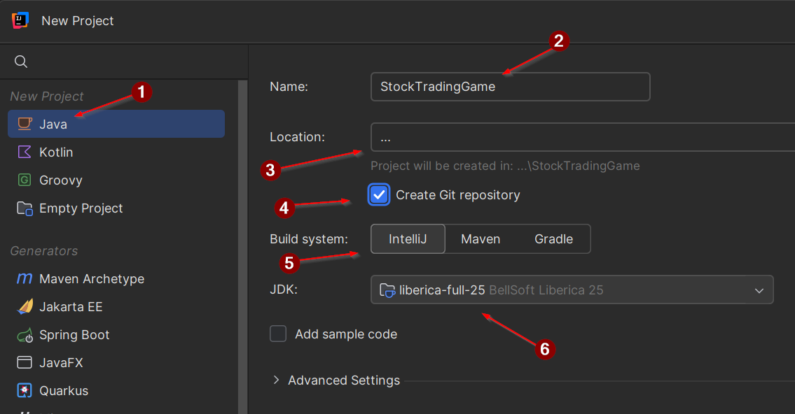
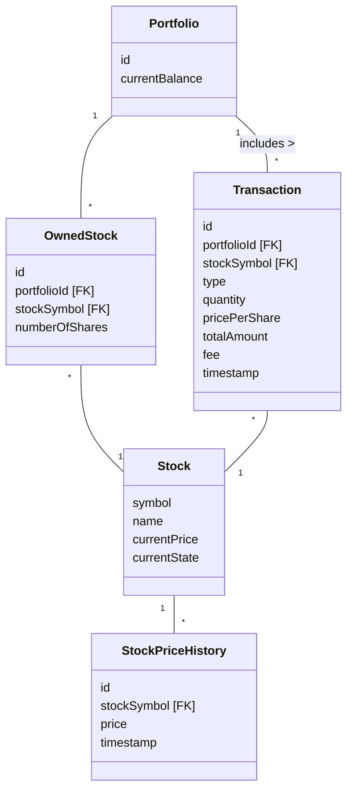
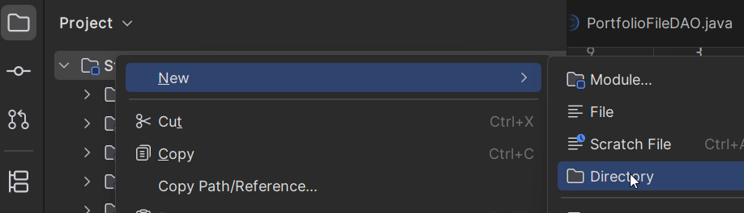
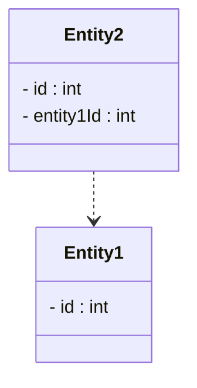
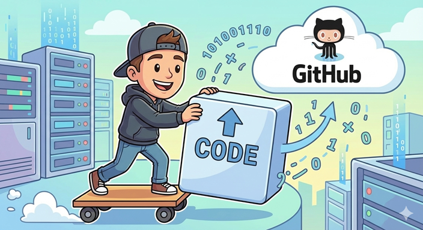

# Assignment 1: Introduction

This project is about a stock trading game. You will simulate stocks changing in value over time, and you will buy and sell stocks to make money.

## Assignment 1 deliverables

- Setting up project
- Push to GitHub
- Create package structure
- Create domain entities
- Class diagram

## Deadline

See itslearning.

## Handing in

Handing in is optional.

On itslearning, you will just submit a link to your GitHub repository.

---

# Project requirements

In this project you will develop a stock trading game. The user can buy and sell stocks, and see their portfolio and transaction history.

The stock market is simulated, and stocks will be updated in real-time. They will grow and decline, and the user can buy and sell them, to increase their fortune.

## Problem domain

In the game, there will be a number of stocks, which are represented by a symbol and a name. The symbol is a unique identifier for the stock, and the name is a human-readable name for the stock. Each Stock also have a current price, which is regularly updated by a background process.\
The user can create a portfolio, which is a collection of stocks they own and their quantities. The user can potentially create multiple portfolios, but this is optional.\
Stock prices are updated in real-time, and the user can buy and sell stocks at the current price. The user can also see the transaction history, and the portfolio history, i.e. how their balance has changed over time.

## Functional Requirements

There are several functional requirements for the game. They are listed below, and will be used to guide the development of the game.

Further explanation of the requirements will be provided in the assignments throughout the course.

The first five are mandatory, and the last three are optional. Each assignment will assume you are doing all 8 of them, so you may need to cut some corners in some assignments.

**Mandatory:**\
F1. User can see the stock price chart, updated in real-time\
F2. User can buy stock\
F3. User can sell stock\
F4. User can see their portfolio\
F5. User can win the game by reaching a certain balance.

**Optional:**\
F6. User can see their transaction history\
F7. User can see the portfolio history, i.e. how their balance has changed over time\
F8. User can create multiple portfolios

## Non-functional Requirements

NF1. Developed in Java.\
NF2. Uses JavaFX for the UI.\
NF3. Persistence is handled by storing data in files.\
NF4. The application is a desktop application, so it will just run locally on your machine.

---

# New GitHub repository

You are going to have your project on GitHub. So, you need to create a new repository for your project.

It should be public. Or you should invite your teacher as a collaborator.

---

# New project

Create a new project in IntelliJ. It is easier to check the box for adding git repository right away.

((1)) Select "Java"\
((2)) Choose a name\
((3)) Choose a location\
((4)) Check the box for adding git repository\
((5)) Select IntelliJ as build system\
((6)) Pick "Liberica-full" as JDK. Either use your existing version, or upgrade to the latest release. The version is less important. But we will use JavaFX, so "Liberica-full" is the best choice.

Create the project.

---

# Packages

Create packages to correspond with the three layered architecture.

---

# Domain entities

Create the domain entity classes for the game.

Remember to add or choose primary keys for all entities.

Also remember to model relationships with foreign keys, rather than object references.

## Data model

Below, you can find a data model. It is _almost_ a domain model, but I have kindly added foreigns keys for your convenience.

Most entities have an id field, this is a unique identifier for the entity.\
Some entities have a foreign key field, this is a reference to another entity. These attributes are marked with [FK].

`Stock::currentState` stores the state name as a `String` (e.g., `"Steady"`, `"Growing"`, `"Declining"`, `"Bankrupt"`, `"Reset"`).  

## Task

Implement the domain entities in Java. Add relevant constructors, getters for all fields, and the necessary setters.

Do consider which fields should be final (i.e. immutable).

---

# Documentation

In your project, add a new directory (outside of the src folder) called `documentation`.

Some assignments will require you to document various aspects of the project.

---

# Class diagram

Create a class diagram for your domain entities. Include the relevant packages as well.

As there are no associations between the entities, because of the foreign keys, you should instead use the dependency arrow.

You should still add multiplicities, if relevant.

---

# Push to GitHub

Push your project to GitHub.

Do note that empty directories are not pushed to GitHub. That's fine. So, on your GitHub repository, you should see the src folder, with the non-empty packages inside it, and the documentation folder, with your class diagram.

---

# Handing in

You will find an assignment on itslearning. Just hand in a link to your GitHub repository.
