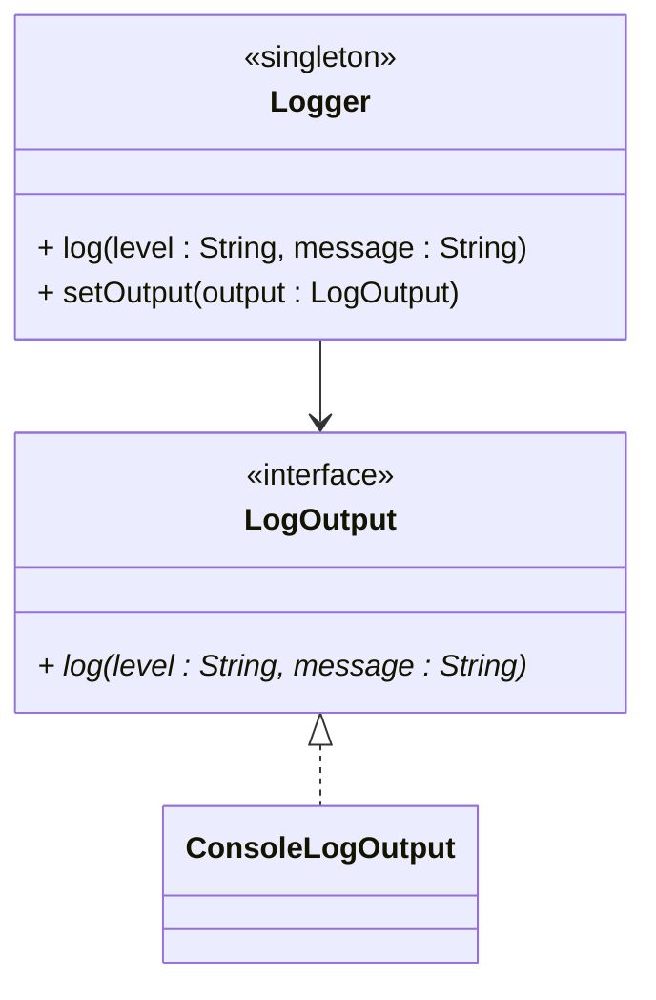

# Introduction to Assignment 2 - Singleton pattern

This time we will solve to problems:

- Logging what is happening in the application
- Centralizing various settings and configuration

We will use the Singleton pattern for both cases.

## Assignment 2 deliverables

- Logging-related classes
- AppConfig class
- Version 2 of the class diagram

## Deadline

See itslearning.

## Handing in

Handing in is optional.

On itslearning, you will just submit a link to the sub-folder containing your code.

---

# Updating the project structure

I recommend creating a new package called "shared". This implies that stuff in this package is shared across the application.


---

# Logging

Many systems need to log information to _somewhere_, usually a file, we will start with the console.\
This is sometimes used just to be able to track what is happening in the system. But more importantly, if something goes wrong, we can use the logs to debug the issue.

Have you ever had a program crash on you, and you were asked if you wanted to send a crash report to the developer? That's because the program has logged information about the crash, and the developer can use this information to debug the issue.


## Explanation

You will create a new class called `Logger`. We want to be able to eventually change the output-destination of the logging, but for now we will just log to the console. We do still need a future-safe design, though.

## Package

Inside the "shared" package, create a new package called "logging".

## Design

The `Logger` class should be a singleton.

You will also need a `LogOutput` interface, which will be _used by_ the `Logger` class, i.e. the `Logger` has an association to the `LogOutput` interface.

The interface is implemented by the `ConsoleLogOutput` class.

Here is a rough outline of the class diagram:



## Implementation

Implement the three classes/interface in Java.

The `log()` method in the `Logger` class should simply call the `log()` method on the `LogOutput` instance, passing both the level and message.

The implementation of the `log()` method in the `ConsoleLogOutput` class should print the message to the console with the log level formatted as a prefix, e.g., `[INFO] message` or `[ERROR] message`.

**Log Levels:**
- `"INFO"` - Normal operations, informational messages
- `"WARNING"` - Non-critical issues, potential problems
- `"ERROR"` - Critical failures, exceptions

**Example usage:**
```java
Logger logger = Logger.getInstance();
logger.log("INFO", "Application started");
logger.log("WARNING", "Stock not found in database");
logger.log("ERROR", "Failed to save data: " + exception.getMessage());
```

##Example output:**

```console
[INFO] Application started
[WARNING] Stock not found in database
[ERROR] Failed to save data: Database connection failed
```

## Thread safety

The application will eventually be multi-threaded, so the `Logger` class must be thread-safe.

### Thread safe access

If you are unlucky, then having multiple threads trying to access the `Logger` class at the same time, will potentially result in multiple instances of the `Logger` class being created. This is not what we want.

Research how to make a singleton thread-safe. There are at least five different ways to do this, you can pick your favorite.

Apply this to the `Logger` class. 

### Thread safe output

You may also encounter a problem, if two threads are trying to log to the console, at the same time. This will result in the messages being interleaved, which is not what we want.\
Therefore, you also need to make this part thread-safe.

---

# Testing your Logger class

You should test your Logger class, to make sure it works as expected.

Do this, by creating a class, e.g. `RunApp`, with a main method.

It should

* Create an instance of the LogOutput interface, e.g. `ConsoleLogOutput`.
* Set this on the Logger instance.
* Log a few messages to the console.

**Example usage:**
```java
Logger logger = Logger.getInstance();
logger.log("INFO", "Application started");
logger.log("WARNING", "Stock not found in database");
logger.log("ERROR", "Failed to save data: " + exception.getMessage());
```

##Example output:**

```console
[INFO] Application started
[WARNING] Stock not found in database
[ERROR] Failed to save data: Database connection failed
```

---

# Application configuration

Your application will require various settings, which may be used from different parts of the application. You must use the Singleton pattern to implement this.

Settings could be:
- The starting balance when starting a new game
- The transaction fee when buying or selling stocks
- How often the stock market is updated
- The value of a stock after it has been reset

We will keep all these settings in a single class, called `AppConfig`.

## Package

Inside the "shared" package, create a new package called "configuration".

## Design

The `AppConfig` class should be a singleton. Unlike the `Logger` class, data is probably not updated, so there is no need for thread-safety.

## Implementation

Implement the `AppConfig` class as a singleton.


### Fields
Include the following field variables:

```java
private final int startingBalance;
private final double transactionFee;
private final int updateFrequencyInMs;
private final double stockResetValue;
```

More may come later. Maybe you need to add more fields yourself. 

### Methods

Create get-methods for all the field variables.

## Testing

Not much to test here, I will leave this optional.

## Thread safety

Is it important to make this thread-safe? Why or why not? Maybe we will talk about this at the exam.

---

# Documentation

Update your class diagram to include the packages, classes, and interfaces, you have created for this assignment.

Export this as svg as "Assignment2ClassDiagram.svg" and include it in your assignment. Make sure to keep the older class diagram.

---

# Handing in

You will find an assignment on itslearning. Just hand in a link to the shared sub-folder containing your code on GitHub.