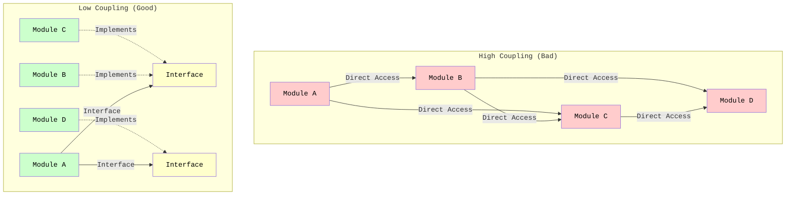
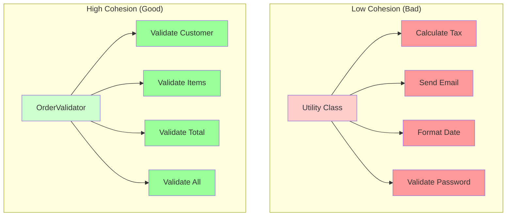
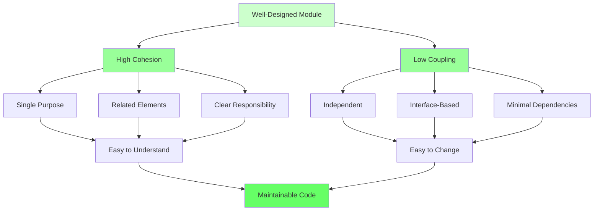

# Introduction to Coupling and Cohesion

Welcome to **Coupling and Cohesion**! These are two fundamental concepts in software design that help you create maintainable, flexible, and understandable code.

## What are Coupling and Cohesion?

**Coupling** and **Cohesion** are complementary principles that describe how modules (classes, methods, components) relate to each other and how well their internal elements work together.

### Coupling

**Coupling** measures how much one module depends on or knows about another module. It describes the **connections between** different parts of your system.

- **Low Coupling (Good):** Modules are independent and can change without affecting each other
- **High Coupling (Bad):** Modules are tightly connected and changes in one affect many others

### Cohesion

**Cohesion** measures how well the elements within a single module work together to achieve a single, well-defined purpose. It describes the **internal organization** of a module.

- **High Cohesion (Good):** All elements in a module work together toward a single, clear purpose
- **Low Cohesion (Bad):** Elements in a module are unrelated or serve multiple, different purposes

## The Golden Rule

> **Aim for Low Coupling and High Cohesion**

This is one of the most fundamental principles in software design. When you achieve this, you create code that is:
- **Easy to understand** - Each module has a clear purpose
- **Easy to change** - Changes are isolated and don't ripple through the system
- **Easy to test** - Modules can be tested independently
- **Easy to reuse** - Modules can be used in different contexts

## The Visual Metaphor

Think of coupling and cohesion like a well-organized office:

### High Cohesion, Low Coupling (Good)
```
Department A (Sales)        Department B (Marketing)        Department C (Support)
├─ Sales Team               ├─ Marketing Team              ├─ Support Team
├─ Sales Tools              ├─ Marketing Tools             ├─ Support Tools
└─ Sales Data               └─ Marketing Data              └─ Support Data
     │                            │                              │
     └────────────────────────────┴──────────────────────────────┘
                    (Minimal, well-defined interfaces)
```

Each department (module) is:
- **Highly Cohesive** - All elements work together for one purpose
- **Loosely Coupled** - Departments interact through clear, minimal interfaces

### Low Cohesion, High Coupling (Bad)
```
Department X (Everything)
├─ Sales Team
├─ Marketing Team
├─ Support Team
├─ Sales Tools
├─ Marketing Tools
├─ Support Tools
└─ All Data Mixed Together
     │
     └─── Directly accesses everything, knows about everything
```

This department (module) is:
- **Low Cohesion** - Unrelated elements mixed together
- **High Coupling** - Everything depends on everything else

## Why This Matters

Coupling and Cohesion directly impact:

1. **Maintainability** - How easy it is to modify code
2. **Testability** - How easy it is to test modules in isolation
3. **Reusability** - How easy it is to use modules in different contexts
4. **Understandability** - How easy it is to understand what code does
5. **Flexibility** - How easy it is to change requirements

## Connection to Other Principles

Coupling and Cohesion are foundational concepts that relate to:

- **Single Responsibility Principle** - High cohesion means each class has one responsibility
- **Dependency Inversion Principle** - Low coupling is achieved through abstractions
- **Interface Segregation Principle** - Small, focused interfaces reduce coupling
- **Open/Closed Principle** - Low coupling makes it easier to extend without modification

## Summary

Coupling and Cohesion are two sides of the same coin:

- **Coupling** - How modules connect to each other (should be low)
- **Cohesion** - How elements within a module work together (should be high)

Together, they guide you toward creating well-designed, maintainable software. In the following sections, we'll explore each concept in detail and learn how to achieve low coupling and high cohesion in practice.


---

# Understanding Coupling

**Coupling** measures how much one module depends on or knows about another module. The goal is to achieve **low coupling** - modules should be as independent as possible.

## What is Coupling?

Coupling describes the **connections between** different parts of your system. When two modules are coupled, changes to one module may require changes to the other.

### The Core Idea

> **Low Coupling: Modules are independent and can change without affecting each other.**

Modules should interact through well-defined interfaces, not by knowing about each other's internal details.

## Types of Coupling

Coupling can be categorized from worst to best:

### 1. Content Coupling (Worst)

One module directly modifies or relies on the internal implementation of another module.

```java
// Bad: Content Coupling
public class Order {
    public List<Item> items;  // Public field - internal implementation exposed
}

public class OrderProcessor {
    public void processOrder(Order order) {
        // Directly accessing and modifying internal structure
        order.items.add(new Item());  // Violates encapsulation!
        order.items.remove(0);        // Knows about list implementation
    }
}
```

**Problems:**
- Changes to `Order.items` break `OrderProcessor`
- Violates encapsulation
- Cannot change implementation without breaking dependents

### 2. Common Coupling

Multiple modules share the same global data.

```java
// Bad: Common Coupling
public class GlobalState {
    public static String currentUser;  // Global state
    public static int orderCount;      // Shared by many modules
}

public class OrderService {
    public void createOrder() {
        GlobalState.orderCount++;  // Modifies global state
    }
}

public class ReportService {
    public void generateReport() {
        int count = GlobalState.orderCount;  // Reads global state
    }
}

public class UserService {
    public void login(String username) {
        GlobalState.currentUser = username;  // Modifies global state
    }
}
```

**Problems:**
- Changes to global state affect all modules
- Hard to track who modifies what
- Difficult to test (shared state)
- Unpredictable behavior

### 3. Control Coupling

One module controls the behavior of another by passing control information.

```java
// Bad: Control Coupling
public class OrderProcessor {
    public void processOrder(Order order, boolean applyDiscount, 
                           boolean sendEmail, boolean logTransaction) {
        if (applyDiscount) {
            applyDiscount(order);
        }
        if (sendEmail) {
            sendEmail(order);
        }
        if (logTransaction) {
            logTransaction(order);
        }
    }
}
```

**Problems:**
- Caller must know internal logic of the called module
- Adding new options requires changing the method signature
- Hard to understand what the method does

### 4. Stamp Coupling

Modules share a composite data structure, but only use part of it.

```java
// Bad: Stamp Coupling
public class User {
    private String name;
    private String email;
    private String address;
    private String phone;
    private String creditCard;
    // ... 20 more fields
}

public class EmailService {
    public void sendWelcomeEmail(User user) {
        // Only needs email, but receives entire User object
        sendEmail(user.getEmail(), "Welcome!");
    }
}
```

**Problems:**
- Module receives more data than it needs
- Changes to `User` may affect `EmailService` even if it doesn't use those fields
- Creates unnecessary dependencies

### 5. Data Coupling (Best)

Modules communicate only through simple data parameters.

```java
// Good: Data Coupling
public class EmailService {
    public void sendWelcomeEmail(String email) {
        sendEmail(email, "Welcome!");
    }
}

public class UserService {
    public void createUser(User user) {
        // Only passes the data needed
        emailService.sendWelcomeEmail(user.getEmail());
    }
}
```

An alternative is to use a data transfer object (DTO) instead of passing the entire `User` object.

**Benefits:**
- Modules are independent
- Changes to `User` don't affect `EmailService`
- Easy to test and understand

## Problems with High Coupling

### 1. Ripple Effects

Changes in one module require changes in many others:

```java
// High Coupling: Change ripples through system
public class Database {
    public void save(String table, Map<String, Object> data) {
        // Implementation
    }
}

public class UserRepository {
    public void saveUser(User user) {
        Map<String, Object> data = new HashMap<>();
        data.put("name", user.getName());
        data.put("email", user.getEmail());
        database.save("users", data);  // Coupled to Database implementation
    }
}

// If Database.save() changes, UserRepository must change
// If UserRepository changes, all code using it must change
```

### 2. Difficult Testing

High coupling makes it hard to test modules in isolation:

```java
// Hard to test because of coupling
public class OrderService {
    private Database database;  // Tightly coupled
    private EmailService emailService;  // Tightly coupled
    
    public void processOrder(Order order) {
        database.save(order);  // Requires real database
        emailService.send(order);  // Requires real email service
    }
}
```

### 3. Reduced Reusability

Coupled modules cannot be reused independently:

```java
// Cannot reuse OrderService without Database and EmailService
public class OrderService {
    private Database database;  // Specific implementation
    private EmailService emailService;  // Specific implementation
    
    // Cannot use this in a different context
}
```

### 4. Harder to Understand

High coupling makes it difficult to understand the system:

```java
// To understand OrderService, you must understand:
// - Database implementation
// - EmailService implementation
// - How they interact
// - What happens if one fails
public class OrderService {
    private Database database;
    private EmailService emailService;
    // Complex interactions
}
```

## Achieving Low Coupling

### 1. Use Interfaces and Abstractions

```java
// Good: Low Coupling through Interface
public interface IRepository {
    void save(Object entity);
}

public class OrderService {
    private IRepository repository;  // Depends on abstraction
    
    public void processOrder(Order order) {
        repository.save(order);  // Doesn't know about implementation
    }
}
```

### 2. Dependency Injection

```java
// Good: Dependencies injected, not created
public class OrderService {
    private IRepository repository;
    private IEmailService emailService;
    
    public OrderService(IRepository repository, IEmailService emailService) {
        this.repository = repository;
        this.emailService = emailService;
    }
}
```

### 3. Minimize Dependencies

```java
// Bad: Too many dependencies
public class OrderService {
    private Database database;
    private EmailService emailService;
    private LoggingService loggingService;
    private AnalyticsService analyticsService;
    private NotificationService notificationService;
    // ... 10 more dependencies
}

// Good: Minimal, focused dependencies
public class OrderService {
    private IRepository repository;
    private IEmailService emailService;
    // Only what's needed
}
```

### 4. Law of Demeter (Don't Talk to Strangers)

```java
// Bad: Talking through multiple objects
public class OrderService {
    public void processOrder(Order order) {
        // Violates Law of Demeter
        order.getCustomer().getAddress().getCity();
    }
}

// Good: Direct communication
public class OrderService {
    public void processOrder(Order order) {
        String city = order.getCustomerCity();  // Order provides what's needed
    }
}
```

## Visualizing Coupling




## Summary

Coupling measures how modules depend on each other:

- **High Coupling (Bad):** Modules are tightly connected, changes ripple through the system
- **Low Coupling (Good):** Modules are independent, changes are isolated

To achieve low coupling:
- Use interfaces and abstractions
- Inject dependencies
- Minimize dependencies
- Follow the Law of Demeter

Low coupling makes your code more maintainable, testable, and flexible.


---

# Understanding Cohesion

**Cohesion** measures how well the elements within a single module work together to achieve a single, well-defined purpose. The goal is to achieve **high cohesion** - all elements in a module should work together toward a common goal.

## What is Cohesion?

Cohesion describes the **internal organization** of a module. When a module has high cohesion, all its elements (methods, fields, nested classes) work together to accomplish one clear purpose.

### The Core Idea

> **High Cohesion: All elements in a module work together toward a single, well-defined purpose.**

A cohesive module does one thing and does it well. All its parts contribute to that single purpose.

## Types of Cohesion

Cohesion can be categorized from worst to best:

### 1. Coincidental Cohesion (Worst)

Elements are grouped together arbitrarily with no meaningful relationship.

```java
// Bad: Coincidental Cohesion
public class Utility {
    public void calculateTax(double amount) {
        // Tax calculation
    }
    
    public void sendEmail(String address) {
        // Email sending
    }
    
    public void formatDate(Date date) {
        // Date formatting
    }
    
    public void validatePassword(String password) {
        // Password validation
    }
}
```

**Problems:**
- No clear purpose
- Elements are unrelated
- Hard to understand what the class does
- Changes to one element don't relate to others

### 2. Logical Cohesion

Elements are grouped because they perform similar operations, but they work on different data types.

```java
// Bad: Logical Cohesion
public class DataProcessor {
    public void processString(String data) {
        // Process string
    }
    
    public void processNumber(int data) {
        // Process number
    }
    
    public void processDate(Date data) {
        // Process date
    }
    
    public void processBoolean(boolean data) {
        // Process boolean
    }
}
```

**Problems:**
- Methods are similar in structure but work on different types
- No clear single purpose
- Hard to understand when to use which method

### 3. Temporal Cohesion

Elements are grouped because they are executed at the same time, but they're not otherwise related.

```java
// Bad: Temporal Cohesion
public class Initialization {
    public void initializeDatabase() {
        // Database setup
    }
    
    public void initializeCache() {
        // Cache setup
    }
    
    public void initializeLogger() {
        // Logger setup
    }
    
    public void initializeEmailService() {
        // Email service setup
    }
}
```

**Problems:**
- Elements are related only by timing
- No functional relationship
- Hard to maintain (what if initialization order changes?)

### 4. Procedural Cohesion

Elements are grouped because they execute in a specific sequence, but they work on different data.

```java
// Bad: Procedural Cohesion
public class OrderWorkflow {
    public void validateOrder(Order order) {
        // Validation
    }
    
    public void calculateTotal(Order order) {
        // Calculation
    }
    
    public void sendConfirmation(Order order) {
        // Sending
    }
    
    public void updateInventory(Order order) {
        // Inventory update
    }
}
```

**Problems:**
- Elements are related by sequence, not by purpose
- Each method could belong to a different class
- Hard to reuse individual steps

### 5. Communicational Cohesion

Elements are grouped because they operate on the same data, but they don't necessarily work toward the same goal.

```java
// Bad: Communicational Cohesion
public class UserData {
    private User user;
    
    public void updateName(String name) {
        user.setName(name);
    }
    
    public void updateEmail(String email) {
        user.setEmail(email);
    }
    
    public void printUser() {
        System.out.println(user);
    }
    
    public void validateUser() {
        // Validation
    }
    
    public void sendWelcomeEmail() {
        // Email sending
    }
}
```

**Problems:**
- Methods work on same data but serve different purposes
- Mixing data access, validation, and communication
- Not a single, clear responsibility

### 6. Sequential Cohesion

Elements are grouped because the output of one is the input of the next, forming a pipeline.

```java
// Better: Sequential Cohesion
public class DataPipeline {
    public String readData() {
        // Read from source
    }
    
    public String transformData(String data) {
        // Transform
    }
    
    public void saveData(String data) {
        // Save transformed data
    }
}
```

**Still not ideal:**
- Elements are related by data flow, but serve different purposes
- Could be split into separate classes (Reader, Transformer, Writer)

### 7. Functional Cohesion (Best)

All elements work together to accomplish a single, well-defined task.

```java
// Good: Functional Cohesion
public class OrderValidator {
    private boolean isValidCustomer(Order order) {
        return order.getCustomer() != null;
    }
    
    private boolean isValidItems(Order order) {
        return !order.getItems().isEmpty();
    }
    
    private boolean isValidTotal(Order order) {
        return order.getTotal() > 0;
    }
    
    public boolean validate(Order order) {
        return isValidCustomer(order) 
            && isValidItems(order) 
            && isValidTotal(order);
    }
}
```

**Benefits:**
- All methods work toward one purpose: validation
- Clear, single responsibility
- Easy to understand and test
- Easy to reuse

## Problems with Low Cohesion

### 1. Hard to Understand

Low cohesion makes it unclear what a module does:

```java
// What does this class do?
public class Utility {
    public void calculateTax(double amount) { }
    public void sendEmail(String address) { }
    public void formatDate(Date date) { }
    public void validatePassword(String password) { }
    public void processPayment(Payment payment) { }
    public void generateReport(Data data) { }
}
```

### 2. Hard to Maintain

Changes to one element don't relate to others:

```java
// Changing email logic doesn't relate to tax calculation
public class Utility {
    public void calculateTax(double amount) {
        // Tax logic changes
    }
    
    public void sendEmail(String address) {
        // Email logic - unrelated to tax
    }
}
```

### 3. Hard to Reuse

You can't reuse parts independently:

```java
// Want to use tax calculation? Must include email, date formatting, etc.
public class Utility {
    // Everything bundled together
}
```

### 4. Violates Single Responsibility

Low cohesion often means multiple responsibilities:

```java
// Does validation, calculation, communication, and persistence
public class OrderProcessor {
    public void validate(Order order) { }
    public void calculate(Order order) { }
    public void sendEmail(Order order) { }
    public void save(Order order) { }
}
```

## Achieving High Cohesion

### 1. Single Responsibility

Each class should have one reason to change:

```java
// Good: High Cohesion - Single Responsibility
public class OrderValidator {
    public boolean validate(Order order) {
        return isValidCustomer(order) 
            && isValidItems(order) 
            && isValidTotal(order);
    }
    
    private boolean isValidCustomer(Order order) { }
    private boolean isValidItems(Order order) { }
    private boolean isValidTotal(Order order) { }
}
```

### 2. Group Related Functionality

Keep related methods together:

```java
// Good: All methods work together for order calculation
public class OrderCalculator {
    public double calculateSubtotal(Order order) {
        // Calculate subtotal
    }
    
    public double calculateTax(Order order) {
        // Calculate tax
    }
    
    public double calculateShipping(Order order) {
        // Calculate shipping
    }
    
    public double calculateTotal(Order order) {
        return calculateSubtotal(order) 
            + calculateTax(order) 
            + calculateShipping(order);
    }
}
```

### 3. Extract Unrelated Functionality

Move unrelated methods to separate classes:

```java
// Bad: Low Cohesion
public class OrderService {
    public void processOrder(Order order) { }
    public void sendEmail(String address) { }  // Unrelated!
    public void generateReport(Data data) { }   // Unrelated!
}

// Good: High Cohesion
public class OrderService {
    public void processOrder(Order order) { }
}

public class EmailService {
    public void sendEmail(String address) { }
}

public class ReportService {
    public void generateReport(Data data) { }
}
```

### 4. Use Helper Methods

Break down complex operations into related helper methods:

```java
// Good: High Cohesion - Helper methods support main purpose
public class OrderProcessor {
    public void processOrder(Order order) {
        validateOrder(order);
        calculateTotals(order);
        applyDiscounts(order);
        saveOrder(order);
    }
    
    private void validateOrder(Order order) { }
    private void calculateTotals(Order order) { }
    private void applyDiscounts(Order order) { }
    private void saveOrder(Order order) { }
}
```

## Visualizing Cohesion



## Summary

Cohesion measures how well elements within a module work together:

- **Low Cohesion (Bad):** Elements are unrelated or serve multiple purposes
- **High Cohesion (Good):** All elements work toward a single, clear purpose

To achieve high cohesion:
- Follow Single Responsibility Principle
- Group related functionality
- Extract unrelated functionality
- Use helper methods to support main purpose

High cohesion makes your code easier to understand, maintain, and reuse.


---

# The Relationship: Coupling and Cohesion Together

Coupling and Cohesion work together to create well-designed software. Understanding their relationship is key to achieving good design.

## The Fundamental Relationship

> **Low Coupling and High Cohesion are complementary goals.**

They work together to create modules that are:
- **Independent** (low coupling) - Can change without affecting others
- **Focused** (high cohesion) - Have a single, clear purpose

## The Design Matrix

You can visualize the relationship between coupling and cohesion:

```
                    High Cohesion          Low Cohesion
                  
High Coupling    │  ❌ Worst Case      │  ❌ Very Bad
                 │  Tightly connected  │  Tightly connected
                 │  but focused        │  and unfocused
                 │                     │
                 ├─────────────────────┼─────────────────────
                 │                     │
Low Coupling     │  ✅ Best Case       │  ⚠️  Acceptable
                 │  Independent        │  Independent
                 │  and focused        │  but unfocused
```

### Best Case: Low Coupling + High Cohesion

```java
// Low Coupling: Depends on interface, not implementation
// High Cohesion: All methods work together for order validation
public class OrderValidator {
    private IOrderRepository repository;  // Interface, not concrete class
    
    public OrderValidator(IOrderRepository repository) {
        this.repository = repository;  // Dependency injection
    }
    
    public boolean validate(Order order) {
        return isValidCustomer(order) 
            && isValidItems(order) 
            && isValidTotal(order)
            && isNotDuplicate(order);
    }
    
    private boolean isValidCustomer(Order order) {
        return order.getCustomer() != null;
    }
    
    private boolean isValidItems(Order order) {
        return !order.getItems().isEmpty();
    }
    
    private boolean isValidTotal(Order order) {
        return order.getTotal() > 0;
    }
    
    private boolean isNotDuplicate(Order order) {
        return !repository.exists(order.getId());
    }
}
```

**Benefits:**
- Easy to test (can inject mock repository)
- Easy to change (can swap repository implementation)
- Easy to understand (single, clear purpose)
- Easy to reuse (independent and focused)

### Worst Case: High Coupling + Low Cohesion

```java
// High Coupling: Directly depends on concrete classes
// Low Cohesion: Mixes validation, calculation, email, and persistence
public class OrderProcessor {
    private MySQLDatabase database;  // Concrete class, not interface
    private GmailEmailService emailService;  // Concrete class
    private FileLogger logger;  // Concrete class
    
    public void processOrder(Order order) {
        // Validation (should be separate)
        if (order.getCustomer() == null) {
            throw new IllegalArgumentException();
        }
        
        // Calculation (should be separate)
        double total = 0;
        for (Item item : order.getItems()) {
            total += item.getPrice();
        }
        
        // Email (should be separate)
        emailService.sendGmail(order.getCustomer().getEmail(), "Order confirmed");
        
        // Persistence (should be separate)
        database.executeSQL("INSERT INTO orders ...");
        
        // Logging (should be separate)
        logger.writeToFile("Order processed: " + order.getId());
    }
}
```

**Problems:**
- Hard to test (requires real database, email service, file system)
- Hard to change (tightly coupled to specific implementations)
- Hard to understand (does too many things)
- Hard to reuse (can't use parts independently)

## How They Work Together

### High Cohesion Enables Low Coupling

When modules are highly cohesive (focused on one thing), they need fewer connections to other modules:

```java
// High Cohesion: OrderValidator only validates
public class OrderValidator {
    public boolean validate(Order order) {
        // Only needs order data, nothing else
        return isValid(order);
    }
}

// Low Coupling: Other modules only depend on validation result
public class OrderService {
    private OrderValidator validator;
    
    public void processOrder(Order order) {
        if (validator.validate(order)) {  // Simple interface
            // Process order
        }
    }
}
```

### Low Coupling Enables High Cohesion

When modules are loosely coupled (independent), they can focus on their own responsibility:

```java
// Low Coupling: OrderService doesn't know about database details
public class OrderService {
    private IRepository repository;  // Interface, not implementation
    
    public void processOrder(Order order) {
        // High Cohesion: Focuses only on order processing logic
        validateOrder(order);
        calculateTotals(order);
        applyDiscounts(order);
        repository.save(order);  // Simple interface
    }
}
```

## The Trade-off

Sometimes you face a choice between coupling and cohesion:

### Example: Data Transfer Objects

```java
// Option 1: Low Coupling, Lower Cohesion
public class OrderService {
    public void processOrder(String customerName, String customerEmail, 
                           List<String> itemNames, List<Double> itemPrices) {
        // Many parameters = lower cohesion
        // But doesn't depend on Order class = lower coupling
    }
}

// Option 2: Higher Coupling, Higher Cohesion
public class OrderService {
    public void processOrder(Order order) {
        // Single parameter = higher cohesion
        // But depends on Order class = higher coupling
    }
}
```

**Solution:** Use a DTO (Data Transfer Object) to balance both:

```java
// Best: Low Coupling (interface), High Cohesion (single parameter)
public interface IOrder {
    String getCustomerName();
    String getCustomerEmail();
    List<IItem> getItems();
}

public class OrderService {
    public void processOrder(IOrder order) {  // Interface, not concrete class
        // High cohesion: Single, focused parameter
        // Low coupling: Depends on interface, not implementation
    }
}
```

## Practical Guidelines

### 1. Start with High Cohesion

Design modules with a single, clear purpose:

```java
// Good: High Cohesion
public class OrderValidator {
    // All methods work together for validation
}
```

### 2. Then Achieve Low Coupling

Connect modules through well-defined interfaces:

```java
// Good: Low Coupling
public class OrderService {
    private IOrderValidator validator;  // Interface, not concrete class
}
```

### 3. When in Doubt, Favor High Cohesion

High cohesion is often more important than low coupling:

```java
// Better: High Cohesion (even with some coupling)
public class OrderProcessor {
    public void processOrder(Order order) {
        // All methods work together
        validate(order);
        calculate(order);
        save(order);
    }
}

// Worse: Low Cohesion (even with low coupling)
public class Utility {
    public void calculateTax(double amount) { }
    public void sendEmail(String address) { }
    public void formatDate(Date date) { }
}
```

## Visualizing the Relationship



## Summary

Coupling and Cohesion work together:

- **High Cohesion** makes modules focused and clear
- **Low Coupling** makes modules independent and flexible
- **Together** they create maintainable, testable, reusable code

**The Goal:** Low Coupling + High Cohesion = Well-Designed Software

When designing:
1. Start with high cohesion (single purpose)
2. Then achieve low coupling (independent interfaces)
3. Balance both for optimal design


---

# Examples: Coupling and Cohesion in Practice

Real-world examples showing good and bad coupling and cohesion.

## Example 1: Order Processing System

### Bad: High Coupling + Low Cohesion

```java
// High Coupling: Direct dependencies on concrete classes
// Low Cohesion: Mixes validation, calculation, email, persistence
public class OrderProcessor {
    private MySQLDatabase database;  // Concrete class
    private GmailEmailService emailService;  // Concrete class
    private FileLogger logger;  // Concrete class
    
    public void processOrder(Order order) {
        // Validation (should be separate class)
        if (order.getCustomer() == null) {
            throw new IllegalArgumentException("Customer required");
        }
        if (order.getItems().isEmpty()) {
            throw new IllegalArgumentException("Items required");
        }
        
        // Calculation (should be separate class)
        double subtotal = 0;
        for (Item item : order.getItems()) {
            subtotal += item.getPrice() * item.getQuantity();
        }
        double tax = subtotal * 0.1;
        double total = subtotal + tax;
        order.setTotal(total);
        
        // Email (should be separate class)
        emailService.sendGmail(
            order.getCustomer().getEmail(), 
            "Order confirmed: " + order.getId()
        );
        
        // Persistence (should be separate class)
        database.executeSQL(
            "INSERT INTO orders (id, customer_id, total) VALUES (?, ?, ?)",
            order.getId(), 
            order.getCustomer().getId(), 
            total
        );
        
        // Logging (should be separate class)
        logger.writeToFile("Order processed: " + order.getId());
    }
}
```

**Problems:**
- Hard to test (needs real database, email, file system)
- Hard to change (tightly coupled to specific implementations)
- Hard to understand (does too many things)
- Violates Single Responsibility Principle

### Good: Low Coupling + High Cohesion

```java
// Low Coupling: Depends on interfaces
// High Cohesion: Each class has a single responsibility

// OrderValidator: High Cohesion - only validates
public class OrderValidator {
    public boolean validate(Order order) {
        return isValidCustomer(order) 
            && isValidItems(order) 
            && isValidTotal(order);
    }
    
    private boolean isValidCustomer(Order order) {
        return order.getCustomer() != null;
    }
    
    private boolean isValidItems(Order order) {
        return !order.getItems().isEmpty();
    }
    
    private boolean isValidTotal(Order order) {
        return order.getTotal() > 0;
    }
}

// OrderCalculator: High Cohesion - only calculates
public class OrderCalculator {
    public void calculateTotals(Order order) {
        double subtotal = calculateSubtotal(order);
        double tax = calculateTax(subtotal);
        double total = subtotal + tax;
        order.setTotal(total);
    }
    
    private double calculateSubtotal(Order order) {
        return order.getItems().stream()
            .mapToDouble(item -> item.getPrice() * item.getQuantity())
            .sum();
    }
    
    private double calculateTax(double subtotal) {
        return subtotal * 0.1;
    }
}

// OrderService: Low Coupling - depends on interfaces
public class OrderService {
    private IOrderValidator validator;  // Interface
    private IOrderCalculator calculator;  // Interface
    private IOrderRepository repository;  // Interface
    private IEmailService emailService;  // Interface
    private ILogger logger;  // Interface
    
    public OrderService(
        IOrderValidator validator,
        IOrderCalculator calculator,
        IOrderRepository repository,
        IEmailService emailService,
        ILogger logger
    ) {
        this.validator = validator;
        this.calculator = calculator;
        this.repository = repository;
        this.emailService = emailService;
        this.logger = logger;
    }
    
    public void processOrder(Order order) {
        if (!validator.validate(order)) {
            throw new IllegalArgumentException("Invalid order");
        }
        
        calculator.calculateTotals(order);
        repository.save(order);
        emailService.sendConfirmation(order);
        logger.log("Order processed: " + order.getId());
    }
}
```

**Benefits:**
- Easy to test (can inject mocks)
- Easy to change (swap implementations)
- Easy to understand (each class has one purpose)
- Follows Single Responsibility Principle

## Example 2: User Management System

### Bad: High Coupling

```java
// High Coupling: Direct access to internal implementation
public class User {
    public String name;  // Public field - exposes implementation
    public String email;  // Public field
    public List<String> roles;  // Public field
}

public class UserService {
    public void updateUser(User user, String newName) {
        // Directly modifying internal structure
        user.name = newName;  // High coupling!
        
        // Directly accessing internal list
        if (!user.roles.contains("admin")) {
            user.roles.add("user");
        }
    }
    
    public void printUser(User user) {
        // Directly accessing fields
        System.out.println(user.name + " <" + user.email + ">");
    }
}
```

**Problems:**
- Changes to `User` internals break `UserService`
- Violates encapsulation
- Cannot change `User` implementation

### Good: Low Coupling

```java
// Low Coupling: Uses public interface
public class User {
    private String name;
    private String email;
    private List<String> roles;
    
    public String getName() {
        return name;
    }
    
    public void setName(String name) {
        this.name = name;
    }
    
    public String getEmail() {
        return email;
    }
    
    public boolean hasRole(String role) {
        return roles.contains(role);
    }
    
    public void addRole(String role) {
        if (!roles.contains(role)) {
            roles.add(role);
        }
    }
    
    @Override
    public String toString() {
        return name + " <" + email + ">";
    }
}

public class UserService {
    public void updateUser(User user, String newName) {
        // Uses public interface, not internal structure
        user.setName(newName);
        
        if (!user.hasRole("admin")) {
            user.addRole("user");
        }
    }
    
    public void printUser(User user) {
        // Uses public interface
        System.out.println(user.toString());
    }
}
```

**Benefits:**
- `UserService` doesn't know about `User` internals
- Can change `User` implementation without breaking `UserService`
- Encapsulation maintained

## Example 3: Utility Class

### Bad: Low Cohesion

```java
// Low Cohesion: Unrelated methods grouped together
public class Utility {
    public double calculateTax(double amount) {
        return amount * 0.1;
    }
    
    public void sendEmail(String address, String message) {
        // Email sending logic
    }
    
    public String formatDate(Date date) {
        // Date formatting logic
    }
    
    public boolean validatePassword(String password) {
        // Password validation logic
    }
    
    public void processPayment(Payment payment) {
        // Payment processing logic
    }
}
```

**Problems:**
- No clear purpose
- Methods are unrelated
- Hard to understand what the class does
- Hard to find specific functionality

### Good: High Cohesion

```java
// High Cohesion: Each class has a single, clear purpose

public class TaxCalculator {
    private static final double TAX_RATE = 0.1;
    
    public double calculateTax(double amount) {
        return amount * TAX_RATE;
    }
    
    public double calculateTotalWithTax(double amount) {
        return amount + calculateTax(amount);
    }
}

public class EmailService {
    public void sendEmail(String address, String message) {
        // Email sending logic
    }
    
    public void sendBulkEmail(List<String> addresses, String message) {
        // Bulk email logic
    }
}

public class DateFormatter {
    public String formatDate(Date date) {
        // Date formatting logic
    }
    
    public String formatDateTime(Date date) {
        // DateTime formatting logic
    }
}

public class PasswordValidator {
    public boolean validatePassword(String password) {
        // Password validation logic
    }
    
    public boolean isStrongPassword(String password) {
        // Strength checking logic
    }
}

public class PaymentProcessor {
    public void processPayment(Payment payment) {
        // Payment processing logic
    }
    
    public void refundPayment(Payment payment) {
        // Refund logic
    }
}
```

**Benefits:**
- Each class has a clear purpose
- Related methods grouped together
- Easy to find functionality
- Easy to understand and maintain

## Example 4: Data Access Layer

### Bad: High Coupling + Low Cohesion

```java
// High Coupling: Directly uses database implementation
// Low Cohesion: Mixes data access, validation, and business logic
public class UserDAO {
    private MySQLConnection connection;  // Concrete class
    
    public void saveUser(User user) {
        // Validation (should be separate)
        if (user.getName() == null) {
            throw new IllegalArgumentException();
        }
        
        // Business logic (should be separate)
        if (user.getAge() < 18) {
            user.setStatus("minor");
        }
        
        // Data access (mixed with other concerns)
        connection.execute(
            "INSERT INTO users (name, email, age, status) VALUES (?, ?, ?, ?)",
            user.getName(), user.getEmail(), user.getAge(), user.getStatus()
        );
    }
    
    public User findUser(int id) {
        // Direct SQL access
        ResultSet rs = connection.executeQuery(
            "SELECT * FROM users WHERE id = ?", id
        );
        // Mapping logic mixed with data access
        User user = new User();
        user.setId(rs.getInt("id"));
        user.setName(rs.getString("name"));
        // ... more mapping
        return user;
    }
}
```

### Good: Low Coupling + High Cohesion

```java
// Low Coupling: Uses repository interface
// High Cohesion: Each class has a single responsibility

// UserValidator: High Cohesion - only validates
public class UserValidator {
    public boolean validate(User user) {
        return user.getName() != null 
            && user.getEmail() != null
            && user.getAge() > 0;
    }
}

// UserService: High Cohesion - only business logic
public class UserService {
    private IUserRepository repository;  // Interface
    private UserValidator validator;  // High cohesion class
    
    public UserService(IUserRepository repository) {
        this.repository = repository;
        this.validator = new UserValidator();
    }
    
    public void saveUser(User user) {
        if (!validator.validate(user)) {
            throw new IllegalArgumentException("Invalid user");
        }
        
        // Business logic
        if (user.getAge() < 18) {
            user.setStatus("minor");
        }
        
        repository.save(user);  // Simple interface
    }
}

// UserRepository: High Cohesion - only data access
public class UserRepository implements IUserRepository {
    private IDataSource dataSource;  // Interface, not concrete
    
    public UserRepository(IDataSource dataSource) {
        this.dataSource = dataSource;
    }
    
    public void save(User user) {
        // Only data access logic
        dataSource.execute(
            "INSERT INTO users (name, email, age, status) VALUES (?, ?, ?, ?)",
            user.getName(), user.getEmail(), user.getAge(), user.getStatus()
        );
    }
    
    public User findById(int id) {
        // Only data access logic
        ResultSet rs = dataSource.query(
            "SELECT * FROM users WHERE id = ?", id
        );
        return mapToUser(rs);
    }
    
    private User mapToUser(ResultSet rs) {
        // Mapping logic
        User user = new User();
        user.setId(rs.getInt("id"));
        user.setName(rs.getString("name"));
        // ... more mapping
        return user;
    }
}
```

**Benefits:**
- Easy to test (can mock repository)
- Easy to change (can swap database)
- Clear separation of concerns
- Each class has one responsibility

## Key Takeaways

From these examples:

1. **High Coupling** makes code hard to test, change, and maintain
2. **Low Cohesion** makes code hard to understand and reuse
3. **Low Coupling + High Cohesion** creates maintainable, flexible code
4. **Use interfaces** to achieve low coupling
5. **Single responsibility** to achieve high cohesion

The goal is always: **Low Coupling + High Cohesion = Well-Designed Code**

