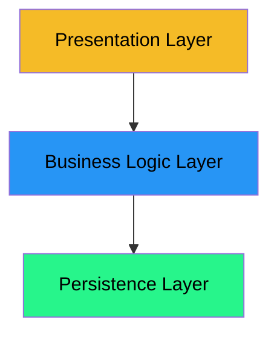
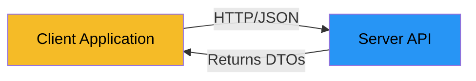

# Introduction to Data Transfer Objects

When building applications with multiple layers, you need to pass data between those layers. But how should you do it? Should the presentation layer directly use domain entities? Should the business logic layer expose its internal data structures?

Eventually, your domain models may become too complex to pass between layers.\
Or your view requires data that is organized in a way that is not the same as the domain model.

## What are Data Transfer Objects?

A **Data Transfer Object (DTO)** is a simple object that carries data between different parts of an application, typically between layers, or between a client program and a server program. It's a "data container" - it holds information but doesn't contain business logic.

**Real-world analogy:**

Think about filling out a form at a government office. The form doesn't contain your entire life history - it only has the specific fields needed for that transaction. The form is like a DTO:

- It has **only the data needed** for that specific purpose
- It's **simple and flat** - no complex relationships
- It's **easy to process** - just read the fields
- It's **disposable** - once used, you might throw it away

Similarly, when you receive a shipping label, it doesn't contain the entire product database - just the information needed to ship that package.

## Why Do We Need DTOs?

In a three-layer architecture (Presentation, Business Logic, Persistence), each layer has different concerns:

- **Presentation Layer**: Displays data to users, handles user input
- **Business Logic Layer**: Contains domain rules and operations
- **Persistence Layer**: Stores and retrieves data

If the presentation layer directly uses domain entities from the business logic layer, you create **tight coupling**:

- Changes to domain entities break the presentation layer
- The presentation layer depends on internal business logic structure
- Domain logic might accidentally leak into the presentation layer
- Testing becomes harder because layers are intertwined

DTOs solve this by creating a **contract** between layers - the presentation layer only knows about simple data objects, not complex domain entities.

## Prerequisites

This learning path assumes you're familiar with:

- Three-layer architecture (Presentation, Business Logic, Persistence)
- Domain entities with primary keys and foreign keys
- Java classes, constructors, and getters/setters
- The Space Explorer domain from the "Keys in Domains" learning path (or other learning paths, we have seen it multiple times)

If you've completed the learning paths on application design and keys, you're ready to continue.


---

# The Problem: Domain Entities Leaking Between Layers

Let's examine what happens when we don't use DTOs and allow domain entities to leak between layers.

## Three-Layer Architecture Recap

Recall the three-layer architecture:



- **Presentation Layer**: User interface, controllers, views
- **Business Logic Layer**: Services, domain logic, business rules
- **Persistence Layer**: Data managers, file I/O, database access

The arrows show **dependency direction** - each layer depends on the layer below it, but not the other way around.

## The Problem: Direct Entity Usage

In many beginner applications, you might see code like this:

```java
// In the Presentation Layer (Controller)
public class PlanetController 
{
    private PlanetService planetService;
    
    public void displayAllPlanets() 
    {
        ArrayList<Planet> planets = planetService.getAllPlanets();  // Returns domain entities!
        
        for (Planet planet : planets) 
        {
            System.out.println(planet.getName());
            System.out.println(planet.getClimateDescription());
            // ... using Planet entity directly
        }
    }
}
```

This seems simple and works fine initially. But it creates several problems:

## Problem 1: Tight Coupling

The presentation layer is **directly coupled** to the domain entity structure:

```java
// If Planet entity changes...
public class Planet 
{
    private int id;
    private String name;
    private String climateDescription;  // What if this field is renamed?
    // ...
}
```

If the business logic layer renames `climateDescription` to `climateInfo`, the presentation layer breaks. The presentation layer shouldn't care about internal domain structure.

## Problem 2: Presentation Depends on Domain Structure

The presentation layer needs to know about:
- All fields in the entity (even ones it doesn't use)
- The entity's relationships (foreign keys, collections)
- The entity's methods and behavior

This violates the **principle of least knowledge** - the presentation layer knows too much.

## Problem 3: Changes Cascade

When you modify a domain entity, you might break multiple places:

```java
// Domain entity change
public class Planet 
{
    // Removed: private String climateDescription;
    // Added: private ClimateData climateData;  // More complex structure
    
    public ClimateData getClimateData() { ... }
}
```

Now **every** place in the presentation layer that used `getClimateDescription()` breaks. You have to update:
- All controllers
- All views
- All display methods
- All tests

## Problem 4: Domain Logic Leakage

Domain entities often have business logic methods:

```java
public class Planet 
{
    // ... fields ...
    
    public boolean isHabitable() 
    {
        return hasAtmosphere && hasLife && distanceFromStarAU < 2.0;
    }
    
    public double calculateTravelTime(double speed) 
    {
        // Complex calculation...
    }
}
```

If the presentation layer has access to these methods, it might:
- Call business logic methods directly (bypassing the service layer)
- Duplicate business logic in the presentation layer
- Create inconsistent behavior across the application

## Problem 5: Testing Difficulties

When layers are tightly coupled, testing becomes harder:

- You can't test the presentation layer without creating full domain entities
- You can't mock the business logic layer easily
- Changes to domain entities require updating many tests

## Example: The Space Explorer Case

In our Space Explorer system, imagine the presentation layer directly using `Mission` entities:

```java
// Presentation Layer
public class MissionController 
{
    private MissionService missionService;
    
    public void displayMission(int missionId) 
    {
        Mission mission = missionService.getMission(missionId);
        
        // Directly accessing domain entity
        System.out.println(mission.getMissionName());
        System.out.println(mission.getObjective());
        
        // Accessing foreign keys directly
        for (int explorerId : mission.getCrewIds()) 
        {
            // Need to resolve IDs manually in presentation layer!
            Explorer explorer = explorerService.findById(explorerId);
            System.out.println(explorer.getName());
        }
    }
}
```

**Problems:**
- Presentation layer needs to know about `crewIds` (foreign keys)
- Presentation layer has to resolve IDs itself
- Presentation layer depends on `ExplorerService` (multiple dependencies)
- If `Mission` structure changes, this code breaks

## The Solution: DTOs

Instead of exposing domain entities, the business logic layer should return **Data Transfer Objects**:

```java
// Business Logic Layer returns DTOs
public class MissionDTO 
{
    private int id;
    private String missionName;
    private String objective;
    private ArrayList<String> crewNames;  // Already resolved!
    // ... simple data, no business logic
}

// Presentation Layer only knows about DTOs
public class MissionController 
{
    private MissionService missionService;
    
    public void displayMission(int missionId) 
    {
        MissionDTO mission = missionService.getMission(missionId);
        
        // Simple, clean, no domain knowledge needed
        System.out.println(mission.getMissionName());
        System.out.println(mission.getObjective());
        
        for (String crewName : mission.getCrewNames()) 
        {
            System.out.println(crewName);
        }
    }
}
```

**Benefits:**
- Presentation layer doesn't know about foreign keys
- Presentation layer doesn't need to resolve IDs
- Presentation layer has fewer dependencies
- Changes to `Mission` entity don't break presentation (only mapping changes)

## Summary

- Direct use of domain entities creates **tight coupling** between layers
- Changes to domain entities **cascade** to presentation layer
- Presentation layer **knows too much** about domain structure
- Domain logic might **leak** into presentation layer
- Testing becomes **more difficult**

The solution is to use **DTOs** as a contract between layers. Next, we'll see what DTOs are and how they differ from domain entities.


---

# What are DTOs?

A **Data Transfer Object (DTO)** is a simple object designed to carry data between different parts of an application, between layers, or between a client program and a server program. It's a "data container" with no business logic, just field variables, a constructor, and getters (and setters).

## Definition

A DTO is:
- A **simple class** with fields and getters (maybe setters)
- **No business logic** - just data
- **No behavior** - no complex methods
- **Purpose-built** - designed for a specific data transfer need

## Characteristics of DTOs

### 1. Only Data, No Logic

DTOs contain fields and simple accessors. They don't have business methods:

```java
// ✅ Good DTO
public class PlanetDTO 
{
    private int id;
    private String name;
    private String climateDescription;
    
    public PlanetDTO(int id, String name, String climateDescription) 
    {
        this.id = id;
        this.name = name;
        this.climateDescription = climateDescription;
    }
    
    public int getId() { return id; }
    public String getName() { return name; }
    public String getClimateDescription() { return climateDescription; }
}

// ❌ Bad DTO (has business logic)
public class PlanetDTO 
{
    // ... fields ...
    
    public boolean isHabitable()  // ❌ Business logic!
    {
        return hasAtmosphere && hasLife;
    }
}
```

### 2. Simple Getters and Setters

DTOs typically have straightforward getters. Setters are rarely needed (DTOs can be immutable):

```java
// Immutable DTO (recommended)
public class PlanetDTO 
{
    private final int id;
    private final String name;
    private final String climateDescription;
    
    public PlanetDTO(int id, String name, String climateDescription) 
    {
        this.id = id;
        this.name = name;
        this.climateDescription = climateDescription;
    }
    
    // Only getters, no setters
    public int getId() { return id; }
    public String getName() { return name; }
    public String getClimateDescription() { return climateDescription; }
}
```

### 3. No Entity Relationships

DTOs don't contain references to other entities. Instead, they contain:
- **IDs** (foreign keys) if needed for reference
- **Resolved values** (names, descriptions) instead of entity references

```java
// Domain Entity (has relationships)
public class Explorer 
{
    private int id;
    private String name;
    private int spacecraftId;  // Foreign key
    // ...
}

// DTO (no relationships, just resolved data)
public class ExplorerDTO 
{
    private int id;
    private String name;
    private String spacecraftName;  // ✅ Resolved value, not an ID or reference
    // ...
}
```

### 4. Purpose-Specific

A DTO is designed for a specific use case. You might have different DTOs for different purposes:

```java
// DTO for displaying planet in a list
public class PlanetSummaryDTO 
{
    private int id;
    private String name;
    // Only essential fields for a list view
}

// DTO for displaying planet details
public class PlanetDetailDTO 
{
    private int id;
    private String name;
    private String climateDescription;
    private double distanceFromStarAU;
    private boolean hasAtmosphere;
    private boolean hasLife;
    // All fields for a detail view
}
```

## DTOs vs Domain Entities

Let's compare DTOs with domain entities:

| Aspect | Domain Entity | DTO |
|--------|--------------|-----|
| **Purpose** | Represents a business concept | Transfers data |
| **Business Logic** | Contains business methods | No business logic |
| **Relationships** | Has foreign keys, references other entities | Has IDs or resolved values |
| **Complexity** | Can be complex with methods | Simple, flat structure |
| **Mutability** | Often mutable (can change state) | Often immutable |
| **Lifecycle** | Managed by business logic | Created, used, discarded |
| **Location** | Business Logic layer | Passed between layers |

### Example: Planet Entity vs PlanetDTO

```java
// Domain Entity (Business Logic Layer)
public class Planet 
{
    private int id;
    private String name;
    private String climateDescription;
    private double distanceFromStarAU;
    private boolean hasAtmosphere;
    private boolean hasLife;
    
    // Business logic methods
    public boolean isHabitable() 
    {
        return hasAtmosphere && hasLife && distanceFromStarAU < 2.0;
    }
    
    public double calculateTravelTime(double speed) 
    {
        return distanceFromStarAU * 149.6 / speed;  // AU to km conversion
    }
    
    // Foreign keys (relationships)
    private int starSystemId;  // References another entity
}

// DTO (Transfer between layers)
public class PlanetDTO 
{
    private int id;
    private String name;
    private String climateDescription;
    private double distanceFromStarAU;
    private boolean hasAtmosphere;
    private boolean hasLife;
    private String starSystemName;  // Resolved value, not an ID
    
    // Constructor
    public PlanetDTO(int id, String name, String climateDescription,
                     double distanceFromStarAU, boolean hasAtmosphere,
                     boolean hasLife, String starSystemName) 
    {
        this.id = id;
        this.name = name;
        this.climateDescription = climateDescription;
        this.distanceFromStarAU = distanceFromStarAU;
        this.hasAtmosphere = hasAtmosphere;
        this.hasLife = hasLife;
        this.starSystemName = starSystemName;
    }
    
    // Only getters - no business logic, no setters
    public int getId() { return id; }
    public String getName() { return name; }
    // ... other getters
}
```

## When to Use DTOs

Use DTOs when:
- ✅ Passing data between layers (especially to presentation layer)
- ✅ You want to hide domain structure from other layers
- ✅ You need to combine data from multiple entities
- ✅ You need to format data differently for display
- ✅ You're building APIs (client-server communication)

Don't use DTOs when:
- ❌ You're working entirely within one layer
- ❌ The data structure is exactly what you need (rare)
- ❌ You're over-engineering a simple application

## Summary

- DTOs are **simple data containers** with no business logic
- They contain **only fields and getters** (often immutable)
- They have **no entity relationships** (just IDs or resolved values)
- They are **purpose-specific** for data transfer
- They differ from entities: entities have logic, DTOs are just data


---

# DTOs in Java

Let's implement DTOs in Java using the Space Explorer domain as our example.

## Naming Convention

The standard naming convention for DTOs is:
- `EntityNameDTO`
- Examples: `PlanetDTO`, `ExplorerDTO`, `MissionDTO`

This makes it clear that the class is a DTO and which entity it represents.

And then, sometimes, you need different DTOs for the same entity, for different purposes. Then you should expand the name with the purpose. Examples: `PlanetSummaryDTO`, `PlanetDetailDTO`.

## Basic Structure

A DTO class typically has:
1. **Private fields** (often `final` for immutability)
2. **Constructor** (takes all fields as parameters)
3. **Getters** (one for each field)
4. **No setters** (if immutable) or simple setters (if mutable)

## Example 1: PlanetDTO

Here's a simple DTO for the `Planet` entity:

```java
public class PlanetDTO 
{
    private final int id;
    private final String name;
    private final String climateDescription;
    private final double distanceFromStarAU;
    private final boolean hasAtmosphere;
    private final boolean hasLife;
    
    public PlanetDTO(int id, String name, String climateDescription,
                     double distanceFromStarAU, boolean hasAtmosphere,
                     boolean hasLife) 
    {
        this.id = id;
        this.name = name;
        this.climateDescription = climateDescription;
        this.distanceFromStarAU = distanceFromStarAU;
        this.hasAtmosphere = hasAtmosphere;
        this.hasLife = hasLife;
    }
    
    // getters..
}
```

**Key points:**
- All fields are `final` (immutable)
- Constructor takes all fields
- Only getters, no setters
- No business logic methods

## Example 2: ExplorerDTO with Resolved Values

The `Explorer` entity has a foreign key to `Spacecraft`. The DTO should resolve this to a name:

```java
public class ExplorerDTO 
{
    private final int id;
    private final String name;
    private final String spacecraftName;  // Resolved from spacecraftId
    
    public ExplorerDTO(int id, String name, String spacecraftName) 
    {
        this.id = id;
        this.name = name;
        this.spacecraftName = spacecraftName;
    }

    // getters..
}
```

**Note:** The DTO contains `spacecraftName` (a resolved value), not `spacecraftId` (a foreign key). The business logic layer resolves the ID to a name before creating the DTO. This would require first fetching the Explorer entity, then fetching the Spacecraft entity, and getting its name. Then putting it all together in the DTO constructor.

## Example 3: MissionDTO with Collection

A `Mission` has multiple crew members (stored as IDs). The DTO could resolve these to names:

```java
import java.time.LocalDate;
import java.util.ArrayList;

public class MissionDTO 
{
    private final int id;
    private final String missionName;
    private final LocalDate startDate;
    private final LocalDate endDate;
    private final String objective;
    private final ArrayList<String> crewNames;  // Resolved from crewIds
    private final ArrayList<String> targetPlanetNames;  // Resolved from targetPlanetIds
    
    public MissionDTO(int id, String missionName, LocalDate startDate,
                      LocalDate endDate, String objective,
                      ArrayList<String> crewNames, ArrayList<String> targetPlanetNames) 
    {
        this.id = id;
        this.missionName = missionName;
        this.startDate = startDate;
        this.endDate = endDate;
        this.objective = objective;
        this.crewNames = crewNames;
        this.targetPlanetNames = targetPlanetNames;
    }
    
    // getters..
}
```

**Key points:**
- Collections are resolved (names instead of IDs)
- All fields are `final`


## Simplified DTOs for Specific Views

You might create different DTOs for different purposes:

```java
// DTO for planet list (minimal data)
public class PlanetSummaryDTO 
{
    private final int id;
    private final String name;
    
    public PlanetSummaryDTO(int id, String name) 
    {
        this.id = id;
        this.name = name;
    }

    // getters..
}

// DTO for planet details (all data)
public class PlanetDetailDTO 
{
    private final int id;
    private final String name;
    private final String climateDescription;
    private final double distanceFromStarAU;
    private final boolean hasAtmosphere;
    private final boolean hasLife;
    
    // ... constructor and getters ...
}
```

This allows the presentation layer to request only the data it needs.

## Summary

- Use naming convention: `EntityNameDTO`
- Prefer **immutable DTOs** with `final` fields
- Include **constructor** with all fields
- Provide **getters** for all fields
- **Resolve foreign keys** to names/values in DTOs
- Create **purpose-specific DTOs** for different views

---

# Mapping Between Layers

Now that we have DTOs, we need to convert between domain entities and DTOs. This conversion is called **mapping**, and it happens in the **Business Logic layer**.

## Where Mapping Happens

The mapping between entities and DTOs should happen in the **Business Logic layer** (service layer):


- **Persistence Layer** returns domain entities
- **Business Logic Layer** converts entities to DTOs
- **Presentation Layer** receives DTOs

## Converting Entity to DTO

The most common mapping is **Entity → DTO**. This happens when the business logic layer needs to return data to the presentation layer.

### Simple Mapping: Planet

For a simple entity like `Planet`, the mapping is straightforward:

```java
public class PlanetService 
{
    private PlanetDataManager planetDataManager;
    
    public PlanetDTO getPlanet(int id) 
    {
        Planet planet = planetDataManager.findById(id);
        if (planet == null) 
        {
            return null;
        }
        
        // Convert entity to DTO
        return new PlanetDTO(
            planet.getId(),
            planet.getName(),
            planet.getClimateDescription(),
            planet.getDistanceFromStarAU(),
            planet.hasAtmosphere(),
            planet.hasLife()
        );
    }
    
    public ArrayList<PlanetDTO> getAllPlanets() 
    {
        ArrayList<Planet> planets = planetDataManager.getAll();
        ArrayList<PlanetDTO> dtos = new ArrayList<>();
        
        for (Planet planet : planets) 
        {
            dtos.add(new PlanetDTO(
                planet.getId(),
                planet.getName(),
                planet.getClimateDescription(),
                planet.getDistanceFromStarAU(),
                planet.hasAtmosphere(),
                planet.hasLife()
            ));
        }
        
        return dtos;
    }
}
```

### Mapping with Resolved Foreign Keys: Explorer

For entities with foreign keys, you need to resolve them:

```java
public class ExplorerService 
{
    private ExplorerDataManager explorerDataManager;
    private SpacecraftDataManager spacecraftDataManager;
    
    public ExplorerDTO getExplorer(int id) 
    {
        Explorer explorer = explorerDataManager.findById(id);
        if (explorer == null) 
        {
            return null;
        }
        
        // Resolve foreign key
        Spacecraft spacecraft = spacecraftDataManager.findById(explorer.getSpacecraftId());
        String spacecraftName = (spacecraft != null) ? spacecraft.getName() : "Unknown";
        
        // Convert entity to DTO with resolved value
        return new ExplorerDTO(
            explorer.getId(),
            explorer.getName(),
            spacecraftName  // Resolved, not the ID
        );
    }
}
```


## Converting DTO to Entity

Sometimes you need to convert **DTO → Entity**, typically when creating new entities from user input.

Here, the data flows from the presentation layer to the business logic layer, i.e. opposite of the above examples.\
In this type of case, I prefer to suffix my DTO with "Request", instead of "DTO". Examples: `CreatePlanetRequest`, `UpdatePlanetRequest`, `DeletePlanetRequest`. The user is requesting something of the system, indicated by the DTO name and data.

```java
public class PlanetService 
{
    private PlanetDataManager planetDataManager;
    
    public void createPlanet(PlanetRequest request) 
    {
        // Convert DTO to entity
        Planet planet = new Planet(
            request.getName(),
            request.getClimateDescription(),
            request.getDistanceFromStarAU(),
            request.hasAtmosphere(),
            request.hasLife()
        );
        
        // Save entity
        planetDataManager.add(planet);
        planetDataManager.save();
    }
}
```

**Note:** When creating entities, the DTO typically doesn't have an ID yet (it's generated by the data manager).

## Helper Methods

You can extract mapping logic into helper methods for reusability.

```java
public class PlanetService 
{
    private PlanetDataManager planetDataManager;
    
    // Helper method: Entity → DTO
    private PlanetDTO toDTO(Planet planet) 
    {
        return new PlanetDTO(
            planet.getId(),
            planet.getName(),
            planet.getClimateDescription(),
            planet.getDistanceFromStarAU(),
            planet.hasAtmosphere(),
            planet.hasLife()
        );
    }
    
    // Helper method: DTO → Entity (for creation)
    private Planet fromDTO(PlanetDTO dto) 
    {
        return new Planet(
            dto.getName(),
            dto.getClimateDescription(),
            dto.getDistanceFromStarAU(),
            dto.hasAtmosphere(),
            dto.hasLife()
        );
    }
    
    public PlanetDTO getPlanet(int id) 
    {
        Planet planet = planetDataManager.findById(id);
        return (planet != null) ? toDTO(planet) : null;
    }
    
    public ArrayList<PlanetDTO> getAllPlanets() 
    {
        ArrayList<Planet> planets = planetDataManager.getAll();
        ArrayList<PlanetDTO> dtos = new ArrayList<>();
        
        for (Planet planet : planets) 
        {
            dtos.add(toDTO(planet));
        }
        
        return dtos;
    }
    
    public void createPlanet(PlanetDTO dto) 
    {
        Planet planet = fromDTO(dto);
        planetDataManager.add(planet);
        planetDataManager.save();
    }
}
```

## Separate Mapper Classes

For complex mappings, or if the same mapping is used in multiple places, you might create separate mapper classes:

```java
public class PlanetMapper 
{
    public static PlanetDTO toDTO(Planet planet) 
    {
        return new PlanetDTO(
            planet.getId(),
            planet.getName(),
            planet.getClimateDescription(),
            planet.getDistanceFromStarAU(),
            planet.hasAtmosphere(),
            planet.hasLife()
        );
    }
    
    public static Planet fromDTO(PlanetDTO dto) 
    {
        return new Planet(
            dto.getName(),
            dto.getClimateDescription(),
            dto.getDistanceFromStarAU(),
            dto.hasAtmosphere(),
            dto.hasLife()
        );
    }
}
```

Then use it in the service:

```java
public class PlanetService 
{
    private PlanetDataManager planetDataManager;
    
    public PlanetDTO getPlanet(int id) 
    {
        Planet planet = planetDataManager.findById(id);
        return (planet != null) ? PlanetMapper.toDTO(planet) : null;
    }
}
```


## Summary

- Mapping happens in the **Business Logic layer**
- **Entity → DTO**: Convert when returning data to presentation layer
- **DTO → Entity**: Convert when creating entities from user input
- **Resolve foreign keys** to names/values in DTOs
- Use **helper methods** or **separate mapper classes** for reusability
- Keep mapping logic **simple and clear**


---

# DTOs in Client-Server Systems

So far, we've focused on DTOs in **standalone applications** with three layers. But DTOs are also essential in **client-server architectures**, where applications communicate over a network.

You will see this in another course, but I will just briefly mention it here.

## The Client-Server Architecture

In a client-server system, you have:

- **Client**: The application that users interact with (web browser, mobile app, desktop app)
- **Server**: The application that provides services and data (API server, web server)

They communicate over a network (internet, local network) using protocols like HTTP.



## Why DTOs Are Essential

In client-server systems, DTOs are **not just recommended - they're essential**. Here's why:

### 1. Entities Can't Be Sent Over Network

Domain entities often contain:
- Object references (can't be serialized)
- Complex relationships (circular references)
- Business logic methods (not needed on client)
- Internal state (shouldn't be exposed)

You can't send a Java object directly over the network. You need to convert it to a format like **JSON** or **XML**.

### 2. Security Concerns

Domain entities might contain:
- Sensitive data (passwords, internal IDs)
- Business logic that shouldn't be exposed
- Implementation details

DTOs allow you to control exactly what data is sent to the client.

### 3. Decoupling Client and Server

The client and server might be:
- Written in different languages (Java server, JavaScript client)
- Updated independently
- Developed by different teams

DTOs create a **contract** between client and server that both sides understand.


## Benefits in Client-Server

- ✅ **Serialization**: DTOs can be easily converted to JSON/XML
- ✅ **Security**: Only send what the client needs
- ✅ **Independence**: Client and server can evolve separately
- ✅ **Performance**: Send only necessary data, not entire object graphs
- ✅ **Compatibility**: Works across different programming languages

## Note

This is a brief overview. Client-server architectures, REST APIs, JSON serialization, and related topics are covered in more detail in networking and web development courses. For now, just remember: **DTOs are essential when sending data over a network**.

## Summary

- DTOs are **essential** in client-server systems (not just recommended)
- Entities can't be sent over network - they must be converted to DTOs
- DTOs are serialized to JSON/XML for APIs
- DTOs provide security and decoupling between client and server
- This topic is covered in more detail in networking/web courses

The same DTOs you use in standalone applications work perfectly in client-server systems!

