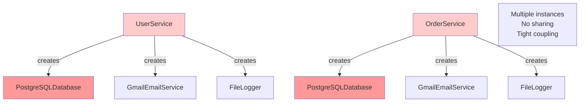
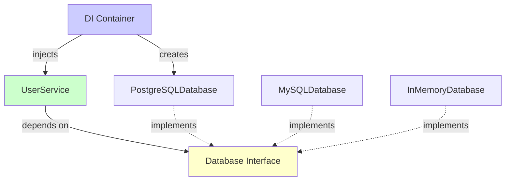

# Introduction to Dependency Injection

Welcome to **Dependency Injection (DI)**! This is a fundamental technique in software design that helps you create flexible, testable, and maintainable code.

## What is Dependency Injection?

**Dependency Injection** is a design pattern where an object receives its dependencies from an external source rather than creating them itself.

### The Core Idea

Instead of a class creating its own dependencies (using `new`), dependencies are **injected** into the class from the outside. The class doesn't know how to create its dependencies - it only knows how to use them.

## The Problem: Direct Dependencies

Without dependency injection, classes create their own dependencies:

```java
// Bad: Class creates its own dependencies
public class UserService {
    private Database database;
    
    public UserService() {
        this.database = new PostgreSQLDatabase();  // Creates dependency itself
    }
    
    public void saveUser(User user) {
        database.save(user);
    }
}
```

**Problems:**
- **Hard to test** - Cannot replace database with a mock
- **Tight coupling** - Tightly coupled to `PostgreSQLDatabase`
- **Hard to change** - Must modify code to switch databases
- **Violates Dependency Inversion Principle** - Depends on concrete class, not abstraction

## The Solution: Dependency Injection

With dependency injection, dependencies are provided from outside:

```java
// Good: Dependencies are injected
public class UserService {
    private Database database;  // Interface, not concrete class
    
    public UserService(Database database) {  // Dependency injected via constructor
        this.database = database;
    }
    
    public void saveUser(User user) {
        database.save(user);
    }
}
```

**Benefits:**
- **Easy to test** - Can inject a mock database
- **Loose coupling** - Depends on interface, not implementation
- **Easy to change** - Can swap implementations without modifying code
- **Follows Dependency Inversion Principle** - Depends on abstraction

## The Visual Metaphor

Think of dependency injection like a lamp:

### Without Dependency Injection (Hardwired)

```
Lamp → Hardwired directly into wall
- Cannot move lamp to another room
- Cannot test lamp without wall wiring
- Cannot use lamp with battery
```

### With Dependency Injection (Plugged In)

```
Lamp → Plug → Wall Outlet (Production)
Lamp → Plug → Battery Pack (Testing)
- Can move lamp anywhere
- Can test lamp independently
- Can use different power sources
```

## Connection to SOLID Principles

Dependency Injection is closely related to SOLID:

### Dependency Inversion Principle (D)

**DIP states:** High-level modules should not depend on low-level modules. Both should depend on abstractions.

Dependency Injection is the **primary mechanism** for achieving DIP. By injecting dependencies through interfaces, you invert the dependency direction.

```java
// High-level module (UserService) depends on abstraction (Database interface)
// Low-level module (PostgreSQLDatabase) implements the abstraction
public class UserService {
    private Database database;  // Abstraction
    
    public UserService(Database database) {
        this.database = database;  // Injected dependency
    }
}
```

### Single Responsibility Principle (S)

Dependency Injection helps maintain SRP by allowing classes to focus on their core responsibility without worrying about creating dependencies.

### Open/Closed Principle (O)

With DI, you can extend functionality by injecting different implementations without modifying existing code.

### Interface Segregation Principle (I)

DI encourages using focused interfaces, as you inject specific interfaces rather than large, fat ones.

## Why Dependency Injection Matters

Dependency Injection provides:

1. **Testability** - The #1 reason. You can inject mocks for testing
2. **Flexibility** - Easy to swap implementations
3. **Maintainability** - Changes are isolated
4. **Loose Coupling** - Classes depend on abstractions
5. **Reusability** - Classes can be used in different contexts

## Summary

Dependency Injection is:
- **A pattern** - Dependencies are provided from outside
- **A technique** - For achieving loose coupling
- **A practice** - That enables testability and flexibility
- **A mechanism** - For implementing Dependency Inversion Principle

In the following sections, we'll explore how to implement dependency injection, different injection methods, and see practical examples.


---

# The Problem: Direct Dependencies

Without dependency injection, classes create their own dependencies. This creates several problems that make code hard to test, maintain, and change.

## The Anti-Pattern: "New is Glue"

The problem is using the `new` keyword inside classes to create dependencies:

```java
// Bad: Creating dependencies directly
public class UserService {
    private Database database;
    
    public UserService() {
        this.database = new PostgreSQLDatabase();  // "New is glue"
    }
    
    public void saveUser(User user) {
        database.save(user);
    }
}
```

This is the **"New is Glue"** anti-pattern - your class is permanently glued to that specific implementation.

## Problem 1: Hard to Test

The biggest problem: **You cannot unit test without real dependencies.**

```java
public class UserService {
    private Database database;
    
    public UserService() {
        this.database = new PostgreSQLDatabase();  // Real database!
    }
    
    public void saveUser(User user) {
        database.save(user);
    }
}

// Testing is difficult:
@Test
public void testSaveUser() {
    UserService service = new UserService();
    // Problem: This creates a REAL database connection!
    // - Requires database to be running
    // - Requires database setup/teardown
    // - Tests are slow
    // - Tests are fragile
    service.saveUser(new User("John", "john@example.com"));
}
```

**Problems:**
- Requires real database to be running
- Tests are slow (database I/O)
- Tests are fragile (database state issues)
- Cannot test in isolation
- Cannot test error scenarios easily

## Problem 2: Tight Coupling

Classes are tightly coupled to specific implementations:

```java
public class UserService {
    private PostgreSQLDatabase database;  // Concrete class!
    
    public UserService() {
        this.database = new PostgreSQLDatabase();
    }
}

// If you want to switch to MySQL:
public class UserService {
    private MySQLDatabase database;  // Must change the class!
    
    public UserService() {
        this.database = new MySQLDatabase();  // Must change code!
    }
}
```

**Problems:**
- Must modify code to change implementations
- Violates Open/Closed Principle
- Creates ripple effects through the codebase

## Problem 3: Hard to Reuse

Classes cannot be reused in different contexts:

```java
public class OrderService {
    private PostgreSQLDatabase database;
    
    public OrderService() {
        this.database = new PostgreSQLDatabase();  // Always PostgreSQL
    }
}

// Cannot use OrderService with:
// - Different database
// - In-memory database for testing
// - Mock database for unit tests
// - Different environment (dev, test, prod)
```

## Problem 4: Violates Dependency Inversion Principle

Direct dependencies violate DIP:

```java
// High-level module depends on low-level module
public class UserService {  // High-level (business logic)
    private PostgreSQLDatabase database;  // Low-level (infrastructure)
    
    public UserService() {
        this.database = new PostgreSQLDatabase();
    }
}
```

**DIP Violation:**
- High-level `UserService` depends directly on low-level `PostgreSQLDatabase`
- Should depend on abstraction instead

## Problem 5: Hidden Dependencies

Dependencies are hidden inside the class:

```java
public class UserService {
    private Database database;
    private EmailService emailService;
    private Logger logger;
    
    public UserService() {
        this.database = new PostgreSQLDatabase();  // Hidden!
        this.emailService = new GmailEmailService();  // Hidden!
        this.logger = new FileLogger();  // Hidden!
    }
    
    public void createUser(User user) {
        database.save(user);
        emailService.sendWelcomeEmail(user.getEmail());
        logger.log("User created: " + user.getName());
    }
}
```

**Problems:**
- Cannot see what dependencies a class has
- Cannot control dependencies from outside
- Hard to understand class requirements
- Hard to configure for different environments

## Problem 6: Lifecycle Management

Classes manage the lifecycle of their dependencies:

```java
public class UserService {
    private Database database;
    
    public UserService() {
        this.database = new PostgreSQLDatabase();
        // Who closes the database?
        // When does it close?
        // What if multiple services use the same database?
    }
}
```

**Problems:**
- Each service creates its own database connection
- No shared resources
- No control over lifecycle
- Resource leaks possible

## Visualizing the Problem



## The "Testing Wall"

The most practical problem: **The Testing Wall**

If you use `new` inside your class, you **cannot** unit test that class without:
- Real database connections
- Real network services
- Real file systems
- Real external dependencies

This makes testing:
- **Slow** - Real I/O operations
- **Fragile** - External dependencies can fail
- **Complex** - Requires setup and teardown
- **Expensive** - Requires infrastructure

## Summary

Direct dependencies (creating objects with `new`) cause:

1. **Hard to test** - Cannot inject mocks
2. **Tight coupling** - Glued to specific implementations
3. **Hard to change** - Must modify code to swap implementations
4. **Hard to reuse** - Cannot use in different contexts
5. **Violates DIP** - Depends on concrete classes, not abstractions
6. **Hidden dependencies** - Dependencies are not visible
7. **Lifecycle issues** - No control over resource management

The solution is **Dependency Injection** - provide dependencies from outside rather than creating them inside.


---

# The Solution: Dependency Injection

Dependency Injection solves the problems of direct dependencies by providing dependencies from outside the class.

## The Core Concept

Instead of a class creating its own dependencies, dependencies are **injected** into the class:

```java
// Bad: Class creates dependencies
public class UserService {
    private Database database;
    
    public UserService() {
        this.database = new PostgreSQLDatabase();  // Creates it
    }
}

// Good: Dependencies are injected
public class UserService {
    private Database database;
    
    public UserService(Database database) {  // Receives it
        this.database = database;
    }
}
```

## Three Ways to Inject Dependencies

There are three main ways to inject dependencies:

### 1. Constructor Injection (Recommended)

Dependencies are provided through the constructor:

```java
public class UserService {
    private Database database;
    private EmailService emailService;
    
    // Dependencies injected via constructor
    public UserService(Database database, EmailService emailService) {
        this.database = database;
        this.emailService = emailService;
    }
    
    public void createUser(User user) {
        database.save(user);
        emailService.sendWelcomeEmail(user.getEmail());
    }
}

// Usage:
Database db = new PostgreSQLDatabase();
EmailService email = new GmailEmailService();
UserService service = new UserService(db, email);  // Inject dependencies
```

**Benefits:**
- Dependencies are required (cannot create object without them)
- Immutable (dependencies don't change after construction)
- Clear what dependencies are needed
- Easy to test

### 2. Setter Injection

Dependencies are provided through setter methods:

```java
public class UserService {
    private Database database;
    private EmailService emailService;
    
    // Dependencies injected via setters
    public void setDatabase(Database database) {
        this.database = database;
    }
    
    public void setEmailService(EmailService emailService) {
        this.emailService = emailService;
    }
    
    public void createUser(User user) {
        database.save(user);
        emailService.sendWelcomeEmail(user.getEmail());
    }
}

// Usage:
UserService service = new UserService();
service.setDatabase(new PostgreSQLDatabase());
service.setEmailService(new GmailEmailService());
```

**Benefits:**
- Dependencies can be changed after construction
- Optional dependencies possible
- More flexible

**Drawbacks:**
- Dependencies might not be set (null checks needed)
- Object can be in invalid state
- Less clear what's required

### 3. Interface Injection

Dependencies are provided through an interface:

```java
public interface DatabaseInjectable {
    void injectDatabase(Database database);
}

public class UserService implements DatabaseInjectable {
    private Database database;
    
    @Override
    public void injectDatabase(Database database) {
        this.database = database;
    }
}
```

**Note:** This is less common and usually not recommended. Constructor injection is preferred.

## Constructor Injection: The Best Practice

Constructor injection is generally the best choice because:

1. **Required Dependencies** - Cannot create object without them
2. **Immutable** - Dependencies don't change after construction
3. **Clear Contract** - Constructor signature shows what's needed
4. **Easy to Test** - Simple to provide mocks in tests
5. **Thread-Safe** - No setter race conditions

```java
// Best Practice: Constructor Injection
public class UserService {
    private final Database database;  // final = immutable
    private final EmailService emailService;
    
    public UserService(Database database, EmailService emailService) {
        if (database == null || emailService == null) {
            throw new IllegalArgumentException("Dependencies cannot be null");
        }
        this.database = database;
        this.emailService = emailService;
    }
}
```

## How Dependency Injection Solves Problems

### Problem 1: Testing → Solved

```java
// Easy to test with mocks
@Test
public void testCreateUser() {
    // Inject mock dependencies
    Database mockDb = mock(Database.class);
    EmailService mockEmail = mock(EmailService.class);
    
    UserService service = new UserService(mockDb, mockEmail);
    
    User user = new User("John", "john@example.com");
    service.createUser(user);
    
    // Verify interactions
    verify(mockDb).save(user);
    verify(mockEmail).sendWelcomeEmail("john@example.com");
}
```

### Problem 2: Tight Coupling → Solved

```java
// Depends on interface, not implementation
public class UserService {
    private Database database;  // Interface!
    
    public UserService(Database database) {
        this.database = database;  // Any implementation works
    }
}

// Can use any Database implementation:
UserService service1 = new UserService(new PostgreSQLDatabase());
UserService service2 = new UserService(new MySQLDatabase());
UserService service3 = new UserService(new InMemoryDatabase());
```

### Problem 3: Hard to Change → Solved

```java
// Change implementation without modifying code
// Just inject different implementation:
Database db = new MySQLDatabase();  // Changed here
UserService service = new UserService(db);
```

### Problem 4: DIP Violation → Solved

```java
// High-level module depends on abstraction
public class UserService {  // High-level
    private Database database;  // Abstraction (interface)
    
    public UserService(Database database) {
        this.database = database;
    }
}

// Low-level module implements abstraction
public class PostgreSQLDatabase implements Database {  // Low-level
    // Implementation
}
```

## Dependency Injection Containers

For larger applications, you might use a **Dependency Injection Container** (also called IoC Container):

### Manual Injection (Small Projects)

```java
// Create dependencies manually
Database db = new PostgreSQLDatabase();
EmailService email = new GmailEmailService();
UserService service = new UserService(db, email);
```

### DI Container (Larger Projects)

```java
// Container manages dependencies
@Configuration
public class AppConfig {
    @Bean
    public Database database() {
        return new PostgreSQLDatabase();
    }
    
    @Bean
    public EmailService emailService() {
        return new GmailEmailService();
    }
    
    @Bean
    public UserService userService(Database db, EmailService email) {
        return new UserService(db, email);
    }
}

// Container automatically injects dependencies
@Autowired
private UserService userService;  // Dependencies injected automatically
```

**Popular DI Containers:**
- Spring (Java)
- Guice (Java)
- Dagger (Java/Android)
- Unity (C#)
- Ninject (.NET)

## Visualizing the Solution



## Summary

Dependency Injection solves the problems of direct dependencies:

1. **Constructor Injection** - Best practice, dependencies required
2. **Setter Injection** - More flexible, but less safe
3. **Interface Injection** - Less common

**Benefits:**
- Easy to test (inject mocks)
- Loose coupling (depend on interfaces)
- Easy to change (swap implementations)
- Follows DIP (depend on abstractions)
- Clear dependencies (constructor shows requirements)

**The key:** Dependencies come from outside, not from inside.


---

# Examples: Dependency Injection in Practice

Real-world examples showing dependency injection and how it relates to SOLID principles.

## Example 1: User Service

### Without Dependency Injection

```java
// Bad: Direct dependencies
public class UserService {
    private PostgreSQLDatabase database;
    private GmailEmailService emailService;
    private FileLogger logger;
    
    public UserService() {
        this.database = new PostgreSQLDatabase();  // Hardcoded!
        this.emailService = new GmailEmailService();  // Hardcoded!
        this.logger = new FileLogger();  // Hardcoded!
    }
    
    public void createUser(User user) {
        database.save(user);
        emailService.sendWelcomeEmail(user.getEmail());
        logger.log("User created: " + user.getName());
    }
}

// Problems:
// - Cannot test without real database, email, file system
// - Tightly coupled to specific implementations
// - Cannot change implementations without modifying code
// - Violates Dependency Inversion Principle
```

### With Dependency Injection

```java
// Good: Dependencies injected
public class UserService {
    private final Database database;  // Interface
    private final EmailService emailService;  // Interface
    private final Logger logger;  // Interface
    
    // Constructor injection - dependencies required
    public UserService(Database database, EmailService emailService, Logger logger) {
        if (database == null || emailService == null || logger == null) {
            throw new IllegalArgumentException("Dependencies cannot be null");
        }
        this.database = database;
        this.emailService = emailService;
        this.logger = logger;
    }
    
    public void createUser(User user) {
        database.save(user);
        emailService.sendWelcomeEmail(user.getEmail());
        logger.log("User created: " + user.getName());
    }
}

// Usage in production:
Database db = new PostgreSQLDatabase();
EmailService email = new GmailEmailService();
Logger logger = new FileLogger();
UserService service = new UserService(db, email, logger);

// Usage in testing:
Database mockDb = mock(Database.class);
EmailService mockEmail = mock(EmailService.class);
Logger mockLogger = mock(Logger.class);
UserService service = new UserService(mockDb, mockEmail, mockLogger);
```

**Benefits:**
- Easy to test (inject mocks)
- Loose coupling (depends on interfaces)
- Easy to change (swap implementations)
- Follows Dependency Inversion Principle

## Example 2: Order Processing

### Without Dependency Injection

```java
// Bad: Creates dependencies
public class OrderProcessor {
    private PaymentGateway paymentGateway;
    private InventoryService inventoryService;
    
    public OrderProcessor() {
        this.paymentGateway = new StripePaymentGateway();  // Hardcoded!
        this.inventoryService = new DatabaseInventoryService();  // Hardcoded!
    }
    
    public void processOrder(Order order) {
        // Process payment
        paymentGateway.charge(order.getTotal());
        
        // Update inventory
        inventoryService.reduceStock(order.getItems());
    }
}

// Testing is difficult:
@Test
public void testProcessOrder() {
    OrderProcessor processor = new OrderProcessor();
    // Problem: Uses real Stripe API and real database!
    // - Requires internet connection
    // - Charges real credit cards
    // - Modifies real inventory
    processor.processOrder(order);
}
```

### With Dependency Injection

```java
// Good: Dependencies injected
public class OrderProcessor {
    private final PaymentGateway paymentGateway;
    private final InventoryService inventoryService;
    
    public OrderProcessor(PaymentGateway paymentGateway, InventoryService inventoryService) {
        this.paymentGateway = paymentGateway;
        this.inventoryService = inventoryService;
    }
    
    public void processOrder(Order order) {
        paymentGateway.charge(order.getTotal());
        inventoryService.reduceStock(order.getItems());
    }
}

// Easy to test:
@Test
public void testProcessOrder() {
    // Inject mocks
    PaymentGateway mockPayment = mock(PaymentGateway.class);
    InventoryService mockInventory = mock(InventoryService.class);
    
    OrderProcessor processor = new OrderProcessor(mockPayment, mockInventory);
    Order order = new Order(/* ... */);
    
    processor.processOrder(order);
    
    // Verify interactions
    verify(mockPayment).charge(order.getTotal());
    verify(mockInventory).reduceStock(order.getItems());
}
```

## Example 3: Connection to Dependency Inversion Principle

Dependency Injection is the primary mechanism for achieving DIP:

### Violating DIP (Without DI)

```java
// High-level module depends on low-level module
public class UserService {  // High-level (business logic)
    private PostgreSQLDatabase database;  // Low-level (infrastructure)
    
    public UserService() {
        this.database = new PostgreSQLDatabase();
    }
}

// DIP Violation:
// - UserService (high-level) depends on PostgreSQLDatabase (low-level)
// - Both should depend on abstraction
```

### Following DIP (With DI)

```java
// Both depend on abstraction
public interface Database {  // Abstraction
    void save(Object entity);
    Object findById(String id);
}

public class UserService {  // High-level
    private Database database;  // Depends on abstraction
    
    public UserService(Database database) {
        this.database = database;
    }
}

public class PostgreSQLDatabase implements Database {  // Low-level
    @Override
    public void save(Object entity) {
        // PostgreSQL implementation
    }
    
    @Override
    public Object findById(String id) {
        // PostgreSQL implementation
    }
}

// DIP Followed:
// - UserService (high-level) depends on Database (abstraction)
// - PostgreSQLDatabase (low-level) implements Database (abstraction)
// - Both depend on abstraction ✓
```

## Example 4: Testing with Dependency Injection

The #1 reason for dependency injection: **Testing**

### Without DI: Hard to Test

```java
public class InvoiceService {
    private Database database;
    private EmailService emailService;
    private PdfGenerator pdfGenerator;
    
    public InvoiceService() {
        this.database = new PostgreSQLDatabase();  // Real database
        this.emailService = new GmailEmailService();  // Real email
        this.pdfGenerator = new ApachePdfGenerator();  // Real PDF library
    }
    
    public void generateAndSendInvoice(int invoiceId) {
        Invoice invoice = database.findInvoice(invoiceId);
        byte[] pdf = pdfGenerator.generate(invoice);
        emailService.send(invoice.getCustomerEmail(), pdf);
    }
}

// Testing requires:
// - Real database running
// - Real email service
// - Real PDF library
// - Network connection
// - Slow, fragile tests
```

### With DI: Easy to Test

```java
public class InvoiceService {
    private final Database database;
    private final EmailService emailService;
    private final PdfGenerator pdfGenerator;
    
    public InvoiceService(Database database, EmailService emailService, PdfGenerator pdfGenerator) {
        this.database = database;
        this.emailService = emailService;
        this.pdfGenerator = pdfGenerator;
    }
    
    public void generateAndSendInvoice(int invoiceId) {
        Invoice invoice = database.findInvoice(invoiceId);
        byte[] pdf = pdfGenerator.generate(invoice);
        emailService.send(invoice.getCustomerEmail(), pdf);
    }
}

// Easy to test:
@Test
public void testGenerateAndSendInvoice() {
    // Create mocks
    Database mockDb = mock(Database.class);
    EmailService mockEmail = mock(EmailService.class);
    PdfGenerator mockPdf = mock(PdfGenerator.class);
    
    // Setup mocks
    Invoice invoice = new Invoice(123, "customer@example.com", 100.0);
    when(mockDb.findInvoice(123)).thenReturn(invoice);
    when(mockPdf.generate(invoice)).thenReturn(new byte[]{1, 2, 3});
    
    // Inject mocks
    InvoiceService service = new InvoiceService(mockDb, mockEmail, mockPdf);
    
    // Test
    service.generateAndSendInvoice(123);
    
    // Verify
    verify(mockDb).findInvoice(123);
    verify(mockPdf).generate(invoice);
    verify(mockEmail).send("customer@example.com", new byte[]{1, 2, 3});
}

// Fast, isolated, reliable tests!
```

## Example 5: Different Environments

Dependency Injection makes it easy to use different implementations in different environments:

```java
public class UserService {
    private final Database database;
    
    public UserService(Database database) {
        this.database = database;
    }
}

// Development: Use in-memory database
Database devDb = new InMemoryDatabase();
UserService devService = new UserService(devDb);

// Testing: Use mock database
Database testDb = mock(Database.class);
UserService testService = new UserService(testDb);

// Production: Use real database
Database prodDb = new PostgreSQLDatabase();
UserService prodService = new UserService(prodDb);

// Same code, different implementations!
```

## Example 6: Connection to Other SOLID Principles

### Single Responsibility Principle

DI helps maintain SRP by allowing classes to focus on their core responsibility:

```java
// UserService focuses on user business logic
// Doesn't worry about creating dependencies
public class UserService {
    private final Database database;
    
    public UserService(Database database) {
        this.database = database;  // Just uses it, doesn't create it
    }
    
    // Focuses on user operations, not dependency management
    public void createUser(User user) {
        database.save(user);
    }
}
```

### Open/Closed Principle

DI enables OCP by allowing extension without modification:

```java
// Can add new Database implementations without modifying UserService
public class UserService {
    private final Database database;  // Any implementation works
    
    public UserService(Database database) {
        this.database = database;
    }
}

// New implementation - no need to modify UserService
public class MongoDBDatabase implements Database {
    // Implementation
}

// Use it:
UserService service = new UserService(new MongoDBDatabase());
```

## Key Takeaways

From these examples:

1. **Dependency Injection enables testing** - The #1 benefit
2. **DI implements Dependency Inversion Principle** - Primary mechanism for DIP
3. **DI supports other SOLID principles** - SRP, OCP, ISP
4. **Constructor injection is best practice** - Required, immutable, clear
5. **DI makes code flexible** - Easy to swap implementations
6. **DI reduces coupling** - Depend on interfaces, not implementations

The pattern is simple: **Don't create dependencies inside classes. Inject them from outside.**

