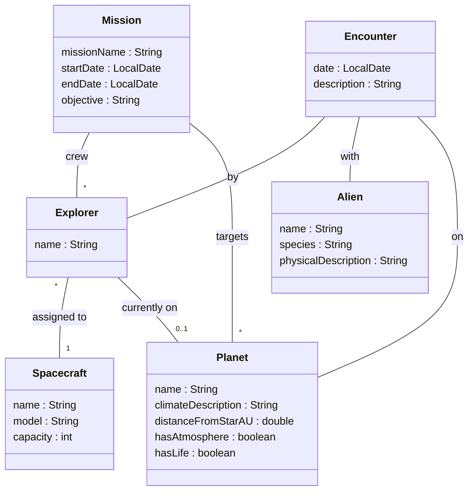
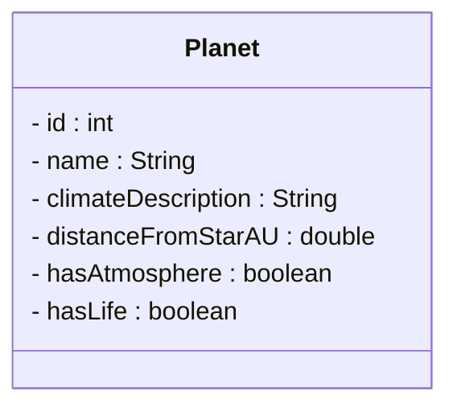
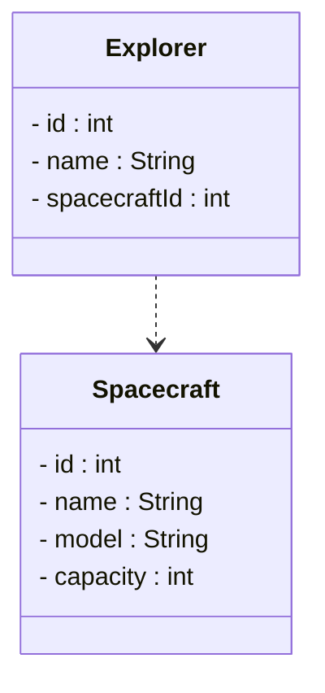

# Introduction to Keys in Domain Models

When building software systems, we create objects that represent real-world things. These are commonly called domain entities. 

> An entity is a key concept or "thing" in the problem domain that has distinct identity and attributes. Entities become classes in your domain model. 
> 
> Examples: `Book`, `Member`, `Loan`, `Author`. Each entity has attributes (properties) like `Book` has `title`, `ISBN`, and `author`.
> 
> An entity is uniquely identifiable, usually by an identifier, i.e. some ID attribute.
> 
> An entity has a life cycle. That means the entity changes over time, its data changes.

A `Planet` object represents a planet. An `Explorer` object represents a space explorer. But how do we tell one planet apart from another? How do we know which explorer we're talking about?

## Analysis vs Design/Implementation

You have already been taught about domain models. As an analysis artefact. Nothing changes with this particular artefact. This learning path is about the design/implementation part. **NOT** the analysis part.

On first semester, you then _implemented_ the domain model in Java. Using associations and other relationships to model the relationships between the entities.

In SDT you will _implement_ the domain model in Java. Using primary keys and foreign keys to model the relationships between the entities.

**But, keep in mind the difference between analysis, and design/implementation.**

## The Identity Problem

Imagine you're building a system to track space exploration missions (sounds familiar?). You have two planets in your system:

- Planet with name "Kepler-442b"
- Planet with name "Kepler-442b"

Wait... are these the same planet? Or did someone accidentally add it twice? Or are there actually two different planets with the same name? Probably someone messed up, as planet names are generally unique, but is that a hard rule?

In the real world, we solve this problem all the time:

| Domain | Identifier |
|--------|------------|
| People in Denmark | CPR number |
| Students at VIA | Student ID (e.g., 310254) |
| Books | ISBN number |
| Cars | License plate / VIN number |
| Bank accounts | Account number |
| Packages | Tracking number |

Each of these identifiers is **unique** - no two people share the same CPR number (yet, we have a problem around year 2050), no two books have the same ISBN. This uniqueness is what allows us to distinguish one thing from another, even if they have similar attributes.

## Why Names Aren't Enough

You might think: "Why not just use the name as the identifier?"

Consider these problems:

1. **Duplicates exist** - Two people can be named "Anders Jensen". Two companies can be named "Apple" (the tech company and the Beatles' record label had a famous dispute over this).

2. **Names can change** - A person might change their name after marriage. A company might rebrand. If you used the name as the identifier, you'd lose track of the entity.

3. **Names might be empty or unknown** - What if you discover a new planet but haven't named it yet? You still need to track it in your system.

## What You'll Learn

In this learning path, we'll explore how to properly identify and link entities in your Java domain models:

1. **Primary Keys** - How to give each entity a unique identifier
2. **Foreign Keys** - How to create relationships between entities using their identifiers. No, we don't use associations for this anymore.

By the end, you'll understand how to build robust domain models where every entity can be uniquely identified and properly linked to related entities.

## Prerequisites

This learning path assumes you're familiar with:

- Java classes with fields, constructors, and methods
- Object relationships (association, aggregation, composition)
- ArrayList and basic collections
- Basic UML class diagrams

This is all PRO1 stuff, so you are obviously familiar with all of this.


---

# The Case: Space Explorer System

Throughout this learning path, we'll use a **Space Explorer** system as our running example. This system tracks space exploration missions, the explorers who undertake them, the spacecraft they use, the planets they visit, and the alien life forms they encounter. Yes, I am reusing an old classic.

## The Domain

The Space Explorer system manages the following entities:

| Entity | Description |
|--------|-------------|
| **Planet** | Celestial bodies that can be explored. Each planet has characteristics like climate, distance from its star, and whether it has an atmosphere or life. |
| **Alien** | Extraterrestrial life forms that explorers might encounter. Each alien belongs to a species and has physical characteristics. |
| **Explorer** | Human space explorers who travel to planets and make discoveries. Each explorer is assigned to a spacecraft and may be on a planet. |
| **Spacecraft** | Vehicles used for space travel. Each spacecraft has a name, model, and passenger capacity. |
| **Mission** | Organized exploration expeditions. A mission has a crew of explorers and targets specific planets to visit. |
| **Encounter** | Records of meetings between explorers and aliens. Documents when, where, and what happened during the encounter. |

## Domain Model

Here is a rough sketch of the domain model showing all entities and their relationships. 



## Understanding the Relationships

Let's break down what each relationship means:

### Explorer → Spacecraft
An explorer is **assigned to** a spacecraft. This is their "home base" vehicle for missions. One spacecraft can have multiple explorers assigned to it.

### Explorer → Planet
An explorer can be **currently on** a planet. This tracks their physical location during exploration.

### Mission → Explorer (crew)
A mission has a **crew** of explorers. Multiple explorers work together on a mission. An explorer could potentially be part of multiple missions over time.

### Mission → Planet (targets)
A mission **targets** specific planets to visit and explore. A single mission might visit several planets.

### Encounter → Explorer, Alien, Planet
An encounter records that a specific **explorer** met a specific **alien** **on** a specific **planet**. It's a record of an event that links three entities together.

## The Challenge

Currently, our domain model shows the attributes and relationships, but it's missing something crucial: **How do we uniquely identify each entity?**

- If two missions are both called "Deep Space Survey", how do we tell them apart?
- When an Encounter references an Explorer, how exactly does it "point to" that explorer?
- If we save a Mission to a file and load it later, how do we reconnect it to its crew members?

These are the questions we'll answer in the following pages. We'll add **primary keys** to identify each entity, and **foreign keys** to create the links between them. These two concepts are discussed in detail in your database course, but we need to visit them here, as we are now working with entities in our domain model.

## Using This Case

Throughout this learning path, we'll use different parts of this domain to illustrate concepts:

- **Primary Keys**: We'll add IDs to `Planet` and `Spacecraft`
- **Foreign Keys**: We'll show how `Explorer` links to `Spacecraft`, and how `Mission` links to its crew
- **Finding by ID**: We'll implement lookups for planets and resolving mission crews

Let's begin by understanding what primary keys are and why we need them.


---

# Primary Keys

A **primary key** is an attribute that uniquely identifies each instance of an entity. No two instances can have the same primary key value.

## Characteristics of a Primary Key

A good primary key has these properties:

| Property | Description |
|----------|-------------|
| **Unique** | No two entities can have the same key value |
| **Immutable** | The key value never changes once assigned |
| **Non-null** | Every entity must have a key value |
| **Simple** | Preferably a single attribute (not a combination) |

Most of the time, we just use an auto-incremented integer as the primary key. But sometimes the real world provides us with an obvious identifier, like an ISBN number for a book.

## Types of Primary Keys

There are two main approaches to choosing a primary key:

### Natural Keys

A **natural key** is an attribute that already exists in the real world and naturally identifies the entity.

Examples:
- **ISBN** for books (International Standard Book Number)
- **CPR number** for Danish citizens
- **VIN** for vehicles (Vehicle Identification Number)
- **Email address** for user accounts (sometimes)

**Advantages:**
- Meaningful to humans
- Already exists, no need to generate

**Disadvantages:**
- May change (email addresses change, companies rebrand)
- May not be truly unique (duplicate ISBNs exist due to errors)
- May be sensitive data (CPR numbers shouldn't be exposed)
- May not exist for all entities (not all products have barcodes)

If your selected primary key falls into one of the disadvantages, you should not use it, and instead read below.

### Surrogate Keys

A **surrogate key** is an artificial identifier created specifically to serve as the primary key. It has no business meaning.

Examples:
- Auto-incremented integers: 1, 2, 3, 4, ...
- UUIDs: `550e8400-e29b-41d4-a716-446655440000`
- Random strings: `abc123xyz`

**Advantages:**
- Guaranteed unique (system controls generation)
- Never needs to change
- Simple and consistent across all entities
- No sensitive data concerns

**Disadvantages:**
- No inherent meaning
- Requires storage overhead (it's an extra field in the entity)

## Which Should You Use?

For most applications, **surrogate keys are recommended**. Here's why:

1. **Consistency** - Every entity gets an ID the same way
2. **Stability** - IDs never change, even if business data changes
3. **Simplicity** - Just an integer, easy to work with
4. **Privacy** - No sensitive data in the key

Natural keys can be useful as **secondary identifiers** (for lookups), but the primary key should typically be a surrogate.

For example, you may have a forum app, where each user has a unique username. But they are allowed to change their username. Most of your code will probably just use the username for lookups, like "look at the profile for user with username 'johndoe'". But you should still include a surrogate key to ensure the entity's history is preserved.

An attribute that is unique, but not the primary key, is called an **alternate key**.

## Back to Our Case: Planet

In the Space Explorer system, consider the `Planet` entity:

```
Planet
├── name: "Kepler-442b"
├── climateDescription: "Temperate"
├── distanceFromStarAU: 0.4
├── hasAtmosphere: true
└── hasLife: false
```

**Why not use `name` as the primary key?**

1. Two planets might have the same name (discovered independently by different agencies)
2. A planet might be renamed after discovery
3. A planet might not have a name yet ("Unknown Planet #47")

**Solution: Add a surrogate key**

```
Planet
├── id: 1                        ← Primary Key
├── name: "Kepler-442b"
├── climateDescription: "Temperate"
├── distanceFromStarAU: 0.4
├── hasAtmosphere: true
└── hasLife: false
```

Now we can uniquely identify this planet as "Planet 1", regardless of what its name is or whether it changes.

## Primary Keys in UML

In UML class diagrams, we typically show the primary key as the first attribute. And generally give it the name `id`.



Some conventions mark the primary key with `{PK}` or underline it, but for simplicity, we'll just put it first and use `id` as the name.

## Summary

- A **primary key** uniquely identifies each entity instance
- **Natural keys** come from the real world but can be problematic
- **Surrogate keys** are artificial IDs that we control
- For most Java applications, use **auto-incremented integers** as surrogate keys
- Always put the `id` field first in your class

Next, we'll see how to implement primary keys in Java code.


---

# Primary Keys in Java

Now let's implement primary keys in our Java entity classes. We'll use the `Planet` and `Spacecraft` classes from our Space Explorer case.

## Adding an ID Field

The simplest approach is to add an `id` field of type `int`:

```java
public class Planet 
{
    private int id;
    private String name;
    private String climateDescription;
    private double distanceFromStarAU;
    private boolean hasAtmosphere;
    private boolean hasLife;
    
    // Constructor and methods...
}
```

But where does the ID value come from? We have several options.

## Setting the IDs

Generally, databases are responsible for creating these IDs. We will somewhat mimic this by letting our data management classes handle this, in session 3.

We need to be able to create a new entity, without knowing what ID it should get.\
We also need the data managers to be able to recreate the entity after loading it from storage.

Therefore:

- Your entity will at least one constructor: 
  - **REQURIED**: one constructor _should not_ receive an ID as parameter, only the other attributes, and 
  - **OPTIONAL**: for convenience, you can include a constructor, which takes the id, so the data manager can re-create the entity. 
- Your entity _should_ have a setId() method, so the ID can be set after the object is created, or after it has been loaded.
(the setId() is actually slightly dangerous, as someone could update the id of an entity, which is not allowed. We will just rely on discipline and good design to avoid this.)

## Example: Spacecraft Class

Let's apply the same pattern to the `Spacecraft` class:

```java
public class Spacecraft 
{
    private int id;
    private String name;
    private String model;
    private int capacity;
    
    // When creating for the first time
    public Spacecraft(String name, String model, int capacity) 
    {
        this.name = name;
        this.model = model;
        this.capacity = capacity;
    }
    
    // optional constructor, for loading from storage
    public Spacecraft(int id, String name, String model, int capacity) 
    {
        this.id = id;
        this.name = name;
        this.model = model;
        this.capacity = capacity;
    }

    // used by the data manager to set the ID after the entity has been created,
    // or after the entity has been loaded from storage.
    public void setId(int id) 
    {
        this.id = id;
    }

    // other methods, getters etc...
}
```

## Summary

- Add an `id` field as the first field in your entity class
- Provide two constructors: one for new entities, one for loading
- Always provide `setId()`, so the ID can be set after the entity has been created, or after it has been loaded from storage.

Next, we'll explore how these primary keys enable us to create relationships between entities using foreign keys.


---

# Foreign Keys

Now that each entity has a primary key, we can create relationships between entities. A **foreign key** is a field in one entity that references the primary key of another entity.

## The Concept

Think of a foreign key as a "pointer" or "reference" to another entity, but instead of pointing directly to the object, it stores the ID of that object.

On previous semester we used associations to create relationships between entities. And while these are still valid in Object Oriented Design, and sometimes great for your domain entities, they cannot easily be converted to the storage model, of either a database or a file (which we will use).

**Foreign keys**

A foreign key is a field in one entity that references the primary key of another entity. That's it. One entity references another entity. 

**Real-world analogy:**

Your exam paper doesn't contain your entire student record. Instead, it has your **student ID** written on it. The examiner can use that ID to look up your full record in the student system.

- Your student ID on the exam paper = **foreign key**
- Your full record in the student database = **referenced entity**
- Your student ID in the database = **primary key**

## Visualizing Foreign Keys

Let's look at how an `Explorer` relates to a `Spacecraft`:

**Without foreign keys (object reference, association):**

Here, one object "includes" the other object. We have a group or cluster of objects, commonly known as an object graph. Imagine multiple real world objects tied together with a string. You pull on one object, and all objects are pulled along.

```
Explorer object                    Spacecraft object
┌─────────────────┐               ┌─────────────────┐
│ name: "Neil"    │               │ id: 1           │
│ spacecraft: ───────────────────>│ name: "Apollo"  │
└─────────────────┘               │ model: "CSM"    │
                                  └─────────────────┘
```

**With foreign keys:**

With foreign keys, we do not have that "string", there is no association, your objects do not actually know about each other. The object graph is broken. Instead, each object just has a little label to tell you which other object it is "imaginarily" tied to (in databases this is enforced, but not in your Java code).

```
Explorer object                    Spacecraft object
┌─────────────────┐               ┌─────────────────┐
│ id: 1           │               │ id: 1           │
│ name: "Neil"    │               │ name: "Apollo"  │
│ spacecraftId: 1 │ ─ ─ ─ ─ ─ ─ ─ │ model: "CSM"    │
└─────────────────┘               └─────────────────┘
```

The `spacecraftId` value `1` **refers to** the Spacecraft with `id = 1`. It's an indirect reference through the ID.

## Why Use Foreign Keys?

You might wonder: "Why not just store the actual object reference?"

In pure Java with objects in memory, you often **do** store object references. But foreign keys become essential when:

### 1. Persistence (Saving to Files/Databases)

When you save data to a file, you can't save an object reference - it's just a memory address. Instead, you save the ID:

```
// File: explorers.txt
1,Neil,1
2,Buzz,1

// File: spacecraft.txt  
1,Apollo,CSM,3
```

When loading, you use the foreign key (spacecraftId = 1) to reconnect the Explorer to the correct Spacecraft.

### 2. Large Data Sets

If you have millions of records, keeping all objects in memory isn't practical. Foreign keys let you load only what you need.

This code illustrates how we load a single specific mission, and then _only_ load the explorers that are part of that mission.

```java
// Load just the mission
Mission mission = loadMission(5);

// Later, if needed, resolve the crew
for (int explorerId : mission.getCrewIds()) 
{
    Explorer e = loadExplorer(explorerId);
    // process explorer...
}
```

## Foreign Keys in Our Case

Let's see where foreign keys appear in the Space Explorer domain:

### Explorer → Spacecraft

An explorer is assigned to a spacecraft:

```
Explorer
├── id: 1
├── name: "Neil Armstrong"
└── spacecraftId: 1          ← new attribute, foreign key to Spacecraft
```

### Mission → Explorers (One-to-Many)

A mission has multiple crew members:

```
Mission
├── id: 1
├── missionName: "Apollo 11"
├── objective: "Moon landing"
└── crewIds: [1, 2, 3]       ← Foreign keys to Explorers
```

### Encounter → Explorer, Alien, Planet

An encounter references three different entities:

```
Encounter
├── id: 1
├── date: "1969-07-20"
├── description: "First contact..."
├── explorerId: 1            ← Foreign key to Explorer
├── alienId: 5               ← Foreign key to Alien
└── planetId: 3              ← Foreign key to Planet
```

## UML Notation

In UML, when using foreign keys, we show the ID field explicitly and can indicate the relationship:



In this diagram `spacecraftId` is a foreign key that references the `id` field of the `Spacecraft` entity.

The arrow shows the _conceptual_ relationship, and the `spacecraftId` field is the foreign key that implements it.

## Naming Convention

A common convention for foreign key field names:

| Related Entity | Foreign Key Field |
|----------------|-------------------|
| Spacecraft | spacecraftId |
| Planet | planetId |
| Explorer | explorerId |
| Alien | alienId |

Simply take the entity name (lowercase) and append `Id`.

For collections (one-to-many):
- `crewIds` (list of explorer IDs)
- `targetPlanetIds` (list of planet IDs)

---

# Foreign Keys in Java

Let's implement foreign keys in our Java entity classes. We'll explore two approaches and understand when to use each.

## Approach 1: Object References (Traditional)

This is what you've likely been doing already - storing a reference to the actual object:

```java
public class Explorer 
{
    private int id;
    private String name;
    private Spacecraft spacecraft;  // Direct object reference
    
    public Explorer(String name, Spacecraft spacecraft) 
    {
        this.name = name;
        this.spacecraft = spacecraft;
    }
    
    public Spacecraft getSpacecraft() 
    {
        return spacecraft;
    }
}
```

**Usage:**
```java
Spacecraft apollo = new Spacecraft("Apollo", "CSM", 3);
Explorer neil = new Explorer("Neil Armstrong", apollo);

// Easy to navigate
String shipName = neil.getSpacecraft().getName();  // "Apollo"
```

**Pros:**
- Simple and intuitive
- Easy navigation between objects
- Type-safe (compiler ensures you reference a Spacecraft)

**Cons:**
- Can't easily save to a file (what do you write for the spacecraft field?)
- All related objects must be in memory
- Can create complex object graphs

## Approach 2: Foreign Key (ID Reference)

Store only the ID of the related entity:

```java
public class Explorer 
{
    private int id;
    private String name;
    private int spacecraftId;  // Foreign key - just the ID
    
    public Explorer(String name, int spacecraftId) 
    {
        this.id = nextId++;
        this.name = name;
        this.spacecraftId = spacecraftId;
    }
    
    public int getSpacecraftId() 
    {
        return spacecraftId;
    }
}
```

**Usage:**
```java
Spacecraft apollo = new Spacecraft("Apollo", "CSM", 3);  // apollo.getId() = 1
Explorer neil = new Explorer("Neil Armstrong", apollo.getId());

// To get the spacecraft, you need a lookup
int shipId = neil.getSpacecraftId();  // 1
// Then find the Spacecraft with id = 1 (we'll cover this in the next page)
```

**Pros:**
- Easy to save to files (just save the integer)
- Entities are independent - can be loaded separately
- Works well with databases

**Cons:**
- Extra step to get the related object, requires potentially many data manager lookups to get all the related objects
- Less convenient for in-memory navigation

## Example: Mission with Collection of Foreign Keys

A `Mission` has multiple crew members. With foreign keys, we store a list of IDs:

```java
import java.time.LocalDate;
import java.util.ArrayList;

public class Mission 
{
    private int id;
    private String missionName;
    private LocalDate startDate;
    private LocalDate endDate;
    private String objective;
    private ArrayList<Integer> crewIds;         // FKs to Explorers
    private ArrayList<Integer> targetPlanetIds; // FKs to Planets
    
    public Mission(String missionName, LocalDate startDate, String objective) 
    {
        this.missionName = missionName;
        this.startDate = startDate;
        this.endDate = null;  // Not ended yet
        this.objective = objective;
        this.crewIds = new ArrayList<>();
        this.targetPlanetIds = new ArrayList<>();
    }
    
    // Constructor for loading
    public Mission(int id, String missionName, LocalDate startDate, 
                   LocalDate endDate, String objective,
                   ArrayList<Integer> crewIds, ArrayList<Integer> targetPlanetIds) 
    {
        this.id = id;
        this.missionName = missionName;
        this.startDate = startDate;
        this.endDate = endDate;
        this.objective = objective;
        this.crewIds = crewIds;
        this.targetPlanetIds = targetPlanetIds;
    }
    
    public void setId(int id)
    {
        this.id = id;
    }

    public void addCrewMember(int explorerId) 
    {
        if (!crewIds.contains(explorerId)) 
        {
            crewIds.add(explorerId);
        }
    }
    
    public void addTargetPlanet(int planetId) 
    {
        if (!targetPlanetIds.contains(planetId)) 
        {
            targetPlanetIds.add(planetId);
        }
    }
    
    public ArrayList<Integer> getCrewIds() 
    {
        return new ArrayList<>(crewIds);  // Return a copy, to prevent external modification
    }
    
    public ArrayList<Integer> getTargetPlanetIds() 
    {
        return new ArrayList<>(targetPlanetIds);  // Return a copy, to prevent external modification
    }
    
    public int getId() 
    {
        return id;
    }
    
    public String getMissionName() 
    {
        return missionName;
    }
    
    // ... other getters
}
```

**Usage:**
```java
// Create explorers
Explorer neil = new Explorer("Neil Armstrong", 1);      // id = 1
Explorer buzz = new Explorer("Buzz Aldrin", 1);         // id = 2
Explorer michael = new Explorer("Michael Collins", 1);  // id = 3

// Create mission with crew
Mission apollo11 = new Mission("Apollo 11", LocalDate.of(1969, 7, 16), "Moon landing");
apollo11.addCrewMember(neil.getId());     // Add explorer 1
apollo11.addCrewMember(buzz.getId());     // Add explorer 2
apollo11.addCrewMember(michael.getId());  // Add explorer 3

// The mission stores [1, 2, 3] as crew IDs
```

## Hybrid Approach: Both Object and ID

Sometimes you want the convenience of object references during runtime, but foreign keys for persistence. You can have both.

The `spacecraft` field is _transient_, it _will not_ be saved to the file. You will control the file writing manually, so you can just ignore it when writing to the file.\
The `spacecraftId` field _is_ saved to the file.

```java
public class Explorer 
{
    private int id;
    private String name;
    
    // For persistence
    private int spacecraftId;
    
    // For runtime convenience (transient - not saved)
    private Spacecraft spacecraft;
    
    public void setSpacecraft(Spacecraft spacecraft) 
    {
        this.spacecraft = spacecraft;
        this.spacecraftId = spacecraft.getId();
    }
    
    public Spacecraft getSpacecraft() 
    {
        return spacecraft;
    }
    
    public int getSpacecraftId() 
    {
        return spacecraftId;
    }
}
```

When saving, use `spacecraftId`. When loading, first load all Spacecraft objects, then "resolve" the references.

## Summary

- **Object references** are convenient but don't persist well
- **Foreign keys** (storing IDs) are essential for persistence
- For collections, use `ArrayList<Integer>` to store multiple foreign keys
- You can combine both approaches for convenience
- The add methods should check for duplicates to prevent adding the same ID twice


---

# Finding Entities by ID

When using foreign keys, you store IDs instead of object references. But at some point, you need to get the actual object. This is where **lookup methods** come in.

## The Problem

You have a `Mission` with `crewIds = [1, 2, 3]`. To display the crew members' names, you need to find the `Explorer` objects with those IDs.

```java
Mission apollo11 = loadMission(1);

// You have IDs, but you need Explorer objects
for (int explorerId : apollo11.getCrewIds()) 
{
    // How do we get the Explorer with this ID?
}
```

## The Solution: findById Methods

Create methods that search through your collection of entities and return the one with the matching ID. The below example uses a list for simplicity, but we will store the data in a file, and read it into a list.

### Basic Implementation

```java
public class ExplorerDataManager 
{
    private ArrayList<Explorer> explorers;
    
    public ExplorerDataManager() 
    {
        this.explorers = new ArrayList<>();
    }
    
    public void add(Explorer explorer) 
    {
        explorers.add(explorer);
    }
    
    public Explorer findById(int id) 
    {
        for (Explorer explorer : explorers) 
        {
            if (explorer.getId() == id) 
            {
                return explorer;
            }
        }
        return null;  // Not found
    }
}
```

**Usage:**
```java
ExplorerManager explorerManager = new ExplorerManager();

// Add some explorers
explorerManager.add(new Explorer("Neil Armstrong", 1));   // id = 1
explorerManager.add(new Explorer("Buzz Aldrin", 1));      // id = 2
explorerManager.add(new Explorer("Michael Collins", 1)); // id = 3

// Later, find by ID
Explorer neil = explorerManager.findById(1);
System.out.println(neil.getName());  // "Neil Armstrong"
```

## Resolving Foreign Keys

Now we can "resolve" foreign keys to actual objects. Let's display a mission's crew:

```java
public class MissionDisplay 
{
    private MissionDataManager missionDataManager;
    private ExplorerDataManager explorerDataManager;
    private PlanetDataManager planetDataManager;
    
    public MissionDisplay(MissionDataManager missionDataManager,
                          ExplorerDataManager explorerDataManager, 
                          PlanetDataManager planetDataManager) 
    {
        this.missionDataManager = missionDataManager;
        this.explorerDataManager = explorerDataManager;
        this.planetDataManager = planetDataManager;
    }
    
    public void displayMission(int missionId) 
    {
        // First, find the mission by ID
        Mission mission = missionDataManager.findById(missionId);
        if (mission == null) 
        {
            System.out.println("Mission not found: " + missionId);
            return;
        }
        
        System.out.println("Mission: " + mission.getMissionName());
        System.out.println("Objective: " + mission.getObjective());
        
        // Resolve crew IDs to Explorer objects
        System.out.println("Crew:");
        for (int explorerId : mission.getCrewIds()) 
        {
            Explorer explorer = explorerDataManager.findById(explorerId);
            if (explorer != null) 
            {
                System.out.println("  - " + explorer.getName());
            }
        }
        
        // Resolve target planet IDs
        System.out.println("Target Planets:");
        for (int planetId : mission.getTargetPlanetIds()) 
        {
            Planet planet = planetDataManager.findById(planetId);
            if (planet != null) 
            {
                System.out.println("  - " + planet.getName());
            }
        }
    }
}
```

**Output:**
```
Mission: Apollo 11
Objective: Moon landing
Crew:
  - Neil Armstrong
  - Buzz Aldrin
  - Michael Collins
Target Planets:
  - Saturn
```

