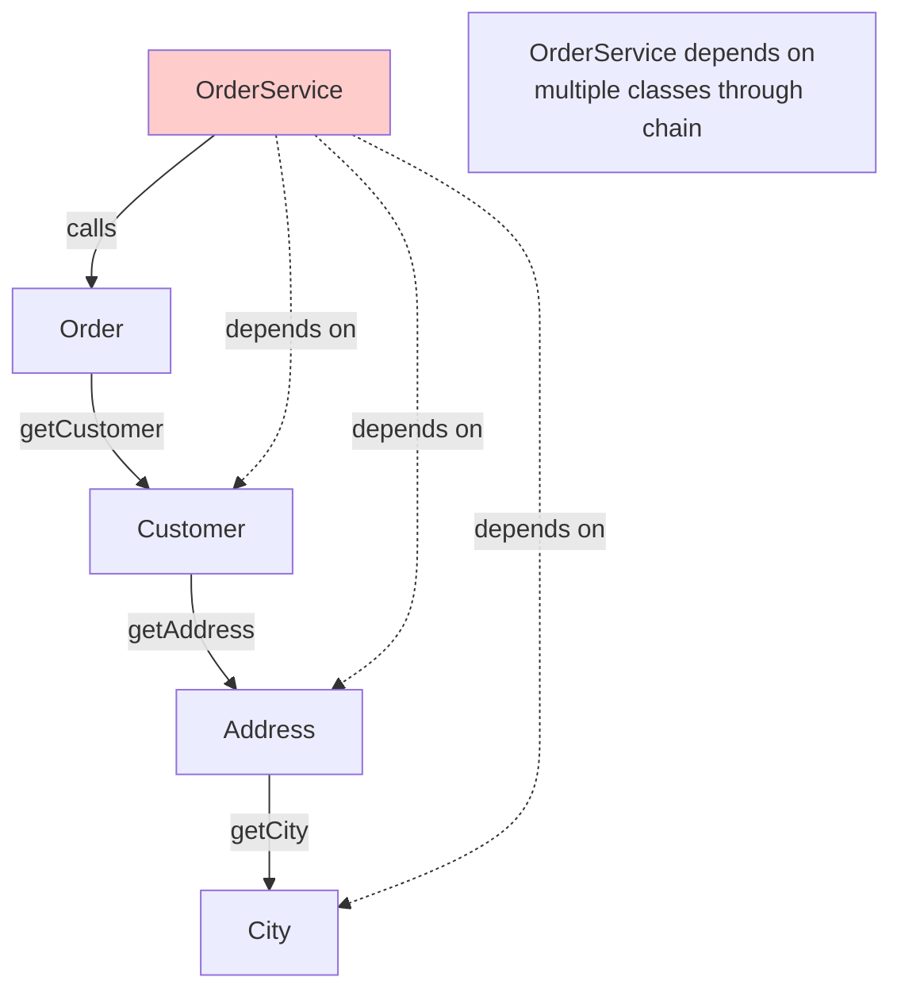
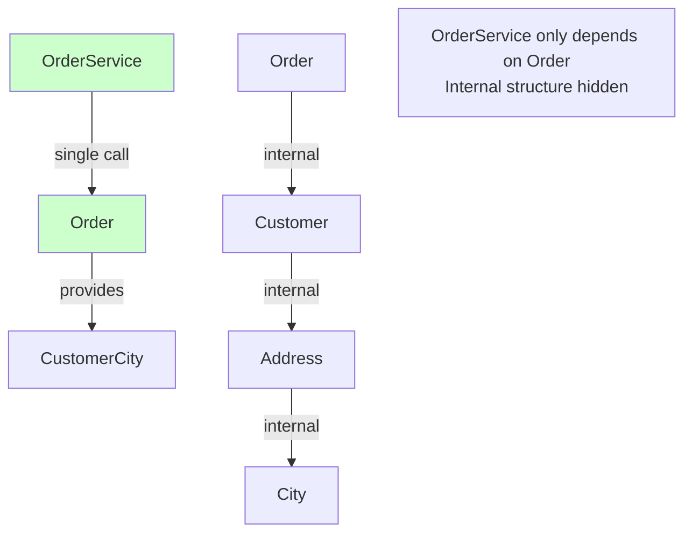

# Introduction to the Law of Demeter

Welcome to the **Law of Demeter (LoD)**! Also known as the **Principle of Least Knowledge**, this is a design guideline that helps reduce coupling and create more maintainable code.

## What is the Law of Demeter?

The **Law of Demeter** states that an object should only talk to its **immediate friends**, not to friends of friends.

### The Core Rule

> **"Only talk to your immediate neighbors."**

An object should only call methods on:
1. **Itself** - Methods on the same object
2. **Objects passed as parameters** - Method parameters
3. **Objects it creates** - Objects created within the method
4. **Its direct component objects** - Objects stored in instance variables

An object should **NOT** call methods on objects returned by other method calls.

## The Formal Definition

More formally, the Law of Demeter states that a method `m` of an object `O` should only call methods of:
- `O` itself
- Objects passed as parameters to `m`
- Objects created within `m`
- Objects stored in instance variables of `O`
- Objects in global variables accessible by `O`

## The "Don't Talk to Strangers" Principle

A simpler way to remember it:

> **"Don't talk to strangers."**

You can talk to:
- Yourself
- Your friends (objects you know directly)
- Objects you create

You should **NOT** talk to:
- Friends of friends (objects returned by method calls)
- Strangers (objects you don't know directly)

## The Visual Metaphor

Think of it like a conversation:

### Good: Talking to Friends

```
You → Your Friend
"Can you help me?"
```

### Bad: Talking Through Friends

```
You → Your Friend → Friend's Friend
"Can you ask your friend to help me?"
```

In code, this becomes:

### Good: Direct Communication

```java
// You talk directly to the object you need
String city = order.getCustomerCity();
```

### Bad: Talking Through Chains

```java
// You talk through multiple objects
String city = order.getCustomer().getAddress().getCity();  // Chain!
```

## Why It Matters

The Law of Demeter helps you:

1. **Reduce Coupling** - Objects depend on fewer other objects
2. **Improve Encapsulation** - Internal structure is hidden
3. **Increase Flexibility** - Changes are isolated
4. **Improve Maintainability** - Code is easier to understand and modify

## Connection to Other Principles

The Law of Demeter relates to:

- **Coupling** - Reduces coupling by limiting dependencies
- **Encapsulation** - Preserves encapsulation by not exposing internal structure
- **Single Responsibility Principle** - Objects focus on their own responsibilities
- **Dependency Inversion Principle** - Encourages depending on abstractions

## The Classic Example

The most common violation is the "train wreck" or "chain of calls":

```java
// Violation: Chain of method calls
String city = order.getCustomer().getAddress().getCity();
//     ↑         ↑          ↑          ↑
//   result   method    method    method
//           call      call      call
```

This violates the Law of Demeter because:
- `order` calls `getCustomer()` (OK - immediate friend)
- Then calls `getAddress()` on the result (NOT OK - friend of friend)
- Then calls `getCity()` on that result (NOT OK - friend of friend of friend)

## Summary

The Law of Demeter:
- **Limits communication** - Only talk to immediate friends
- **Reduces coupling** - Fewer dependencies
- **Improves encapsulation** - Internal structure stays hidden
- **Prevents "train wrecks"** - Avoids long chains of method calls

In the following sections, we'll explore violations, solutions, and practical examples.


---

# The Problem: Violations of the Law of Demeter

When you violate the Law of Demeter, you create code that is tightly coupled, fragile, and hard to maintain.

## The "Train Wreck" Pattern

The most common violation is the **"train wreck"** - a chain of method calls:

```java
// Violation: Chain of method calls
String city = order.getCustomer().getAddress().getCity();
```

This is called a "train wreck" because it looks like a train of connected cars: `order` → `customer` → `address` → `city`.

## Why Train Wrecks Are Problems

### Problem 1: Tight Coupling

```java
// Violation: Tightly coupled to internal structure
public class OrderService {
    public void processOrder(Order order) {
        // Knows about Order → Customer → Address → City
        String city = order.getCustomer().getAddress().getCity();
        
        if (city.equals("New York")) {
            applySpecialTax(order);
        }
    }
}
```

**Problems:**
- `OrderService` knows about `Customer`'s internal structure
- `OrderService` knows about `Address`'s internal structure
- If `Customer` or `Address` changes, `OrderService` breaks
- High coupling - depends on multiple classes

### Problem 2: Fragile Code

```java
// If the internal structure changes, this breaks:
String city = order.getCustomer().getAddress().getCity();

// What if:
// - Customer no longer has an Address?
// - Address structure changes?
// - getCity() is renamed?
// - Any link in the chain changes?
```

**Result:** Code breaks when any part of the chain changes.

### Problem 3: Hard to Test

```java
// Hard to test because you need to mock the entire chain
@Test
public void testProcessOrder() {
    Order order = mock(Order.class);
    Customer customer = mock(Customer.class);
    Address address = mock(Address.class);
    
    when(order.getCustomer()).thenReturn(customer);
    when(customer.getAddress()).thenReturn(address);
    when(address.getCity()).thenReturn("New York");
    
    // Complex setup for a simple test
}
```

**Problem:** Must mock every object in the chain.

### Problem 4: Violates Encapsulation

```java
// Exposes internal structure
String city = order.getCustomer().getAddress().getCity();
// This reveals:
// - Order has a Customer
// - Customer has an Address
// - Address has a City
```

**Problem:** Internal structure is exposed, breaking encapsulation.

## Common Violation Patterns

### Pattern 1: Navigation Through Objects

```java
// Bad: Navigating through object structure
public void printCustomerInfo(Order order) {
    String name = order.getCustomer().getName();
    String email = order.getCustomer().getEmail();
    String city = order.getCustomer().getAddress().getCity();
}
```

### Pattern 2: Method Chaining

```java
// Bad: Long chain of method calls
public void process(Order order) {
    order.getCustomer().getAddress().getCountry().getTaxRate();
}
```

### Pattern 3: Nested Method Calls

```java
// Bad: Nested calls
public void sendEmail(Order order) {
    emailService.send(
        order.getCustomer().getEmail(),
        order.getCustomer().getAddress().getCity()
    );
}
```

## Real-World Example: Order Processing

### Violation

```java
public class OrderService {
    public void processOrder(Order order) {
        // Violation: Chain of calls
        String customerName = order.getCustomer().getName();
        String customerEmail = order.getCustomer().getEmail();
        String customerCity = order.getCustomer().getAddress().getCity();
        String customerCountry = order.getCustomer().getAddress().getCountry();
        
        // Process order
        double tax = calculateTax(order, customerCountry);
        sendConfirmation(customerEmail, customerName, customerCity);
    }
    
    private double calculateTax(Order order, String country) {
        // Tax calculation
    }
    
    private void sendConfirmation(String email, String name, String city) {
        // Send email
    }
}
```

**Problems:**
- Tightly coupled to `Customer` and `Address` structure
- If `Customer` changes, this breaks
- If `Address` changes, this breaks
- Hard to test (must mock entire chain)
- Exposes internal structure

## The Ripple Effect

When you violate the Law of Demeter, changes ripple through the system:

```java
// Original code
String city = order.getCustomer().getAddress().getCity();

// If Address structure changes:
public class Address {
    // Before: getCity() returns String
    // After: getCity() returns City object
    public City getCity() { ... }
}

// Now this breaks:
String city = order.getCustomer().getAddress().getCity();  // Returns City, not String!
```

**Result:** One change breaks multiple places.

## Visualizing the Problem



## Summary

Violations of the Law of Demeter cause:

1. **Tight Coupling** - Depends on multiple classes through chains
2. **Fragile Code** - Breaks when any part of chain changes
3. **Hard to Test** - Must mock entire chain
4. **Violates Encapsulation** - Exposes internal structure
5. **Ripple Effects** - Changes propagate through system

The solution is to **avoid chains** and **talk directly** to the objects you need.


---

# The Solution: Following the Law of Demeter

The solution is to **avoid chains** and have objects provide what you need directly.

## The Core Strategy

Instead of navigating through object chains, ask the object you know to provide what you need.

### The Pattern

**Bad:** Navigate through objects
```java
String city = order.getCustomer().getAddress().getCity();
```

**Good:** Ask the object you know
```java
String city = order.getCustomerCity();
```

## Solution 1: Delegate to the Object

Have the object you know provide the information you need:

### Example

```java
// Bad: Chain of calls
public class OrderService {
    public void processOrder(Order order) {
        String city = order.getCustomer().getAddress().getCity();
        // Use city
    }
}

// Good: Order provides what's needed
public class Order {
    private Customer customer;
    
    // Delegate method - provides what callers need
    public String getCustomerCity() {
        return customer.getAddress().getCity();
    }
}

public class OrderService {
    public void processOrder(Order order) {
        String city = order.getCustomerCity();  // Direct call
        // Use city
    }
}
```

**Benefits:**
- `OrderService` only depends on `Order`
- If `Customer` or `Address` structure changes, only `Order` needs to change
- Encapsulation preserved
- Easier to test

## Solution 2: Use Data Transfer Objects (DTOs)

Create simple objects that contain only the data you need:

### Example

```java
// Bad: Chain of calls
public void sendConfirmation(Order order) {
    String email = order.getCustomer().getEmail();
    String name = order.getCustomer().getName();
    String city = order.getCustomer().getAddress().getCity();
    sendEmail(email, name, city);
}

// Good: Use a DTO
public class CustomerInfo {
    private String email;
    private String name;
    private String city;
    
    // Constructor and getters
}

public class Order {
    public CustomerInfo getCustomerInfo() {
        Customer customer = this.customer;
        Address address = customer.getAddress();
        return new CustomerInfo(
            customer.getEmail(),
            customer.getName(),
            address.getCity()
        );
    }
}

public void sendConfirmation(Order order) {
    CustomerInfo info = order.getCustomerInfo();  // Single call
    sendEmail(info.getEmail(), info.getName(), info.getCity());
}
```

**Benefits:**
- Single method call
- Only depends on `Order` and `CustomerInfo`
- Internal structure hidden
- Easy to test

## Solution 3: Tell, Don't Ask

Instead of asking for data and doing something with it, tell the object to do it:

### Example

```java
// Bad: Ask for data, then do something
public class OrderService {
    public void processOrder(Order order) {
        String email = order.getCustomer().getEmail();
        String name = order.getCustomer().getName();
        sendConfirmationEmail(email, name);
    }
}

// Good: Tell the object to do it
public class Order {
    private Customer customer;
    
    public void sendConfirmation() {
        String email = customer.getEmail();
        String name = customer.getName();
        emailService.sendConfirmation(email, name);
    }
}

public class OrderService {
    public void processOrder(Order order) {
        order.sendConfirmation();  // Tell, don't ask
    }
}
```

**Benefits:**
- Behavior stays with the object that has the data
- No chain of calls
- Better encapsulation
- Follows Single Responsibility Principle

## Solution 4: Flatten the Structure

Sometimes the structure itself is the problem. Consider flattening it:

### Example

```java
// Bad: Deep nesting
public class Order {
    private Customer customer;  // Customer has Address
}

public class Customer {
    private Address address;  // Address has City
}

public class Address {
    private String city;
}

// Good: Flatten if appropriate
public class Order {
    private Customer customer;
    private String customerCity;  // Store directly if needed frequently
}
```

**Note:** Only flatten if it makes sense for your domain. Don't flatten just to avoid chains.

## Real-World Example: Fixing the Order Service

### Before: Violation

```java
public class OrderService {
    public void processOrder(Order order) {
        // Violation: Multiple chains
        String customerName = order.getCustomer().getName();
        String customerEmail = order.getCustomer().getEmail();
        String customerCity = order.getCustomer().getAddress().getCity();
        String customerCountry = order.getCustomer().getAddress().getCountry();
        
        double tax = calculateTax(order, customerCountry);
        sendConfirmation(customerEmail, customerName, customerCity);
    }
}
```

### After: Following LoD

```java
// Option 1: Delegate methods
public class Order {
    private Customer customer;
    
    public String getCustomerName() {
        return customer.getName();
    }
    
    public String getCustomerEmail() {
        return customer.getEmail();
    }
    
    public String getCustomerCity() {
        return customer.getAddress().getCity();
    }
    
    public String getCustomerCountry() {
        return customer.getAddress().getCountry();
    }
}

public class OrderService {
    public void processOrder(Order order) {
        // Single level of calls
        String customerName = order.getCustomerName();
        String customerEmail = order.getCustomerEmail();
        String customerCity = order.getCustomerCity();
        String customerCountry = order.getCustomerCountry();
        
        double tax = calculateTax(order, customerCountry);
        sendConfirmation(customerEmail, customerName, customerCity);
    }
}

// Option 2: Tell, don't ask (even better)
public class Order {
    private Customer customer;
    private TaxCalculator taxCalculator;
    private EmailService emailService;
    
    public void process() {
        double tax = taxCalculator.calculate(this);
        emailService.sendConfirmation(this);
    }
    
    // Getters for what's needed
    public String getCustomerName() {
        return customer.getName();
    }
    
    public String getCustomerEmail() {
        return customer.getEmail();
    }
    
    public String getCustomerCity() {
        return customer.getAddress().getCity();
    }
}

public class OrderService {
    public void processOrder(Order order) {
        order.process();  // Tell, don't ask
    }
}
```

## The "One Dot" Rule

A simple guideline: **Limit yourself to one dot (method call).**

```java
// Bad: Multiple dots
order.getCustomer().getAddress().getCity();  // 3 dots

// Good: One dot
order.getCustomerCity();  // 1 dot
```

**Note:** This is a guideline, not a strict rule. Sometimes two dots are acceptable, but chains of three or more are usually a problem.

## Visualizing the Solution



## Summary

To follow the Law of Demeter:

1. **Delegate methods** - Have objects provide what callers need
2. **Use DTOs** - Create simple data objects
3. **Tell, don't ask** - Tell objects to do things, don't ask for data
4. **Flatten structure** - If appropriate for your domain
5. **One dot rule** - Limit method call chains

**The key:** Objects should provide what callers need, not force callers to navigate internal structure.


---

# Examples: Law of Demeter in Practice

Real-world examples showing violations and how to fix them.

## Example 1: Order Processing

### Violation: Train Wreck

```java
// Bad: Chain of method calls
public class OrderService {
    public void processOrder(Order order) {
        // Violation: Multiple chains
        String name = order.getCustomer().getName();
        String email = order.getCustomer().getEmail();
        String city = order.getCustomer().getAddress().getCity();
        String country = order.getCustomer().getAddress().getCountry();
        
        // Process with this data
        applyTax(order, country);
        sendEmail(email, name, city);
    }
}
```

**Problems:**
- Depends on `Customer` and `Address` structure
- Breaks if internal structure changes
- Hard to test (must mock entire chain)

### Solution: Delegate Methods

```java
// Good: Order provides what's needed
public class Order {
    private Customer customer;
    
    public String getCustomerName() {
        return customer.getName();
    }
    
    public String getCustomerEmail() {
        return customer.getEmail();
    }
    
    public String getCustomerCity() {
        return customer.getAddress().getCity();
    }
    
    public String getCustomerCountry() {
        return customer.getAddress().getCountry();
    }
}

public class OrderService {
    public void processOrder(Order order) {
        // Single level of calls
        String name = order.getCustomerName();
        String email = order.getCustomerEmail();
        String city = order.getCustomerCity();
        String country = order.getCustomerCountry();
        
        applyTax(order, country);
        sendEmail(email, name, city);
    }
}
```

**Benefits:**
- Only depends on `Order`
- If `Customer` or `Address` changes, only `Order` needs updating
- Easier to test

## Example 2: Email Sending

### Violation: Nested Calls

```java
// Bad: Nested method calls
public class NotificationService {
    public void sendOrderConfirmation(Order order) {
        emailService.send(
            order.getCustomer().getEmail(),  // Chain!
            "Order confirmed",
            "Your order total: " + order.getTotal()
        );
    }
}
```

### Solution: Tell, Don't Ask

```java
// Good: Tell Order to send confirmation
public class Order {
    private Customer customer;
    private EmailService emailService;
    
    public void sendConfirmation() {
        emailService.send(
            customer.getEmail(),
            "Order confirmed",
            "Your order total: " + getTotal()
        );
    }
}

public class NotificationService {
    public void sendOrderConfirmation(Order order) {
        order.sendConfirmation();  // Tell, don't ask
    }
}
```

**Benefits:**
- Behavior stays with the object that has the data
- No chain of calls
- Better encapsulation

## Example 3: Tax Calculation

### Violation: Deep Navigation

```java
// Bad: Deep navigation
public class TaxCalculator {
    public double calculateTax(Order order) {
        String country = order.getCustomer().getAddress().getCountry();
        double rate = getTaxRate(country);
        return order.getTotal() * rate;
    }
}
```

### Solution: DTO or Delegate Method

```java
// Option 1: Delegate method
public class Order {
    public String getCustomerCountry() {
        return customer.getAddress().getCountry();
    }
}

public class TaxCalculator {
    public double calculateTax(Order order) {
        String country = order.getCustomerCountry();  // Single call
        double rate = getTaxRate(country);
        return order.getTotal() * rate;
    }
}

// Option 2: Tell, don't ask (even better)
public class Order {
    private TaxCalculator taxCalculator;
    
    public double calculateTax() {
        String country = customer.getAddress().getCountry();
        double rate = taxCalculator.getTaxRate(country);
        return getTotal() * rate;
    }
}

public class TaxCalculator {
    public double calculateTax(Order order) {
        return order.calculateTax();  // Tell, don't ask
    }
}
```

## Example 4: User Profile Display

### Violation: Multiple Chains

```java
// Bad: Multiple chains
public class ProfileService {
    public void displayUserProfile(User user) {
        String name = user.getProfile().getPersonalInfo().getName();
        String email = user.getProfile().getContactInfo().getEmail();
        String city = user.getProfile().getAddress().getCity();
        
        display(name, email, city);
    }
}
```

### Solution: DTO

```java
// Good: Use a DTO
public class UserProfileDTO {
    private String name;
    private String email;
    private String city;
    
    // Constructor and getters
}

public class User {
    public UserProfileDTO getProfileInfo() {
        Profile profile = this.profile;
        return new UserProfileDTO(
            profile.getPersonalInfo().getName(),
            profile.getContactInfo().getEmail(),
            profile.getAddress().getCity()
        );
    }
}

public class ProfileService {
    public void displayUserProfile(User user) {
        UserProfileDTO profile = user.getProfileInfo();  // Single call
        display(profile.getName(), profile.getEmail(), profile.getCity());
    }
}
```

## Example 5: Shopping Cart

### Violation: Method Chaining

```java
// Bad: Long chain
public class CheckoutService {
    public void checkout(ShoppingCart cart) {
        double total = cart.getItems().stream()
            .mapToDouble(item -> item.getProduct().getPrice() * item.getQuantity())
            .sum();
        
        String customerEmail = cart.getCustomer().getEmail();
        String customerName = cart.getCustomer().getName();
        
        processPayment(total, customerEmail);
        sendReceipt(customerEmail, customerName, total);
    }
}
```

### Solution: Delegate Methods

```java
// Good: Cart provides what's needed
public class ShoppingCart {
    private List<CartItem> items;
    private Customer customer;
    
    public double getTotal() {
        return items.stream()
            .mapToDouble(item -> item.getProduct().getPrice() * item.getQuantity())
            .sum();
    }
    
    public String getCustomerEmail() {
        return customer.getEmail();
    }
    
    public String getCustomerName() {
        return customer.getName();
    }
}

public class CheckoutService {
    public void checkout(ShoppingCart cart) {
        double total = cart.getTotal();  // Single call
        String customerEmail = cart.getCustomerEmail();  // Single call
        String customerName = cart.getCustomerName();  // Single call
        
        processPayment(total, customerEmail);
        sendReceipt(customerEmail, customerName, total);
    }
}
```

## Example 6: Connection to Coupling

The Law of Demeter directly relates to coupling:

### High Coupling (Violation)

```java
// OrderService is coupled to Order, Customer, and Address
public class OrderService {
    public void process(Order order) {
        String city = order.getCustomer().getAddress().getCity();
        // Depends on 3 classes
    }
}
```

### Low Coupling (Following LoD)

```java
// OrderService is only coupled to Order
public class OrderService {
    public void process(Order order) {
        String city = order.getCustomerCity();
        // Depends on 1 class
    }
}
```

## Key Takeaways

From these examples:

1. **Avoid chains** - Don't call methods on returned objects
2. **Delegate methods** - Have objects provide what callers need
3. **Use DTOs** - For complex data needs
4. **Tell, don't ask** - Tell objects to do things
5. **Reduces coupling** - Fewer dependencies
6. **Improves encapsulation** - Internal structure hidden

**The pattern:** Instead of navigating through objects, ask the object you know to provide what you need.

