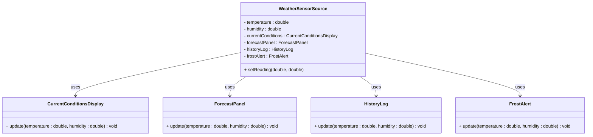
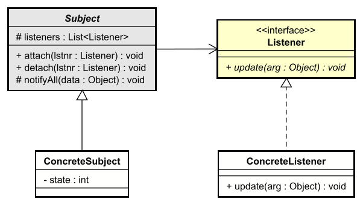

# Introduction to the Observer Design Pattern

When one object's state _changes_, other objects often need to react: 
* update a display, 
* log the change, 
* send an alert, or 
* refresh derived data. 

The **Observer** design pattern gives you a clean way to do this without the changing object knowing the concrete types of whoever is listening.

In this learning path we use the names **Subject** (the object whose state changes) and **Listener** (the object(s) that reacts). You may see the same pattern called Observer, Subscriber, or Event Listener elsewhere; the idea is the same.

The pattern is _old_, has been around for a long time. It is a fundamental pattern in object-oriented design. It was first popularized in the book "Design Patterns: Elements of Reusable Object-Oriented Software" by Erich Gamma, Richard Helm, Ralph Johnson, and John Vlissides, published in 1994!  
As with everything else, stuff evolves, and so has the pattern. Here, though, I will introduce the original idea.

## The Core Idea

- **Subject**: The object that holds state. When its state changes, it _notifies_ everyone who has registered an interest.
- **Listener**: An object that wants to be notified when the Subject changes. It implements a simple contract (for example, an `update` method) and registers with the Subject.

The Subject _does not_ depend on concrete listener classes — only on a Listener interface. That keeps the design loose and makes it easy to add or remove listeners at runtime.

## What You Will Learn

1. **The problem** – Why we need a structured way to notify multiple dependents when state changes.
2. **A poor solution** – Directly wiring the "source" to concrete display or consumer classes, and why that hurts.
3. **The pattern** – Its purpose, structure (with a UML class diagram), participants, and consequences.
4. **Implementation** – How to implement it in Java using an abstract Subject superclass and a Listener interface.
5. **Applying the pattern** – Taking the initial problem and solving it with the Observer (Subject/Listener) pattern.

## Scope of This Learning Path

Here we focus on the **classic** approach: an abstract Subject superclass that maintains a list of Listeners and calls their `update` method when state changes. Other approaches—such as Java's legacy `Observable`/`Observer`, property bindings, or reactive streams—are covered elsewhere. Once you understand this version, those alternatives will be easier to follow.


---

# The Problem

The Observer pattern addresses a common situation: **one object's state changes, and several other objects need to react** — update a display, log the change, send an alert, or keep derived data in sync.

## The Scenario

Imagine a **weather sensor** that reports **temperature** and **humidity** (e.g. two fields, updated when new readings arrive). Several **dependent components** need to stay in sync with those readings:

- A **current conditions display** shows the latest temperature and humidity.
- A **forecast panel** uses the readings (e.g. for a simple forecast).
- A **history log** records each reading.
- A **frost alert** warns when temperature drops below a threshold (e.g. 0 °C).

When the sensor gets new readings, all four must be updated. The question is: how does the source tell them?

## A Poor Solution: Direct References

A straightforward but brittle approach is for the "source" class, `WeatherSensorSource`, to hold **direct references** to each concrete display or consumer. When its state changes, it explicitly calls each one:

```java
public class WeatherSensorSource {
    private double temperature;
    private double humidity;

    // Tight coupling: source knows every concrete listener type
    private CurrentConditionsDisplay currentConditions;
    private ForecastPanel forecastPanel;
    private HistoryLog historyLog;
    private FrostAlert frostAlert;

    // Constructor...

    public void setReading(double temperature, double humidity) {
        this.temperature = temperature;
        this.humidity = humidity;
        currentConditions.update(temperature, humidity);
        forecastPanel.update(temperature, humidity);
        historyLog.update(temperature, humidity);
        frostAlert.update(temperature, humidity);
    }
}
```

Here, `WeatherSensorSource` depends directly on `CurrentConditionsDisplay`, `ForecastPanel`, `HistoryLog`, and `FrostAlert`. It has to know every type that cares about the readings.

### Adding or Removing Listeners

To add a new component (for example a statistics panel), you must:

1. Add a new field to `WeatherSensorSource`.
2. Add a call in `setReading` (and in any constructor or setter that wires things up).

To remove a listener, you have to change the same class again. Every time the set of listeners changes, the class must be modified. Inconvenient!

## Why This Is a Problem: Drawbacks and Consequences

Direct dependency is a problem not only in principle but in practice. Here are the main drawbacks, pitfalls, and consequences.

### Tight Coupling

The source class **depends on concrete listener types**. That means:

- **Reuse is limited**: You cannot use the source in another project or module that does not have `CurrentConditionsDisplay`, `ForecastPanel`, and so on. The source drags all those classes in as compile-time dependencies.
- **Change ripples**: If a listener’s API changes (e.g. `update` gets an extra parameter), you must change the source and every call site. The source is tied to the listener’s concrete interface.

### Hard to Add or Remove Listeners

Every new component that needs the readings forces you to **edit the source**:

- Add a new field.
- Add a call in `setReading` (and in constructors or setters that wire things up).
- If you remove a listener (e.g. you no longer need the history log in one deployment), you must change the source again and redeploy.

So the **set of listeners is fixed at compile time**. You cannot attach or detach listeners at runtime without changing code. That makes it hard to support different configurations (e.g. “headless” mode with no displays, or a minimal UI with only current conditions).

### Violates Open/Closed Principle

The Open/Closed Principle says: *open for extension, closed for modification*. You should be able to add new behaviour (new listeners) without modifying existing code (the source). With direct references, **every new listener requires modifying the source**. The source is closed for extension and open for modification—the opposite of what you want.

### No Single Abstraction

There is no unified “listener” concept. The source just has a list of specific types it knows about. So:

- You cannot treat “all things that react to readings” in a uniform way (e.g. iterate over them, attach/detach via one interface).
- You cannot swap implementations (e.g. replace one display with another) without changing the source’s fields and method calls.

### Pitfalls in Practice

- **Easy to forget a listener**: When adding a new consumer, developers often add the field but forget the call in `setReading`, so one display stays stale. The compiler does not help.
- **Order dependence**: If the order of calls matters (e.g. one listener assumes another has already run), the code is fragile and hard to reason about. There is no single “notification” point; you have a hard-coded sequence.
- **Testing**: To unit-test the source, you must construct or mock all four listener types. You cannot test “source notifies one listener” in isolation without bringing in the rest. More on this later in the course.


## Visualizing the Problem

The source is tied directly to every concrete consumer:



The Subject (here, the source) should not depend on concrete listener types. The Observer pattern fixes this by introducing a **Listener** interface and letting the Subject depend only on that.


---

# The Pattern

The Observer pattern (here: Subject and Listener) defines a one-to-many dependency so that when the Subject's state changes, all Listeners are notified automatically, without the Subject knowing concrete listener types.

## Intent

- **Define a one-to-many dependency** between a Subject and its Listeners.
- When the **Subject's state changes**, all registered Listeners are **notified automatically**.
- The Subject depends only on a **Listener interface**, not on concrete listener classes.

This lets you add and remove listeners at runtime and keeps the Subject loosely coupled to whoever is listening.

## Structure

The structure of the pattern comes with a few minor variations. But the core idea is the same.

The following class diagram shows the roles: an abstract **Subject** that maintains a list of **Listener**s and notifies them; **ConcreteSubject** holds the actual state (whatever that state is); **ConcreteListener** implements the reaction.




- **Subject** (abstract class): Holds a list of Listeners; provides `attach` and `detach` to register and unregister listeners; calls `notifyListeners()` when state changes (typically from a subclass).
- **Listener** (interface): Defines `update(Object)` so the Subject can notify with some data without knowing concrete types.
- **ConcreteSubject**: Extends Subject; holds the actual state; in setters or mutators, updates state and then calls `notifyListeners()`.
- **ConcreteListener**: Implements Listener; in `update(Object)` it reacts.

### Variations
Sometimes the ConcreteListener has a dependency on the Subject, this serves as a way for the Listener to attach itself to the Subject.  
Alternatively, sometimes the Listener::update() method takes the Subject as a parameter. The ConcreteListener then has to call relevant get methods on the ConcreteSubject to get the new state. This approach, however, would tie the ConcreteListener to the ConcreteSubject, which is less ideal.

In our case, Listeners will be attached from somewhere else. And they get the relevant data in the update() method.

## Participants

### Subject (abstract class)

- Maintains a list of Listeners.
- Provides `attach(Listener)` and `detach(Listener)` to register and unregister.
- Provides `notifyListeners()` (typically protected) that iterates over the list and calls `update(arg)` on each Listener. `arg` is usually of type object, so it can be anything. This makes the Subject and Listener reusable in other contexts, instead of having implement new specific versions for each case.
- Does not know concrete listener types; only the Listener interface.

### Listener (interface)

- Defines the contract for "something that reacts to Subject changes."
- Single method, e.g. `void update(Object arg)`, so the listener can receive the new state.

### ConcreteSubject

- Extends Subject.
- Holds the concrete state (e.g. a value, a model).
- When state changes (in a setter or other method), calls `notifyListeners(arg)` so all attached listeners are notified.

### ConcreteListener

- Implements Listener.
- In `update(Object arg)`, performs the concrete reaction: update a display, log, send an alert, etc.

## Consequences

**Benefits**

- **Loose coupling**: The Subject depends only on the Listener interface. It does not depend on concrete listener classes.
- **Runtime flexibility**: Listeners can be attached and detached at runtime without changing the Subject's code.
- **Broadcast communication**: The Subject notifies all listeners in one place (`notifyListeners()`); it does not need to know how many or what kind of listeners exist.
- **Open/Closed**: New listener types can be added by implementing the Listener interface; the Subject stays unchanged.

**Trade-offs**

- **Indirection**: Notification goes through the Listener interface; debugging "who reacted" may require following the listener list.
- **Order and side effects**: The Subject does not control the order in which listeners are notified. If listeners have side effects or depend on each other, you may need to document or enforce an ordering policy elsewhere.

---

# Implementation

This section shows a **general** Java implementation of the Observer pattern using an abstract Subject superclass and a Listener interface. The Subject never references concrete listener classes — only the Listener interface.

## Listener Interface

The Listener interface defines the contract: one method that receives the data or state change as an Object. The listener reacts to the data without needing a reference to the Subject.

```java
public interface Listener {
    void update(Object arg);
}
```

## Abstract Subject

The abstract Subject superclass maintains a list of Listeners and provides attach, detach, and a protected method to notify all listeners with some data. Subclasses call `notifyListeners(arg)` when their state changes, passing the relevant state or data as an Object.

```java
import java.util.ArrayList;
import java.util.List;

public abstract class Subject {
    protected final List<Listener> listeners = new ArrayList<>();

    public void attach(Listener listener) {
        listeners.add(listener);
    }

    public void detach(Listener listener) {
        listeners.remove(listener);
    }

    protected void notifyListeners(Object arg) {
        for (Listener listener : listeners) {
            listener.update(arg);
        }
    }
}
```

The Subject depends only on the `Listener` type. It never references concrete listener classes.

## ConcreteSubject

A concrete subject holds actual state and notifies listeners when that state changes, passing the new state (or a value representing it) as the argument.

```java
public class ConcreteSubject extends Subject {
    private int value;

    public int getValue() {
        return value;
    }

    public void setValue(int value) {
        this.value = value;
        notifyListeners(value);
    }
}
```

When `setValue` is called, the subject updates its state and then calls `notifyListeners(value)`. Every attached listener will receive an `update` call with that value.

## ConcreteListener

A concrete listener implements the Listener interface and reacts in `update` to the data it receives. Here it only prints; in a real application it might refresh a UI or log.

```java
public class ConcreteListener implements Listener {
    private final String name;

    public ConcreteListener(String name) {
        this.name = name;
    }

    @Override
    public void update(Object arg) {
        if (arg instanceof Integer value) {
            System.out.println(name + " received update: value = " + value);
        }
    }
}
```

The listener receives the data (here, the new value as an Integer). It does not depend on the Subject or ConcreteSubject — only on the shape of the data passed. The Subject does not need to know this; it only calls `listener.update(arg)`.

## Demo

A small demo that attaches two listeners, changes the subject's state, and then detaches one listener and changes again:

```java
public class Demo {
    public static void main(String[] args) {
        ConcreteSubject subject = new ConcreteSubject();
        ConcreteListener listenerA = new ConcreteListener("Listener A");
        ConcreteListener listenerB = new ConcreteListener("Listener B");

        subject.attach(listenerA);
        subject.attach(listenerB);

        subject.setValue(10);
        // Listener A received update: value = 10
        // Listener B received update: value = 10

        subject.detach(listenerB);
        subject.setValue(20);
        // Listener A received update: value = 20
    }
}
```

## Summary

- **Listener**: Interface with `void update(Object arg)`; the listener receives the data or state change, not the Subject.
- **Subject**: Abstract class with `listeners`, `attach`, `detach`, and `notifyListeners(Object arg)`. Never references concrete listener classes.
- **ConcreteSubject**: Extends Subject; holds state; in mutators calls `notifyListeners(arg)` with the relevant data.
- **ConcreteListener**: Implements Listener; in `update(Object arg)` reacts to the data (e.g. by type-checking the arg).

This is the classic approach using an abstract superclass for Subject. The same structure can be applied to the problem from the previous section — a data source and multiple displays — as shown in the next file.


---

# Applying the Pattern

We now apply the Observer pattern to the problem from the second page: a weather sensor that multiple components (current conditions display, forecast panel, history log, frost alert) must react to when the readings change.

## Before: The Poor Solution

Previously, the source class held direct references to each concrete display and called them explicitly:

```java
public void setReading(double temperature, double humidity) {
    this.temperature = temperature;
    this.humidity = humidity;
    currentConditions.update(temperature, humidity);
    forecastPanel.update(temperature, humidity);
    historyLog.update(temperature, humidity);
    frostAlert.update(temperature, humidity);
}
```

The source was tightly coupled to `CurrentConditionsDisplay`, `ForecastPanel`, `HistoryLog`, and `FrostAlert`. Adding or removing a listener required changing this class.

## After: Subject and Listeners

The source becomes a **ConcreteSubject** that extends the abstract **Subject**. The displays become **ConcreteListener**s that implement **Listener**. The source no longer knows their concrete types; it only calls `notifyListeners(arg)` with the new data.

### ConcreteSubject: WeatherSensor

We pass the state as a data object so that listeners depend on the data, not on the Subject. For example, a class as follows:

```java
public class WeatherReading {
    private final double temperature;
    private final double humidity;

    public WeatherReading(double temperature, double humidity) {
        this.temperature = temperature;
        this.humidity = humidity;
    }

    public double getTemperature() {
        return temperature;
    }

    public double getHumidity() {
        return humidity;
    }
}
```

The WeatherSensor holds temperature and humidity and, when they change, notifies listeners with a `WeatherReading`:

```java
public class WeatherSensor extends Subject {
    private double temperature;
    private double humidity;

    public double getTemperature() {
        return temperature;
    }

    public double getHumidity() {
        return humidity;
    }

    public void setReading(double temperature, double humidity) {
        this.temperature = temperature;
        this.humidity = humidity;
        notifyListeners(new WeatherReading(temperature, humidity));
    }
}
```

When the readings change, `setReading` calls `notifyListeners(new WeatherReading(...))`. Every attached listener receives that data through the Listener interface.

### ConcreteListeners: Current Conditions, Forecast, History, Frost Alert

Each component implements Listener and reacts in `update` to the data it receives:

```java
public class CurrentConditionsDisplay implements Listener {
    @Override
    public void update(Object arg) {
        if (arg instanceof WeatherReading r) {
            System.out.println("Current: " + r.temperature() + " °C, "
                + r.humidity() + "% humidity");
        }
    }
}

public class ForecastPanel implements Listener {
    @Override
    public void update(Object arg) {
        if (arg instanceof WeatherReading r) {
            System.out.println("Forecast: temp=" + r.temperature()
                + ", humidity=" + r.humidity());
        }
    }
}

public class HistoryLog implements Listener {
    @Override
    public void update(Object arg) {
        if (arg instanceof WeatherReading r) {
            System.out.println("History: temp=" + r.temperature()
                + ", humidity=" + r.humidity());
        }
    }
}

public class FrostAlert implements Listener {
    private static final double FROST_THRESHOLD = 0.0;

    @Override
    public void update(Object arg) {
        if (arg instanceof WeatherReading r && r.temperature() < FROST_THRESHOLD) {
            System.out.println("Frost alert: temperature " + r.temperature()
                + " °C is below " + FROST_THRESHOLD + " °C!");
        }
    }
}
```

Each listener receives the data (a `WeatherReading`) and reacts. It does not depend on `WeatherSensor`, only on the data type. The Subject does not reference these classes, only the Listener interface.

### Wiring and Using

Listeners are attached and detached at runtime. The Subject does not need to be changed when you add or remove listeners. Notice polymorphism at work here, the `attach` method takes a `Listener` parameter, and any `Listener`-implementation can be attached.

```java
WeatherSensor sensor = new WeatherSensor();
CurrentConditionsDisplay currentConditions = new CurrentConditionsDisplay();
ForecastPanel forecastPanel = new ForecastPanel();
HistoryLog historyLog = new HistoryLog();
FrostAlert frostAlert = new FrostAlert();

sensor.attach(currentConditions);
sensor.attach(forecastPanel);
sensor.attach(historyLog);
sensor.attach(frostAlert);

sensor.setReading(5.0, 80.0);   // All four are notified
sensor.setReading(-2.0, 90.0);   // All four are notified; FrostAlert shows warning

sensor.detach(historyLog);
sensor.setReading(3.0, 85.0);   // Only current conditions, forecast, and frost alert are notified
```

## Summary

- **Before**: The source depended on concrete display types and called each one explicitly. Adding or removing a listener meant changing the source.
- **After**: The source extends Subject and calls `notifyListeners(arg)` with the new data. Displays implement Listener and register with `attach`/`detach`. The source never references concrete listener classes.

The same `WeatherSensor` subject can later be used with other listener types (e.g. a statistics panel, a persistence layer) without changing `WeatherSensor` or the existing listeners. That is the benefit of depending only on the Listener interface.
