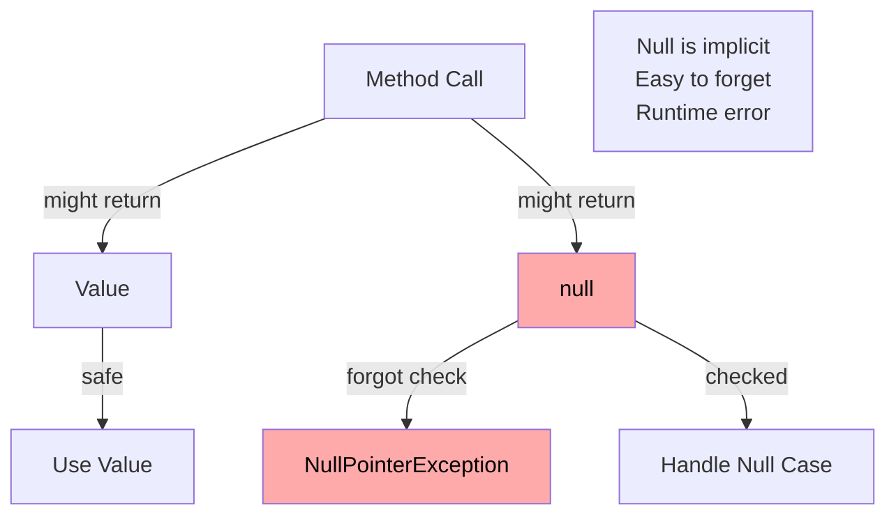

# Introduction to the Option Pattern

Welcome to the **Option Pattern**! This is a powerful design pattern that provides a safe and explicit way to represent values that may or may not exist.

Consider the most basic way in Java here, where a variable can be either `null` or not.

```java
String name = null;
String otherName = "Alice";
```

This means that the variable `name` is not assigned to any value. It is like having a note that says "I have a String here," but the note doesn't tell you where to find it because you haven't assigned it yet.


## The Language-Agnostic Concept

The Option pattern is a **language-agnostic concept** that exists across many programming languages (this is generally the case for design patterns). At its core, it's a simple but powerful idea:

> **A container that either contains a value or is empty.**

Instead of using `null` to represent "no value," the Option pattern wraps the value in a container that explicitly states whether a value is present or absent.

The idea is to clearer indicate that a value may be missing. Instead of using `null` to represent "no value," the Option pattern wraps the value in a container that explicitly states whether a value is present or absent.

## The Core Concept

The Option pattern provides a type-safe way to handle potentially missing values:

- **If a value exists**: The container holds the value
- **If no value exists**: The container is explicitly empty

This makes the possibility of absence **explicit in the type system**, rather than implicit through `null`.

If you have a method, which may or may not return a value, you cannot easily show this in a Java method signature. You just have return type of `String` or `Person`.\
Instead, the Option pattern allows you to return a container, which either contains a value or is empty. Thereby it is very clear to the caller, that the value may be missing, and they should account for this by checking if the container is empty.

Sure, you could just check if the return value is `null`, but this is not type-safe, it is not clear, and you may forget to check for `null`.

## Different Names, Same Concept

The Option pattern goes by different names in different languages, but the concept is the same:

- **Option** - Scala, Rust, F#
- **Maybe** - Haskell
- **Optional** - Java (since Java 8)
- **Option type** - General functional programming term
- **Nullable** - Some languages (though this is different - allows null, doesn't prevent it. C# uses this as a simpler fix for the same problem)

All of these represent the same fundamental idea: a container that may or may not contain a value.

## Why Does It Exist?

The Option pattern exists as a **better alternative to null references**.

### The Problem with Null

In many languages (including Java), `null` represents "no value." However, `null` has several problems:

1. **Not explicit** - A method can return `null` without declaring it
2. **Easy to forget** - You might forget to check for `null`
3. **Unclear intent** - Does `null` mean "not found", or "error", or "no value", or "invalid request", or...?
4. **Runtime errors** - Forgetting a null check causes `NullPointerException`. Your compiler can _sometimes_ help you detect potential problems, but it is not guaranteed.

### The Solution: Option

The Option pattern makes absence **explicit and type-safe**:

- The type system forces you to handle the empty case
- You cannot accidentally access a value that doesn't exist
- The intent is clear: "This might not have a value"

## A Simple Mental Model

Think of Option like a box:

```
Option────┐
│  Value  │  ← Box with a value
└─────────┘

Option────┐
│  Empty  │  ← Empty box
└─────────┘
```

You can only get the value out if you first check that the box is not empty.

## Easy to Implement

One of the beautiful aspects of the Option pattern is that **it's easy to implement your own**. The concept is simple enough that you can create a basic Option type in just a few lines of code.

While Java provides `Optional` (which we'll explore in detail), understanding that you can implement your own helps you appreciate the simplicity and power of the concept.

## Connection to Other Concepts

The Option pattern connects to several important software design concepts:

### Null Safety

The Option pattern is a key technique for achieving **null safety** - writing code that cannot have null pointer exceptions.

### Functional Programming

The Option pattern comes from **functional programming**, where it's a fundamental type. 

### Type Safety

By making absence explicit in the type system, Option provides **compile-time safety** rather than runtime errors.

## The Two States

Every Option type has exactly two states:

1. **Some/Just/Present** - Contains a value
2. **None/Empty** - Does not contain a value

These are the only two possibilities - there's no third state, no ambiguity.


---

# The Problem: Null References

The Option pattern exists to solve a fundamental problem in programming: **how to represent the absence of a value**.

## The "Billion Dollar Mistake"

Tony Hoare, the creator of the null reference, called it his **"billion dollar mistake"**:

> "I call it my billion-dollar mistake. It was the invention of the null reference in 1965... This has led to innumerable errors, vulnerabilities, and system crashes, which have probably caused a billion dollars of pain and damage in the last forty years."

The problem is that `null` is **too easy to use incorrectly** and **too hard to detect when missing**.

## Problem 1: NullPointerException

The most common problem: forgetting to check for `null`:

```java
// Dangerous: No null check
public String getCity(User user) {
    return user.getAddress().getCity();  // NullPointerException if user or address is null!
}
```

**What can go wrong:**
- If `user` is `null` → `NullPointerException`
- If `user.getAddress()` returns `null` → `NullPointerException`
- The error only happens at **runtime**, not compile time

### Real-World Example

```java
public class UserService {
    public void sendWelcomeEmail(String userId) {
        User user = userDAO.findById(userId);  // Might return null
        String email = user.getEmail();  // NullPointerException if user is null!
        emailService.send(email, "Welcome!");
    }
}

public class UserDAO {
    // Could return null, but it's not in the signature
    public User findById(String id) {
        User user = ... // Fetch user from database
        return user;
    }
}
```

**The bug:** If the user doesn't exist, `findById` returns `null`, and the code crashes.

**Problems:**
- Method signature doesn't tell you if `null` is possible
- Documentation might be wrong or missing
- Easy to forget to check
- No compiler warning if you forget

## Problem 3: Defensive Null Checking

To be safe, you need **defensive null checks everywhere**:

```java
// Defensive programming - lots of null checks
public String getCity(User user) {
    if (user == null) {
        return null;  // Or throw exception?
    }
    
    Address address = user.getAddress();
    if (address == null) {
        return null;  // Or throw exception?
    }
    
    return address.getCity();
}
```

**Problems:**
- **Verbose** - Lots of boilerplate code
- **Easy to miss** - Might forget a check
- **Inconsistent** - Different developers handle null differently
- **Unclear** - What should happen when null? Return null? Throw exception?

## Problem 4: Unclear Intent

When you see `null`, what does it mean?

```java
User user = findUser("123");
if (user == null) {
    // What does null mean here?
    // - User doesn't exist?
    // - Error occurred?
    // - Not yet loaded?
    // - Permission denied?
}
```

**Problem:** `null` doesn't tell you **why** there's no value. It could mean:
- Not found
- Error occurred
- Not yet initialized
- Permission denied
- Different reasons in different contexts

## Problem 5: Null Propagation

Null checks can create deeply nested code:

```java
// Deeply nested null checks
public String getShippingAddress(User user) {
    if (user != null) {
        Order order = user.getCurrentOrder();
        if (order != null) {
            Address address = order.getShippingAddress();
            if (address != null) {
                return address.toString();
            }
        }
    }
    return "No address available";
}
```

**Problems:**
- **Hard to read** - Deep nesting
- **Easy to make mistakes** - Miss a null check
- **Verbose** - Lots of boilerplate

## Problem 6: Null in Collections

Collections can contain `null` values:

```java
List<String> names = Arrays.asList("Alice", null, "Bob", null);

// Iterating is dangerous
for (String name : names) {
    System.out.println(name.toUpperCase());  // NullPointerException!
}

// Need defensive checks
for (String name : names) {
    if (name != null) {
        System.out.println(name.toUpperCase());
    }
}
```

**Problem:** Collections don't distinguish between "no value" and "null value."

## Problem 7: Null as a Valid Value

Sometimes `null` is a **valid value**, sometimes it's not:

```java
public class User {
    private String email;  // null means "not set" or "invalid"?
    private String middleName;  // null means "doesn't have one" (valid)
    
    // Which nulls are valid? Which are errors?
}
```

**Problem:** You can't tell from the type whether `null` is valid or an error.

## Real-World Example: The Chain of Nulls

Here's a common scenario that causes bugs:

```java
public class OrderService {
    public void processOrder(String orderId) {
        Order order = orderDAO.findById(orderId);  // Might be null
        User customer = order.getCustomer();  // NullPointerException if order is null
        String email = customer.getEmail();  // NullPointerException if customer is null
        Address address = customer.getAddress();  // Might be null
        String city = address.getCity();  // NullPointerException if address is null
        
        // Process order with city
        processWithCity(order, city);
    }
}
```

**The problem:** Any link in this chain can be `null`, causing a crash. You need null checks at every step.

## The Cost of Null

Null references cause:

1. **Runtime crashes** - `NullPointerException` is one of the most common exceptions
2. **Defensive code** - Lots of null checks everywhere
3. **Bugs** - Easy to forget a null check
4. **Unclear code** - Hard to understand what null means
5. **Testing burden** - Must test null cases everywhere
6. **Maintenance cost** - Null-related bugs are hard to find and fix

## Visualizing the Problem



## Summary

Null references cause:

1. **NullPointerException** - Runtime crashes when null is not checked
2. **Not explicit** - Method signatures don't indicate if null is possible
3. **Defensive code** - Lots of verbose null checks
4. **Unclear intent** - Null doesn't explain why there's no value
5. **Nested code** - Deep nesting from null checks
6. **Collection issues** - Null values in collections are dangerous
7. **Ambiguity** - Can't tell if null is valid or an error

**The solution:** The Option pattern makes absence **explicit and type-safe**, preventing these problems at compile time rather than runtime.


---

# The Solution: The Option Pattern

The Option pattern solves the problems of null references by making absence **explicit and type-safe**.

## How Option Works

The Option pattern wraps a value in a container that has exactly two states:

1. **Some/Just/Present** - Contains a value
2. **None/Empty** - Does not contain a value

This makes the possibility of absence **explicit in the type system**.

## The Two States

### State 1: Present (Some/Just)

When a value exists, it's wrapped in the "Present" state:

```
Optional.of("Hello")
┌─────────────┐
│ Present:    │
│   "Hello"   │
└─────────────┘
```

### State 2: Empty (None)

When no value exists, it's in the "Empty" state:

```
Optional.empty()
┌─────────────┐
│   Empty     │
└─────────────┘
```

## Java's Optional Class

Java 8 introduced `java.util.Optional<T>` as the standard implementation of the Option pattern:

```java
import java.util.Optional;

// Create an Optional with a value
Optional<String> name = Optional.of("Alice");

// Create an empty Optional
Optional<String> empty = Optional.empty();

// Create from a value that might be null
Optional<String> maybeName = Optional.ofNullable(getName());  // getName() might return null
```

## Basic Optional Operations

### Creating Optionals

```java
// Create with a non-null value (throws exception if null)
Optional<String> name = Optional.of("Alice");

// Create empty
Optional<String> empty = Optional.empty();

// Create from nullable value (handles null safely)
String value = getName();  // Might be null
Optional<String> maybe = Optional.ofNullable(value);  // Safe even if value is null
```

### Checking if Value Exists

```java
Optional<String> name = Optional.of("Alice");

// Check if present
if (name.isPresent()) {
    System.out.println("Name: " + name.get());
}

// Modern approach: use ifPresent
name.ifPresent(n -> System.out.println("Name: " + n));
```

### Getting the Value

```java
Optional<String> name = Optional.of("Alice");

// Get value (throws exception if empty)
String value = name.get();  // Use only if you're sure it's present

// Get with default value
String value = name.orElse("Unknown");  // Returns "Unknown" if empty

// Get with supplier (lazy evaluation)
String value = name.orElseGet(() -> generateDefaultName());

// Throw exception if empty
String value = name.orElseThrow(() -> new IllegalArgumentException("Name required"));
```

## How Optional Prevents NullPointerException

Optional **forces you to handle the empty case**:

```java
// Before: Dangerous
public String getCity(User user) {
    if (user != null && user.getAddress() != null) {
        return user.getAddress().getCity();
    }
    return null;  // Or throw exception?
}

// After: Safe with Optional
public Optional<String> getCity(User user) {
    if (user == null || user.getAddress() == null) {
        return Optional.empty();
    }
    return Optional.ofNullable(user.getAddress().getCity());
}

// Usage: Must handle empty case
Optional<String> city = getCity(user);
if (city.isPresent()) {
    System.out.println(city.get());
} else {
    System.out.println("No city available");
}

// Or with ifPresent:
city.ifPresent(c -> System.out.println("City: " + c));
String cityName = city.orElse("Unknown");
```

**Key difference:** The type system forces you to handle the empty case. You cannot accidentally access a value that doesn't exist.

## Implementing Your Own Option

The Option pattern is simple enough that you can implement your own. The basic concept is straightforward: a container that either holds a value or is empty. While Java provides `Optional`, understanding that you can create your own helps you appreciate the simplicity of the pattern.

It does require a bit of knowledge about _generics_, but it is not too complex.

For a complete implementation with advanced features, see the Advanced Features section.

## Optional vs Null: The Comparison

| Aspect | Null | Optional |
|--------|-----|----------|
| **Explicit** | No - implicit in all types | Yes - explicit in type |
| **Type-safe** | No - runtime errors | Yes - compile-time safety |
| **Forces handling** | No - easy to forget | Yes - must handle empty case |
| **Intent** | Unclear | Clear - absence is explicit |
| **Chaining** | Nested if statements | Clean functional chains |

## When to Use Optional

Use Optional when:

1. **Method might not return a value** - Better than returning null
2. **API design** - Makes absence explicit to callers
3. **Null safety** - Prevents NullPointerException
4. **Functional operations** - For advanced chaining (see Advanced Features)

Don't use Optional for:

1. **Required parameters** - Use regular types, not Optional
2. **Collections** - Use empty collections, not Optional<List>
3. **Performance-critical code** - Optional has slight overhead

## Summary

The Option pattern:

1. **Makes absence explicit** - Type system shows when value might not exist
2. **Prevents NullPointerException** - Forces you to handle empty case
3. **Simple concept** - Easy to understand and implement
4. **Java's Optional** - Standard implementation since Java 8
5. **Easy to implement** - You can create your own Option type
6. **Advanced features** - Functional operations for elegant code (see Advanced Features)

**The key insight:** By making absence explicit in the type system, Option prevents the runtime errors that null causes, while making code clearer and more maintainable.


---

# Examples: Option Pattern in Practice

Real-world examples showing how to use the Option pattern with Java's `Optional` class.

## Example 1: Finding Elements in Collections

### Before: Null Return

```java
// Bad: Returns null if not found
public User findUser(String id) {
    for (User user : users) {
        if (user.getId().equals(id)) {
            return user;
        }
    }
    return null;  // Caller must remember to check for null
}

// Usage: Easy to forget null check
User user = findUser("123");
String email = user.getEmail();  // NullPointerException if not found!
```

### After: Optional Return

```java
// Good: Returns Optional
public Optional<User> findUser(String id) {
    for (User user : users) {
        if (user.getId().equals(id)) {
            return Optional.of(user);
        }
    }
    return Optional.empty();
}


// Alternative with stream:
public Optional<User> findUser(String id) {
    return users.stream()
        .filter(user -> user.getId().equals(id))
        .findFirst();  // Returns Optional<User>
}

// Usage: Must handle empty case
Optional<User> user = findUser("123");
if (user.isPresent()) {
    String email = user.get().getEmail();
} else {
    System.out.println("User not found");
}

// Or with ifPresent:
user.ifPresent(u -> System.out.println("Found: " + u.getEmail()));
```

**Benefits:**
- Type-safe - cannot forget to check
- Clear intent - method signature shows it might not find a value
- Functional style - clean operations

## Example 2: Method Return Values

### Before: Null Return

```java
// Bad: Returns null, not explicit
public String getConfigValue(String key) {
    Properties props = loadProperties();
    return props.getProperty(key);  // Returns null if not found
}

// Usage: Must remember null check
String value = getConfigValue("timeout");
if (value != null) {
    int timeout = Integer.parseInt(value);
}
```

### After: Optional Return

```java
// Good: Returns Optional, explicit
public Optional<String> getConfigValue(String key) {
    Properties props = loadProperties();
    String value = props.getProperty(key);
    return Optional.ofNullable(value);
}

// Usage: Type-safe handling
Optional<String> value = getConfigValue("timeout");
if (value.isPresent()) {
    int timeout = Integer.parseInt(value.get());
    // Use timeout
} else {
    int timeout = 30;  // Default to 30 if not found
}
```

## Example 3: Default Values and Fallbacks

### Simple Default

```java
Optional<String> name = findName(userId);

// Simple default
String displayName = name.orElse("Anonymous");

// Lazy default (only computed if needed)
String displayName = name.orElseGet(() -> generateDefaultName());

// Throw exception if missing
String displayName = name.orElseThrow(() -> 
    new IllegalArgumentException("Name required for user: " + userId));
```

### Conditional Defaults

```java
Optional<String> timeoutStr = getConfigValue("timeout");
if (timeoutStr.isPresent()) {
    try {
        int timeout = Integer.parseInt(timeoutStr.get());
        if (timeout > 0) {
            // Use timeout
        } else {
            int timeout = 30;  // Default if invalid
        }
    } catch (NumberFormatException e) {
        int timeout = 30;  // Default if parse fails
    }
} else {
    int timeout = 30;  // Default if missing
}
```


## Key Takeaways

From these examples:

1. **Use Optional for return values** - Makes absence explicit
2. **Always check before using** - Use `isPresent()` or `ifPresent()`
3. **Provide defaults** - Use `orElse` or `orElseGet`
4. **Handle empty cases** - Never assume a value exists
5. **Better than null** - Type-safe, explicit, prevents errors

**The pattern:** Wrap potentially missing values in Optional, then handle the empty case explicitly.

For advanced features like functional operations (map, flatMap, filter) and elegant chaining, see the Advanced Features section.


---

# Advanced Features: Functional Operations and Chaining

Once you understand the basics of Optional, you can use functional operations to write more elegant and concise code.

## Functional Operations

Optional provides functional-style operations for working with values. These operations allow you to transform, filter, and chain Optionals without explicit null checks.

### map - Transform the Value

The `map` operation transforms the value inside an Optional if it's present:

```java
Optional<String> name = Optional.of("alice");

// Transform if present
Optional<String> upper = name.map(String::toUpperCase);  // Optional.of("ALICE")

// If empty, map does nothing
Optional<String> empty = Optional.<String>empty();
Optional<String> result = empty.map(String::toUpperCase);  // Still empty
```

**How it works:**
- If Optional is present: applies the function and wraps the result
- If Optional is empty: returns empty Optional without calling the function

**Example:**
```java
Optional<Integer> age = Optional.of(25);
Optional<String> ageString = age.map(a -> "Age: " + a);  // Optional.of("Age: 25")

Optional<Integer> emptyAge = Optional.empty();
Optional<String> emptyString = emptyAge.map(a -> "Age: " + a);  // Optional.empty()
```

### flatMap - Chain Optionals

The `flatMap` operation is used when you have an Optional that contains another Optional. It "flattens" the nested structure:

```java
// If you have Optional<Optional<String>>, flatten it
Optional<User> user = Optional.of(new User("Alice"));

Optional<String> email = user
    .flatMap(User::getEmail);  // getEmail() returns Optional<String>
```

**Difference between map and flatMap:**

```java
// map: Returns Optional<Optional<String>>
Optional<Optional<String>> nested = user.map(User::getEmail);

// flatMap: Returns Optional<String> (flattened)
Optional<String> flat = user.flatMap(User::getEmail);
```

**When to use flatMap:**
- When the function you're applying returns an Optional
- When you want to chain operations that might return empty

**Example:**
```java
public class User {
    private Address address;
    
    public Optional<Address> getAddress() {
        return Optional.ofNullable(address);
    }
}

public class Address {
    private String city;
    
    public Optional<String> getCity() {
        return Optional.ofNullable(city);
    }
}

// Chain with flatMap
Optional<User> user = findUser("123");
Optional<String> city = user
    .flatMap(User::getAddress)  // Returns Optional<Address>
    .flatMap(Address::getCity);  // Returns Optional<String>
```

### filter - Conditionally Keep Value

The `filter` operation keeps the value only if it matches a condition:

```java
Optional<String> name = Optional.of("Alice");

// Keep only if condition is true
Optional<String> longName = name.filter(n -> n.length() > 5);  // Empty (Alice is 5 chars)
Optional<String> shortName = name.filter(n -> n.length() < 10);  // Present ("Alice")
```

**How it works:**
- If Optional is present and condition is true: returns the same Optional
- If Optional is present but condition is false: returns empty Optional
- If Optional is empty: returns empty Optional (condition not evaluated)

**Example:**
```java
Optional<Integer> age = Optional.of(25);

// Keep only if age is 18 or older
Optional<Integer> adultAge = age.filter(a -> a >= 18);  // Present (25)

// Keep only if age is over 100
Optional<Integer> centenarian = age.filter(a -> a > 100);  // Empty
```

## Chaining Operations

Optional allows you to chain operations elegantly, avoiding nested if statements:

### Before: Nested Null Checks

```java
// Bad: Deeply nested null checks
public String getCity(User user) {
    if (user != null) {
        Address address = user.getAddress();
        if (address != null) {
            return address.getCity();
        }
    }
    return null;
}
```

### After: Clean Chain with Optional

```java
// Good: Clean functional chain
public Optional<String> getCity(User user) {
    return Optional.ofNullable(user)
        .map(User::getAddress)
        .map(Address::getCity);
}

// Usage:
Optional<String> city = getCity(user);
String cityName = city.orElse("Unknown");
```

**Benefits:**
- No nested if statements
- Clear and readable
- Type-safe
- Handles null at every step

### Complex Chaining Example

```java
// Get user's shipping city, but only if user is active
public Optional<String> getActiveUserCity(String userId) {
    return findUser(userId)
        .filter(User::isActive)  // Only active users
        .map(User::getAddress)
        .map(Address::getCity)
        .filter(city -> !city.isEmpty());  // Only non-empty cities
}
```

## Combining Optionals

### Combining Two Optionals

```java
// Get user and their address, both might be missing
Optional<User> user = findUser("123");
Optional<Address> address = user.flatMap(User::getAddress);

// Combine with default
String city = address
    .map(Address::getCity)
    .orElse("No city");
```

### Combining Multiple Optionals

```java
// Get first non-empty value
Optional<String> result = Optional.ofNullable(getPrimaryEmail())
    .or(() -> Optional.ofNullable(getSecondaryEmail()))
    .or(() -> Optional.ofNullable(getDefaultEmail()));

String email = result.orElse("no-email@example.com");
```

### Combining with Conditions

```java
// Get timeout from config, but validate it
Optional<Integer> timeout = getConfigValue("timeout")
    .map(Integer::parseInt)
    .filter(t -> t > 0)  // Only positive values
    .filter(t -> t < 3600);  // Less than 1 hour
```

## Advanced Chaining Patterns

### Pattern 1: Transform and Validate

```java
// Parse and validate in one chain
Optional<Integer> validTimeout = Optional.ofNullable(System.getProperty("timeout"))
    .map(Integer::parseInt)
    .filter(t -> t > 0)
    .filter(t -> t <= 300);
```

### Pattern 2: Chain with Fallbacks

```java
// Try primary, fallback to secondary
Optional<String> email = getUserPrimaryEmail(userId)
    .filter(e -> e.contains("@"))
    .or(() -> getUserSecondaryEmail(userId))
    .or(() -> Optional.of("default@example.com"));
```

### Pattern 3: Conditional Transformation

```java
// Transform only if condition is met
Optional<String> displayName = findUser(userId)
    .filter(User::isActive)
    .map(User::getName)
    .map(name -> name.toUpperCase());
```

## Implementing Your Own Option

The Option pattern is simple enough that you can implement your own. Here's a complete implementation with all functional operations:

```java
import java.util.function.*;

public class Option<T> {
    private final T value;
    private final boolean isPresent;
    
    private Option(T value, boolean isPresent) {
        this.value = value;
        this.isPresent = isPresent;
    }
    
    // Factory methods
    public static <T> Option<T> of(T value) {
        if (value == null) {
            throw new NullPointerException("Value cannot be null");
        }
        return new Option<>(value, true);
    }
    
    public static <T> Option<T> empty() {
        return new Option<>(null, false);
    }
    
    public static <T> Option<T> ofNullable(T value) {
        return value == null ? empty() : of(value);
    }
    
    // Query methods
    public boolean isPresent() {
        return isPresent;
    }
    
    public boolean isEmpty() {
        return !isPresent;
    }
    
    // Get value
    public T get() {
        if (!isPresent) {
            throw new NoSuchElementException("No value present");
        }
        return value;
    }
    
    // Default values
    public T orElse(T other) {
        return isPresent ? value : other;
    }
    
    public T orElseGet(Supplier<T> supplier) {
        return isPresent ? value : supplier.get();
    }
    
    public <X extends Throwable> T orElseThrow(Supplier<? extends X> exceptionSupplier) throws X {
        if (isPresent) {
            return value;
        } else {
            throw exceptionSupplier.get();
        }
    }
    
    // Functional operations
    public <U> Option<U> map(Function<T, U> mapper) {
        return isPresent ? Option.of(mapper.apply(value)) : Option.empty();
    }
    
    public <U> Option<U> flatMap(Function<T, Option<U>> mapper) {
        return isPresent ? mapper.apply(value) : Option.empty();
    }
    
    public Option<T> filter(Predicate<T> predicate) {
        return isPresent && predicate.test(value) ? this : Option.empty();
    }
    
    // Consumer
    public void ifPresent(Consumer<T> consumer) {
        if (isPresent) {
            consumer.accept(value);
        }
    }
    
    public void ifPresentOrElse(Consumer<T> action, Runnable emptyAction) {
        if (isPresent) {
            action.accept(value);
        } else {
            emptyAction.run();
        }
    }
}

// Usage example:
Option<String> name = Option.of("Alice");
name.ifPresent(n -> System.out.println("Name: " + n));
String display = name.orElse("Unknown");

// Functional operations
Option<String> upper = name.map(String::toUpperCase);
Option<Integer> length = name.map(String::length);
Option<String> filtered = name.filter(n -> n.length() > 5);
```

**Key points:**
- Simple structure: value + presence flag
- Immutable
- Type-safe
- Functional operations (map, flatMap, filter)
- Easy to understand and use
- Demonstrates that Option is not magic - it's a simple, elegant solution

## Advanced Use Cases

### Use Case 1: Parsing and Validation

```java
// Parse string to integer, validate range
Optional<Integer> parseAndValidate(String input) {
    return Optional.ofNullable(input)
        .map(String::trim)
        .filter(s -> !s.isEmpty())
        .map(Integer::parseInt)
        .filter(i -> i > 0)
        .filter(i -> i < 1000);
}
```

### Use Case 2: Safe Navigation

```java
// Navigate through object graph safely
Optional<String> getShippingCity(Order order) {
    return Optional.ofNullable(order)
        .map(Order::getCustomer)
        .map(User::getAddress)
        .map(Address::getCity)
        .filter(city -> !city.isEmpty());
}
```

### Use Case 3: Conditional Processing

```java
// Process only if conditions are met
Optional<String> processIfValid(User user) {
    return Optional.ofNullable(user)
        .filter(User::isActive)
        .filter(u -> u.getEmail() != null)
        .map(User::getEmail)
        .filter(email -> email.contains("@"));
}
```

## Summary

Advanced Optional features:

1. **map** - Transform values if present
2. **flatMap** - Chain Optionals (flatten nested Optionals)
3. **filter** - Conditionally keep values
4. **Chaining** - Combine operations elegantly
5. **Combining** - Merge multiple Optionals
6. **Custom implementation** - Easy to create your own Option type

**The power:** These functional operations let you write clean, readable code that handles null cases automatically, without explicit null checks.

