# Introduction to SOLID Principles

Welcome to the SOLID design principles! These five principles are fundamental guidelines for writing maintainable, flexible, and robust object-oriented software.

## What is SOLID?

**SOLID** is an acronym that stands for five key design principles:

- **S** - **Single Responsibility Principle**
- **O** - **Open Closed Principle**
- **L** - **Liskov Substitution Principle**
- **I** - **Interface Segregation Principle**
- **D** - **Dependency Inversion Principle**

Each principle addresses a specific aspect of software design, helping you create code that is easier to understand, test, maintain, and extend.

## Why SOLID Principles Matter

As your software grows, you'll face common challenges:

- **Hard to change** - Modifying one part breaks another
- **Hard to test** - Dependencies are tightly coupled, it is hard to test one part without testing the whole thing
- **Hard to understand** - Classes do too many things
- **Hard to reuse** - Code is too specific or too coupled

SOLID principles help you avoid these problems by providing guidelines for:

- **Organizing responsibilities** - Each class has one clear purpose
- **Extending functionality** - Add features without breaking existing code
- **Designing interfaces** - Create contracts that are easy to fulfill
- **Managing dependencies** - Depend on abstractions, not concrete implementations

## How SOLID Principles Work Together

The SOLID principles are complementary and work together:

- **Single Responsibility** ensures classes are focused and cohesive
- **Open Closed** enables extension without modification
- **Liskov Substitution** ensures reliable polymorphism
- **Interface Segregation** keeps interfaces focused and usable
- **Dependency Inversion** enables flexibility and testability

Following all five principles creates code that is:
- **Maintainable** - Easy to understand and modify
- **Testable** - Easy to test in isolation
- **Flexible** - Easy to extend and adapt
- **Reusable** - Easy to use in different contexts


## Learning Approach

On the following pages, each principle is explained in depth, with examples, and how to fix the violations. Each principle follows a three-part structure:

1. **Introduction** - Understand what the principle means and why it matters
2. **Violations** - See common mistakes and understand the problems they cause
3. **Fix** - Learn how to refactor code to follow the principle

This approach helps you:
- Recognize when code violates principles
- Understand the consequences of violations
- Apply principles effectively in your own code

## Remember

SOLID principles are **guidelines**, not rigid rules. They help you make better design decisions, but context matters. Sometimes principles conflict, and you need to balance them. The goal is better software, not perfect adherence to every principle in every situation.

Let's begin with the first principle: Single Responsibility Principle.


---

# Single Responsibility Principle - Introduction

The **Single Responsibility Principle (SRP)** is the first principle in SOLID. It's a fundamental guideline for organizing code.

> Gather together the things that change for the same reasons. Separate things that change for different reasons.

## Definition

**A class should have only one reason to change.**

Or, in other words:

**A class should have only one responsibility.**

This means each class should have a single, well-defined responsibility. If a class has multiple reasons to change, it has multiple responsibilities and violates SRP. We will actually generally violate this principle to some extent. This is where "guideline, not rule" comes in.

## What is a "Responsibility"?

A **responsibility** is a reason for a class to change. It represents one aspect of the system's behavior or one concern that the class addresses.

Examples of responsibilities:
- Managing user data (name, email, password)
- Sending emails
- Calculating prices
- Validating input
- Persisting data to a database
- Generating reports

Each of these is a distinct responsibility that could change independently. Though, some of these could be sepated even further, into smaller responsibilities. So, it's a balance how far you want to separate the responsibilities.

## The Principle in Practice

A class following SRP:
- Has **one clear purpose**
- Has **one reason to change**
- Does **one thing well**
- Is **focused and cohesive**

When you look at a class, you should be able to describe its purpose in a single sentence without using "and" or "or".

**Good:** "This class manages user account information."
**Bad:** "This class manages user account information and sends emails and validates passwords."

## Benefits of SRP

Following the Single Responsibility Principle provides several benefits:

### 1. Easier to Understand

When a class has one responsibility, it's easier to understand what it does. You don't need to understand multiple concerns to work with the class.

### 2. Easier to Maintain

If you need to change how emails are sent, you only modify the email class. You don't risk breaking user management functionality.

### 3. Easier to Test

Classes with single responsibilities are easier to test. You can test email functionality independently of user management.

### 4. Easier to Reuse

A focused class is more likely to be reusable. A class that does everything is harder to reuse in different contexts.

### 5. Reduced Coupling

When responsibilities are separated, classes are less coupled. Changes to one responsibility don't affect others.

---


## Common Violations

Classes often violate SRP when they:
- Handle both business logic and data persistence
- Manage data and perform I/O operations
- Combine validation and processing
- Mix presentation and business logic
- Handle multiple unrelated concerns

## Summary

- **Definition:** A class should have only one reason to change
- **Key idea:** One responsibility per class
- **Benefits:** Easier to understand, maintain, test, and reuse
- **Question to ask:** "Can I describe this class's purpose in one sentence?"

Next, we'll look at examples of SRP violations and the problems they cause.


---

# Single Responsibility Principle - Violations

Let's examine an example of a class that violates the Single Responsibility Principle and understand the problems it causes.

## Example: User Class with Multiple Responsibilities

Consider a `User` class that handles user data, email sending, and database operations.


Here's a diagram showing the difference between a class that violates SRP and one that follows it:

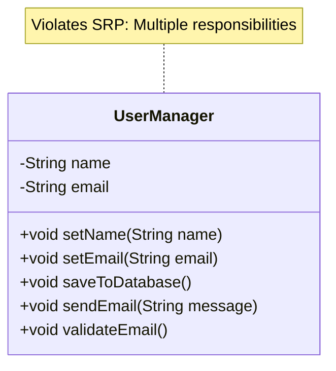
```mermaid
classDiagram
    class UserManager {
        -String name
        -String email
        +void setName(String name)
        +void setEmail(String email)
        +void saveToDatabase()
        +void sendEmail(String message)
        +void validateEmail()
    }
    
    note for UserManager "Violates SRP: Multiple responsibilities"
```

And the code something like this:

```java
public class User {
    private String name;
    private String email;
    private String password;
    
    // User data management
    public void setName(String name) {
        this.name = name;
    }
    
    public void setEmail(String email) {
        this.email = email;
    }
    
    public String getName() {
        return name;
    }
    
    public String getEmail() {
        return email;
    }
    
    // Email sending responsibility
    public void sendWelcomeEmail() {
        String subject = "Welcome!";
        String body = "Welcome to our system, " + name + "!";
        // Email sending logic here
        System.out.println("Sending email to " + email + ": " + subject);
        System.out.println("Body: " + body);
    }
    
    // Database persistence responsibility
    public void saveToDatabase() {
        // Database connection and save logic
        System.out.println("Saving user to database: " + name + ", " + email);
    }
    
    public void loadFromDatabase(int userId) {
        // Database connection and load logic
        System.out.println("Loading user from database with ID: " + userId);
    }
    
    // Validation responsibility
    public boolean validateEmail() {
        return email != null && email.contains("@");
    }
}
```

## The Problem

This class violates SRP because it has **multiple reasons to change**:

1. **User data structure changes** - If we need to add a phone number field
2. **Email sending logic changes** - If we need to change email format or add HTML emails
3. **Database schema changes** - If we need to change how users are stored
4. **Validation rules change** - If email validation becomes more complex

## Problems Caused by This Violation

### 1. Hard to Test

Testing email functionality requires understanding database operations, and vice versa:

```java
// To test email sending, we need to set up database state
User user = new User();
user.setName("John");
user.setEmail("john@example.com");
user.saveToDatabase(); // Why do we need this to test email?
user.sendWelcomeEmail();
```

### 2. Hard to Maintain

If you need to change how emails are sent (e.g., add HTML support), you must modify the `User` class, which also contains database and validation code. This increases the risk of breaking unrelated functionality.

### 3. Hard to Reuse

You can't reuse the email sending logic without also bringing in user data management and database code. If you want to send emails for other entities (like orders or notifications), you can't reuse this code.

### 4. Tight Coupling

The `User` class is tightly coupled to:
- Email sending implementation
- Database implementation
- Validation logic

Changes to any of these affect the entire class.

### 5. Violates Other Principles

This violation often leads to violations of other SOLID principles:
- **Open Closed Principle** - Can't extend email functionality without modifying User
- **Dependency Inversion** - User depends on concrete email and database implementations

## Real-World Scenario

Imagine you need to:
- Change email format to HTML
- Switch from MySQL to PostgreSQL
- Add phone number validation

With the current design, you'd modify the `User` class for all three changes, even though they're unrelated. This increases the chance of introducing bugs and makes the code harder to understand.

## Recognizing SRP Violations

Signs that a class violates SRP:

1. **The class name contains "And" or "Or"** - e.g., `UserAndEmailManager`
2. **You can't describe the class in one sentence** without using "and"
3. **The class has multiple groups of related methods** that don't interact
4. **Changes to one feature require understanding unrelated code**
5. **You hesitate to modify the class** because you're not sure what else might break


---

# Single Responsibility Principle - Fix

Let's refactor the `User` class to follow the Single Responsibility Principle by separating each responsibility into its own class.

## The Solution

We'll split the responsibilities into separate classes:

1. **User** - Manages user data only
2. **EmailService** - Handles email sending
3. **UserRepository** - Handles database operations
4. **EmailValidator** - Handles email validation

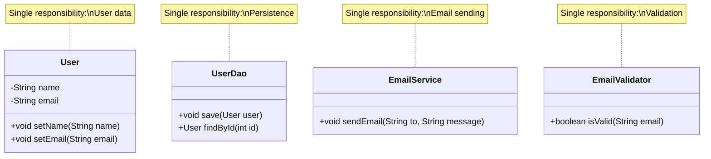
```mermaid
classDiagram
    class User {
        -String name
        -String email
        +void setName(String name)
        +void setEmail(String email)
    }
    
    class UserDao {
        +void save(User user)
        +User findById(int id)
    }
    
    class EmailService {
        +void sendEmail(String to, String message)
    }
    
    class EmailValidator {
        +boolean isValid(String email)
    }
    
    note for User "Single responsibility:\nUser data"
    note for UserDao "Single responsibility:\nPersistence"
    note for EmailService "Single responsibility:\nEmail sending"
    note for EmailValidator "Single responsibility:\nValidation"
```

**Solution:** Each class has one clear responsibility.

## Identifying Responsibilities

To identify if a class violates SRP, ask:

1. **Can I describe this class's purpose in one sentence?** (without "and" or "or")
2. **How many reasons does this class have to change?**
3. **If I need to change X, do I also need to understand Y and Z?**
4. **Can I test this class's functionality independently?**

If you find multiple answers or concerns, the class likely has multiple responsibilities.


## Refactored Code

### User Class (User Data Only)

```java
public class User {
    private String name;
    private String email;
    private String password;
    
    public User(String name, String email, String password) {
        this.name = name;
        this.email = email;
        this.password = password;
    }
    
    public void setName(String name) {
        this.name = name;
    }
    
    public void setEmail(String email) {
        this.email = email;
    }
    
    public String getName() {
        return name;
    }
    
    public String getEmail() {
        return email;
    }
    
    // Only user data management - single responsibility
}
```

### EmailService Class (Email Sending Only)

```java
public class EmailService {
    public void sendWelcomeEmail(User user) {
        String subject = "Welcome!";
        String body = "Welcome to our system, " + user.getName() + "!";
        // Email sending logic here
        System.out.println("Sending email to " + user.getEmail() + ": " + subject);
        System.out.println("Body: " + body);
    }
    
    public void sendEmail(String to, String subject, String body) {
        // Generic email sending
        System.out.println("Sending email to " + to + ": " + subject);
        System.out.println("Body: " + body);
    }
}
```

### UserRepository Class (Database Operations Only)

```java
public class UserRepository {
    public void save(User user) {
        // Database connection and save logic
        System.out.println("Saving user to database: " + user.getName() + ", " + user.getEmail());
    }
    
    public User findById(int userId) {
        // Database connection and load logic
        System.out.println("Loading user from database with ID: " + userId);
        // Return loaded user
        return null; // Simplified for example
    }
    
    public void delete(int userId) {
        // Database delete logic
        System.out.println("Deleting user from database with ID: " + userId);
    }
}
```

### EmailValidator Class (Validation Only)

```java
public class EmailValidator {
    public boolean isValid(String email) {
        if (email == null || email.isEmpty()) {
            return false;
        }
        return email.contains("@") && email.contains(".");
    }
    
    public boolean isValidDomain(String email) {
        // More complex validation logic
        return email.endsWith(".com") || email.endsWith(".org");
    }
}
```

## Benefits of the Refactored Design

### 1. Easy to Test

Each class can be tested independently:

```java
// Test email service independently
EmailService emailService = new EmailService();
User user = new User("John", "john@example.com", "password");
emailService.sendWelcomeEmail(user);

// Test validator independently
EmailValidator validator = new EmailValidator();
assertTrue(validator.isValid("test@example.com"));
```

### 2. Easy to Maintain

If you need to change email format, you only modify `EmailService`. The `User` class remains unchanged.

### 3. Easy to Reuse

`EmailService` can be used to send emails for any entity (users, orders, notifications). It's not tied to the `User` class.

### 4. Loose Coupling

Classes depend on each other only when necessary. `User` doesn't know about emails or databases.

### 5. Single Responsibility

Each class has one clear reason to change:
- **User** changes when user data structure changes
- **EmailService** changes when email sending logic changes
- **UserRepository** changes when database schema changes
- **EmailValidator** changes when validation rules change

## Handling Changes

Now, when requirements change:

**Change email to HTML format:**
- Modify only `EmailService`
- No impact on `User`, `UserRepository`, or `EmailValidator`

**Switch database:**
- Modify only `UserRepository`
- No impact on other classes

**Add phone number:**
- Modify only `User`
- No impact on other classes

## Summary

By separating responsibilities:
- **User** - User data only
- **EmailService** - Email sending only
- **UserRepository** - Database operations only
- **EmailValidator** - Validation only

Each class now:
- Has one reason to change
- Is easy to test
- Is easy to maintain
- Is reusable
- Follows the Single Responsibility Principle


---

# Open Closed Principle - Introduction

The **Open Closed Principle (OCP)** is the second principle in SOLID. It guides how to design software that can be extended without modification.

> A Module should be open for extension but closed for modification.

## Definition

**Software entities (classes, modules, functions) should be open for extension but closed for modification.**

This means:
- **Open for extension** - You should be able to add new functionality
- **Closed for modification** - You shouldn't need to modify existing, working code

## The Core Idea

When you need to add new features, you should **extend/expand** the system rather than **modify** existing code. This keeps existing code stable and reduces the risk of introducing bugs.


## When OCP Applies

OCP is especially important when:
- You expect the system to grow and change
- You want to minimize risk when adding features
- You need to maintain backward compatibility
- You want to enable plugin-like architectures

## Summary

- **Definition:** Open for extension, closed for modification
- **Key idea:** Add functionality by extending, not modifying
- **Benefits:** Stability, extensibility, testability, maintainability
- **Techniques:** Use interfaces, abstraction, polymorphism
- **Question to ask:** "Can I add this feature without changing existing code?"


---

# Open Closed Principle - Violations

Let's examine a real example that violates the Open Closed Principle and understand the problems it causes.

## Example: Shape Area Calculator

Consider a system that calculates the area of different shapes. Here's a design that violates OCP:

```java
public class AreaCalculator {
    public double calculateArea(Object shape) {
        if (shape instanceof Circle) {
            Circle circle = (Circle) shape;
            return Math.PI * circle.getRadius() * circle.getRadius();
        } else if (shape instanceof Rectangle) {
            Rectangle rectangle = (Rectangle) shape;
            return rectangle.getWidth() * rectangle.getHeight();
        } else if (shape instanceof Square) {
            Square square = (Square) shape;
            return square.getSide() * square.getSide();
        }
        throw new IllegalArgumentException("Unknown shape type");
    }
}

```

## The Problem

This design violates OCP because:

1. **To add a new shape** (e.g., Triangle), you must **modify** the `calculateArea` method
2. **Existing code changes** every time you add functionality
3. **Risk of breaking** existing functionality increases with each modification

## Visualizing the Violation

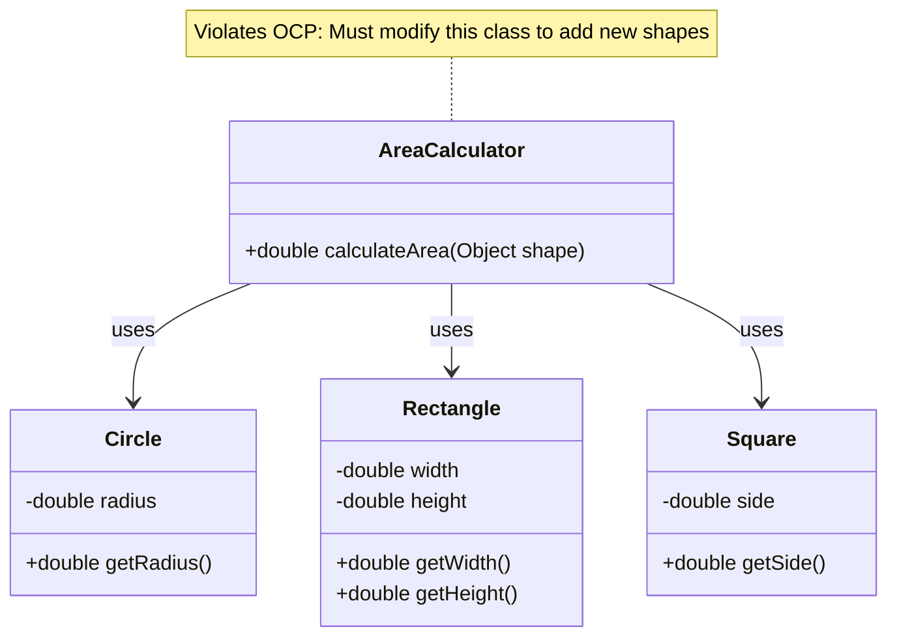
```mermaid
classDiagram
    class AreaCalculator {
        +double calculateArea(Object shape)
    }
    
    class Circle {
        -double radius
        +double getRadius()
    }
    
    class Rectangle {
        -double width
        -double height
        +double getWidth()
        +double getHeight()
    }
    
    class Square {
        -double side
        +double getSide()
    }
    
    AreaCalculator --> Circle : uses
    AreaCalculator --> Rectangle : uses
    AreaCalculator --> Square : uses
    
    note for AreaCalculator "Violates OCP: Must modify this class to add new shapes"
```

## Problems Caused by This Violation

### 1. Must Modify Working Code

Every time you add a new shape, you must modify the `calculateArea` method:

```java{9}
// To add Triangle, you must modify existing code
public double calculateArea(Object shape) {
    if (shape instanceof Circle) {
        // ... existing code
    } else if (shape instanceof Rectangle) {
        // ... existing code
    } else if (shape instanceof Square) {
        // ... existing code
    } else if (shape instanceof Triangle) {  // NEW: Modification required
        Triangle triangle = (Triangle) shape;
        return 0.5 * triangle.getBase() * triangle.getHeight();
    }
    throw new IllegalArgumentException("Unknown shape type");
}
```

**Problem:** You're changing code that was already working, which risks introducing bugs.

### 2. Risk of Breaking Existing Functionality

When you modify `calculateArea` to add Triangle support, you might accidentally break Circle or Rectangle calculations. Every modification is a risk.

Yes, this example is contrived and simple, but it is a real problem. You might accidentally break something else, because you are modifying the code that was already working.

### 3. Violates Single Responsibility

The `AreaCalculator` class is responsible for:
- Knowing about all shape types
- Calculating area for each shape type
- Deciding which calculation to use

This is too many responsibilities.

### 4. Hard to Test

To test the calculator, you need to test all shape types together. You can't easily test new shapes in isolation.

### 5. Tight Coupling

`AreaCalculator` is tightly coupled to every concrete shape class. It must know about Circle, Rectangle, Square, and any future shapes.

### 6. Violates Other Principles

This design also violates:
- **Single Responsibility** - Calculator knows about all shapes
- **Dependency Inversion** - Depends on concrete classes, not abstractions


## Another Example: Discount Calculator

Here's another common violation:

```java
public class DiscountCalculator {
    public double calculateDiscount(String customerType, double price) {
        if (customerType.equals("REGULAR")) {
            return price * 0.1;  // 10% discount
        } else if (customerType.equals("PREMIUM")) {
            return price * 0.2;  // 20% discount
        } else if (customerType.equals("VIP")) {
            return price * 0.3;  // 30% discount
        }
        return 0;
    }
}
```

**Problem:** To add a new customer type (e.g., "STUDENT"), you must modify this method.

## Recognizing OCP Violations

Signs that code violates OCP:

1. **If-else or switch statements** that check types to determine behavior
2. **Modifying existing methods** to add new functionality
3. **Type checking** with `instanceof` or similar
4. **Long methods** with multiple conditional branches
5. **Frequent modifications** to the same class for new features

If your class or method is generally doing to much, it is tempting to just add more and more functionality to it. This started out as a violation of SRP, and then became a violation of OCP.


## Summary

The `AreaCalculator` class violates OCP because:
- Adding new shapes requires **modifying** existing code
- This creates **risk** of breaking working functionality
- The class is **tightly coupled** to all shape types
- It's **hard to test** and maintain

Next, we'll see how to fix this by using abstraction and polymorphism.


---

# Open Closed Principle - Fix

Let's refactor the shape area calculator to follow the Open Closed Principle by using abstraction and polymorphism.

## The Solution

We'll use an interface to define a contract that all shapes must follow. New shapes can be added by implementing this interface, without modifying existing code.

Interfaces are often a solution to OCP violations. But there are other solutions. Generally following SRP is also a good start. Instead of updating an existing method, you might just add a new method. Instead of updating an existing class, you might just add a new class.

## Refactored Code

### Shape Interface (Abstraction)

```java
public interface Shape {
    double calculateArea();
}
```

### Shape Implementations

```java
public class Circle implements Shape {
    // ...
}

public class Rectangle implements Shape {
    // ...
}

public class Square implements Shape {
    // ...
}
```

### AreaCalculator (Closed for Modification)

```java
import java.util.List;

public class AreaCalculator {
    public double calculateArea(Shape shape) {
        return shape.calculateArea();
    }
    
    public double calculateTotalArea(List<Shape> shapes) {
        double total = 0;
        for (Shape shape : shapes) {
            total += shape.calculateArea();
        }
        return total;
    }
}
```

## Adding New Shapes (Extension)

Now, to add a new shape like Triangle, you **extend** the system without modifying existing code:

```java
public class Triangle implements Shape {
    private double base;
    private double height;
    
    public Triangle(double base, double height) {
        this.base = base;
        this.height = height;
    }
    
    @Override
    public double calculateArea() {
        return 0.5 * base * height;
    }
    
    public double getBase() {
        return base;
    }
    
    public double getHeight() {
        return height;
    }
}
```

**No modification needed!** The `AreaCalculator` works with Triangle automatically because it implements `Shape`.

## Visualizing the Fix

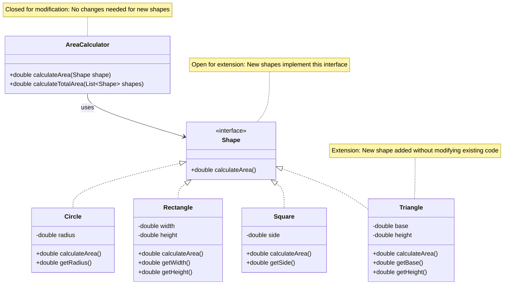
```mermaid
classDiagram
    class Shape {
        <<interface>>
        +double calculateArea()
    }
    
    class Circle {
        -double radius
        +double calculateArea()
        +double getRadius()
    }
    
    class Rectangle {
        -double width
        -double height
        +double calculateArea()
        +double getWidth()
        +double getHeight()
    }
    
    class Square {
        -double side
        +double calculateArea()
        +double getSide()
    }
    
    class Triangle {
        -double base
        -double height
        +double calculateArea()
        +double getBase()
        +double getHeight()
    }
    
    class AreaCalculator {
        +double calculateArea(Shape shape)
        +double calculateTotalArea(List~Shape~ shapes)
    }
    
    Shape <|.. Circle
    Shape <|.. Rectangle
    Shape <|.. Square
    Shape <|.. Triangle
    AreaCalculator --> Shape : uses
    
    note for Shape "Open for extension: New shapes implement this interface"
    note for AreaCalculator "Closed for modification: No changes needed for new shapes"
    note for Triangle "Extension: New shape added without modifying existing code"
```

## Benefits of the Refactored Design

### 1. No Modification Required

To add Triangle, you create a new class. You don't modify `AreaCalculator` or any existing shape classes.

### 2. Existing Code Remains Stable

Circle, Rectangle, and Square code never change. This reduces the risk of introducing bugs.

### 3. Easy to Extend

Adding new shapes is straightforward:

```java
public class Ellipse implements Shape {
    private double a, b;  // semi-major and semi-minor axes
    
    public Ellipse(double a, double b) {
        this.a = a;
        this.b = b;
    }
    
    @Override
    public double calculateArea() {
        return Math.PI * a * b;
    }
}
```

### 4. Polymorphism Works Automatically

The `AreaCalculator` works with any `Shape` implementation:

```java
AreaCalculator calculator = new AreaCalculator();

Shape circle = new Circle(5);
Shape rectangle = new Rectangle(4, 6);
Shape triangle = new Triangle(3, 4);

System.out.println(calculator.calculateArea(circle));     // Works
System.out.println(calculator.calculateArea(rectangle));  // Works
System.out.println(calculator.calculateArea(triangle));   // Works automatically!
```

### 5. Easy to Test

Each shape can be tested independently:

```java
@Test
public void testCircleArea() {
    Circle circle = new Circle(5);
    assertEquals(78.54, circle.calculateArea(), 0.01);
}

@Test
public void testTriangleArea() {
    Triangle triangle = new Triangle(3, 4);
    assertEquals(6.0, triangle.calculateArea(), 0.01);
}
```

### 6. Follows Other Principles

This design also follows:
- **Single Responsibility** - Each class has one job
- **Dependency Inversion** - Depends on abstraction (Shape interface)


## Comparison

**Before (Violates OCP):**
- Add Triangle → Modify `AreaCalculator.calculateArea()`
- Risk of breaking existing code
- Must retest all shapes

**After (Follows OCP):**
- Add Triangle → Create new `Triangle` class
- No risk to existing code
- Test Triangle independently

## Summary

By using abstraction (the `Shape` interface):
- **New shapes extend** the system by implementing `Shape`
- **Existing code remains unchanged** (closed for modification)
- **AreaCalculator works** with any `Shape` implementation
- **Easy to add** new shapes without risk
- **Follows OCP** - open for extension, closed for modification

The system is now extensible without modification, following the Open Closed Principle.


---

# Liskov Substitution Principle - Introduction

The **Liskov Substitution Principle (LSP)** is the third principle in SOLID. It ensures that implementations of interfaces can be used interchangeably without breaking functionality.

The original SOLID princples are fairly "old", around 2000. Things have changed a little since then, and especially the interface-focused version of LSP is more common today.

Original definition:

> "Subtypes must be substitutable for their base types"

This is more about inheritance, and not about interfaces. It is still relevant, but the modern understanding is more about interfaces. Here is an updated "paraphrase" of the principle:

> A program that uses an interface must not be confused by an implementation of that interface.

## Definition

**Implementations of an interface must be substitutable for each other without breaking the program.**

This is the modern, interface-focused version of LSP. The traditional definition focused on inheritance ("Subtypes must be substitutable for their base types"), but the modern understanding emphasizes interface contracts.

## The Core Idea

When you have an interface, any class that implements that interface should be able to replace any other implementation without causing errors or unexpected behavior. The code using the interface should work correctly regardless of which implementation is used.

Sure, if you change from file-based data manager to an in-memory data manager, or to using a database, you data would end up in a different place. But the class _using_ your interface should not notice a difference. Data is stored and retrieved. And so, we can consider the interface a _contract_, which promises certain behavior. Classes implementing the interface must fulfill this contract!

## Interface Contracts

An interface defines a **contract** - a promise about what methods are available and what behavior they provide. All implementations must fulfill this contract completely and correctly.

```java
public interface PaymentProcessor {
    void processPayment(double amount);
    boolean isPaymentSuccessful();
}
```

Any class implementing `PaymentProcessor` must:
- Provide `processPayment(double amount)` method
- Provide `isPaymentSuccessful()` method
- Fulfill the expected behavior of these methods

## Behavioral Compatibility

LSP is about **behavioral compatibility**, not just method signatures. Implementations must not only have the right methods, but also behave in ways that are compatible with the interface's contract.

### What This Means

If code works with one implementation of an interface, it should work with **any** implementation of that interface:

```java
public void processOrder(PaymentProcessor processor, double amount) {
    processor.processPayment(amount);
    if (processor.isPaymentSuccessful()) {
        // Complete order
    } else {
        // Handle failure
    }
}
```

This code should work whether `processor` is:
- A `CreditCardProcessor`
- A `PayPalProcessor`
- A `BankTransferProcessor`
- Any other implementation of `PaymentProcessor`

## Benefits of LSP

Following the Liskov Substitution Principle provides several benefits:

### 1. Reliable Polymorphism

You can use different implementations interchangeably, enabling true polymorphism.

### 2. Predictable Behavior

Code behaves predictably regardless of which implementation is used.

### 3. Easy Testing

You can substitute mock implementations for testing without changing the code being tested.

### 4. Flexibility

You can swap implementations (e.g., different payment processors) without modifying code that uses the interface.

### 5. Correctness

Prevents runtime errors and unexpected behavior from incompatible implementations.

## Visualizing LSP

Here's a diagram showing proper interface implementation:

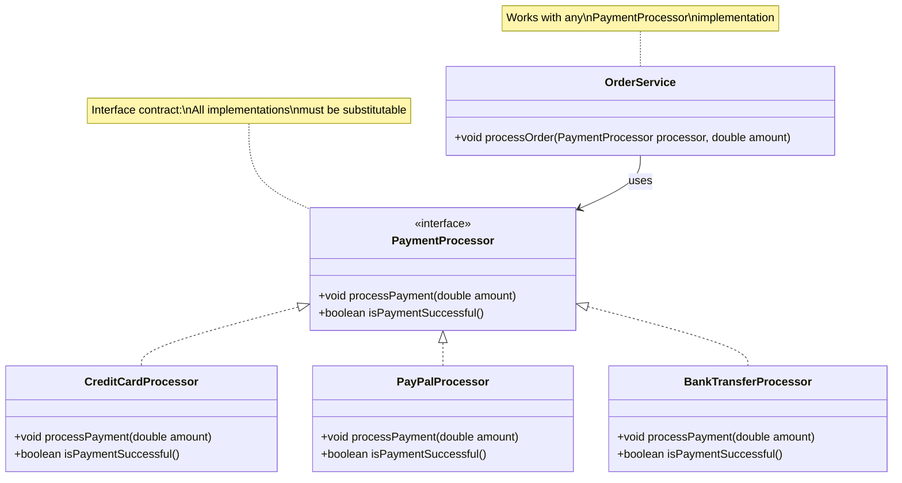
```mermaid
classDiagram
    class PaymentProcessor {
        <<interface>>
        +void processPayment(double amount)
        +boolean isPaymentSuccessful()
    }
    
    class CreditCardProcessor {
        +void processPayment(double amount)
        +boolean isPaymentSuccessful()
    }
    
    class PayPalProcessor {
        +void processPayment(double amount)
        +boolean isPaymentSuccessful()
    }
    
    class BankTransferProcessor {
        +void processPayment(double amount)
        +boolean isPaymentSuccessful()
    }
    
    class OrderService {
        +void processOrder(PaymentProcessor processor, double amount)
    }
    
    PaymentProcessor <|.. CreditCardProcessor
    PaymentProcessor <|.. PayPalProcessor
    PaymentProcessor <|.. BankTransferProcessor
    OrderService --> PaymentProcessor : uses
    
    note for PaymentProcessor "Interface contract:\nAll implementations\nmust be substitutable"
    note for OrderService "Works with any\nPaymentProcessor\nimplementation"
```

## What LSP Requires

For implementations to be substitutable, they must:

### 1. Implement All Methods

All methods in the interface must be implemented. No missing methods. No "empty" methods.

### 2. Maintain Preconditions

If the interface method has requirements (preconditions), implementations must meet them.

### 3. Maintain Postconditions

If the interface method promises certain results (postconditions), implementations must deliver them.

### 4. Not Throw Unexpected Exceptions

Implementations shouldn't throw exceptions that the interface doesn't specify, unless they're subtypes of specified exceptions. This is the "guideline". We will violate this a lot, though. So... again, that comment about recommendation vs strict law.

### 5. Maintain Behavioral Contracts

The behavior must be compatible with what code using the interface expects.


## Summary

- **Definition:** Implementations of an interface must be substitutable
- **Key idea:** Any implementation should work wherever the interface is expected
- **Focus:** Interface contracts and behavioral compatibility
- **Benefits:** Reliable polymorphism, predictable behavior, flexibility
- **Question to ask:** "Can I swap implementations without breaking anything?"


---

# Liskov Substitution Principle - Violations

Let's examine examples that violate the Liskov Substitution Principle and understand the problems they cause.

## Example 1: Bird Interface with Fly Method

Yet another contrived example. But they are a simple way to start. Consider a `Bird` interface that includes a `fly()` method:

```java
public interface Bird {
    void fly();
    void eat();
    void sleep();
}

public class Sparrow implements Bird {
    @Override
    public void fly() {
        System.out.println("Sparrow is flying");
    }
    
    @Override
    public void eat() {
        System.out.println("Sparrow is eating");
    }
    
    @Override
    public void sleep() {
        System.out.println("Sparrow is sleeping");
    }
}

public class Penguin implements Bird {
    @Override
    public void fly() {
        throw new UnsupportedOperationException("Penguins cannot fly!");
    }
    
    @Override
    public void eat() {
        System.out.println("Penguin is eating");
    }
    
    @Override
    public void sleep() {
        System.out.println("Penguin is sleeping");
    }
}
```

## The Problem

The `Penguin` class violates LSP because:

1. **It can't fulfill the contract** - The `fly()` method throws an exception
2. **It's not substitutable** - Code that expects birds to fly will break with Penguin
3. **Unexpected behavior** - Using a Penguin where a Bird is expected causes runtime errors

## Visualizing the Violation

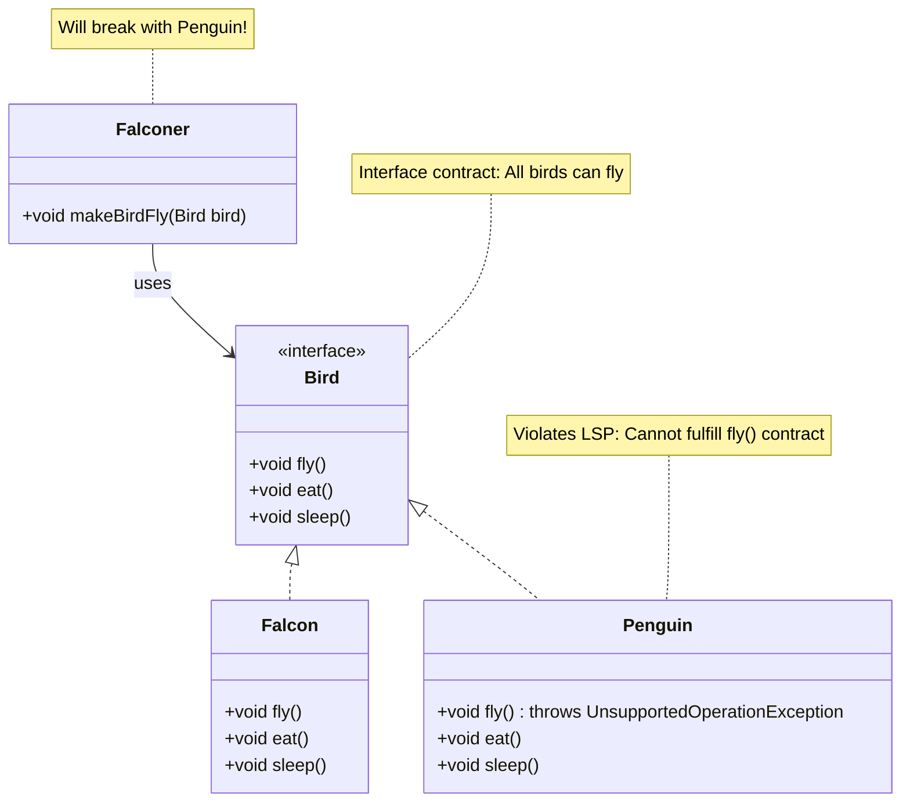
```mermaid
classDiagram
    class Bird {
        <<interface>>
        +void fly()
        +void eat()
        +void sleep()
    }
    
    class Falcon {
        +void fly()
        +void eat()
        +void sleep()
    }
    
    class Penguin {
        +void fly() throws UnsupportedOperationException
        +void eat()
        +void sleep()
    }
    
    class Falconer {
        +void makeBirdFly(Bird bird)
    }
    
    Bird <|.. Falcon
    Bird <|.. Penguin
    Falconer --> Bird : uses
    
    note for Bird "Interface contract: All birds can fly"
    note for Penguin "Violates LSP: Cannot fulfill fly() contract"
    note for Falconer "Will break with Penguin!"
```


## Problems Caused by This Violation

### 1. Runtime Errors

Code that uses the `Bird` interface will crash when given a `Penguin`:

```java
public class BirdController {
    public void makeBirdFly(Bird bird) {
        bird.fly();  // Crashes if bird is a Penguin!
    }
}

// Usage
BirdController controller = new BirdController();
Bird falcon = new Falcon();
controller.makeBirdFly(falcon);  // Works fine

Bird penguin = new Penguin();
controller.makeBirdFly(penguin);  // Throws UnsupportedOperationException!
```

### 2. Not Substitutable

You cannot substitute a `Penguin` for a `Falcon` without breaking the program. This violates the core idea of LSP.

### 3. Violates Interface Contract

The `Bird` interface promises that all birds can fly, but `Penguin` cannot fulfill this promise.

### 4. Unpredictable Behavior

Code using `Bird` cannot rely on `fly()` working - it might throw an exception.

## Example 2: Rectangle and Square

Here's a classic violation using inheritance (which also applies to interfaces):

```java
public interface Shape {
    void setWidth(double width);
    void setHeight(double height);
    double getArea();
}

public class Rectangle implements Shape {
    private double width;
    private double height;
    
    @Override
    public void setWidth(double width) {
        this.width = width;
    }
    
    @Override
    public void setHeight(double height) {
        this.height = height;
    }
    
    @Override
    public double getArea() {
        return width * height;
    }
}

public class Square implements Shape {
    private double side;
    
    @Override
    public void setWidth(double width) {
        this.side = width;
    }
    
    @Override
    public void setHeight(double height) {
        this.side = height;  // Problem: ignores width!
    }
    
    @Override
    public double getArea() {
        return side * side;
    }
}
```

## The Problem

The `Square` class violates LSP because:

1. **Different behavior** - Setting width and height doesn't work as expected
2. **Breaks expectations** - Code that sets width and height separately expects them to be independent

```java
public void resizeShape(Shape shape) {
    shape.setWidth(5);
    shape.setHeight(10);
    // Expects area to be 5 * 10 = 50
    // But with Square, area is 10 * 10 = 100 (only height matters!)
    System.out.println("Area: " + shape.getArea());
}

// Usage
Shape rectangle = new Rectangle();
resizeShape(rectangle);  // Works: Area = 50

Shape square = new Square();
resizeShape(square);  // Breaks: Area = 100, not 50!
```

## Example 3: Payment Processor with Different Behavior

```java
public interface PaymentProcessor {
    boolean processPayment(double amount);
    String getTransactionId();
}

public class CreditCardProcessor implements PaymentProcessor {
    @Override
    public boolean processPayment(double amount) {
        // Process payment
        return true;  // Always succeeds (simplified)
    }
    
    @Override
    public String getTransactionId() {
        return "CC-" + System.currentTimeMillis();
    }
}

public class BankTransferProcessor implements PaymentProcessor {
    @Override
    public boolean processPayment(double amount) {
        // Bank transfers take time
        // Return false immediately, transaction happens later
        return false;  // Problem: Different behavior!
    }
    
    @Override
    public String getTransactionId() {
        return null;  // Problem: Returns null when payment "fails"
    }
}
```

## The Problem

`BankTransferProcessor` violates LSP because:

1. **Different return behavior** - Returns `false` when payment is actually processing
2. **Returns null** - `getTransactionId()` returns null, breaking code that expects a transaction ID
3. **Incompatible semantics** - The meaning of `processPayment` is different

```java
public void handlePayment(PaymentProcessor processor, double amount) {
    if (processor.processPayment(amount)) {
        String id = processor.getTransactionId();
        System.out.println("Payment successful: " + id);
    } else {
        System.out.println("Payment failed");
    }
}

// Usage
PaymentProcessor creditCard = new CreditCardProcessor();
handlePayment(creditCard, 100);  // Works: "Payment successful: CC-..."

PaymentProcessor bankTransfer = new BankTransferProcessor();
handlePayment(bankTransfer, 100);  // Breaks: Says "failed" but payment is processing!
// Also crashes if getTransactionId() is called on "failed" payment
```

## Visualizing the Payment Violation

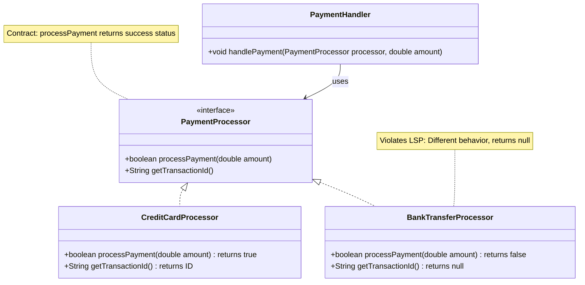
```mermaid
classDiagram
    class PaymentProcessor {
        <<interface>>
        +boolean processPayment(double amount)
        +String getTransactionId()
    }
    
    class CreditCardProcessor {
        +boolean processPayment(double amount) returns true
        +String getTransactionId() returns ID
    }
    
    class BankTransferProcessor {
        +boolean processPayment(double amount) returns false
        +String getTransactionId() returns null
    }
    
    class PaymentHandler {
        +void handlePayment(PaymentProcessor processor, double amount)
    }
    
    PaymentProcessor <|.. CreditCardProcessor
    PaymentProcessor <|.. BankTransferProcessor
    PaymentHandler --> PaymentProcessor : uses
    
    note for PaymentProcessor "Contract: processPayment returns success status"
    note for BankTransferProcessor "Violates LSP: Different behavior, returns null"
```

## Recognizing LSP Violations

Signs that code violates LSP:

1. **Throwing exceptions** in methods that shouldn't throw them
2. **Returning null** when a value is expected
3. **Different behavior** for the same method call
4. **Requiring special handling** for specific implementations
5. **Type checking** with `instanceof` to handle different implementations
6. **Empty implementations** that don't fulfill the contract

## Summary

LSP violations occur when:
- **Implementations can't fulfill the contract** (Penguin can't fly)
- **Different behavior** for the same method (Square's setWidth/setHeight)
- **Incompatible semantics** (BankTransfer returns false for processing)
- **Not substitutable** - Code breaks when implementations are swapped

These violations cause:
- **Runtime errors** when unexpected implementations are used
- **Unpredictable behavior** that's hard to debug
- **Broken polymorphism** - can't trust the interface contract


---

# Liskov Substitution Principle - Fix

Let's fix the LSP violations by redesigning interfaces to match actual capabilities and ensure all implementations can properly fulfill their contracts.

## Fix 1: Bird Interface - Separate Capabilities

Instead of forcing all birds to implement `fly()`, we separate flying capability into its own interface.

### Refactored Code

```java
public interface Bird {
    void eat();
    void sleep();
}

public interface Flyable {
    void fly();
}

public class Falcon implements Bird, Flyable {
    @Override
    public void fly() {
        System.out.println("Falcon is flying");
    }
    
    @Override
    public void eat() {
        System.out.println("Falcon is eating");
    }
    
    @Override
    public void sleep() {
        System.out.println("Falcon is sleeping");
    }
}

public class Penguin implements Bird {
    @Override
    public void eat() {
        System.out.println("Penguin is eating");
    }
    
    @Override
    public void sleep() {
        System.out.println("Penguin is sleeping");
    }
    // No fly() method - Penguins don't implement Flyable
}
```

### Using the Refactored Code

```java
public class Falconer {
    public void makeBirdEat(Bird bird) {
        bird.eat();  // Works with any Bird
    }
    
    public void makeBirdFly(Flyable flyable) {
        flyable.fly();  // Only works with birds that can fly
    }
}

// Usage
Falconer controller = new Falconer();

Bird falcon = new Falcon();
controller.makeBirdEat(falcon);  // Works
if (falcon instanceof Flyable) {
    controller.makeBirdFly((Flyable) falcon);  // Works
}

Bird penguin = new Penguin();
controller.makeBirdEat(penguin);  // Works - no exception!
// Penguin doesn't implement Flyable, so we don't try to make it fly
```

Here is the updated diagram:

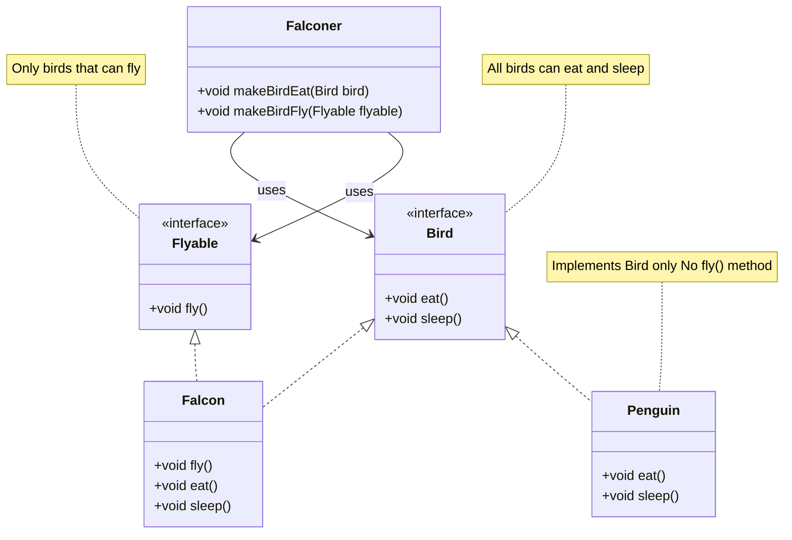
```mermaid
classDiagram
    class Bird {
        <<interface>>
        +void eat()
        +void sleep()
    }
    
    class Flyable {
        <<interface>>
        +void fly()
    }
    
    class Falcon {
        +void fly()
        +void eat()
        +void sleep()
    }
    
    class Penguin {
        +void eat()
        +void sleep()
    }
    
    class Falconer {
        +void makeBirdEat(Bird bird)
        +void makeBirdFly(Flyable flyable)
    }
    
    Bird <|.. Falcon
    Bird <|.. Penguin
    Flyable <|.. Falcon
    Falconer --> Bird : uses
    Falconer --> Flyable : uses
    
    note for Bird "All birds can eat and sleep"
    note for Flyable "Only birds that can fly"
    note for Penguin "Implements Bird only No fly() method"
```

## Fix 2: Shape Interface - Remove Incompatible Methods

There is not really a great fix here, the Rectangle and Square are not really the same thing. But we can make them more similar. This will change the behaviour of the code, and is a bit patchworky, but I just want to plant the idea in your mind that sometimes you have to make trade-offs.

Instead of having `setWidth` and `setHeight` that don't work for squares, we use a more flexible approach.\
Let's introduce a `resize()` method that resizes the shape proportionally.

```java
public interface Shape {
    double getArea();
    void resize(double factor);
}
```

Now all implementations can be resized. The Rectangle still has the methods for setting the width and height, but the Square only has the method for setting the side.

### Refactored Code

```java
public class Rectangle implements Shape {
    private double width;
    private double height;
    
    public Rectangle(double width, double height) {
        this.width = width;
        this.height = height;
    }
    
    @Override
    public double getArea() {
        return width * height;
    }
    
    @Override
    public void resize(double factor) {
        this.width *= factor;
        this.height *= factor;
    }
    
    // Specific methods for rectangles
    public void setWidth(double width) {
        this.width = width;
    }
    
    public void setHeight(double height) {
        this.height = height;
    }
}

public class Square implements Shape {
    private double side;
    
    public Square(double side) {
        this.side = side;
    }
    
    @Override
    public double getArea() {
        return side * side;
    }
    
    @Override
    public void resize(double factor) {
        this.side *= factor;
    }
    
    // Specific method for squares
    public void setSide(double side) {
        this.side = side;
    }
}
```

## Fix 3: Payment Processor - Consistent Behavior

Redesign the payment processor to handle asynchronous payments properly.

### Refactored Code

```java
public interface PaymentProcessor {
    PaymentResult processPayment(double amount);
    String getTransactionId();
}

public class PaymentResult {
    private boolean success;
    private String transactionId;
    private String message;
    
    public PaymentResult(boolean success, String transactionId, String message) {
        this.success = success;
        this.transactionId = transactionId;
        this.message = message;
    }
    
    public boolean isSuccess() {
        return success;
    }
    
    public String getTransactionId() {
        return transactionId;
    }
    
    public String getMessage() {
        return message;
    }
}

public class CreditCardProcessor implements PaymentProcessor {
    @Override
    public PaymentResult processPayment(double amount) {
        // Process payment immediately
        String transactionId = "CC-" + System.currentTimeMillis();
        return new PaymentResult(true, transactionId, "Payment processed");
    }
    
    @Override
    public String getTransactionId() {
        // For credit cards, transaction ID is available immediately
        return "CC-" + System.currentTimeMillis();
    }
}

public class BankTransferProcessor implements PaymentProcessor {
    private String pendingTransactionId;
    
    @Override
    public PaymentResult processPayment(double amount) {
        // Initiate bank transfer
        pendingTransactionId = "BT-" + System.currentTimeMillis();
        // Bank transfers are asynchronous, but we return a result
        return new PaymentResult(true, pendingTransactionId, 
            "Bank transfer initiated. Processing...");
    }
    
    @Override
    public String getTransactionId() {
        // Always returns a transaction ID (even for pending transfers)
        return pendingTransactionId != null ? pendingTransactionId : "BT-PENDING";
    }
}
```


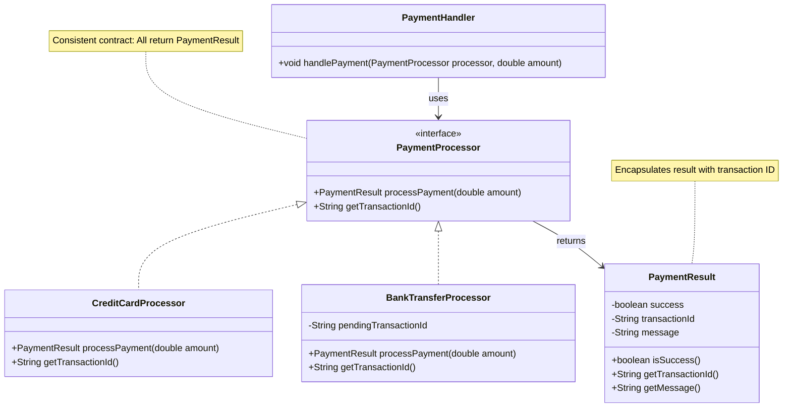
```mermaid
classDiagram
    class PaymentProcessor {
        <<interface>>
        +PaymentResult processPayment(double amount)
        +String getTransactionId()
    }
    
    class PaymentResult {
        -boolean success
        -String transactionId
        -String message
        +boolean isSuccess()
        +String getTransactionId()
        +String getMessage()
    }
    
    class CreditCardProcessor {
        +PaymentResult processPayment(double amount)
        +String getTransactionId()
    }
    
    class BankTransferProcessor {
        -String pendingTransactionId
        +PaymentResult processPayment(double amount)
        +String getTransactionId()
    }
    
    class PaymentHandler {
        +void handlePayment(PaymentProcessor processor, double amount)
    }
    
    PaymentProcessor <|.. CreditCardProcessor
    PaymentProcessor <|.. BankTransferProcessor
    PaymentProcessor --> PaymentResult : returns
    PaymentHandler --> PaymentProcessor : uses
    
    note for PaymentProcessor "Consistent contract: All return PaymentResult"
    note for PaymentResult "Encapsulates result with transaction ID"
```

## Benefits of the Fixes

### 1. All Implementations Are Substitutable

- `Falcon` and `Penguin` can both be used as `Bird`
- `CreditCardProcessor` and `BankTransferProcessor` can both be used as `PaymentProcessor`

### 2. No Runtime Errors

- No exceptions thrown for unsupported operations
- No null returns when values are expected
- Consistent behavior across implementations

### 3. Clear Contracts

- Interfaces define what implementations **can** do, not what they **must** do
- Separate interfaces for separate capabilities
- All methods fulfill their contracts

### 4. Predictable Behavior

- Code using interfaces can rely on consistent behavior
- No need for special-case handling
- True polymorphism works correctly

## Summary

By redesigning interfaces to match actual capabilities:

- **Separate concerns** - Use multiple interfaces for different capabilities (Bird + Flyable)
- **Consistent behavior** - All implementations fulfill the contract the same way
- **No exceptions** - Methods don't throw "not supported" exceptions
- **Proper contracts** - Interfaces define what implementations can do

All implementations are now **substitutable** - you can swap them without breaking functionality, following the Liskov Substitution Principle.


---

# Interface Segregation Principle - Introduction

The **Interface Segregation Principle (ISP)** is the fourth principle in SOLID. It guides how to design interfaces that are focused and easy to use. It is closely related to the Single Responsibility Principle, but focused on interfaces instead of classes.

> Keep interfaces small so that users don’t end up depending on things they don’t need.

## The contract

An interface is often considered a _contract_ between the class using the interface and the class implementing the interface. The class using the interface can expect certain methods to be implemented with certain behaviour. The class implementing the interface is the _provider_ of the contract, and has to fulfil the agreed upon behaviour.


## The Core Message

> **Interfaces should be small, granular and focused.**

Instead of creating one large interface with many methods, use multiple smaller interfaces, each serving a specific purpose. This principle ensures that classes only depend on the interfaces they actually use.

## Three Perspectives

The Interface Segregation Principle can be understood from (at least) three distinct perspectives, each highlighting different aspects of the same core idea. They all end up at roughly the same message, though: small interfaces.

### 1. The Consumer Side

**"I only want to depend on the small slice of behavior I actually use."**

From the consumer's perspective, ISP is about avoiding unnecessary coupling. A class that uses an interface should not be forced to depend on methods it doesn't call. This leads to **Role Interfaces** - interfaces defined by what the consumer needs, not what the provider has.

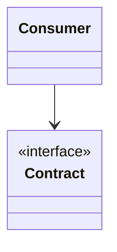
```mermaid
classDiagram
    class Contract {
        <<interface>>
    }

    Consumer --> Contract
```

### 2. The Provider Side

**"I must define a contract that groups behaviors logically."**

Sometimes you write code, others will use. You define the interface to expose the behaviour of your code. This makes you the architect of this particular library or framework.

From the provider/architect's perspective, ISP is about creating well-organized, cohesive interfaces. Instead of creating "kitchen sink" interfaces that bundle unrelated functionality, interfaces should group related behaviors together. This ensures **Interface Cohesion** - all methods in an interface have a strong logical relationship.

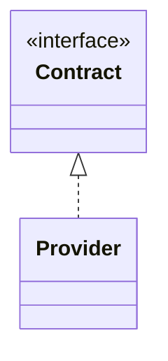
```mermaid
classDiagram
    class Contract {
        <<interface>>
    }

    Contract <|.. Provider
```

### 3. The Implementer Side

**"I should only be required to fulfill a contract if it matches my actual capabilities."**

From the implementer's perspective, ISP is about avoiding the "Tax to Enter" problem. Classes should not be forced to implement methods they cannot meaningfully support. Granular interfaces allow classes to implement only what they can honestly provide, avoiding empty methods, exceptions, or "lying code."

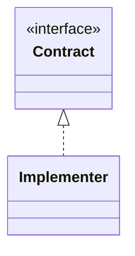
```mermaid
classDiagram
    class Contract {
        <<interface>>
    }

    Contract <|.. Implementer
```

## Relationship to Other Principles

ISP works closely with:
- **Single Responsibility Principle** - Interfaces should have one responsibility
- **Liskov Substitution Principle** - Segregated interfaces help ensure implementations can fulfill contracts honestly
- **Dependency Inversion Principle** - Consumers depend on focused interfaces

## Summary

The Interface Segregation Principle ensures that:
- **Interfaces are small and focused** - Each interface has a clear, single purpose
- **Classes depend only on what they use** - No unnecessary coupling
- **Implementations are honest** - No forced empty methods or exceptions
- **Designs are flexible** - Classes can mix and match interfaces as needed

In the following sections, we'll explore each of the three perspectives in detail to understand how ISP applies in different scenarios.


---

# Interface Segregation Principle - Consumer Side

The **Consumer Side** of the Interface Segregation Principle focuses on the perspective of classes that *use* interfaces. This is often called the **Client-Owned Interfaces** or **Role Interfaces** approach.

This is actually the most common perspective, as the principle states:


## The Consumer Perspective

> **"I only want to depend on the small slice of behavior I actually use."**

When you're writing a class that needs some functionality, you should define an interface based on what *you* need, not what the provider has. This naturally results in small, focused interfaces.

## The Pressure: Coupling

The main concern from the consumer's perspective is **coupling**. If an interface is too large, the consumer becomes coupled to methods it doesn't call, or shouldn't have access to.

### The Problem

If the interface changes a method that the consumer doesn't use, the consumer might still need to be recompiled or retested. This creates unnecessary dependencies and makes the system more fragile.

**Example:** A `ProfilePictureViewer` class that only needs to display a user's profile picture shouldn't have to depend on methods related to "Admin Rights" or "Account Management" just because they're in the same `IUser` interface.

## The Solution: Role Interfaces

The consumer should define the interface it needs based on the *role* the object plays for the consumer, not the identity of the object itself.

### Key Concept: Role Interfaces

A **Role Interface** describes a specific *role* that an object plays for the consumer, not what the object is. For example:
- `IImageProvider` - describes something that can provide an image
- `IReadable` - describes something that can be read
- `IAuthenticator` - describes something that can authenticate

The same object might implement multiple role interfaces, playing different roles for different consumers.

## Example: Document Previewer

Imagine a **Document Management System** where you have a `DocumentPreviewer` class that needs to show a thumbnail.

### Bad ISP: Fat Interface

```java
public interface IDocument {
    String read();
    void delete();
    void encrypt();
    void edit();
    void archive();
    void print();
    // ... many more methods
}

public class DocumentPreviewer {
    private IDocument document;  // Forced to depend on ALL methods
    
    public void showThumbnail() {
        // I only need read(), but I'm coupled to delete(), encrypt(), etc.
        String content = document.read();
        displayThumbnail(content);
    }
}
```

**Problem:** The `DocumentPreviewer` is coupled to methods like `delete()` and `encrypt()` that it will never use. If any of those methods change, this class might be affected.

### Good ISP: Role Interface

```java
// Consumer defines what it needs
public interface IReadable {
    String read();
}

public class DocumentPreviewer {
    private IReadable document;  // Only depends on what it uses
    
    public void showThumbnail() {
        String content = document.read();
        displayThumbnail(content);
    }
}
```

**Benefit:** The `DocumentPreviewer` only depends on `read()`. It's not affected by changes to `delete()`, `encrypt()`, or any other methods.

## Example: Profile Picture Viewer

Consider a class that only needs to display a user's profile picture:

### Bad ISP

```java
public interface IUser {
    String getProfilePicture();
    String getName();
    String getEmail();
    void setAdminRights(boolean admin);
    void changePassword(String newPassword);
    void deleteAccount();
    // ... many more methods
}

public class ProfilePictureViewer {
    private IUser user;  // Forced to depend on ALL user methods
    
    public void displayPicture() {
        String picture = user.getProfilePicture();
        render(picture);
    }
}
```

**Problem:** The viewer is coupled to admin rights, password changes, and account deletion - none of which it needs.

### Good ISP

```java
// Consumer defines the role it needs
public interface IImageProvider {
    String getProfilePicture();
}

public class ProfilePictureViewer {
    private IImageProvider imageSource;  // Only depends on image provision
    
    public void displayPicture() {
        String picture = imageSource.getProfilePicture();
        render(picture);
    }
}
```

**Benefit:** The viewer is decoupled from all user management concerns. It only knows about image provision.

## Visualizing the Consumer Side

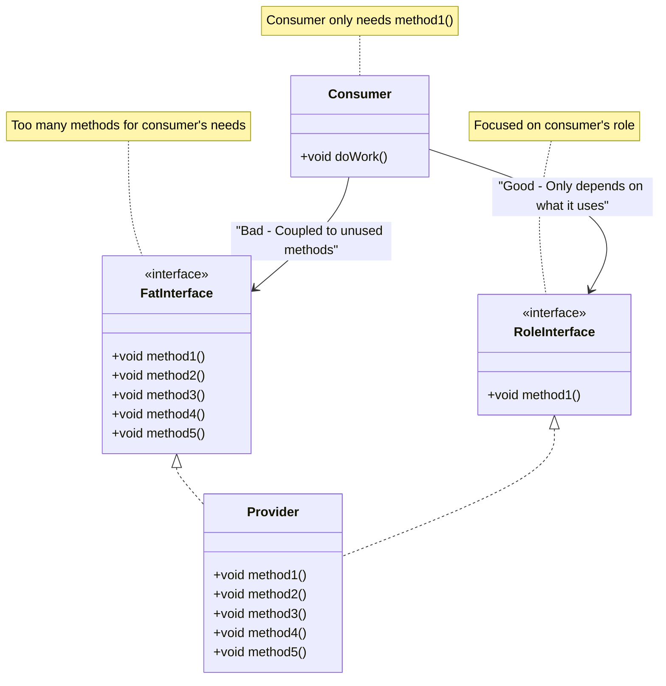
```mermaid
classDiagram
    class Consumer {
        +void doWork()
    }
    
    class FatInterface {
        <<interface>>
        +void method1()
        +void method2()
        +void method3()
        +void method4()
        +void method5()
    }
    
    class RoleInterface {
        <<interface>>
        +void method1()
    }
    
    class Provider {
        +void method1()
        +void method2()
        +void method3()
        +void method4()
        +void method5()
    }
    
    Consumer --> FatInterface : "Bad - Coupled to unused methods"
    Consumer --> RoleInterface : "Good - Only depends on what it uses"
    FatInterface <|.. Provider
    RoleInterface <|.. Provider
    
    note for Consumer "Consumer only needs method1()"
    note for FatInterface "Too many methods for consumer's needs"
    note for RoleInterface "Focused on consumer's role"
```

## The Mindset

When following the consumer-side approach:

- **Think:** "I am a class doing a job. I need a helper. I don't care who the helper is, but they must be able to do *X*."
- **Result:** You define an interface based on what the consumer needs, not what the provider has.
- **Outcome:** This naturally results in small, focused interfaces that satisfy ISP.

## Benefits

Following ISP from the consumer side provides:

1. **Safety** - Consumers can't accidentally call methods they shouldn't use
2. **Low Coupling** - Consumers aren't affected by changes to methods they don't use
3. **Clear Intent** - The interface clearly communicates what the consumer needs
4. **Flexibility** - Any object that can play the role can be used, regardless of its other capabilities

## Relationship to Dependency Inversion

The consumer-side view of ISP is closely related to the **Dependency Inversion Principle**. When consumers define their own interfaces (required interfaces), they're inverting the dependency - they're not depending on concrete implementations, but on abstractions they control.

## Summary

From the consumer's perspective, ISP means:

- **Define interfaces based on what you need** - Not what the provider has
- **Use Role Interfaces** - Describe the role, not the identity
- **Avoid unnecessary coupling** - Don't depend on methods you don't use
- **Think "required interface"** - What does my class require to do its job?

By following this approach, you naturally create small, focused interfaces that make your code more maintainable and flexible.


---

# Interface Segregation Principle - Provider Side

The **Provider Side** of the Interface Segregation Principle focuses on the perspective of those who *design* and *expose* interfaces - the API designers, library authors, and system architects. Basically:

**You write some code, that someone else will use.**

## The Provider Perspective

> **"I must define a contract that groups behaviors logically."**

When you're designing a system's public API or library interface, you need to organize functionality into cohesive, well-structured interfaces. This is about how the system is *defined* before anyone even writes the code to implement it.

## The Pressure: Cohesion

The main concern from the provider's perspective is **cohesion**. Interfaces should group related behaviors together, ensuring that all methods in an interface have a strong logical relationship to one another.

### The Problem

Creating a "Kitchen Sink" or "God Object" interface that bundles unrelated functionality leads to:
- Bloated APIs that are hard to understand
- Difficult mocking and testing (must mock 50 methods even if you only use 2)
- Confusing contracts that don't clearly communicate purpose
- Maintenance nightmares when the interface grows

**Example:** A single `IDocumentService` interface containing 50 methods for everything from printing to archiving to encryption makes the API hard to understand and use.

## The Solution: Interface Cohesion

Design interfaces based on functional clusters. Group methods that belong together logically, and separate concerns that are unrelated.

### Key Concept: Interface Cohesion

**Interface Cohesion** means ensuring that the methods in an interface have a strong logical relationship to one another. Methods should work together to fulfill a single, well-defined purpose.

For example:
- `IAuthentication` - Login, Logout, ValidateSession (all about authentication)
- `IAuthorization` - CheckPermissions, HasAccess, IsAuthorized (all about authorization)
- `IDocumentEditor` - Edit, Save, Undo, Redo (all about editing)
- `IDocumentArchiver` - Archive, Retrieve, ListArchived (all about archiving)

These are separate because authentication and authorization are different concerns, even though they're related.

## Example: Document Management System

Imagine you're the architect designing the core library for a **Document Management System**.

### Bad ISP: Kitchen Sink Interface

```java
// One massive interface with everything
public interface DocumentService {
    // Authentication
    void login(String username, String password);
    void logout();
    boolean isAuthenticated();
    
    // Document operations
    Document createDocument(String name);
    Document readDocument(String id);
    void updateDocument(String id, Document doc);
    void deleteDocument(String id);
    
    // Editing
    void editDocument(String id);
    void saveDocument(String id);
    void undo(String id);
    void redo(String id);
    
    // Archiving
    void archiveDocument(String id);
    Document retrieveArchived(String id);
    List<Document> listArchived();
    
    // Printing
    void printDocument(String id);
    void printPreview(String id);
    void setPrintSettings(String id, PrintSettings settings);
    
    // Encryption
    void encryptDocument(String id, String key);
    void decryptDocument(String id, String key);
    
    // Sharing
    void shareDocument(String id, String userId);
    void revokeAccess(String id, String userId);
    List<String> getSharedWith(String id);
    
    // ... 30 more methods
}
```

**Problems:**
1. **Hard to understand** - What does this interface do? Everything?
2. **Hard to mock** - Testing requires mocking 50+ methods
3. **Hard to implement** - Any class implementing this must handle all concerns
4. **Violates SRP** - The interface has multiple responsibilities

### Good ISP: Segregated by Function

```java
// Authentication - separate concern
public interface Authentication {
    void login(String username, String password);
    void logout();
    boolean isAuthenticated();
}

// Document CRUD operations
public interface DocumentRepository {
    Document createDocument(String name);
    Document readDocument(String id);
    void updateDocument(String id, Document doc);
    void deleteDocument(String id);
}

// Document editing
public interface DocumentEditor {
    void editDocument(String id);
    void saveDocument(String id);
    void undo(String id);
    void redo(String id);
}

// Document archiving
public interface DocumentArchiver {
    void archiveDocument(String id);
    Document retrieveArchived(String id);
    List<Document> listArchived();
}

// Document printing
public interface DocumentPrinter {
    void printDocument(String id);
    void printPreview(String id);
    void setPrintSettings(String id, PrintSettings settings);
}

// Document encryption
public interface DocumentEncryption {
    void encryptDocument(String id, String key);
    void decryptDocument(String id, String key);
}

// Document sharing
public interface DocumentSharing {
    void shareDocument(String id, String userId);
    void revokeAccess(String id, String userId);
    List<String> getSharedWith(String id);
}
```

**Benefits:**
1. **Clear purpose** - Each interface has a single, well-defined responsibility
2. **Easy to mock** - Test only what you need (e.g., mock `DocumentRepository` for repository tests)
3. **Easy to understand** - The API structure communicates the system's organization
4. **Flexible implementation** - Classes can implement only the interfaces they need

## Example: Testing and Mocking

The provider-side perspective becomes especially important when considering testing. We will cover this later in the course. But sometimes, when testing your code, you might have to swap out the concrete implementation of the interface with a "mock", or fake, implementation. If you have a large interface, this can be a pain. 

## Visualizing the Provider Side

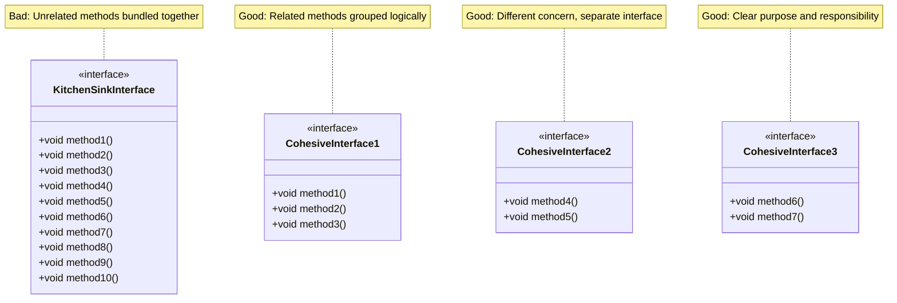
```mermaid
classDiagram
    class KitchenSinkInterface {
        <<interface>>
        +void method1()
        +void method2()
        +void method3()
        +void method4()
        +void method5()
        +void method6()
        +void method7()
        +void method8()
        +void method9()
        +void method10()
    }
    
    class CohesiveInterface1 {
        <<interface>>
        +void method1()
        +void method2()
        +void method3()
    }
    
    class CohesiveInterface2 {
        <<interface>>
        +void method4()
        +void method5()
    }
    
    class CohesiveInterface3 {
        <<interface>>
        +void method6()
        +void method7()
    }
    
    note for KitchenSinkInterface "Bad: Unrelated methods bundled together"
    note for CohesiveInterface1 "Good: Related methods grouped logically"
    note for CohesiveInterface2 "Good: Different concern, separate interface"
    note for CohesiveInterface3 "Good: Clear purpose and responsibility"
```

## The Mindset

When following the provider-side approach:

- **Think:** "What functional clusters make sense? What behaviors belong together?"
- **Result:** You create interfaces based on logical groupings of related functionality
- **Outcome:** Clear, cohesive APIs that are easy to understand and use

## Design Guidelines

When designing interfaces from the provider perspective:

1. **Group by functionality** - Methods that work together should be in the same interface
2. **Separate concerns** - Different concerns (authentication vs. authorization) should be separate
3. **Consider usage patterns** - Methods that are often used together should be grouped
4. **Think about testing** - Will this interface be easy to mock for testing?
5. **Consider the API surface** - Does this interface communicate its purpose clearly?

## Benefits

Following ISP from the provider side provides:

1. **Clarity** - The API structure clearly communicates the system's organization
2. **Cohesion** - Related functionality is grouped together logically
3. **Maintainability** - Changes to one concern don't affect unrelated interfaces
4. **Testability** - Easier to mock and test focused interfaces
5. **Usability** - Developers can find and use the right interface for their needs

## Relationship to Single Responsibility Principle

The provider-side view of ISP is closely related to the **Single Responsibility Principle**. Each interface should have one reason to change - one cohesive set of related behaviors. If an interface has multiple unrelated responsibilities, it should be split.

## Summary

From the provider's perspective, ISP means:

- **Design interfaces based on functional clusters** - Group related behaviors together
- **Ensure Interface Cohesion** - All methods in an interface should have a strong logical relationship
- **Separate concerns** - Different concerns should be in different interfaces
- **Think "provided interface"** - What contract am I exposing to the world?

By following this approach, you create well-organized, maintainable APIs that are easy to understand, test, and use.


---

# Interface Segregation Principle - Implementer Side

The **Implementer Side** of the Interface Segregation Principle focuses on the perspective of classes that *implement* interfaces. This addresses the "Tax to Enter" problem - when a class wants to participate in a system but is forced to implement methods it cannot meaningfully support.

## The Implementer Perspective

> **"I can only fulfill a contract if it matches my actual physical or logical capabilities."**

When you're writing a class that implements an interface, you should only be required to implement methods that you can honestly and meaningfully support. If an interface requires methods your class cannot provide, you're forced to write "lying code" - empty methods, exceptions, or null returns.

## The Pressure: Liskov Substitution Principle (LSP)

The main concern from the implementer's perspective is the **Liskov Substitution Principle**. If you're forced to implement methods you can't support, your implementation becomes a "Revolting Implementer" - it can't properly fulfill the contract, violating LSP.

### The Problem: The "Tax to Enter"

The interface acts as a **gatekeeper** or a **slot** in a larger system. Your class wants to participate in the system (join the "Club"), but the doorman demands you implement everything - even capabilities you don't have.

**The "Tax to Enter" Problem:**
- You want your class to fit into a larger system (e.g., work with a foreach loop, participate in an event system, be recognized by a game engine)
- The system defines a slot (interface) that requires too many capabilities
- You're forced to implement empty methods, throw exceptions, or return null just to satisfy the compiler
- Your class carries dead weight and becomes confusing

## The Solution: Granular Interfaces

Granular interfaces allow the implementer to say, "I am a `ReadOnlyRepository`. I implement `IReadable`, but I simply *cannot* implement `IWritable`."

### Key Concept: Partial Implementation

**Partial Implementation** allows classes to pick and choose traits rather than being forced into a rigid hierarchy. A class can implement multiple small interfaces, selecting only the capabilities it actually has.

## Example -1: The ReadOnly list in Java

Java has a `ReadOnlyList` interface, which is a list that cannot be modified. It is a read-only list. It is a list that can only be read from, not written to. Still, this implementation also implements the `List` interface, because it is a list.

So, there is a method called `add(E e)` in the `List` interface, and therefore the ReadOnlyList implementation has the method, but cannot support it. Caling this method will throw an `UnsupportedOperationException`.

This is a clear violation of Liskov's Substitution Principle, and also a problem with the Interface Segregation Principle, as the ReadOnlyList is forced to implement the `List` interface, even though it cannot support all the methods.

## Example 0: javafx.Application

This class is the abstract super class for your JavaFX application. The architects of this class has certainly done some consideration.

The class is abstract, so you extend it, rather the implementing an interface, but it is still worth looking at how the class is designed.

There is one _abstract_ method, `start(Stage primaryStage)`, which is the entry point for the application. You _have_ to provide an implementation of this method.\
But there are other methods, non-abstract, which you can optionally override. For example, you can override the `stop()` method to perform cleanup when the application is stopped.

You probably didn't know about this method, because you haven't needed it. If this method became a required part of the contract, you would have to implement it, and just leave it empty.

## Example 1: Game Object / Trigger Zone

Imagine you're writing a script for a video game engine. You want to create an invisible "Trigger Zone" (a box that triggers an event when the player walks into it).

To get the Game Engine to recognize your class, it requires you to implement the standard `IGameEntity` interface.

### Bad ISP: The "Tax"

```java
// The "Gatekeeper" Interface - requires everything
public interface IGameEntity {
    void render(Graphics g);       // Draw to screen
    void calculatePhysics();       // Handle gravity/collisions
    void playSound(String file);   // Audio
    void handleInput(Input i);     // Keyboard/Mouse
    void loadTexture(String path); // Visual assets
}

// Your Implementer Class - The Trigger Zone
public class InvisibleTrigger implements IGameEntity {
    // This is the ONLY thing you actually need:
    @Override
    public void calculatePhysics() {
        if (player.isTouching(this)) {
            triggerEvent();
        }
    }

    // --- The "Tax" you have to pay to fit into the system ---
    
    @Override
    public void render(Graphics g) {
        // I am invisible! I have nothing to render!
        // Do I leave this empty? Do I return null?
    }

    @Override
    public void playSound(String file) {
        throw new UnsupportedOperationException("I don't make sounds.");
    }

    @Override
    public void handleInput(Input i) {
        // I don't listen to keyboards.
    }

    @Override
    public void loadTexture(String path) {
        // I don't have a texture.
    }
}
```

**Problems:**
1. **Code Noise** - The class is 80% empty methods
2. **Confusion** - Other developers might wonder if the Trigger interacts with the Mouse
3. **Fragility** - If the system adds `onTouchScreenTap()` later, your class breaks even though it has nothing to do with touch screens

### Good ISP: Segregated Interfaces

```java
// Segregated interfaces based on capabilities
public interface IPhysicsEntity {
    void calculatePhysics();
}

public interface IRenderable {
    void render(Graphics g);
}

public interface IAudioEntity {
    void playSound(String file);
}

public interface IInputHandler {
    void handleInput(Input i);
}

public interface ITextureEntity {
    void loadTexture(String path);
}

// Your Implementer Class - Only implements what it needs
public class InvisibleTrigger implements IPhysicsEntity {
    @Override
    public void calculatePhysics() {
        if (player.isTouching(this)) {
            triggerEvent();
        }
    }
    // That's it! No empty methods, no exceptions, no lies.
}
```

**Benefits:**
- Clean, honest implementation
- No forced empty methods
- Clear about what the class actually does
- Easy to extend - can add `IRenderable` later if needed

## Example 2: Application Event System

Imagine you're building a system where objects can "listen" to what is happening in the main application window. You remember this concept from WEB1, yes? JavaScript event listeners?

### Bad ISP: The "God" Listener

```java
// The "Gatekeeper" Interface
public interface IApplicationListener {
    void onMouseClicked(int x, int y);
    void onKeyPressed(char key);
    void onWindowResized(int width, int height);
    void onWifiConnectionLost();
    void onBatteryLow();
}

// Your Implementer - Auto-Save Feature
public class AutoSaveOnLowBattery implements IApplicationListener {
    
    // --- The ONLY reason we are here ---
    @Override
    public void onBatteryLow() {
        System.out.println("Battery low! Emergency save triggered...");
        saveData();
    }

    // --- The "Tax" to enter the system ---
    
    @Override
    public void onMouseClicked(int x, int y) {
        // I am a background process. I don't have a UI. 
        // Why are you telling me about mouse clicks?
    }

    @Override
    public void onKeyPressed(char key) {
        // Empty.
    }

    @Override
    public void onWindowResized(int width, int height) {
        // I don't care about the window size.
    }

    @Override
    public void onWifiConnectionLost() {
        // Not my job.
    }
}
```

**Why this hurts:**
1. **Code Noise** - The class is 80% empty methods
2. **Confusion** - Does the AutoSaver interact with the Mouse? You have to read the code to realize it does nothing
3. **Fragility** - If the system adds `onTouchScreenTap()` later, your class breaks even though it has nothing to do with touch screens

### Good ISP: Segregated Interfaces

```java
// Segregated interfaces based on event types
public interface IMouseListener {
    void onMouseClicked(int x, int y);
}

public interface IKeyboardListener {
    void onKeyPressed(char key);
}

public interface ISystemStateListener {
    void onWifiConnectionLost();
    void onBatteryLow();
}

public interface IWindowListener {
    void onWindowResized(int width, int height);
}

// Your Happy Implementer
public class AutoSaveOnLowBattery implements ISystemStateListener {
    
    @Override
    public void onBatteryLow() {
        saveData();
    }

    @Override
    public void onWifiConnectionLost() {
        // This is cohesive enough that I might actually want to handle this too!
        // (e.g., pause cloud sync)
    }
    // No empty methods! Clean, honest implementation.
}
```

**Benefits:**
- The class "fits into the system" without carrying GUI or Input baggage
- Clear about what it actually handles
- Can easily add more system state listeners if needed

## Example 3: Payment Gateway

Imagine a system that processes payments. The system is designed to handle everything from Credit Cards to Crypto.

### Bad ISP: One-Size-Fits-All

```java
// The Interface - requires everything
public interface IPaymentMethod {
    void processPayment();
    void validateCreditCardNumber();
    void calculateCryptoGasFees();
    void checkBankRoutingNumber();
}

// Your Implementer - PayPal
public class PayPalPayment implements IPaymentMethod {
    @Override
    public void processPayment() {
        // PayPal handles this
        paypalAPI.charge(amount);
    }
    
    // --- The "Tax" ---
    
    @Override
    public void validateCreditCardNumber() {
        // PayPal handles that internally, you don't see the number
        throw new UnsupportedOperationException("PayPal doesn't expose card validation");
    }
    
    @Override
    public void calculateCryptoGasFees() {
        // Irrelevant for PayPal
        throw new UnsupportedOperationException("PayPal doesn't use crypto");
    }
    
    @Override
    public void checkBankRoutingNumber() {
        // PayPal handles this internally
        throw new UnsupportedOperationException("Not applicable");
    }
}
```

**Problem:** Your class becomes messy because the "Entry Ticket" (the interface) required you to acknowledge behaviors you don't possess.

### Good ISP: Capability-Based Interfaces

```java
// Segregated interfaces
public interface IPaymentProcessor {
    void processPayment();
}

public interface ICreditCardValidator {
    void validateCreditCardNumber();
}

public interface ICryptoPaymentCalculator {
    void calculateCryptoGasFees();
}

public interface IBankPaymentValidator {
    void checkBankRoutingNumber();
}

// Your Implementer - Only what it can do
public class PayPalPayment implements IPaymentProcessor {
    @Override
    public void processPayment() {
        paypalAPI.charge(amount);
    }
    // That's it! No forced implementations of capabilities we don't have.
}
```

## Example 4: Read-Only File Storage

Consider a class for **Archived Cold Storage** (e.g., Write-Once-Read-Many optical disks).

### Bad ISP: Forced to Lie

```java
public interface IDocument {
    String read();
    void update(String content);
    void delete();
}

public class ArchivedColdStorage implements IDocument {
    @Override
    public String read() {
        return readFromOpticalDisc();
    }
    
    // --- The "Tax" - I physically cannot do this ---
    @Override
    public void update(String content) {
        // I physically cannot update this file; it is burned onto a disc.
        throw new UnsupportedOperationException("Cannot update write-once media");
    }
    
    @Override
    public void delete() {
        // I physically cannot delete this file.
        throw new UnsupportedOperationException("Cannot delete write-once media");
    }
}
```

**Problem:** The implementer is forced to lie. It has to implement methods that throw exceptions, making the system fragile and prone to runtime errors.

### Good ISP: Honest Implementation

```java
public interface IReadable {
    String read();
}

public interface IModifiable {
    void update(String content);
    void delete();
}

public class ArchivedColdStorage implements IReadable {
    @Override
    public String read() {
        return readFromOpticalDisc();
    }
    // No update() or delete() - I simply cannot do these things.
    // The interface doesn't force me to lie.
}
```

**Benefit:** Granular interfaces allow the implementer to say, "I am a `ReadOnlyRepository`. I implement `IReadable`, but I simply *cannot* implement `IModifiable`."

## Visualizing the Implementer Side

The bad approach:

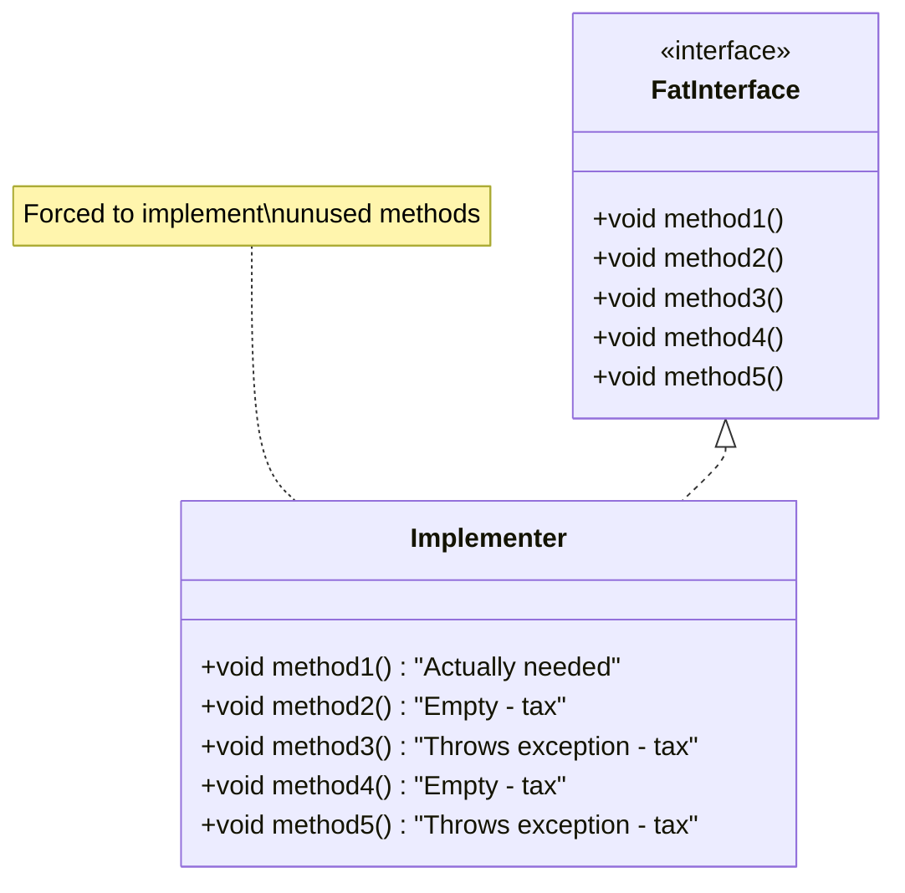
```mermaid
classDiagram
    class FatInterface {
        <<interface>>
        +void method1()
        +void method2()
        +void method3()
        +void method4()
        +void method5()
    }
    
    class Implementer {
        +void method1() "Actually needed"
        +void method2() "Empty - tax"
        +void method3() "Throws exception - tax"
        +void method4() "Empty - tax"
        +void method5() "Throws exception - tax"
    }
    
    FatInterface <|.. Implementer
    
    note for Implementer "Forced to implement\nunused methods"
```

The good approach:

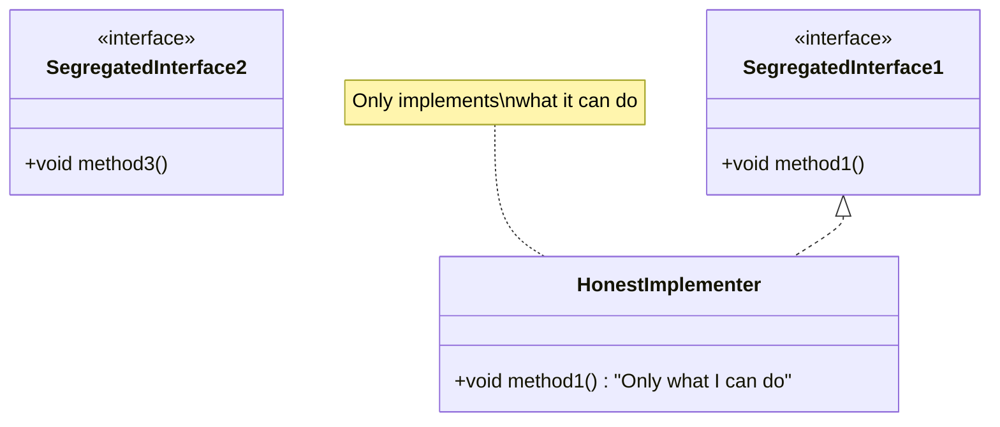
```mermaid
classDiagram
    note for HonestImplementer "Only implements\nwhat it can do"
    
    class SegregatedInterface2 {
        <<interface>>
        +void method3()
    }

    class SegregatedInterface1 {
        <<interface>>
        +void method1()
    }

    
    class HonestImplementer {
        +void method1() "Only what I can do"
    }
    
    SegregatedInterface1 <|.. HonestImplementer
    
```

## The "Resume" Metaphor

To visualize how this works, imagine an interface is a **Job Description** and your class is the **Applicant**:

- **The Job (The Interface):** `IOfficeWorker`
  - Requirements: Type 80wpm, Answer Phones, *Fly a Helicopter*
- **The Applicant (Your Class/Implementer):** A Temp Secretary
  - Capabilities: Type 80wpm, Answer Phones
  - Goal: "I just want to fit into the office system and do work."

**The Violation (Bad ISP):**
The office refuses to hire the secretary unless they get a pilot's license. The secretary is forced to lie on their resume ("Sure, I can fly...") but if anyone actually asks them to fly (calls the method), the helicopter crashes (Runtime Error).

**The Solution (Good ISP):**
Split the job description into `ITypist` and `IPilot`. The secretary applies for `ITypist`. They now "fit into the system" without needing irrelevant skills.

## Benefits

Following ISP from the implementer side provides:

1. **Honesty** - Classes only promise what they can deliver
2. **Type Safety** - Compile-time errors instead of runtime exceptions
3. **No "Lying Code"** - No forced empty methods or exception-throwing stubs
4. **Clarity** - The class clearly communicates what it can and cannot do
5. **Flexibility** - Classes can join systems by implementing only relevant interfaces

## Relationship to Liskov Substitution Principle

The implementer-side view of ISP is closely related to the **Liskov Substitution Principle**. When you're forced to implement methods you can't support, your implementation becomes a "Revolting Implementer" that violates LSP. Segregated interfaces allow honest implementations that can properly fulfill their contracts.

## Summary

From the implementer's perspective, ISP means:

- **Only implement what you can do** - Don't promise capabilities you don't have
- **Avoid the "Tax to Enter"** - Don't force classes to implement irrelevant methods just to join a system
- **Use Partial Implementation** - Pick and choose traits through multiple small interfaces
- **Think "capability"** - What can my class actually do? What interfaces match those capabilities?

By following this approach, you create honest, maintainable implementations that clearly communicate their capabilities and limitations.


---

# Dependency Inversion Principle - Introduction

The **Dependency Inversion Principle (DIP)** is the fifth and final principle in SOLID. It guides how to structure dependencies between modules to achieve flexibility and maintainability.

## Definition

**High-level modules should not depend on low-level modules. Both should depend on abstractions.**

Additionally: **Abstractions should not depend on details. Details should depend on abstractions.**


## The Core Idea

Instead of high-level code depending directly on low-level implementations, both should depend on abstractions (interfaces or abstract classes). This "inverts" the typical dependency direction.

## Traditional Dependency Direction (Wrong)

In traditional design, high-level modules depend directly on low-level modules:

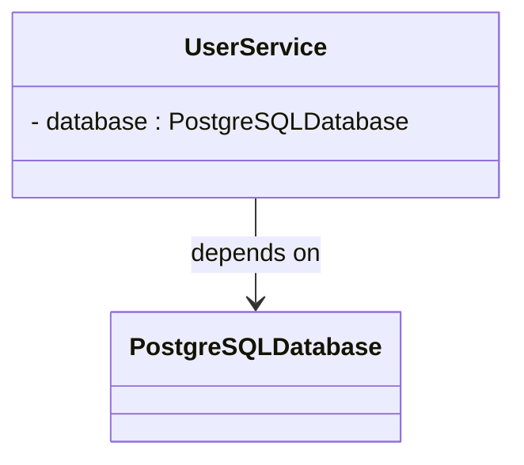
```mermaid
classDiagram
    class UserService {
        - database : PostgreSQLDatabase
    }
    
    class PostgreSQLDatabase {
    }

    UserService --> PostgreSQLDatabase : depends on
```

**Example:**
- A `UserService` (high-level) directly depends on `PostgreSQLDatabase` (low-level)
- If you want to switch to `PostgreSQLDatabase`, you must modify `UserService`

## Inverted Dependency Direction (Right)

With DIP, both depend on abstractions:

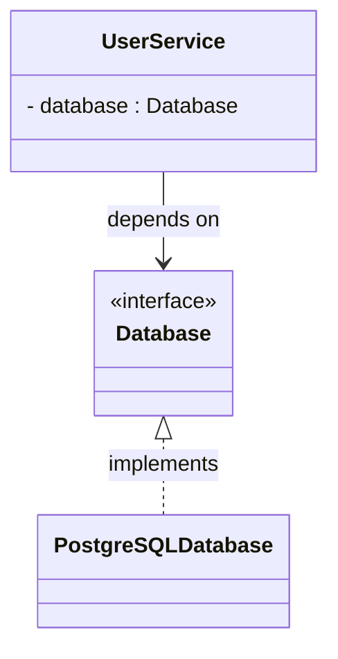
```mermaid
classDiagram
    class UserService {
        - database : Database
    }

    class Database {
        <<interface>>
    }

    class PostgreSQLDatabase {
    }

    UserService --> Database : depends on
    Database <|.. PostgreSQLDatabase : implements
```

**Example:**
- `UserService` depends on `Database` interface (abstraction)
- `PostgreSQLDatabase` implements `Database` interface
- `PostgreSQLDatabase` implements `Database` interface
- To switch databases, you only change which implementation is used

## What Are High-Level and Low-Level Modules?

### High-Level Modules

**High-level modules** contain business logic and policy decisions. They define what the system does.

Examples:
- `UserService` - Business logic for user operations
- `OrderProcessor` - Business logic for processing orders
- `PaymentHandler` - Business logic for handling payments

### Low-Level Modules

**Low-level modules** contain implementation details and "infrastructure" code, like databases, file systems, network connections, etc. They define how things are done.

Examples:
- `PostgreSQLDatabase` - Database implementation
- `FileLogger` - Logging implementation
- `EmailSender` - Email sending implementation

## The Inversion

The "inversion" refers to inverting the dependency direction:

**Before (Wrong):**
- High-level depends on low-level
- `UserService` depends on `MySQLDatabase`

**After (Right):**
- Both depend on abstraction
- `UserService` depends on `Database` interface
- `MySQLDatabase` depends on `Database` interface (implements it)

The dependency direction is "inverted" - high-level no longer points down to low-level, but both point to the abstraction.

## Benefits of DIP

Following the Dependency Inversion Principle provides several benefits:

### 1. Flexibility

You can swap implementations without modifying high-level code. Switch from MySQL to PostgreSQL by changing which implementation is used.

### 2. Testability

You can easily create mock implementations for testing. Test `UserService` with a `MockDatabase` instead of a real database.

### 3. Loose Coupling

High-level modules aren't tightly coupled to specific implementations. They depend on stable abstractions.

### 4. Maintainability

Changes to low-level implementations don't affect high-level code. Modify `MySQLDatabase` without touching `UserService`.

### 5. Extensibility

Add new implementations easily. Create `MongoDBDatabase` that implements `Database` interface.

## Visualizing DIP

Here's a diagram showing the difference:

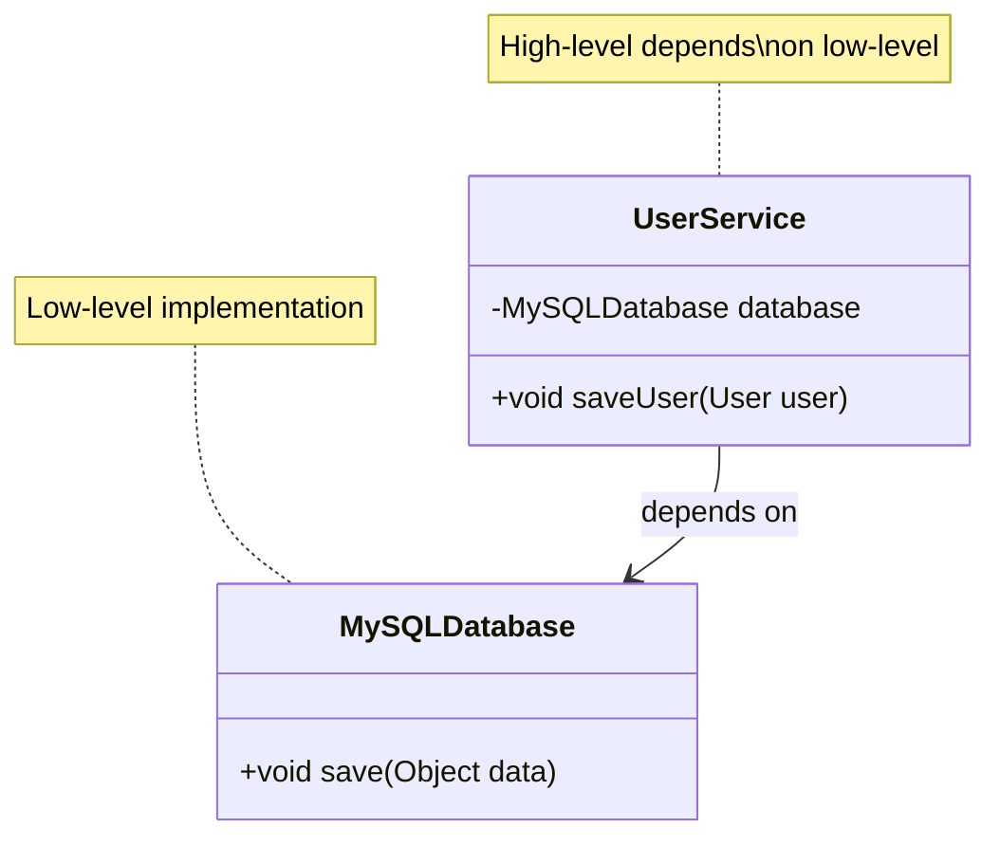
```mermaid
classDiagram
    class UserService {
        -MySQLDatabase database
        +void saveUser(User user)
    }
    
    class MySQLDatabase {
        +void save(Object data)
    }
    
    UserService --> MySQLDatabase : depends on
    
    note for UserService "High-level depends\non low-level"
    note for MySQLDatabase "Low-level implementation"
```

**Problem:** High-level `UserService` depends directly on low-level `MySQLDatabase`. If you want to switch to `PostgreSQLDatabase`, you must modify `UserService`.

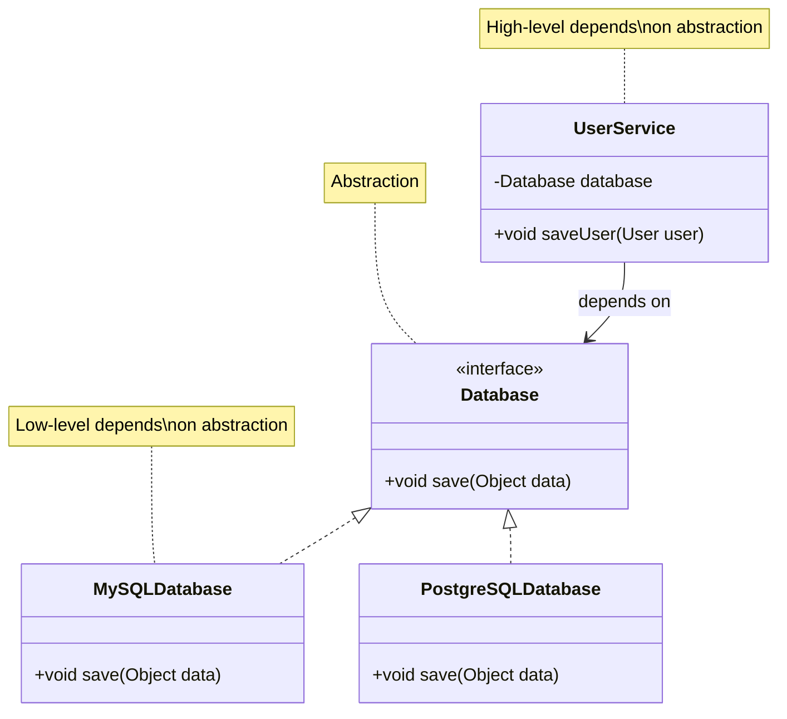
```mermaid
classDiagram
    class UserService {
        -Database database
        +void saveUser(User user)
    }
    
    class Database {
        <<interface>>
        +void save(Object data)
    }
    
    class MySQLDatabase {
        +void save(Object data)
    }
    
    class PostgreSQLDatabase {
        +void save(Object data)
    }
    
    UserService --> Database : depends on
    Database <|.. MySQLDatabase
    Database <|.. PostgreSQLDatabase
    
    note for UserService "High-level depends\non abstraction"
    note for Database "Abstraction"
    note for MySQLDatabase "Low-level depends\non abstraction"
```

**Solution:** Both high-level and low-level depend on the `Database` abstraction. If you want to switch to `PostgreSQLDatabase`, you only need to change the implementation of `PostgreSQLDatabase`. `UserService` does not need to be modified.

## How to Apply DIP

### 1. Identify Dependencies

Find where high-level modules depend on low-level modules.

### 2. Create Abstractions

Define interfaces or abstract classes that represent the contract.

### 3. Invert Dependencies

Make high-level modules depend on abstractions, and low-level modules implement them.

### 4. Use Dependency Injection

Pass implementations (dependencies) into high-level modules rather than creating them inside.

## Key Techniques

### 1. Use Interfaces

Define interfaces that low-level modules implement:

```java
public interface Database {
    void save(Object data);
    Object load(int id);
}
```

### 2. Dependency Injection

Pass dependencies into classes rather than creating them:

```java
// Wrong: Creating dependency inside
public class UserService {
    private MySQLDatabase database = new MySQLDatabase();
}

// Right: Injecting dependency
public class UserService {
    private Database database;
    
    public UserService(Database database) {
        this.database = database;
    }
}
```

### 3. Program to Interfaces

Code should depend on interfaces, not concrete classes:

```java
// Wrong: Depends on concrete class
public void process(MySQLDatabase db) { }

// Right: Depends on interface
public void process(Database db) { }
```

## When DIP Applies

DIP is especially important when:
- You need to swap implementations (different databases, loggers, etc.)
- You want to test code in isolation
- You need flexibility for future changes
- You're building reusable, maintainable code

## Relationship to Other Principles

DIP works closely with:
- **Open Closed Principle** - DIP enables OCP by allowing extension through new implementations
- **Liskov Substitution** - DIP relies on LSP to ensure implementations are substitutable
- **Interface Segregation** - DIP uses focused interfaces for dependencies

## Summary

- **Definition:** High-level modules shouldn't depend on low-level modules; both should depend on abstractions
- **Key idea:** Invert dependency direction - depend on interfaces, not implementations
- **Benefits:** Flexibility, testability, loose coupling, maintainability
- **Question to ask:** "Does this high-level code depend on a concrete implementation?"


---

# Dependency Inversion Principle - Violations

Let's examine examples that violate the Dependency Inversion Principle and understand the problems they cause.

## Example 1: UserService Depending on MySQLDatabase

Consider a `UserService` that directly depends on a concrete `MySQLDatabase` class:

```java
public class MySQLDatabase {
    public void connect() {
        System.out.println("Connecting to MySQL database");
    }
    
    public void save(String table, Object data) {
        System.out.println("Saving to MySQL: " + table);
    }
    
    public Object load(String table, int id) {
        System.out.println("Loading from MySQL: " + table + ", ID: " + id);
        return null; // Simplified
    }
    
    public void disconnect() {
        System.out.println("Disconnecting from MySQL");
    }
}

public class UserService {
    private MySQLDatabase database;
    
    public UserService() {
        this.database = new MySQLDatabase();  // Direct dependency
        this.database.connect();
    }
    
    public void saveUser(User user) {
        database.save("users", user);
    }
    
    public User loadUser(int userId) {
        return (User) database.load("users", userId);
    }
    
    public void close() {
        database.disconnect();
    }
}
```

## The Problem

The `UserService` class violates DIP because:

1. **Direct dependency on concrete class** - `UserService` depends directly on `MySQLDatabase`
2. **Tight coupling** - Cannot use a different database without modifying `UserService`
3. **Hard to test** - Cannot easily test `UserService` without a real MySQL database
4. **Hard to change** - Switching to PostgreSQL requires modifying `UserService`

## Visualizing the Violation

```mermaid
classDiagram
    class UserService {
        -MySQLDatabase database
        +void saveUser(User user)
        +User loadUser(int userId)
    }
    
    class MySQLDatabase {
        +void connect()
        +void save(String table, Object data)
        +Object load(String table, int id)
        +void disconnect()
    }
    
    UserService --> MySQLDatabase : depends on
    
    note for UserService "High-level depends on low-level"
    note for MySQLDatabase "Concrete implementation"
```

## Problems Caused by This Violation

### 1. Cannot Swap Implementations

To switch from MySQL to PostgreSQL, you must modify `UserService`:

```java
// To use PostgreSQL, you must change UserService
public class UserService {
    private PostgreSQLDatabase database;  // Changed!
    
    public UserService() {
        this.database = new PostgreSQLDatabase();  // Changed!
        // ...
    }
}
```

**Problem:** High-level code must change when low-level implementation changes.

### 2. Hard to Test

Testing `UserService` requires a real MySQL database:

```java
@Test
public void testSaveUser() {
    UserService service = new UserService(...);  // Needs real MySQL!
    // Test code...
}
```

**Problem:** Cannot easily test in isolation or use mock databases.

### 3. Tight Coupling

`UserService` is tightly coupled to MySQL-specific details. Any change to `MySQLDatabase` might require changes to `UserService`.

### 4. Violates Open Closed Principle

Cannot extend the system (add new database types) without modifying existing code (`UserService`).

## Example 2: EmailService Depending on SMTPEmailSender

Here's another common violation:

```java
public class SMTPEmailSender {
    private String smtpServer;
    private int port;
    
    public SMTPEmailSender(String smtpServer, int port) {
        this.smtpServer = smtpServer;
        this.port = port;
    }
    
    public void sendEmail(String to, String subject, String body) {
        System.out.println("Sending email via SMTP to " + to);
        // SMTP-specific implementation
    }
}

public class NotificationService {
    private SMTPEmailSender emailSender;
    
    public NotificationService() {
        this.emailSender = new SMTPEmailSender("smtp.example.com", 587);
    }
    
    public void sendNotification(String userEmail, String message) {
        emailSender.sendEmail(userEmail, "Notification", message);
    }
}
```

**Problem:** `NotificationService` is tightly coupled to `SMTPEmailSender`. Cannot switch to a different email provider (e.g., SendGrid, Mailgun) without modifying `NotificationService`.

## Example 3: Logger Direct Dependency

```java
public class FileLogger {
    private String logFile;
    
    public FileLogger(String logFile) {
        this.logFile = logFile;
    }
    
    public void log(String message) {
        // Write to file
        System.out.println("Logging to file: " + message);
    }
}

public class OrderService {
    private FileLogger logger;
    
    public OrderService() {
        this.logger = new FileLogger("orders.log");  // Direct dependency
    }
    
    public void processOrder(Order order) {
        logger.log("Processing order: " + order.getId());
        // Process order...
    }
}
```

**Problem:** `OrderService` is coupled to `FileLogger`. Cannot switch to console logging, database logging, or cloud logging without modifying `OrderService`.


## Recognizing DIP Violations

Signs that code violates DIP:

1. **High-level classes create low-level objects** - Using `new` to create concrete dependencies
2. **Direct imports of concrete classes** - Importing specific implementations
3. **Cannot swap implementations** - Changing implementation requires modifying high-level code
4. **Hard to test** - Cannot easily inject mocks or test doubles
5. **Tight coupling** - High-level code knows about low-level implementation details

## Summary

DIP violations occur when:
- **High-level modules depend on low-level modules** - Direct dependencies on concrete classes
- **No abstractions** - No interfaces between high and low levels
- **Tight coupling** - Cannot change implementations without modifying high-level code
- **Hard to test** - Cannot easily inject test doubles

These violations cause:
- **Inflexibility** - Cannot swap implementations easily
- **Hard to test** - Requires real implementations for testing
- **Tight coupling** - Changes ripple through the system
- **Violations of other principles** - OCP, SRP

Next, we'll see how to fix these violations by introducing abstractions and inverting dependencies.


---

# Dependency Inversion Principle - Fix

Let's fix the DIP violations by introducing abstractions and inverting dependencies so high-level modules depend on interfaces rather than concrete implementations.

## Fix 1: UserService - Introduce Database Interface

Instead of `UserService` depending directly on `MySQLDatabase`, we'll introduce a `Database` interface.

### Refactored Code

```java
// Abstraction (interface)
public interface Database {
    void connect();
    void save(String table, Object data);
    Object load(String table, int id);
    void disconnect();
}

// Low-level implementation 1
public class MySQLDatabase implements Database {
    @Override
    public void connect() {
        System.out.println("Connecting to MySQL database");
    }
    
    @Override
    public void save(String table, Object data) {
        System.out.println("Saving to MySQL: " + table);
    }
    
    @Override
    public Object load(String table, int id) {
        System.out.println("Loading from MySQL: " + table + ", ID: " + id);
        return null;
    }
    
    @Override
    public void disconnect() {
        System.out.println("Disconnecting from MySQL");
    }
}

// Low-level implementation 2
public class PostgreSQLDatabase implements Database {
    @Override
    public void connect() {
        System.out.println("Connecting to PostgreSQL database");
    }
    
    @Override
    public void save(String table, Object data) {
        System.out.println("Saving to PostgreSQL: " + table);
    }
    
    @Override
    public Object load(String table, int id) {
        System.out.println("Loading from PostgreSQL: " + table + ", ID: " + id);
        return null;
    }
    
    @Override
    public void disconnect() {
        System.out.println("Disconnecting from PostgreSQL");
    }
}

// High-level module - depends on abstraction
public class UserService {
    private Database database;  // Depends on interface, not concrete class
    
    public UserService(Database database) {  // Dependency injection
        this.database = database;
        this.database.connect();
    }
    
    public void saveUser(User user) {
        database.save("users", user);
    }
    
    public User loadUser(int userId) {
        return (User) database.load("users", userId);
    }
    
    public void close() {
        database.disconnect();
    }
}
```

### Using the Refactored Code

```java
// Can use MySQL
Database mysqlDb = new MySQLDatabase();
UserService service1 = new UserService(mysqlDb);

// Can use PostgreSQL
Database postgresDb = new PostgreSQLDatabase();
UserService service2 = new UserService(postgresDb);

// Can switch implementations without modifying UserService!
```

## Fix 2: NotificationService - Introduce EmailSender Interface

### Refactored Code

```java
// Abstraction
public interface EmailSender {
    void sendEmail(String to, String subject, String body);
}

// Low-level implementation 1
public class SMTPEmailSender implements EmailSender {
    private String smtpServer;
    private int port;
    
    public SMTPEmailSender(String smtpServer, int port) {
        this.smtpServer = smtpServer;
        this.port = port;
    }
    
    @Override
    public void sendEmail(String to, String subject, String body) {
        System.out.println("Sending email via SMTP to " + to);
    }
}

// Low-level implementation 2
public class SendGridEmailSender implements EmailSender {
    private String apiKey;
    
    public SendGridEmailSender(String apiKey) {
        this.apiKey = apiKey;
    }
    
    @Override
    public void sendEmail(String to, String subject, String body) {
        System.out.println("Sending email via SendGrid to " + to);
    }
}

// High-level module - depends on abstraction
public class NotificationService {
    private EmailSender emailSender;  // Depends on interface
    
    public NotificationService(EmailSender emailSender) {  // Dependency injection
        this.emailSender = emailSender;
    }
    
    public void sendNotification(String userEmail, String message) {
        emailSender.sendEmail(userEmail, "Notification", message);
    }
}
```

## Fix 3: OrderService - Introduce Logger Interface

### Refactored Code

```java
// Abstraction
public interface Logger {
    void log(String message);
}

// Low-level implementations
public class FileLogger implements Logger {
    private String logFile;
    
    public FileLogger(String logFile) {
        this.logFile = logFile;
    }
    
    @Override
    public void log(String message) {
        System.out.println("Logging to file [" + logFile + "]: " + message);
    }
}

public class ConsoleLogger implements Logger {
    @Override
    public void log(String message) {
        System.out.println("Console log: " + message);
    }
}

public class DatabaseLogger implements Logger {
    private Database database;
    
    public DatabaseLogger(Database database) {
        this.database = database;
    }
    
    @Override
    public void log(String message) {
        database.save("logs", message);
    }
}

// High-level module - depends on abstraction
public class OrderService {
    private Logger logger;  // Depends on interface
    
    public OrderService(Logger logger) {  // Dependency injection
        this.logger = logger;
    }
    
    public void processOrder(Order order) {
        logger.log("Processing order: " + order.getId());
        // Process order...
    }
}
```

## Fix 4: OrderProcessor - Introduce PaymentProcessor Interface

### Refactored Code

```java
// Abstraction
public interface PaymentProcessor {
    boolean processPayment(double amount);
}

// Low-level implementations
public class StripePaymentProcessor implements PaymentProcessor {
    private String apiKey;
    
    public StripePaymentProcessor(String apiKey) {
        this.apiKey = apiKey;
    }
    
    @Override
    public boolean processPayment(double amount) {
        System.out.println("Processing payment via Stripe: $" + amount);
        return true;
    }
}

public class PayPalPaymentProcessor implements PaymentProcessor {
    private String clientId;
    private String secret;
    
    public PayPalPaymentProcessor(String clientId, String secret) {
        this.clientId = clientId;
        this.secret = secret;
    }
    
    @Override
    public boolean processPayment(double amount) {
        System.out.println("Processing payment via PayPal: $" + amount);
        return true;
    }
}

// High-level module - depends on abstraction
public class OrderProcessor {
    private PaymentProcessor paymentProcessor;  // Depends on interface
    
    public OrderProcessor(PaymentProcessor paymentProcessor) {  // Dependency injection
        this.paymentProcessor = paymentProcessor;
    }
    
    public void checkout(Order order) {
        if (paymentProcessor.processPayment(order.getTotal())) {
            // Complete order
            System.out.println("Order completed");
        }
    }
}
```

## Visualizing the Fixes

### Database Dependency Fix

```mermaid
classDiagram
    class Database {
        <<interface>>
        +void connect()
        +void save(String table, Object data)
        +Object load(String table, int id)
        +void disconnect()
    }
    
    class UserService {
        -Database database
        +void saveUser(User user)
        +User loadUser(int userId)
    }
    
    class MySQLDatabase {
        +void connect()
        +void save(String table, Object data)
        +Object load(String table, int id)
        +void disconnect()
    }
    
    class PostgreSQLDatabase {
        +void connect()
        +void save(String table, Object data)
        +Object load(String table, int id)
        +void disconnect()
    }
    
    UserService --> Database : depends on
    Database <|.. MySQLDatabase
    Database <|.. PostgreSQLDatabase
    
    note for UserService "High-level depends on abstraction"
    note for Database "Abstraction"
    note for MySQLDatabase "Low-level depends on abstraction"
```

### Complete System Fix

```mermaid
classDiagram
    class Database {
        <<interface>>
    }
    
    class EmailSender {
        <<interface>>
    }
    
    class Logger {
        <<interface>>
    }
    
    class PaymentProcessor {
        <<interface>>
    }
    
    class UserService {
        -Database database
    }
    
    class NotificationService {
        -EmailSender emailSender
    }
    
    class OrderService {
        -Logger logger
    }
    
    class OrderProcessor {
        -PaymentProcessor paymentProcessor
    }
    
    UserService --> Database
    NotificationService --> EmailSender
    OrderService --> Logger
    OrderProcessor --> PaymentProcessor
    
```

## Benefits of the Fixes

### 1. Easy to Swap Implementations

Switch implementations without modifying high-level code:

```java
// Use MySQL
UserService service1 = new UserService(new MySQLDatabase());

// Switch to PostgreSQL - no code changes needed!
UserService service2 = new UserService(new PostgreSQLDatabase());
```

### 2. Easy to Test

Inject mock implementations for testing:

```java
// Mock database for testing
public class MockDatabase implements Database {
    private List<Object> savedData = new ArrayList<>();
    
    @Override
    public void save(String table, Object data) {
        savedData.add(data);
    }
    
    // Other methods...
}

// Test with mock
@Test
public void testSaveUser() {
    MockDatabase mockDb = new MockDatabase();
    UserService service = new UserService(mockDb);
    // Test code...
}
```

### 3. Loose Coupling

High-level modules aren't coupled to specific implementations. They depend on stable interfaces.

### 4. Follows Open Closed Principle

Add new implementations (e.g., `MongoDBDatabase`) without modifying existing code.

### 5. Flexible Configuration

Choose implementations at runtime or through configuration:

```java
// Choose implementation based on configuration
Database database = config.getDatabaseType().equals("mysql") 
    ? new MySQLDatabase() 
    : new PostgreSQLDatabase();
UserService service = new UserService(database);
```

## Using Dependency Injection

The fixes use **dependency injection** - passing dependencies into classes rather than creating them inside:

```java
// Wrong: Creating dependency inside
public class UserService {
    private MySQLDatabase database = new MySQLDatabase();
}

// Right: Injecting dependency
public class UserService {
    private Database database;
    
    public UserService(Database database) {
        this.database = database;
    }
}
```

## Summary

By introducing abstractions and inverting dependencies:

- **High-level modules depend on abstractions** - Interfaces, not concrete classes
- **Low-level modules implement abstractions** - Concrete classes implement interfaces
- **Dependency injection** - Dependencies are passed in, not created inside
- **Easy to swap** - Change implementations without modifying high-level code
- **Easy to test** - Inject mocks or test doubles
- **Loose coupling** - High-level code doesn't know about implementation details

The dependencies are now inverted, following the Dependency Inversion Principle.

## Conclusion

You've now learned all five SOLID principles:

- **S** - Single Responsibility Principle
- **O** - Open Closed Principle
- **L** - Liskov Substitution Principle
- **I** - Interface Segregation Principle
- **D** - Dependency Inversion Principle

These principles work together to help you create maintainable, flexible, and robust software. Apply them thoughtfully in your designs, and remember: they're guidelines to help you make better decisions, not rigid rules that must always be followed.


---

# The FLUID anti principles

These are the anti principles of the SOLID principles, i.e. things we should avoid.

Here is the **FLUID** methodology. Each letter is the direct antagonist to the corresponding **SOLID** letter.

I include these because I commonly see them, even with arguments in favor of the FLUID principles.

## The Core Theme

**Short-Term Speed** vs. **Long-Term Survival**

FLUID is faster for the first hour; SOLID is faster for the next year.

### **F** — Fused Responsibilities
*(The opposite of **S**ingle Responsibility)*

**The Principle:** *Don't separate concerns; melt them together.*
Why have a `User`, a `UserDAO`, and a `UserValidator` when you can just have one massive `User` class? If logic is spread out, you have to look in multiple files. Fuse it all into one giant block of code. If a class has fewer than 2,000 lines, it isn't trying hard enough.

*   **The Anti-Pattern:** The "God Object" or "Frankenstein Class."
*   **The "Fluid" visual:** Logic flows and mixes together like molten metal; there are no boundaries.

#### The Student Argument

*"Why should I split this into 5 files? It's so much easier to find what I'm looking for if everything is in one big `GameController.java` file. I can just Ctrl+F!"*

#### The Counter-Argument

1. **The "Sock Drawer" Reality:** If you throw your socks, silverware, car keys, and hammer into one giant box, it is indeed "all in one place." But finding the *specific* thing you need becomes a nightmare.

2. **Merge Conflict Hell:** In a team project, if everyone is working on the same "God Class," you will have merge conflicts every single time you push code. Splitting classes means Student A works on `Movement` and Student B works on `Inventory` without stepping on each other's toes.

3. **Cognitive Load:** When a class has 2,000 lines, you have to keep the entire state of the "machine" in your head to change one line safely. Small classes let you focus on one gear at a time.

#### The Metaphor

> A Swiss Army Knife is great for camping. But if you need to build a house, you don't want a tool where the hammer is fused to the saw, which is fused to the screwdriver. You want a toolbox of separate, specialized tools.

### **L** — Limitless Modification
*(The opposite of **O**pen/Closed)*

**The Principle:** *Never extend; always rewrite.*
The Open/Closed principle says you should be able to change behavior without touching the source code (via plugins or inheritance). **Limitless Modification** says: just open the file and change the `if` statements. If a requirement changes, delete the old code and write new code in its place. Version control exists for a reason, right?

*   **The Anti-Pattern:** "Shotgun Surgery" (modifying the same core methods over and over again for every new feature).

#### The Student Argument

*"Why create an interface and a new class just to add a new monster type? I can just go into the `monsterAttack()` method and add an `else if (type == 'Zombie')`. It takes 30 seconds!"*

#### The Counter-Argument

1. **Risk of Regression:** Every time you open a working, tested file to "tweak" it, you risk breaking what was already working. You are performing surgery on a healthy patient just to put a hat on them.

2. **The "Else-If" Tower of Terror:** Today it's one `else if`. In two months, it's a nested nightmare of 50 conditions. This makes the logic impossible to read and impossible to test exhaustively.

3. **Plugin Architecture:** If you use OCP, you can add features (new classes) without even recompiling the old code. This is how mods work in video games.

#### The Metaphor

> When you buy a new video game console, you plug it into the TV's HDMI port. You don't unscrew the back of the TV and solder new wires directly onto the motherboard. The TV is "Closed" for modification (soldering) but "Open" for extension (new HDMI devices).

### **U** — Unreliable Subtypes
*(The opposite of **L**iskov Substitution)*

**The Principle:** *Keep them guessing.*
A subclass should not be a perfect substitute for the parent. It should have "personality." If the parent class has a method `save()`, the subclass `ReadOnlyFile` should implement `save()` by throwing a `RuntimeException`. This ensures that anyone using your code has to write `if (obj instanceof ReadOnlyFile)` everywhere to prevent crashes.

*   **The Anti-Pattern:** Refused Bequest (inheriting methods just to break them).

#### The Student Argument

*"It's fine if my `Penguin` class throws an error when `fly()` is called. Everyone knows penguins don't fly. I'll just check `if (bird instanceof Penguin)` before I call it."*

#### The Counter-Argument

1. **The "Hidden Minefield":** You might know the Penguin crashes, but the library you imported that takes a generic `List<Bird>` doesn't know that. It will iterate, call `fly()`, and crash your application.

2. **Polymorphism is Destroyed:** The whole point of inheritance is treating different objects the same way. If you have to check "What represent exactly are you?" before using an object, you aren't doing OOP; you're just writing procedural `if/else` statements wrapped in classes.

3. **Trust:** When you break LSP, your code becomes a liar. The return type says `int`, but it returns `null`. The method says `save()`, but it deletes.

#### The Metaphor

> Imagine a standard electrical outlet. If you plug in a lamp, it lights up. If you plug in a toaster, it heats up. If you plug in a specific brand of vacuum and the house explodes, that outlet violated the Liskov Principle. You shouldn't need to know the wiring diagram of the wall to plug something in safely.

### **I** — Inflated Interfaces
*(The opposite of **I**nterface Segregation)*

**The Principle:** *One interface to rule them all.*
Why have `IReadable` and `IWritable`? Just make `IEverything`. Force every class to implement methods it doesn't need. This creates a "fluid" dependency structure where changing a method used by Class A forces you to recompile Class B, even though Class B never touches that method.

*   **The Anti-Pattern:** The Fat Interface.

#### The Student Argument

*"Why make `IClickable`, `IDraggable`, and `IHoverable`? Just make `IInteractable` with all three methods. It saves me from writing `implements` three times."*

#### The Counter-Argument

1. **The "Dummy Code" Waste:** If you implement a big interface, you are forced to write empty methods (`return null;`) for things you don't support. This is confusing noise that other developers have to read and maintain.

2. **Coupling:** If the `IInteractable` interface adds a new method `onRightClick()`, suddenly the `CloudBackground` class stops compiling, even though clouds can't be clicked. You are forcing unrelated parts of your system to care about each other.

#### The Metaphor

> It's like ordering a cable package. You want to watch Sports. But the provider forces you to buy the "Super Bundle" which includes Cooking, Knitting, and 24-hour News channels. You are paying for (and burdened by) content you never asked for.

### **D** — Direct Dependencies
*(The opposite of **D**ependency Inversion)*

**The Principle:** *New is the glue.*
Never ask for a dependency; take it. Use the `new` keyword deep inside your business logic. If your `InvoiceService` needs a `PdfGenerator`, it should `new PdfGenerator()` right in the middle of the method. This ensures your code is permanently welded to that specific PDF library.

*   **The Anti-Pattern:** Tightly Coupled Code (Hard dependencies).

#### The Student Argument

*"Why do I have to pass the `Database` into the constructor? I can just type `db = new MySQLDatabase()` inside the method. It's fewer lines of code!"*

#### The Counter-Argument

1. **The Testing Wall:** This is the #1 reason. If you use `new` inside your class, you *cannot* unit test that class without a real database connection. If you inject the dependency, you can pass in a "Fake Database" that runs instantly in memory.

2. **Vendor Lock-in:** If you hardcode `new AWSUploader()`, and tomorrow your boss says "We are switching to Azure," you have to rewrite every single class that uploads files. If you used `IFileUploader`, you just change one line of configuration code at the start of the app.

#### The Metaphor

> Imagine a lamp that is hardwired directly into the wall of your house. If you want to move the lamp to another room, you have to tear down the drywall and call an electrician. Dependency Injection is simply putting a **plug** on the lamp. It allows you to plug it into the wall (Production) or a battery pack (Testing).

***

### The FLUID vs SOLID Matchup

| SOLID (Clean) | FLUID (Messy) | The Conflict |
| :--- | :--- | :--- |
| **S**ingle Responsibility | **F**used Responsibilities | **Focus** vs. **Blob** |
| **O**pen/Closed | **L**imitless Modification | **Extension** vs. **Surgery** |
| **L**iskov Substitution | **U**nreliable Subtypes | **Trust** vs. **Surprise** |
| **I**nterface Segregation | **I**nflated Interfaces | **Specific** vs. **Generic** |
| **D**ependency Inversion | **D**irect Dependencies | **Loose** vs. **Tight** |