# Introduction to State Machines

Welcome to **State Machines**! This is a powerful modeling concept that helps you understand and design systems where entities can exist in different states and transition between them.

## What is a State Machine?

A **state machine** (also called a finite state machine or FSM) is a model/diagram that describes the behavior of an entity by defining:
- **States** - The distinct conditions or situations the entity can be in
- **Transitions** - How the entity moves from one state to another
- **Events** - What triggers these transitions

### The Core Idea

Think of a state machine as a map that shows:
- Where an entity can be (its possible states)
- How it can move between states (valid transitions)
- What causes it to move (events, triggers, or conditions)

An entity can only be in **one state at a time**, and it moves between states based on specific events or conditions.

## Real-World Analogies

State machines are everywhere in the real world. Here are some familiar examples:

### Traffic Light

A traffic light is a simple state machine:

- **States**: Red, Yellow, Green
- **Transitions**: Red → Green → Yellow → Red (in a cycle)
- **Events**: Timer events that trigger the transitions

The traffic light can only be in one state at a time (it can't be both red and green simultaneously), and it follows a specific pattern of transitions.

### Vending Machine

A vending machine has states like:

- **Idle** - Waiting for money
- **Collecting Money** - User inserting coins
- **Dispensing** - Product being dispensed
- **Out of Stock** - No products available

The machine transitions between these states based on events like "coin inserted", "product selected", or "product dispensed".

### Game Character

A game character might have states:

- **Idle** - Standing still
- **Walking** - Moving around
- **Running** - Moving fast
- **Jumping** - In the air
- **Attacking** - Performing an attack
- **Defending** - Blocking attacks

The character transitions between states based on player input or game events.

### Order Processing

An order in an e-commerce system might have states:

- **Pending** - Order placed, waiting for payment
- **Processing** - Payment confirmed, preparing order
- **Shipped** - Order sent to customer
- **Delivered** - Order received by customer
- **Cancelled** - Order cancelled before completion

The order moves through these states based on events like "payment received", "order shipped", or "order cancelled".

## Why State Machines Matter in Software Development

State machines are valuable in software development because they help you:

### 1. **Clarify Behavior**

By explicitly defining states and transitions, you make the behavior of your system clear and understandable. Anyone can look at a state machine and understand what states are possible and how the system moves between them.

### 2. **Prevent Invalid States**

A state machine makes it clear which states are valid and which transitions are allowed. This helps prevent bugs where an entity ends up in an invalid or unexpected state.

### 3. **Document Requirements**

State machines serve as documentation. They show stakeholders (developers, testers, product owners) exactly how the system should behave.

### 4. **Guide Implementation**

Once you have a state machine, it guides your implementation. You know what states to handle, what transitions to support, and what events to listen for.

### 5. **Enable Testing**

With a clear state machine, you can systematically test:
- All possible states
- All valid transitions
- All invalid transitions (should be rejected)
- Edge cases and error conditions

## Connection to Your Projects

You've already encountered state machines in your assignments! In Assignment 1, the `Stock` entity has a `currentState` field that can be:

- **Steady** - Stock price is stable
- **Growing** - Stock price is increasing
- **Declining** - Stock price is decreasing
- **Bankrupt** - Company has gone bankrupt
- **Reset** - Stock has been reset

This can be modeled with a state machine! The stock can be in one of these states, and it transitions between them based on market conditions or game events.

## When to Use State Machines

Use state machines when:

- **An entity has distinct states** - The entity can be in clearly different conditions
- **Transitions are well-defined** - You can specify when and how the entity moves between states
- **State matters** - The current state affects what the entity can do or how it behaves
- **Invalid states are possible** - You want to prevent the entity from being in invalid states, or you want to prevent invalid transitions


---

# The Problem: Unclear and Unmanaged States

Without a clear state machine model, managing entity states becomes problematic. States become unclear, transitions are undefined, and invalid states can occur.

## The Problem: Unclear State Management

When entities have states but those states aren't modeled as a state machine, several problems arise:

### Problem 1: Unclear Valid States

Without a state machine, it's unclear what states are actually valid for an entity.

Consider a `Stock` entity with a `currentState` field stored as a string. What are the valid values?

- "Steady"?
- "steady"?
- "STEADY"?
- "Steady State"?
- "Stable"?
- "Normal"?

Without a state machine, you might:
- Use different names in different parts of the code
- Have typos that create invalid states
- Not know all the possible states
- Have states that are semantically the same but named differently

### Problem 2: Invalid State Values

When states are stored as strings or unmanaged values, invalid states can easily occur:

- **Typos**: "Steady" vs "Steady " (extra space) vs "Steedy" (typo)
- **Case sensitivity**: "Steady" vs "steady" vs "STEADY"
- **Inconsistent naming**: "Growing" vs "Grows" vs "Growth"
- **Undefined states**: A state that shouldn't exist but does due to a bug

These invalid states can cause:
- Bugs that are hard to find
- Unexpected behavior
- System crashes
- Data corruption

### Problem 3: Unclear Valid Transitions

Without a state machine, it's unclear which state transitions are valid.

For example, in a stock trading game:
- Can a stock go directly from "Steady" to "Bankrupt"?
- Can a stock go from "Bankrupt" back to "Growing"?
- Can a stock be "Reset" from any state, or only from "Bankrupt"?

Without a state machine, you might:
- Allow invalid transitions (e.g., "Bankrupt" → "Growing")
- Miss valid transitions (e.g., "Declining" → "Reset")
- Have inconsistent transition rules in different parts of the code
- Create bugs where entities end up in impossible states

### Problem 4: Hard to Understand and Maintain

Without a state machine model, understanding the system's behavior requires reading through code, which is:

- **Time-consuming** - You have to trace through multiple methods
- **Error-prone** - Easy to miss edge cases or special conditions
- **Incomplete** - Code might not show all possible states or transitions
- **Scattered** - State logic might be spread across many files

### Problem 5: No Visual Representation

Without a state machine diagram, you can't easily:
- See all states at a glance
- Understand the flow between states
- Identify missing transitions
- Communicate behavior to others
- Validate that the implementation matches the design

## Example: The Stock Entity Problem

Let's consider the `Stock` entity from Assignment 1, which has a `currentState` stored as a string.

### Without a State Machine

The state is just a string field. You might have code like:

```
Stock has currentState: "Steady" | "Growing" | "Declining" | "Bankrupt" | "Reset"
```

**Problems:**
- What if someone sets it to "Steady " (with a space)?
- What if someone sets it to "growing" (lowercase)?
- What if someone sets it to "Inactive" (a state that doesn't exist)?
- Can a stock go from "Steady" directly to "Bankrupt"?
- Can a stock go from "Bankrupt" to "Growing"?
- What triggers the transition from "Growing" to "Declining"?

Without a state machine, these questions are unanswered or answered inconsistently across the codebase.

### With a State Machine

A state machine would clearly define:

- **Valid states**: Steady, Growing, Declining, Bankrupt, Reset
- **Valid transitions**: 
  - Steady → Growing (when price starts rising)
  - Steady → Declining (when price starts falling)
  - Growing → Steady (when price stabilizes)
  - Growing → Declining (when price reverses)
  - Declining → Steady (when price stabilizes)
  - Declining → Bankrupt (when company fails)
- **Invalid transitions**: 
  - Bankrupt → Growing (impossible - company is gone)
  - Steady → Bankrupt (usually requires going through Declining first)

This makes the behavior clear, testable, and maintainable.


## The Consequences

When states are unclear or unmanaged:

1. **Bugs** - Invalid states cause runtime errors or unexpected behavior
2. **Inconsistency** - Different parts of the system handle states differently
3. **Maintenance burden** - Hard to understand and modify state-related code
4. **Testing difficulty** - Hard to test all state combinations
5. **Communication problems** - Team members have different understandings
6. **Documentation gaps** - No clear way to document state behavior

---

# State Diagrams

State diagrams (also called state machine diagrams or statecharts) are a visual way to represent state machines. They show the states an entity can be in and how it transitions between them.

## What is a State Diagram?

A **state diagram** is a UML diagram that visualizes a state machine. It shows:

- **States** - Represented as rounded rectangles
- **Transitions** - Represented as arrows between states
- **Events** - Labels on transitions that trigger the change
- **Initial state** - A filled circle showing where the entity starts
- **Final state** - A circle with a filled center showing where the entity can end (optional)

## Basic Notation

### States

States are represented as **rounded rectangles** with the state name inside:

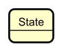

A state represents a condition or situation that an entity can be in. The entity can _only be in one state at a time_.

### Transitions

Transitions are represented as **arrows** connecting states:

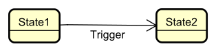

The arrow shows that the entity can move from State1 to State2. The arrow is usually labeled with the event or condition that triggers the transition.

### Initial State

The **initial state** is shown as a **filled circle** with an arrow pointing to the first state:

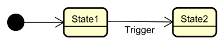

This indicates where the entity starts when it's first created.

### Final State

A **final state** (_if applicable_) is shown as a **circle with a filled center**:

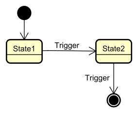

This indicates a state where the entity's lifecycle ends. Not all state machines have final states.

Not all state machines have a final state!


## Example: Traffic Light

Let's create a state diagram for a traffic light:

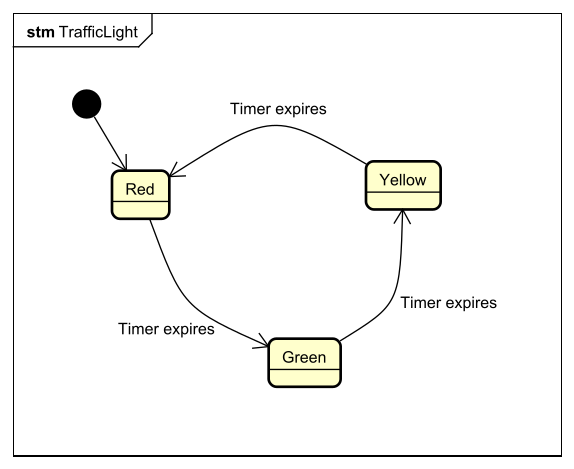

This shows:
- The traffic light starts in the **Red** state
- It transitions to **Green** when the timer expires
- It transitions to **Yellow** when the timer expires
- It transitions back to **Red** when the timer expires
- The cycle repeats

## Example: Door Lock

Here's a state diagram for a door lock:

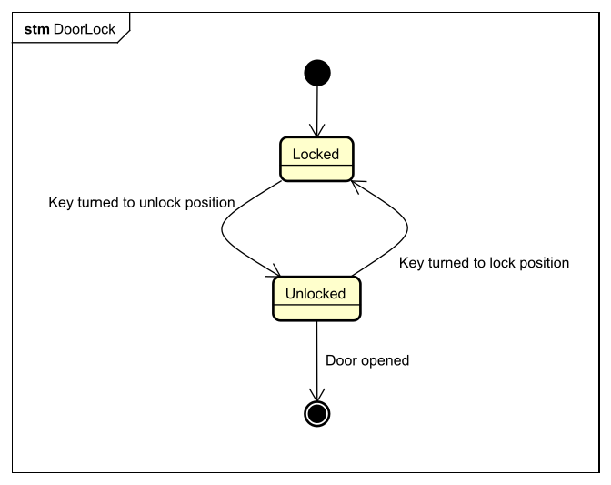

This shows:
- The door starts **Locked**
- It becomes **Unlocked** when a key is inserted and turned
- It becomes **Locked** again when the key is turned to the lock position
- The door can reach a final state when opened (if we consider the door being removed as the end)


## Example: Simple Vending Machine

Here's a more complex example - a simple vending machine:

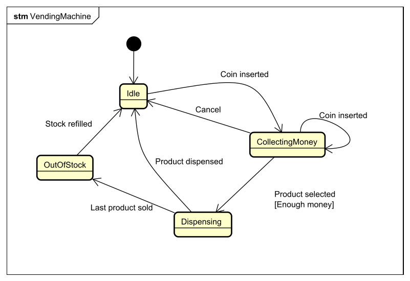

This shows:
- The machine starts **Idle**
- When a coin is inserted, it moves to **CollectingMoney**
- It can stay in **CollectingMoney** if more coins are inserted, or cancel to return to **Idle**
- When enough money is collected and a product is selected, it moves to **Dispensing**. Notice the guard condition `[enough money]` on the transition.
- After dispensing, it returns to **Idle**
- The user can cancel from **CollectingMoney**, returning to **Idle**
- The machine can be **OutOfStock** and return to **Idle** when refilled

## Example: Automatic garage door

Here's a state diagram for an automatic garage door:

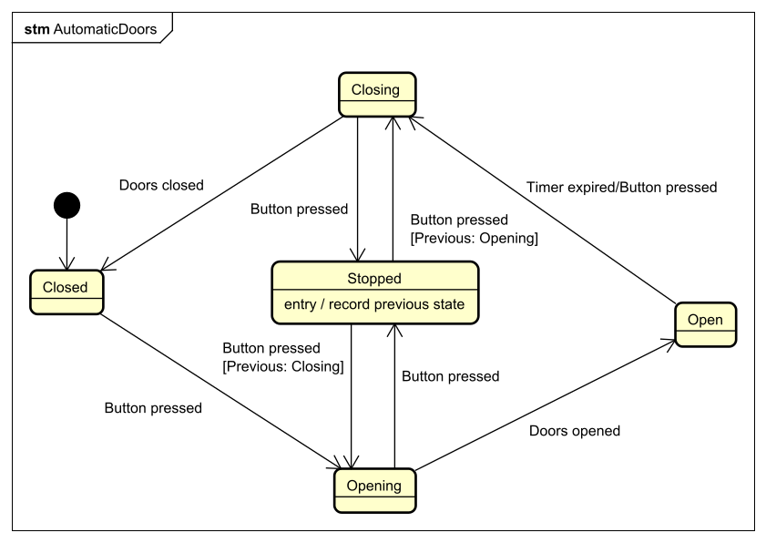

This shows:

- The door starts **Closed**
- It opens when the button is pressed, i.e. the door is  opening.
- When open, the doors will begin closing either when the timer expires, or when the button is pressed again.
- If the doors are opening or closing, pressing the button will stop this. Pressing the button again will reverse the direction of the door movement.

Notice again the guard conditions.

Also notice the Stopped state, it has an "entry action" to record which state we came from. When entering this state, we record the state we came from. This is required to figure out which direction the door should move in when the button is pressed again. Actions are covered in details on a later page.

## Example: Super Mario
Characters in games often have states. For example, a rough state diagram for Super Mario can be:


## Drawing State Diagrams

When creating a state diagram:

1. **Identify all states** - List all possible conditions the entity can be in
2. **Identify the initial state** - Determine where the entity starts
3. **Identify transitions** - Determine how the entity moves between states
4. **Label transitions** - Add events or conditions that trigger transitions
5. **Check for completeness** - Ensure all valid transitions are shown
6. **Check for invalid transitions** - Make sure impossible transitions are not included


---

# States and Transitions

States and transitions are the fundamental building blocks of state machines. Understanding them is essential for modeling entity behavior.

## What are States?

A **state** is a discrete condition or situation that an entity can be in at a given time.

### Characteristics of States

- **Discrete** - States are distinct and separate (not continuous)
- **Mutually exclusive** - An entity can only be in one state at a time
- **Persistent** - A state persists until a transition occurs
- **Observable** - You can determine which state an entity is in

### Examples of States

- **Traffic Light**: Red, Yellow, Green
- **Door**: Locked, Unlocked
- **Order**: Pending, Processing, Shipped, Delivered, Cancelled
- **Stock**: Steady, Growing, Declining, Bankrupt, Reset
- **Document**: Draft, Review, Approved, Published
- **Game Character**: Idle, Walking, Running, Jumping, Attacking

### State Names

State names should be:
- **Clear and descriptive** - "Processing" is better than "Proc"
- **Noun or adjective** - States describe conditions, not actions
- **Consistent** - Use consistent naming conventions
- **Distinct** - Each state should be clearly different from others

## What are Transitions?

A **transition** is a change from one state to another. It represents the entity moving from its current state to a new state.

### Characteristics of Transitions

- **Directed** - Transitions go from one state to another (one direction)
- **Triggered** - Something causes the transition (an event or condition)
- **Instantaneous** - The transition happens immediately (conceptually)
- **Complete** - The entity is fully in the new state after the transition

### Transition Notation

In state diagrams, transitions are shown as arrows:

```
State1 ──────> State2
```

The arrow points from the source state to the target state.

## Events

An **event** is something that happens that can trigger a transition. Events are the "causes" that make state changes occur.

### Types of Events

- **User actions** - Button click, form submission, menu selection
- **System events** - Timer expiration, data received, error occurred
- **External events** - Message received, sensor triggered, API call completed
- **Internal events** - Condition met, threshold reached, process completed


## Summary

- **States** are discrete conditions an entity can be in
- **Transitions** are changes from one state to another
- **Events** trigger transitions
- **Valid transitions** are explicitly defined in the state machine
- **Invalid transitions** are not shown and should be prevented
- **State transition paths** show sequences of states an entity can follow

Understanding states and transitions is the foundation for modeling and understanding state machines.


---

# Guards

Guards are an advanced feature of state machines that add **conditions** to transitions.  
Even if an event happens, the transition only occurs if the guard condition is satisfied.

## What is a Guard?

A **guard** is a boolean condition that must be true for a transition to occur.

- If the guard is **true**, the transition is allowed.
- If the guard is **false**, the transition is **blocked** and the state does not change.

The event still happens, but the state machine decides whether to move to a new state based on the guard.

### Guard Characteristics

- **Boolean condition** – Guards evaluate to true or false.
- **Prevents transitions** – If the guard is false, the transition does not occur.
- **Event still occurs** – The event happens, but the state stays the same.
- **Explicit conditions** – Guards make the requirements for transitions clear and visible.

## Guard Notation

In state diagrams, guards are written in **square brackets** after the event name:

```
State1 ──── Event[Guard] ───> State2
```

This means:

> When `Event` occurs **and** `Guard` is true, transition from `State1` to `State2`.

If the event occurs but the guard is false, the transition is not taken and the state machine remains in `State1`.


## Example: Order with Guards

Guards are also useful in order processing systems.

Imagine an order that should only move to **Processing** if the payment is valid:

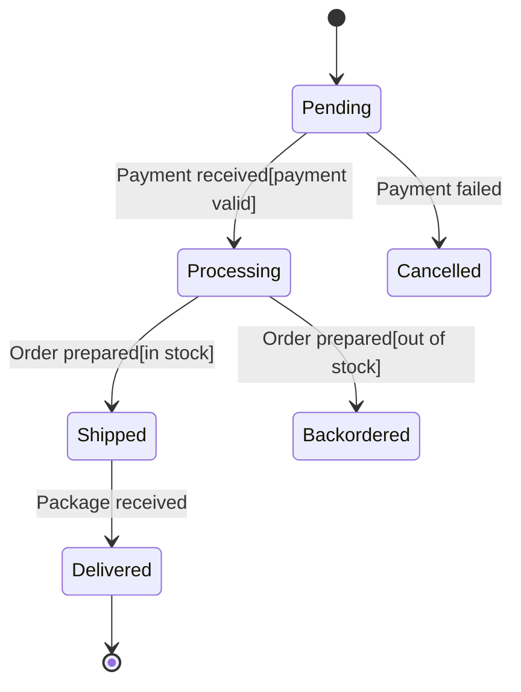

Here we have several guards:

- `Payment received[payment valid]`
  - Only move from `Pending` to `Processing` if the payment is valid.
- `Order prepared[in stock]`
  - Only move from `Processing` to `Shipped` if the items are in stock.
- `Order prepared[out of stock]`
  - If the items are not in stock, move to `Backordered` instead.

The same event (`Order prepared`) can lead to **different target states** depending on which guard is true.

## Why Guards Are Useful

Guards help you:

- **Control transitions** – Only allow transitions when certain conditions are met.
- **Express business rules** – Encode domain rules directly in the state machine.
- **Avoid invalid behavior** – Prevent transitions when preconditions are not satisfied.
- **Keep diagrams readable** – Instead of adding many extra states, you can use guards to express conditions.

---

# Actions

Actions are an advanced feature of state machines that add **behavior** to transitions and states.\
They describe **what happens** when a transition occurs or when a state is entered or exited.

## What is an Action?

An **action** is an operation or behavior that occurs:

- **During a transition** from one state to another, or
- **When entering** a state, or
- **When leaving** a state.

Actions do **not** decide whether the transition is allowed – that is the job of **guards**.  
Actions describe what the state machine **does** when a transition or state change happens.

## Types of Actions

There are three common types of actions:

1. **Transition actions** – Occur during the transition between states.
2. **Entry actions** – Occur when entering a state.
3. **Exit actions** – Occur when leaving a state.
4. **Continuous actions** – Occur continuously while in a state.

## Action Notation

In state diagrams, actions are written after a **forward slash** on transitions:

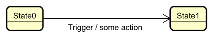

For entry and exit actions, we write them inside the state:

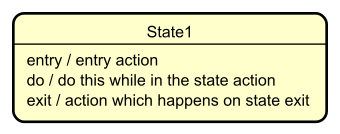

- `entry / ...` – Runs when the state is entered.
- `do / ...` – Runs continuously while in the state.
- `exit / ...` – Runs when the state is left.

## Transition Actions

A **transition action** is an action that occurs during the move from one state to another.

### Example: Order Processing with Transition Actions

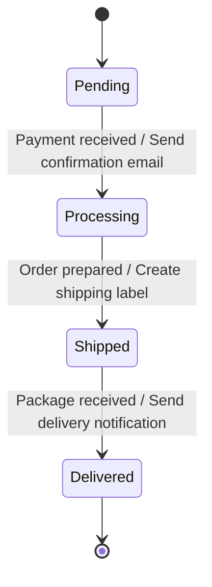

**Actions:**

- When transitioning to `Processing`: **Send confirmation email**  
  (e.g., notify the customer that the payment was received.)

- When transitioning to `Shipped`: **Create shipping label**  
  (e.g., generate label for the package.)

- When transitioning to `Delivered`: **Send delivery notification**  
  (e.g., inform the customer that the package has arrived.)

These actions occur **as part of the transition** between states.

## Entry Actions

An **entry action** runs automatically whenever a state is entered, no matter which transition led to that state.

### Example: Document Workflow with Entry Actions

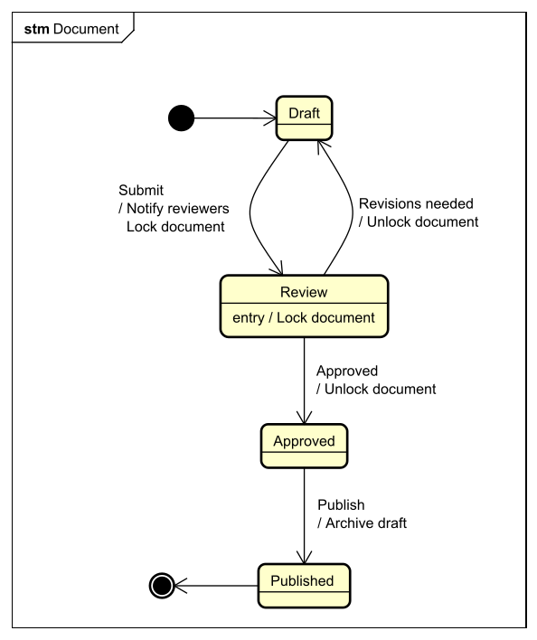

**Entry actions for `Review` state:**

- **Lock document** – Prevents editing while the document is under review.

These actions run **every time** the document enters the `Review` state, regardless of which transition brought it there.

## Exit Actions

An **exit action** runs automatically whenever a state is left, regardless of which transition is taken.

### Example: Game Character with Exit Actions

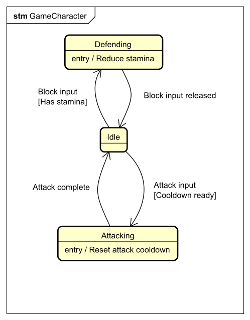

**Exit actions:**

- Leaving `Attacking`: **Reset attack cooldown**  
  (Ensures the character cannot attack again immediately.)

- Leaving `Defending`: **Reset defense stamina**  
  (Restores or updates defense-related values.)

These actions run whenever the character leaves the given state, no matter which target state it goes to.

## Example: Elevator

Here is a diagram of an elevator.

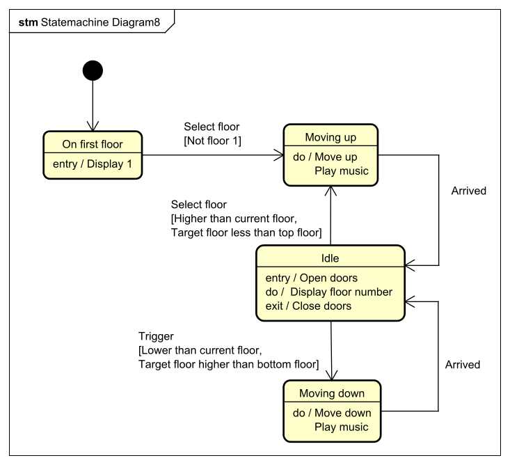


## Combining Guards and Actions

Actions are often used together with **guards**:

```
State1 ──── Event[Guard] / Action ───> State2
```

- The **guard** controls **whether** the transition is allowed.
- The **action** describes **what** happens if the transition occurs.

## When to Use Actions

Use actions when you need to:

- Perform **side effects** (send emails, update logs, trigger other systems).
- Show **notifications** or messages to users.
- Handle **resource management** (allocate or release resources).
- Do **initialization** when entering a state.
- Do **cleanup** when leaving a state.
- Keep behavior **close to the states and transitions** that cause it.

## Summary

- **Actions** describe what happens during transitions or when entering/leaving states.
- **Transition actions** run while moving from one state to another.
- **Entry actions** run every time a state is entered.
- **Exit actions** run every time a state is left.
- **Do actions** run continuously while in a state.
- Actions can be combined with guards to create clear, expressive state machine behavior.

Together with guards, actions make state machines not only describe **where** an entity can go, but also **what happens** along the way.
