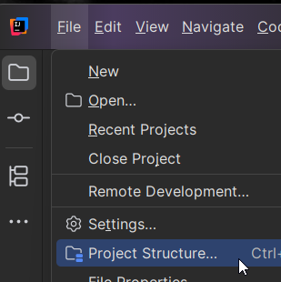
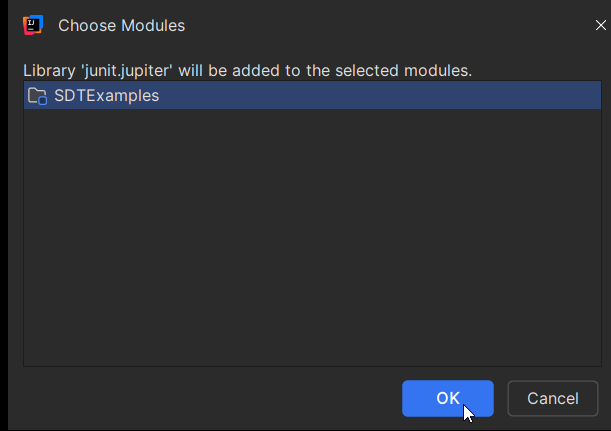
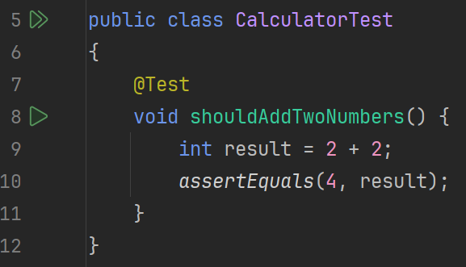

# Introduction to JUnit 5

JUnit is a testing tool for Java. It lets you write small methods that verify your code behaves as expected, and then run all tests automatically.

In this learning path, we use **JUnit 6 (Jupiter)**. 

## Why Use JUnit?

- You can re-run tests quickly after changes.
- You get fast feedback if something breaks.
- Test results are easy to read in IntelliJ (green for pass, red for fail).

## What You Will Learn

1. How to set up JUnit 6 in IntelliJ using the built-in compiler (no Gradle/Maven).
2. How to add a test folder.
3. How to create your first test class.
4. Core annotations (`@Test`, `@BeforeEach`, `@AfterEach`, `@BeforeAll`, `@AfterAll`).
5. Common assert methods.
6. More annotations: parameterized tests and `@Disabled`.

Code examples are intentionally simple and focus on using JUnit itself.


---

# Setting Up JUnit 5 in IntelliJ (Built-in Compiler)

This setup uses IntelliJ's built-in project system, not Gradle or Maven.

## Step 1: Open Project Structure

In IntelliJ:


Go to **File -> Project Structure...**



Open the **Libraries** section.


## Step 2: Add JUnit 5 Library


Click **+** to add a library.  


Choose **From Maven...**  


Input the JUnit Jupiter (for example `org.junit.jupiter:junit-jupiter:5.13.4`, at the time of writing, or google latest version). Searching will not do anything, not for me at least. Slightly inconvenient! So, just click <kbd>OK</kbd>.


When you have clicked <kbd>OK</kbd>, you should see another prompt asking you to select the module you want to add the library to:



Click <kbd>OK</kbd>.

Even though this says "From Maven", you are only downloading the library jars into IntelliJ's project settings. You are still using IntelliJ's built-in compiler setup.

<!-- SCREENSHOT: Add library dialog showing junit-jupiter dependency -->

## Step 3: Verify Imports Work

Create a temporary class and type:

```java
import org.junit.jupiter.api.Test;
```

If IntelliJ resolves the import with no error, setup is complete.


---

# Adding a Test Folder

JUnit tests should live in a dedicated test source folder, separate from your main code.

A common layout is:

```
src/
  ...
test/
  ...
```

Your src folder will have one color, while the test folder will have another color (commonly green, but depends on your theme).


## Create the Folder

In IntelliJ, create `test` if it does not already exist, under your module.  


Right-click the folder.  


Choose **Mark Directory as -> Test Sources Root**.

<!-- SCREENSHOT: Context menu with Mark Directory as Test Sources Root -->

When marked correctly, IntelliJ treats classes in that folder as test code and enables JUnit run icons.

## Why This Matters

- Keeps test code separate from production code.
- Helps IntelliJ discover and run tests automatically.
- Avoids accidental mixing of test-only dependencies in main code.


---

# Your First Test Class

Now create a simple test class in `test`.

## Example Test Class

Notice we import packages from the `junit.jupiter.api`.  
The first one is the for the `@Test` annotation.  
The second one is a _static import_ for the `assertEquals` method. If you don't make the import static, you will have to prefix the method call with the class name, i.e. `Assertions.assertEquals(4, result);`. The static import is a bit more convenient.

The test method is annotated with `@Test`. This tells JUnit that this method is a test method, to be run by the test runner.

The method name is `shouldAddTwoNumbers`. This is a good naming convention for test methods. It tells what the test is doing. 

The method body is a simple calculation, and the `assertEquals` method is used to verify the result.

If the result is not as expected, the test will fail, and the test is marked as red.


```java
import org.junit.jupiter.api.Test;

import static org.junit.jupiter.api.Assertions.assertEquals;

public class CalculatorTest {

    @Test
    void shouldAddTwoNumbers() {
        int result = 2 + 2;
        assertEquals(4, result);
    }
}
```

## Run the Test

Click the green run icon next to the test method or class.



Notice the single green arrow next to the test method. Clicking this play arrow, will run _only_ this test method.

Next to the class, you can see two green arrows, overlapping. Clicking this icon will run _all_ the test methods in the class.

You may also right click anywhere under your test folder structure, and select "Run all tests", or "Run tests in ...". This will run all tests under the selected folder. It allows you to run _all_ your tests, or just a subset, if you are focusing on a specific part of the code.

When running the tests, you should see a tab pane at the bottom of IntelliJ, showing the test results.


- A **green** result means pass.
- A **Yellow** result means an assertion failed.
- A **Red** result means an exception was thrown.

When you have many tests, organized by folders, you will see this tree structure as well, in the tests tab pane.\
If any test failed, all parent folders will be marked as yellow, until the root folder is reached. This easily allows you to navigate to the failing test.


## What a Failing Test Looks Like

If you change the assert to `assertEquals(5, result)`, the test fails.

When an assertion failes, you get some extra information about the test, and the assertion that failed:


Most assert methods have an overload which allows you to provide a custom message, to be displayed in case of failure.

```java
@Test{3}
void shouldAddTwoNumbers() {
    int result = 1 + 2;
    assertEquals(4, result, "This probably fails");
}
```

This message is one of the most important debugging clues when a test fails.

## Breaking code

If you have a failure in your code, and get an unexpected exception thrown, the test is colored red. This indicates an error, not a failed assertion.


---

# Test Lifecycle and Core Annotations

JUnit annotations define which methods are tests and which methods run before or after tests.

## Common Annotations

- `@Test`: marks a test method.
- `@BeforeEach`: runs before every test method.
- `@AfterEach`: runs after every test method.
- `@BeforeAll`: runs once before all tests in the class.
- `@AfterAll`: runs once after all tests in the class.

## Basic Example

```java
import org.junit.jupiter.api.*;

import static org.junit.jupiter.api.Assertions.assertEquals;

public class LifecycleExampleTest {

    private int value;

    @BeforeAll
    static void beforeAll() {
        System.out.println("before all");
    }

    @AfterAll
    static void afterAll() {
        System.out.println("after all");
    }

    @BeforeEach
    void setUp() {
        value = 10;
    }

    @AfterEach
    void tearDown() {
        value = 0;
    }

    @Test
    void testAdd() {
        value += 5;
        assertEquals(15, value);
    }

    @Test
    void testSubtract() {
        value -= 3;
        assertEquals(7, value);
    }
}
```

This keeps each test isolated: each test starts from a known state (`value = 10`).


---

# Most Used Assert Methods

Assertions are checks that decide pass or fail.

Import examples:

```java
import static org.junit.jupiter.api.Assertions.*;
```

## Common Assertions

- `assertEquals(expected, actual)`
- `assertTrue(condition)`
- `assertFalse(condition)`
- `assertNull(value)`
- `assertNotNull(value)`
- `assertAll(...)`
- `assertThrows(...)`

## Basic Examples

```java
@Test
void basicAsserts() {
    assertEquals(4, 2 + 2);
    assertTrue(10 > 3);
    assertFalse(2 > 5);
    assertNull(null);
    assertNotNull("hello");
}
```

Sometimes you may want to group several assertions together. This is where `assertAll` comes in. I generally don't like this all that much, because you should minimize the number of assertions in a test method, and if you have several assertions, you should split them into several test methods.

```java
@Test
void groupedAsserts() {
    int a = 2;
    int b = 3;
    assertAll(
        () -> assertEquals(5, a + b),
        () -> assertTrue(b > a)
    );
}
```

`assertThrows` is useful when an exception is the expected behavior. Here, the first argument is the expected exception _type_, and the second argument is a lambda expression that when executed, throws the exception.

```java	
@Test
void throwAssertExample() {
    assertThrows(IllegalArgumentException.class, () -> {
        throw new IllegalArgumentException("bad input");
    });
}
```

You can also get the exception itself, if you want to inspect it. Maybe you want to check the message, or the stack trace, or the cause.

```java
@Test
void throwAssertExample() {
    IllegalArgumentException exception = assertThrows(IllegalArgumentException.class, () -> {
        throw new IllegalArgumentException("bad input");
    });
    assertEquals("bad input", exception.getMessage());
}
```


---

# Parameterized Tests and Other Annotations

This page introduces two useful annotations beyond the core lifecycle set:

- `@ParameterizedTest`
- `@Disabled`

## Parameterized Tests

A parameterized test runs the same test logic multiple times with different input values, or one test with some kind of loop for all possible inputs (super yikes!). Instead of writing several almost identical `@Test` methods, you write one method and supply a list of inputs; JUnit runs the method once for each row of data.

### Example with `@CsvSource`

You use **`@ParameterizedTest`** instead of `@Test`. The **`@CsvSource`** annotation provides the data: each string is one row of comma-separated values. JUnit turns each row into arguments for the test method. The order of the values in the row must match the order of the method parameters.

In the example below, the three rows `"2, 2, 4"`, `"3, 1, 4"`, and `"10, 5, 15"` produce three test runs: the first run gets `a=2`, `b=2`, `expected=4`; the second gets `a=3`, `b=1`, `expected=4`; and so on. The test checks that `a + b` equals `expected` in each case.

```java
import org.junit.jupiter.params.ParameterizedTest;
import org.junit.jupiter.params.provider.CsvSource;

import static org.junit.jupiter.api.Assertions.assertEquals;

public class ParameterizedSumTest {

    @ParameterizedTest
    @CsvSource({
        "2, 2, 4",
        "3, 1, 4",
        "10, 5, 15"
    })
    void shouldSumNumbers(int a, int b, int expected) {
        assertEquals(expected, a + b);
    }
}
```

### Example with `@ValueSource`

**`@ValueSource`** gives one argument per test run. You use it when the test method has a single parameter. You specify an array of values (e.g. `ints`, `strings`, `longs`). JUnit runs the test once for each value.

In the example below, the test runs four times with `n` equal to 2, 3, 5, and 7, and checks that each is positive.

```java
import org.junit.jupiter.params.ParameterizedTest;
import org.junit.jupiter.params.provider.ValueSource;

import static org.junit.jupiter.api.Assertions.assertTrue;

public class ValueSourceExampleTest {

    @ParameterizedTest
    @ValueSource(ints = {2, 3, 5, 7})
    void eachValueIsPositive(int n) {
        assertTrue(n > 0);
    }
}
```

### Example with `@MethodSource`

**`@MethodSource`** supplies arguments from a static method. You give the method name (or omit it to use a method with the same name as the test plus `Provider`). The method returns a `Stream<Arguments>` (or `Iterable`, etc.); each `Arguments.of(...)` is one set of parameters for the test. This is useful when you need to build data in code or have many rows.

In the example below, `sumProvider()` returns three argument sets; the test runs three times with the corresponding `a`, `b`, and `expected` values.

```java
import org.junit.jupiter.params.ParameterizedTest;
import org.junit.jupiter.params.provider.Arguments;
import org.junit.jupiter.params.provider.MethodSource;

import java.util.stream.Stream;

import static org.junit.jupiter.api.Assertions.assertEquals;

public class MethodSourceSumTest {

    @ParameterizedTest
    @MethodSource("sumProvider")
    void shouldSumNumbers(int a, int b, int expected) {
        assertEquals(expected, a + b);
    }

    static Stream<Arguments> sumProvider() {
        return Stream.of(
            Arguments.of(2, 2, 4),
            Arguments.of(3, 1, 4),
            Arguments.of(10, 5, 15)
        );
    }
}
```

## `@Disabled`

Use **`@Disabled`** when you want to temporarily skip a test so that it is not run. You put it on the test method (or on the class to skip all tests in that class). The optional string (e.g. `"Temporarily disabled while..."`) is the reason; it appears in the test report so you remember why the test was turned off. When you run the class, this test is skipped and does not affect pass or fail.

```java
import org.junit.jupiter.api.Disabled;
import org.junit.jupiter.api.Test;

public class DisabledExampleTest {

    @Test
    @Disabled("Temporarily disabled while example is being updated")
    void thisTestIsSkipped() {
        // not executed
    }
}
```

This is useful during refactoring or when an example is still in progress. Remove `@Disabled` when the test is ready to run again.
