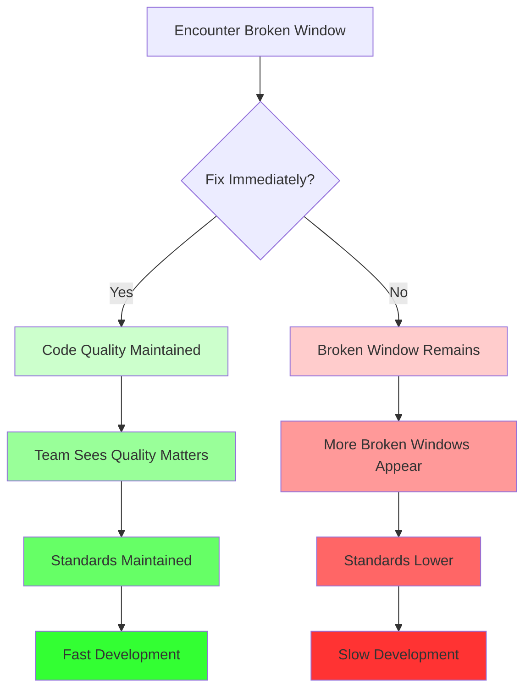

# Introduction to the Broken Window Principle

Welcome to the **Broken Window Principle**! This principle addresses a critical aspect of code quality and team culture: the importance of fixing problems immediately, even small ones.

## What is the Broken Window Principle?

The **Broken Window Principle** states that **visible signs of disorder encourage further disorder**. In software development, this means that small problems left unfixed will lead to more serious problems over time.

## The Origin: Broken Windows Theory

The principle originates from criminology research, introduced by **James Q. Wilson and George Kelling in 1982**. The theory was later popularized in software engineering by **Andrew Hunt and Dave Thomas** in their classic book *The Pragmatic Programmer*.

### The Sociology

**The Original Theory:**
If a building has one broken window that is left unrepaired for a substantial amount of time, people walking by will conclude that no one cares and no one is in charge. Soon, more windows will be broken. Eventually, the building becomes a site for graffiti, litter, and serious structural damage.

**The Software Engineering Translation:**
**Bad code attracts more bad code.**

The same psychology applies to codebases:
- If you leave a small code smell, developers will add more code smells
- If you leave a TODO comment, more TODOs will accumulate
- If you allow one violation of coding standards, more violations will follow
- If you don't fix small bugs, the codebase will degrade

If you are working on a project and you see a class that is messy, has poor variable names, or lacks tests (a "broken window"), your psychological inhibition against making it worse disappears.

You think: *"This file is already a dumpster fire. Adding one more hacky `if-statement` won't make a difference."*

## The Core Philosophy

**Fix problems immediately, even small ones.**

The Broken Window Principle emphasizes that maintaining code quality requires constant vigilance. Every small problem that goes unfixed is a signal that quality doesn't matter, which encourages more problems.

## Why It Matters

In software development, the Broken Window Principle is crucial because:

1. **Technical Debt Accumulates** - Small problems compound into major issues
2. **Team Culture** - What you tolerate becomes the standard
3. **Maintainability** - Code quality directly impacts how easy it is to work with
4. **Velocity** - Clean code is faster to work with than messy code

## The Visual Metaphor

Imagine a pristine codebase as a well-maintained building:
- Clean, organized, and inviting
- Everyone respects the space
- Problems are fixed immediately

Now imagine a codebase with "broken windows":
- Code smells left unfixed
- TODO comments accumulating
- Inconsistent formatting
- Small bugs ignored

Just like a building with broken windows, the codebase will continue to deteriorate unless someone takes action to fix the problems.

## Connection to Other Principles

The Broken Window Principle works hand-in-hand with:
- **SOLID Principles** - Following SOLID prevents "broken windows" from appearing
- **FLUID Anti-Patterns** - The Broken Window Principle explains **why** developers slide from SOLID into FLUID. When broken windows are left unfixed, teams gradually abandon SOLID principles and adopt FLUID practices (Fused Responsibilities, Limitless Modification, Unreliable Subtypes, Inflated Interfaces, Direct Dependencies)
- **Code Reviews** - Catching and fixing problems early
- **Refactoring** - Continuously improving code quality
- **Team Standards** - Establishing and maintaining coding standards

## Summary

The Broken Window Principle teaches us that:
- **Small problems matter** - They signal that quality isn't important
- **Fix immediately** - Don't let problems accumulate
- **Maintain standards** - Consistency prevents deterioration
- **Culture matters** - What you tolerate becomes the norm

In the following sections, we'll explore the principle in detail, understand what happens when broken windows are ignored, and learn how to fix them and prevent new ones.


---

# The Broken Window Principle

The **Broken Window Principle** provides a clear rule for maintaining code quality and preventing technical debt from accumulating.

## The Rule

> **Fix problems immediately, even small ones. Never leave visible signs of disorder in your codebase.**

If you see a problem - whether it's a code smell, a TODO comment, a small bug, or a violation of coding standards - fix it right away. Don't let it accumulate.

## The Core Concept

**Visible signs of disorder encourage further disorder.**

When developers see problems in the codebase that aren't being fixed, they learn that:
- Quality isn't a priority
- It's acceptable to cut corners
- No one will notice or care about small issues
- Standards are flexible or optional

This creates a culture where more problems are introduced, and the codebase gradually deteriorates.

## What Counts as a "Broken Window"?

A "broken window" in code is any visible sign of disorder or neglect:

### Code Quality Issues
- **Code smells** - Long methods, deep nesting, magic numbers
- **Duplicated code** - Copy-paste code that should be extracted
- **Dead code** - Unused methods, commented-out code
- **Poor naming** - Vague variable names like `data`, `info`, `temp`, or misleading method names
- **Commented-out code** - Blocks of old code left "just in case"
- **God Classes** - A 3,000-line class tells the developer, "We don't care about the Single Responsibility Principle here"

### Technical Debt Markers
- **TODO comments** - Left in the code without resolution
- **FIXME comments** - Known issues that aren't addressed
- **HACK comments** - Temporary solutions that become permanent
- **XXX comments** - Code that needs attention

### Standards Violations
- **Inconsistent formatting** - Mixed indentation, spacing
- **Inconsistent naming** - camelCase vs snake_case
- **Missing documentation** - Public methods without comments
- **Incomplete implementations** - Methods that throw "NotImplementedException"
- **Compiler warnings** - Ignoring the yellow warning triangles because "the code still runs"
- **No tests** - A lack of unit tests signals that correctness isn't valued

### Small Bugs
- **Minor bugs** - Edge cases not handled
- **Incomplete error handling** - Missing try-catch blocks
- **Incomplete tests** - Tests that are skipped or incomplete


## When to Apply the Principle

Apply the Broken Window Principle:

- **During development** - Fix problems as you encounter them
- **During code review** - Don't approve code with broken windows
- **During refactoring** - Fix related problems you discover
- **During bug fixes** - Fix the root cause, not just the symptom

## The Balance

The principle doesn't mean you should:
- Refactor everything you touch (that's a different principle)
- Stop feature development to fix every minor issue
- Perfectionism that prevents progress

It means you should:
- Fix problems you encounter in the code you're working on
- Not introduce new broken windows
- Not ignore obvious problems
- Maintain a baseline of code quality

## Summary

The Broken Window Principle states:
- **Fix problems immediately** - Don't let them accumulate
- **Visible disorder encourages more disorder** - Small problems lead to big problems
- **Maintain standards** - What you tolerate becomes the norm
- **Culture matters** - Team behavior follows what's accepted

By following this principle, you maintain code quality and prevent technical debt from accumulating.


---

# The Problem: What Happens When Broken Windows Are Ignored

When broken windows are left unfixed, they create a cascade of problems that gradually degrade code quality and team culture.

## The Cascade Effect

One broken window leads to another, which leads to another, creating a downward spiral:

```
Broken Window #1 (ignored)
    ↓
Broken Window #2 (seems acceptable now)
    ↓
Broken Window #3 (no one cares anymore)
    ↓
Broken Window #4, #5, #6... (the norm)
    ↓
Codebase in disarray
```

## Problem 1: Technical Debt Accumulation

When broken windows are ignored, technical debt accumulates rapidly:

### Example: TODO Comments

```java
// Week 1: First broken window
public class UserService {
    public void createUser(User user) {
        // TODO: Add validation
        saveUser(user);
    }
}

// Week 2: More TODOs appear
public class OrderService {
    public void createOrder(Order order) {
        // TODO: Add validation
        // TODO: Check inventory
        saveOrder(order);
    }
}

// Week 3: TODOs everywhere
public class PaymentService {
    public void processPayment(Payment payment) {
        // TODO: Add validation
        // TODO: Check balance
        // TODO: Handle errors
        // TODO: Log transaction
        savePayment(payment);
    }
}
```

**Result:** The codebase becomes filled with incomplete implementations and deferred work. No one knows which TODOs are important or which are outdated.

## Problem 2: Lowered Standards

When broken windows are tolerated, standards gradually lower:

### Example: Code Smells

```java
// Month 1: One long method (200 lines)
public void processOrder() {
    // 200 lines of code
}

// Month 2: More long methods appear
public void processPayment() {
    // 250 lines of code
}

public void generateReport() {
    // 300 lines of code
}

// Month 3: Long methods are now "normal"
// No one questions them anymore
```

**Result:** What was once considered a problem becomes acceptable. The team's quality bar has been lowered.

## Problem 3: Team Culture Degradation

Broken windows signal that quality doesn't matter:

### The Message Broken Windows Send

- "It's okay to cut corners"
- "No one will notice"
- "Standards are flexible"
- "We don't have time for quality"

### Example: Inconsistent Formatting

```java
// Developer A's code (inconsistent)
public class UserService{
public void createUser(User user){
if(user==null)return;
saveUser(user);
}
}

// Developer B sees this and follows suit
public class OrderService{
public void createOrder(Order order){
if(order==null)return;
saveOrder(order);
}
}

// Now the entire codebase is inconsistent
```

**Result:** Team members stop caring about consistency because they see it's not enforced.

## Problem 4: Increased Maintenance Cost

Broken windows make the codebase harder to work with:

### Example: Dead Code

```java
public class UserService {
    // Old method - no longer used
    public void oldCreateUser(User user) {
        // 50 lines of legacy code
    }
    
    // New method
    public void createUser(User user) {
        // Current implementation
    }
    
    // Another old method
    public void deprecatedValidate(User user) {
        // 30 lines of old validation logic
    }
}
```

**Problems:**
- Developers waste time reading unused code
- Confusion about which method to use
- Increased cognitive load
- Harder to understand the codebase

## Problem 5: Bugs Multiply

Small bugs left unfixed lead to more bugs:

### Example: Missing Error Handling

```java
// Bug #1: Missing null check (ignored)
public void processOrder(Order order) {
    order.getCustomer().getName();  // NullPointerException if customer is null
}

// Bug #2: Similar pattern appears
public void processPayment(Payment payment) {
    payment.getAccount().getBalance();  // Same issue
}

// Bug #3: Pattern spreads
public void generateInvoice(Invoice invoice) {
    invoice.getCustomer().getAddress();  // Same issue
}
```

**Result:** The same bug pattern appears throughout the codebase because no one fixed the first instance.

## Problem 6: Onboarding Becomes Difficult

New team members struggle with a codebase full of broken windows:

### What New Developers See

- Inconsistent code style
- Unclear naming conventions
- TODO comments everywhere
- Dead code mixed with active code
- No clear patterns or standards

### The Impact

- Slower onboarding
- More questions and confusion
- Lower confidence in the codebase
- Difficulty understanding what's important

## Problem 7: Velocity Decreases

As broken windows accumulate, development slows down:

### Why Velocity Decreases

1. **Harder to find code** - Inconsistent structure makes navigation difficult
2. **More bugs to fix** - Accumulated technical debt causes issues
3. **More confusion** - Unclear code requires more time to understand
4. **More refactoring needed** - Code becomes harder to modify safely

### Example: Feature Development

```java
// Adding a new feature requires:
// 1. Understanding inconsistent code patterns
// 2. Working around dead code
// 3. Dealing with missing error handling
// 4. Figuring out which methods are actually used
// 5. Navigating TODO comments

// What should take 2 hours takes 4 hours
```

## The "Slippery Slope" to FLUID

The Broken Windows Theory explains the **psychological drift** toward the FLUID anti-patterns. It shows how teams gradually abandon SOLID principles when broken windows are left unfixed.

### The Progression: From SOLID to FLUID

Here's how a clean codebase can deteriorate into FLUID practices:

#### Step 1: Start with SOLID

```java
// Clean, SOLID code
public class User {
    private String name;
    private String email;
    
    public User(String name, String email) {
        this.name = name;
        this.email = email;
    }
    
    // Single Responsibility: Just holds user data
    public String getName() { return name; }
    public String getEmail() { return email; }
}
```

#### Step 2: The First Rock (Broken Window)

A developer is in a rush and hardcodes a database connection inside `User` instead of injecting it:

```java
// Broken Window #1: Violating Dependency Inversion (D)
public class User {
    private String name;
    private String email;
    private MySQLDatabase database;  // Direct dependency!
    
    public User(String name, String email) {
        this.name = name;
        this.email = email;
        this.database = new MySQLDatabase();  // Hardcoded!
    }
    
    public void save() {
        database.save(this);  // Direct database access
    }
}
```

**The Neglect:** The team sees this in the code review but says, *"We'll fix it later."* They don't fix it.

#### Step 3: The Result

The next developer needs to add validation. They see the database code inside `User` and think, *"Oh, we put logic in this class."* So they add validation logic there too:

```java
// Broken Window #2: Violating Single Responsibility (S)
public class User {
    private String name;
    private String email;
    private MySQLDatabase database;
    
    public User(String name, String email) {
        this.name = name;
        this.email = email;
        this.database = new MySQLDatabase();
    }
    
    public void save() {
        validate();  // Validation logic added here
        database.save(this);
    }
    
    private void validate() {
        if (name == null || name.isEmpty()) {
            throw new IllegalArgumentException("Name required");
        }
        if (email == null || !email.contains("@")) {
            throw new IllegalArgumentException("Invalid email");
        }
    }
}
```

**The Problem:** Now `User` has multiple responsibilities (data storage, persistence, validation).

#### Step 4: The Collapse

Six months later, the `User` class is a 5,000-line **Fused Responsibility** monster:

```java
// The Collapse: Full FLUID violation
public class User {
    // Fused Responsibilities (F) - Does everything
    // Limitless Modification (L) - Constantly modified
    // Unreliable Subtypes (U) - Methods throw exceptions
    // Inflated Interfaces (I) - Too many methods
    // Direct Dependencies (D) - Hardcoded dependencies
    
    private MySQLDatabase database;
    private GmailEmailService emailService;
    private FileLogger logger;
    private RedisCache cache;
    // ... 50 more dependencies
    
    // 5,000 lines of mixed concerns:
    // - Data storage
    // - Validation
    // - Persistence
    // - Email sending
    // - Logging
    // - Caching
    // - Business logic
    // - Reporting
    // - ... everything
}
```

### Why This Happens

The Broken Window Principle explains this progression:

1. **First broken window** - A small violation is tolerated
2. **Psychological inhibition removed** - Developers see it's okay to cut corners
3. **More violations** - Each new violation seems acceptable
4. **Standards degrade** - What was once unacceptable becomes normal
5. **Full FLUID** - The codebase becomes a mess

### The Connection to FLUID

Each broken window that's left unfixed makes it easier to violate SOLID principles:

- **Fused Responsibilities (F)** - When you see mixed concerns, you add more
- **Limitless Modification (L)** - When you see direct changes, you make more
- **Unreliable Subtypes (U)** - When you see exceptions, you add more
- **Inflated Interfaces (I)** - When you see fat interfaces, you add more methods
- **Direct Dependencies (D)** - When you see hardcoded dependencies, you add more

**The key insight:** Broken windows don't just accumulate - they actively encourage the adoption of FLUID anti-patterns.

## The Tipping Point

There's a tipping point where the codebase becomes so degraded that:
- **Fixing problems becomes risky** - Changes might break things
- **Refactoring is too expensive** - Too much technical debt
- **Team morale suffers** - Developers dread working on the code
- **Velocity grinds to a halt** - Everything takes too long


## Summary

When broken windows are ignored:

- **Technical debt accumulates** - Problems multiply
- **Standards lower** - What's acceptable degrades
- **Culture suffers** - Team stops caring about quality
- **Maintenance costs increase** - Code becomes harder to work with
- **Bugs multiply** - Patterns of problems spread
- **Onboarding becomes difficult** - New developers struggle
- **Velocity decreases** - Development slows down

The key insight: **Small problems don't stay small**. They grow and multiply, creating a downward spiral that's hard to reverse.


---

# The Solution: Fixing Broken Windows

The solution to the Broken Window Principle is straightforward: **fix problems immediately and prevent new ones from appearing**.

## The Core Strategy

1. **Fix problems as you encounter them**
2. **Don't introduce new broken windows**
3. **Establish and maintain standards**
4. **Create a culture of quality**

## Strategy 1: Fix Problems Immediately

When you encounter a broken window, fix it right away:

### During Development

```java
// You're working on a feature and see this:
public void processOrder(Order order) {
    if (order.getTotal() > 1000) {  // Magic number!
        applyDiscount(order);
    }
}

// Fix it immediately:
public void processOrder(Order order) {
    private static final double DISCOUNT_THRESHOLD = 1000.0;
    
    if (order.getTotal() > DISCOUNT_THRESHOLD) {
        applyDiscount(order);
    }
}
```

**Rule:** If you touch code with a broken window, fix it.

### During Code Review

```java
// Code being reviewed has a TODO:
public void createUser(User user) {
    // TODO: Add validation
    saveUser(user);
}

// Don't approve it. Request a fix:
// "Please add validation before approving. Let's not leave TODOs in the code."
```

**Rule:** Don't approve code with broken windows.

### During Refactoring

```java
// You're refactoring and discover dead code:
public class UserService {
    public void oldCreateUser(User user) {  // Never called
        // 50 lines of code
    }
    
    public void createUser(User user) {
        // Current implementation
    }
}

// Remove the dead code:
public class UserService {
    public void createUser(User user) {
        // Current implementation
    }
}
```

**Rule:** Clean up related problems you discover.

## Strategy 2: Don't Introduce New Broken Windows

Be disciplined about not creating new problems:

### Write Clean Code from the Start

```java
// Good: Clean code
public class OrderProcessor {
    private static final double DISCOUNT_THRESHOLD = 1000.0;
    
    public void processOrder(Order order) {
        if (order.getTotal() > DISCOUNT_THRESHOLD) {
            applyDiscount(order);
        }
        saveOrder(order);
    }
}

// Bad: Creating a broken window
public class OrderProcessor {
    public void processOrder(Order order) {
        if (order.getTotal() > 1000) {  // Magic number - broken window!
            applyDiscount(order);
        }
        saveOrder(order);
    }
}
```

### Complete Your Work

```java
// Bad: Leaving TODOs
public void createUser(User user) {
    // TODO: Add validation
    saveUser(user);
}

// Good: Complete implementation
public void createUser(User user) {
    validateUser(user);
    saveUser(user);
}

private void validateUser(User user) {
    if (user == null) {
        throw new IllegalArgumentException("User cannot be null");
    }
    if (user.getEmail() == null || user.getEmail().isEmpty()) {
        throw new IllegalArgumentException("User email is required");
    }
}
```

## Strategy 3: Establish and Maintain Standards

Create clear standards and enforce them:

### Coding Standards

Define and document:
- **Naming conventions** - camelCase, PascalCase, etc.
- **Formatting rules** - Indentation, spacing, line length
- **Code structure** - Method length, class organization
- **Documentation** - When and how to document code

### Tools to Enforce Standards

- **Linters** - Automatically catch style violations
- **Formatters** - Automatically format code consistently
- **Pre-commit hooks** - Prevent committing code that violates standards
- **CI/CD checks** - Fail builds if standards aren't met

### Example: Using a Linter

```java
// Linter catches this:
public void processOrder(Order order) {
    if (order.getTotal() > 1000) {  // Warning: Magic number
        applyDiscount(order);
    }
}

// Developer fixes it:
public void processOrder(Order order) {
    private static final double DISCOUNT_THRESHOLD = 1000.0;
    
    if (order.getTotal() > DISCOUNT_THRESHOLD) {
        applyDiscount(order);
    }
}
```

## Strategy 4: Create a Culture of Quality

Build a team culture that values quality:

### Lead by Example

- Fix broken windows you encounter
- Write clean code
- Don't approve code with problems
- Take time to do things right

### Encourage Others

- Praise clean code in code reviews
- Thank teammates for fixing problems
- Share knowledge about best practices
- Make quality a team value

### Make It Easy

- Provide tools and automation
- Create clear guidelines
- Offer training and resources
- Remove barriers to quality

## Strategy 5: Regular Maintenance

Schedule time for maintenance:

### Code Cleanup Sessions

Dedicate time to:
- Removing dead code
- Fixing code smells
- Resolving TODOs
- Improving documentation

### Refactoring Sprints

Periodically:
- Refactor problematic areas
- Improve code structure
- Update dependencies
- Modernize code patterns

## The "Boy Scout Rule": The Antidote

The solution to the Broken Windows Theory is often cited as the **Boy Scout Rule**, popularized in *The Pragmatic Programmer*:

> **"Always leave the code better than you found it."**

This rule is the antidote to the psychological drift toward FLUID. By fixing small problems immediately, you signal to the rest of the team: **"We care about quality here."** This stops the entropy and prevents the FLUID principles from taking over.

### The Rule in Practice

Every time you work on code:
- **Fix at least one problem** you encounter (a bad variable name, a magic number, a TODO)
- **Improve at least one thing** (extract a method, add a constant, improve naming)
- **Don't make it worse** (don't add new broken windows)

### Examples of Applying the Rule

#### Example 1: Fixing a TODO

```java
// You're adding a new feature to this class:
public class UserService {
    public void createUser(User user) {
        // TODO: Add validation  // Broken window!
        saveUser(user);
    }
}

// Apply the Boy Scout Rule:
public class UserService {
    public void createUser(User user) {
        validateUser(user);  // Fixed the broken window!
        saveUser(user);
    }
    
    private void validateUser(User user) {
        if (user == null) {
            throw new IllegalArgumentException("User cannot be null");
        }
    }
}
```

#### Example 2: Fixing Bad Naming

```java
// You encounter this while working on a feature:
public class OrderProcessor {
    public void process(Order data) {  // 'data' is a broken window!
        // Process order
    }
}

// Apply the Boy Scout Rule:
public class OrderProcessor {
    public void process(Order order) {  // Fixed the naming!
        // Process order
    }
}
```

#### Example 3: Fixing a Compiler Warning

```java
// You see a compiler warning:
public class UserService {
    public void createUser(User user) {
        String name = user.getName();  // Warning: unused variable
        saveUser(user);
    }
}

// Apply the Boy Scout Rule:
public class UserService {
    public void createUser(User user) {
        // Removed unused variable - fixed the warning!
        saveUser(user);
    }
}
```

### How the Boy Scout Rule Prevents FLUID

By fixing broken windows immediately, you prevent the slide into FLUID:

- **Prevents Fused Responsibilities (F)** - Fixing mixed concerns early keeps classes focused
- **Prevents Limitless Modification (L)** - Fixing direct changes encourages proper extension
- **Prevents Unreliable Subtypes (U)** - Fixing exception-throwing methods maintains contracts
- **Prevents Inflated Interfaces (I)** - Fixing fat interfaces keeps them focused
- **Prevents Direct Dependencies (D)** - Fixing hardcoded dependencies encourages injection

**The key:** Each small fix reinforces SOLID principles and prevents FLUID from taking hold.

## Balancing Act

The principle doesn't mean:

- **Perfectionism** - Don't refactor everything you touch
- **Feature freeze** - Don't stop development for cleanup
- **Analysis paralysis** - Don't overthink every decision

It means:

- **Fix what you see** - Address problems in code you're working on
- **Don't add problems** - Write clean code from the start
- **Maintain standards** - Keep the codebase consistent
- **Be practical** - Balance quality with delivery

## Visualizing the Solution



## Summary

To fix broken windows:

1. **Fix problems immediately** - Don't let them accumulate
2. **Don't introduce new problems** - Write clean code from the start
3. **Establish standards** - Create and enforce coding standards
4. **Build quality culture** - Make quality a team value
5. **Regular maintenance** - Schedule time for cleanup
6. **Follow the Boy Scout Rule** - Leave code better than you found it

By following these strategies, you maintain code quality and prevent the downward spiral of technical debt.

