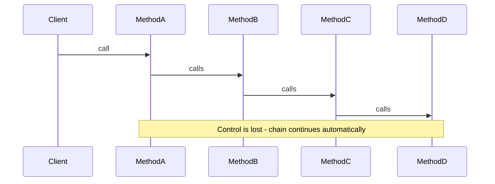
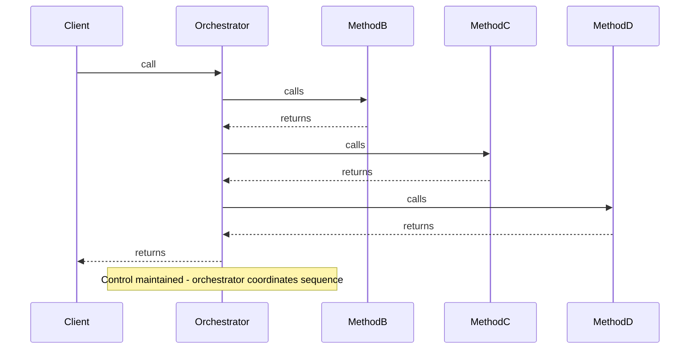

# Introduction to the Orchestrator Principle

Welcome to the "Orchestrator" design principle! This principle addresses a common pitfall that occurs when refactoring code - trading one problem for another.

**Other names**\
I am not sure this principle has a formal name, or maybe there are many. Alternatives you might encounter are:
* **Orchestrator**
* **Conductor**
* **Coordinator**
* **Table of Contents**
* **Flow Coordinator**

## What is the "Orchestrator" Principle?

The **"Orchestrator"** principle states that a high-level method should be an **Orchestrator** (coordinator) of method calls, not a link in a chain of method calls. It should orchestrate operations like a conductor orchestrates an orchestra - showing the flow of logic at the surface while delegating details to helper methods. Or a high-level overview of the algorithm.

## The Problem: Trading Mountains for Rabbit Holes

When developers break up a "Mountain" method (deeply nested code), they often just slice it horizontally. The result is that `Method A` calls `Method B`, which calls `Method C`, which calls `Method D`. 

To understand what `Method A` ultimately achieves, you have to jump down four levels of method calls. You've traded a mountain for a deep, dark cave - a **"Rabbit Hole"**.

I called this "the swim" in the _Mountains and Islands_ learning path. You start on Island 1, and swim to Island 2, and so on, until you reach the end.

## The Core Philosophy

**Orchestration over Chaining.**

A high-level method should coordinate operations like a conductor coordinates an orchestra. It keeps the flow of logic at the surface (the top level method), delegating details to helper methods but retaining control of the sequence.

## Visual Metaphors

### Chaining (Bad): Falling Dominoes

When methods chain together, it's like a line of falling dominoes:



You push the first one (call Method A), and you lose control until the last one falls. You can't see what will happen until you follow the entire chain.

### Orchestration (Good): The Orchestrator

When methods are orchestrated, it's like an orchestrator (conductor) in front of an orchestra:



The orchestrator points to the violins, then the brass, then the percussion. The violins do not tell the brass when to play. The orchestrator maintains control and visibility of the entire sequence.

## Connection to Mountains and Islands

This principle works hand-in-hand with the "Make Islands, Not Mountains" principle:

- **Mountains** = Deep nesting (vertical complexity)
- **Chains** = Deep call stacks (horizontal complexity)
- **Islands** = Flat methods (low altitude)
- **Orchestration** = Shallow call stacks (helicopter view)

If we use the topographical map analogy from Mountains and Islands:

- **Chaining** is "Island Hopping" - You swim to Island A, find a map telling you to swim to Island B, then to Island C. You can't see the destination from the start.
- **Orchestration** is a **Helicopter View** - You hover above the archipelago, dip down to Island A to pick up a package, fly back up, dip down to Island B to drop it off. You always return to the "Sky" (the Orchestrator) between tasks.

## Why This Matters

Chaining methods creates several problems:

- **Hidden Flow** - You can't see the full sequence without following the chain
- **Temporal Coupling** - Methods depend on being called in a specific order
- **Hard to Test** - You can't test one method without triggering the entire chain
- **Hidden Side Effects** - A method that looks innocent might trigger database saves or emails
- **Loss of Control** - Once you call the first method, you lose control of what happens next

## The Goal

By the end of this learning path, you'll be able to:

- Recognize "chaining" code (the rabbit hole)
- Transform chains into orchestrated code (orchestrator pattern)
- Write high-level methods that coordinate operations
- Maintain control and visibility of the flow
- Write code that's easier to test and understand


---

# The Principle

Let's dive deeper into what the "Orchestrator" principle means and how to apply it.

## The Rule

**A high-level method should be a Coordinator, not a link in a chain.**

This means the high-level method should orchestrate the flow of operations, showing all steps at the surface level, rather than being just one link in a chain of method calls.

## What is Orchestration vs Chaining?

### Chaining (Bad)

Methods call each other in sequence, passing control down the chain:

```java
public void processOrder(Order order) {
    validate(order);  // Calls next method, loses control
}

private void validate(Order order) {
    if (order.isValid()) {
        save(order);  // Calls next method, loses control
    }
}

private void save(Order order) {
    db.insert(order);
    sendEmail(order);  // Hidden side effect!
}
```

**Problem:** To understand what `processOrder` does, you must follow the entire chain. Control is lost once the first method is called.

### Orchestration (Good)

A high-level method coordinates all operations, maintaining control:

```java
public void processOrder(Order order) {
    // Step 1: Validation
    boolean isValid = validate(order);
    if (!isValid) return;
    
    // Step 2: Persistence
    Order savedOrder = save(order);
    
    // Step 3: Notification
    sendConfirmationEmail(savedOrder);
}

// Helpers are "leaf nodes" - do one thing and return
private boolean validate(Order order) {
    return order.isValid();
}

private Order save(Order order) {
    return db.insert(order);
}

private void sendConfirmationEmail(Order order) {
    emailService.send(order);
}
```

**Solution:** You can read `processOrder` and understand the entire business logic without looking at helper definitions. Control is maintained at the top level.

## The Orchestrator Metaphor

An orchestrator (conductor) in an orchestra:
- Coordinates when different sections play
- Maintains control of the tempo and sequence
- Doesn't play the instruments themselves
- Can see and control the entire performance

Similarly, an orchestrating method:
- Coordinates when different operations happen
- Maintains control of the sequence
- Doesn't do the low-level work itself
- Can see and control the entire flow

**Slogan:** *Don't let the violin tell the drums when to start.*


## Relationship to Single Responsibility Principle

The Orchestrator principle aligns with SRP:

- **Orchestrator** = Coordinates the sequence (one responsibility)
- **Helper methods** = Do one specific task (one responsibility each)

Each method has a clear, single purpose.

## When to Use Orchestration

Use orchestration when:
- You have a sequence of operations
- The order matters
- You want visibility of the full flow
- You need to make decisions between steps
- You want to test steps independently


## Key Characteristics

### Orchestrated Code Has:
- **Visible flow** - All steps visible at top level
- **Control at surface** - Orchestrator decides what happens next
- **Shallow stacks** - Return to orchestrator after each operation
- **Testable steps** - Each helper can be tested independently
- **No hidden side effects** - Side effects are explicit in orchestrator

### Chained Code Has:
- **Hidden flow** - Must follow chain to see what happens
- **Loss of control** - Once started, can't control the sequence
- **Deep stacks** - Each method calls the next
- **Hard to test** - Can't test one method without triggering chain
- **Hidden side effects** - Side effects buried in the chain

## Summary

- **Rule:** High-level method should be a Coordinator, not a link in a chain
- **Orchestration:** Coordinator maintains control and visibility
- **Chaining:** Methods pass control down, losing visibility
- **Metaphors:** Orchestrator, Conductor, Table of Contents, Hub-and-Spoke
- **Goal:** Shallow stacks, visible flow, maintainable control

Next, we'll examine what chaining looks like in practice and the problems it causes.


---

# Chaining - The Rabbit Hole

Let's examine what "chaining" looks like in code and understand why it creates a "Rabbit Hole" problem.


## Example: The Rabbit Hole

Here's a common example of chaining:

```java
// ❌ THE CHAIN (Bad)
// You have to dig 3 layers deep to know what happens.

public void processOrder(Order order) {
    validate(order);  // Looks innocent...
}

private void validate(Order order) {
    if (order.isValid()) {
        save(order);  // Wait, validation saves?
    }
}

private void save(Order order) {
    db.insert(order);
    sendEmail(order);  // Wait, saving sends emails?
}

private void sendEmail(Order order) {
    emailService.sendConfirmation(order);
}
```

## The Problem: Hidden Flow

When you read `processOrder()`, it looks simple:
- "Oh, it just validates the order."

But to understand what actually happens, you must:
1. Look at `validate()` - "It validates and then saves?"
2. Look at `save()` - "It saves and then sends an email?"
3. Look at `sendEmail()` - "Finally, the actual email sending"

You've fallen down a rabbit hole - three levels deep just to understand what `processOrder()` does!

## Problems Caused by Chaining

### 1. Hidden Temporal Coupling

**Temporal coupling** means methods depend on being called in a specific order, but this dependency is hidden in the chain.

In the example above:
- `validate()` must be called before `save()`
- `save()` must be called before `sendEmail()`
- But this dependency is hidden - `processOrder()` doesn't show it

If someone refactors and changes the chain, the order might break.

### 2. Hard to Test in Isolation

You cannot test `validate()` without triggering the entire chain:

```java
@Test
public void testValidate() {
    Order order = new Order();
    processor.validate(order);  // This also saves and sends email!
    // How do you test just validation?
}
```

You can't test validation without:
- Setting up a database
- Setting up an email service
- Dealing with side effects

### 3. Hidden Side Effects 

A method that looks innocent might trigger unexpected side effects:

```java
public void validate(Order order) {
    if (order.isValid()) {
        save(order);  // Hidden: This also sends an email!
    }
}
```

From the name `validate()`, you'd expect it to only validate. But it also saves and sends emails!

### 4. Loss of Control

Once you call the first method, you lose control:

```java
public void processOrder(Order order) {
    validate(order);  // Control is lost here
    // Can't stop the chain
    // Can't skip steps
    // Can't handle errors between steps
}
```

You can't:
- Stop after validation if you want
- Skip saving if needed
- Handle errors between steps
- See what's happening at each step

### 5. Deep Call Stacks

Chaining creates deep call stacks:

```
processOrder()        (Level 0)
  → validate()        (Level 1)
    → save()          (Level 2)
      → sendEmail()   (Level 3)
```

This makes debugging harder - you must navigate through multiple stack frames.

### 6. Hard to Understand the Full Flow

To understand the complete operation, you must:
- Read `processOrder()`
- Follow to `validate()`
- Follow to `save()`
- Follow to `sendEmail()`
- Remember all the steps
- Understand how they connect

This is mentally exhausting!

## Summary

Chaining is characterized by:
- **Method calls method calls method** - Deep call chains
- **Hidden flow** - Must follow chain to see what happens
- **Temporal coupling** - Order dependencies are hidden
- **Hard to test** - Can't test in isolation
- **Hidden side effects** - Methods do more than expected
- **Loss of control** - Can't control the sequence

The deeper the chain, the deeper the rabbit hole, and the harder it is to understand and maintain the code. Next, we'll learn how to transform chains into orchestrated code.


---

# Orchestration - The Orchestrator

Now let's learn how to transform chains into orchestrated code - code that orchestrates operations like an orchestrator coordinates an orchestra.

## What is Orchestration?

**Orchestration** occurs when a high-level method coordinates operations, showing all steps at the surface level while delegating details to helper methods.

The orchestrator maintains control and visibility of the entire sequence.

## Example: The Orchestrator

Here's the same operation, but orchestrated:

```java
// ✅ THE ORCHESTRATOR (Good)
// Reads like a story. All steps are visible at the top level.

public void processOrder(Order order) {
    // Step 1: Validation
    boolean isValid = validate(order);
    if (!isValid) return;
    
    // Step 2: Persistence
    Order savedOrder = save(order);
    
    // Step 3: Notification
    sendConfirmationEmail(savedOrder);
}

// Helpers are now "Leaf Nodes" - they do one thing and return.
private boolean validate(Order order) {
    return order.isValid();
}

private Order save(Order order) {
    return db.insert(order);
}

private void sendConfirmationEmail(Order order) {
    emailService.send(order);
}
```

## The Orchestrator Structure

When you read `processOrder()`, it's like watching an orchestrator coordinate an orchestra:

1. **Validation** - Check if order is valid (orchestrator points to violins)
2. **Persistence** - Save the order (orchestrator points to brass)
3. **Notification** - Send confirmation email (orchestrator points to percussion)

You can see the entire flow without looking at the helper methods. The helpers contain the details, but the orchestrator shows the structure and sequence.

## Techniques for Orchestration

### 1. High-Level Method Coordinates the Flow

The orchestrator method shows all steps in sequence:

```java
public void processOrder(Order order) {
    // Step 1
    boolean isValid = validate(order);
    if (!isValid) return;
    
    // Step 2
    Order saved = save(order);
    
    // Step 3
    sendEmail(saved);
}
```

All steps are visible at the top level.

### 2. Helper Methods Are "Leaf Nodes"

Helper methods do one thing and return. They do not call further helper methods (ideally):

```java
private boolean validate(Order order) {
    return order.isValid();  // One thing: validate
}

private Order save(Order order) {
    return db.insert(order);  // One thing: save
}

private void sendEmail(Order order) {
    emailService.send(order);  // One thing: send email
}
```

### 3. Return to Orchestrator After Each Operation

After each helper completes, control returns to the orchestrator:

```java
public void processOrder(Order order) {
    boolean isValid = validate(order);  // Call helper
    // Return to orchestrator
    if (!isValid) return;
    
    Order saved = save(order);  // Call helper
    // Return to orchestrator
    
    sendEmail(saved);  // Call helper
    // Return to orchestrator
}
```

The orchestrator decides what happens next after each step.

### 4. Keep Control at the Surface

The orchestrator maintains control:

```java
public void processOrder(Order order) {
    boolean isValid = validate(order);
    if (!isValid) return;  // Orchestrator decides to stop
    
    Order saved = save(order);
    // Orchestrator could add more logic here if needed
    
    sendEmail(saved);
    // Orchestrator controls the sequence
}
```

You can:
- Stop after any step
- Add logic between steps
- Handle errors between steps
- See what's happening at each step

### 5. Minimize use of global state

To simplify the code, and make it easier to understand, you should minimize the use of global state. That means you should avoid using static variables, or variables that are shared between multiple methods, e.g. instance field variables.

Your helper method should receive, as parameters, the data it needs to operate on. And then return a result. 

Even if your helper method needs to read a field variable, it should receive it as a parameter, and not read it directly from the field variable. For example:

```java
private int someField;

public String orchestrator() {
    String result = someHelper(someField); // passing in the field variable
    return result;
}

private String someHelper(int theNumber) {
    return "The number is " + theNumber;
}
```

Things are getting a little advanced here, but you can now, without problems, make the `someHelper()` method, and static, and you can test this method in isolation. Maybe whatever it is doing, is slightly more complex, than just returning a concatenated string.


## Benefits of Orchestration

### 1. Easy to Understand the Full Flow

You can read the orchestrator and see the entire operation:

```java
public void processOrder(Order order) {
    validate(order);
    save(order);
    sendEmail(order);
}
```

No need to read multiple methods - the flow is visible at the top level.

### 2. Easy to Test Each Step

Each helper can be tested independently:

```java
@Test
public void testValidate() {
    Order order = new Order();
    boolean result = processor.validate(order);  // Test just validation
    assertTrue(result);
}

@Test
public void testSave() {
    Order order = new Order();
    Order saved = processor.save(order);  // Test just saving
    assertNotNull(saved);
}
```

No need to set up the entire chain - test each step in isolation.

### 3. No Hidden Side Effects

Side effects are explicit in the orchestrator:

```java
public void processOrder(Order order) {
    validate(order);      // Just validation
    save(order);          // Just saving
    sendEmail(order);     // Just sending email - explicit!
}
```

You can see exactly what happens - no surprises.

### 4. Maintains Control

The orchestrator maintains control of the sequence:

```java
public void processOrder(Order order) {
    boolean isValid = validate(order);
    if (!isValid) {
        logInvalidOrder(order);  // Can add logic between steps
        return;
    }
    
    Order saved = save(order);
    if (saved == null) {
        handleSaveError(order);  // Can handle errors
        return;
    }
    
    sendEmail(saved);
}
```

You can add logic, handle errors, and make decisions between steps.

### 5. Shallow Call Stacks

Orchestration creates shallow call stacks:

```
processOrder()        (Level 0)
  → validate()        (Level 1) → return
  → save()            (Level 1) → return
  → sendEmail()        (Level 1) → return
```

Each helper returns to the orchestrator, keeping the stack shallow.


**Benefits:**
- `handleUserRegistration()` shows all 4 steps clearly
- Each helper does exactly what its name says
- Can test each step independently
- Can see the full flow without reading helpers
- No hidden side effects

Here is how the **Orchestrator Principle** directly reinforces the **SOLID** principles, particularly **SRP** and **DIP**.

### Connection to SOLID

#### 1. S — Single Responsibility Principle (SRP)
*   **The Violation (Monolith):** The original `registerUser` method had **5 reasons to change**: if validation rules changed, if the database changed, if the hashing algorithm changed, if the email text changed, or if the logging format changed.
*   **The Fix (Orchestrator):** The Orchestrator now has only **one responsibility**: **Coordination**. It manages the *policy* (the order of events). The helper methods (or extracted classes) handle the *mechanism* (how those events happen).
    *   *Result:* If you need to change the email text, you go to `sendWelcomeEmail`. You don't risk breaking the registration logic or the database logic.

#### 2. D — Dependency Inversion Principle (DIP)
*   **The Concept:** DIP states that **High-level modules should not depend on low-level modules.**
*   **The Fix:**
    *   **High-Level Module:** The `registerUser` method. It represents the *Business Rule* ("To register a user, we must validate, save, and notify").
    *   **Low-Level Module:** The specific SQL queries, Regex patterns, and SMTP sockets.
    *   **The Orchestrator:** By pushing the "how" into helper methods, the `registerUser` method no longer contains low-level pollution. It reads like a high-level contract.

#### 3. O — Open/Closed Principle (OCP)
*   **The Potential:** Although this simple example uses private methods, this structure paves the way for OCP.
*   **The Fix:** If `saveToDatabase` and `sendWelcomeEmail` were moved into separate classes (e.g., `UserRepository`, `EmailService`) and injected into the constructor, you could swap `SqlUserRepository` for `MongoUserRepository` without ever touching the `registerUser` Orchestrator code. The Orchestrator is "Closed" for modification but the system is "Open" for extension.

### Summary Code Comment

You could add this Javadoc to the Orchestrator method to explain the intent to future developers:

```java
/**
 * Orchestrates the user registration flow.
 * 
 * <p><strong>Architectural Note:</strong> This method acts as a high-level 
 * Coordinator (following the Orchestrator Principle). It defines the 
 * <em>policy</em> of registration but delegates the <em>implementation details</em> 
 * to helper methods.
 * 
 * <p><strong>SOLID Alignment:</strong>
 * <ul>
 *   <li><strong>SRP:</strong> Separates the workflow logic from business rules.</li>
 *   <li><strong>DIP:</strong> High-level policy does not contain low-level code (SQL/Regex).</li>
 * </ul>
 */
public void registerUser(String username, String password, String email) {
    // ... flow ...
}
```

## Summary

Orchestration is characterized by:
- **High-level coordinator** - Shows all steps at surface
- **Leaf node helpers** - Do one thing and return
- **Shallow stacks** - Return to orchestrator after each step
- **Visible flow** - Can see entire operation at top level
- **Maintains control** - Orchestrator decides what happens next
- **Easy to test** - Each step can be tested independently

The goal is to keep the flow visible and maintain control at the surface level. Next, we'll see a complete example of transforming a chain into orchestrated code.


---

# Breaking up long methods

Even if code isn't deeply nested (a Mountain), a long, flat method is still a "Wall of Text". Or, maybe like rolling hills. It mixes **High-Level Policy** (what we want to do) with **Low-Level Implementation** (how we do it).

Here is an example of a **User Registration** process.

### 1. The Monolith (Wall of Text)
This method is linear (mostly flat), but it is cognitively heavy. To understand what happens, you have to read every line. You see regex patterns mixed with SQL queries mixed with HTML string concatenation. There are many details to filter through, just to actually get an idea of the overall behaviour.

```java
public class UserRegistrationService {

    public void registerUser(String username, String password, String email) {
        // --- STEP 1: Validation Logic ---
        if (username == null || username.trim().isEmpty()) {
            throw new IllegalArgumentException("Username required");
        }
        if (password.length() < 8) {
            throw new IllegalArgumentException("Password too short");
        }
        if (!email.contains("@") || !email.contains(".")) {
            throw new IllegalArgumentException("Invalid email");
        }

        // --- STEP 2: Security Logic (Hashing) ---
        String salt = "randomSalt123"; // Simplified
        String hashedPassword = new StringBuilder(password)
                                    .append(salt)
                                    .reverse()
                                    .toString(); // Fake hashing algo

        // --- STEP 3: Database Logic ---
        System.out.println("Opening DB Connection...");
        String sql = "INSERT INTO users (name, pass, email) VALUES ('" 
                     + username + "', '" + hashedPassword + "', '" + email + "')";
        System.out.println("Executing: " + sql);
        
        // --- STEP 4: Notification Logic ---
        String emailBody = "<h1>Welcome " + username + "!</h1>";
        emailBody += "<p>Thanks for joining us.</p>";
        
        System.out.println("Connecting to SMTP server...");
        System.out.println("Sending email to " + email + ": " + emailBody);
        
        // --- STEP 5: Audit Logic ---
        System.out.println("Writing to audit.log: User " + username + " registered.");
    }
}
```

### 2. The Orchestrator (Refactored)
Here, the `registerUser` method becomes the **Orchestrator**. It contains almost no logic itself; it simply directs the traffic.

Notice how this is **Orchestration, not Chaining**:
*   `validateInput` does **not** call `hashPassword`.
*   `saveToDatabase` does **not** call `sendWelcomeEmail`.
*   The Orchestrator passes the result of one step into the next.

```java
public class UserRegistrationService {

    // ✅ THE ORCHESTRATOR
    // This reads like a Table of Contents. 
    // You know exactly what this method does in 5 seconds.
    public void registerUser(String username, String password, String email) {
        
        // 1. Validate
        validateInput(username, password, email);

        // 2. Secure
        String hashedPassword = hashPassword(password);

        // 3. Persist
        User user = new User(username, hashedPassword, email);
        saveToDatabase(user);

        // 4. Notify
        sendWelcomeEmail(user);

        // 5. Audit
        logAudit(user);
    }

    // --- The Helpers (The "Spokes") ---
    // These contain the low-level details. 
    // They are small, focused, and easy to test in isolation.

    private void validateInput(String username, String password, String email) {
        if (username == null || username.trim().isEmpty()) 
            throw new IllegalArgumentException("Username required");
        if (password.length() < 8) 
            throw new IllegalArgumentException("Password too short");
        if (!email.contains("@")) 
            throw new IllegalArgumentException("Invalid email");
    }

    private String hashPassword(String password) {
        // The implementation details are hidden here.
        // If we change hashing algorithms, the Orchestrator doesn't care.
        return new StringBuilder(password).append("salt").reverse().toString();
    }

    private void saveToDatabase(User user) {
        System.out.println("INSERT INTO users VALUES (" + user.getName() + "...)");
    }

    private void sendWelcomeEmail(User user) {
        System.out.println("Sending Welcome Email to " + user.getEmail());
    }

    private void logAudit(User user) {
        System.out.println("Audit: User registered -> " + user.getName());
    }
}
```

### Why this is better
1.  **Single Level of Abstraction:** The Orchestrator speaks in high-level concepts ("Validate", "Save", "Notify"). It doesn't speak in low-level concepts ("Regex", "SQL", "SMTP").
2.  **Decoupling:** If you want to stop sending emails, you just comment out `sendWelcomeEmail(user)` in the orchestrator. In a "Chained" system, removing the email step might break the method that called it.
3.  **Readability:** You don't have to look at the bottom of the file to understand the flow of the top of the file.