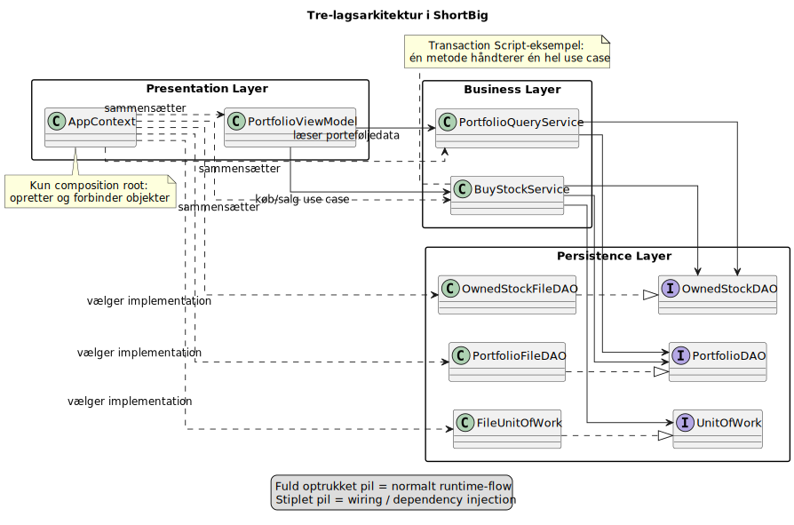

## Hvordan har jeg implementeret det?

## Talepunkter

- Brug diagrammet til at pege paa de tre lag i projektet
- Foelg et enkelt runtime-flow gennem systemet
- Peg paa hvor composition root og services passer ind

[Tilbage](1.2.md) [Næste](1.4.md)
