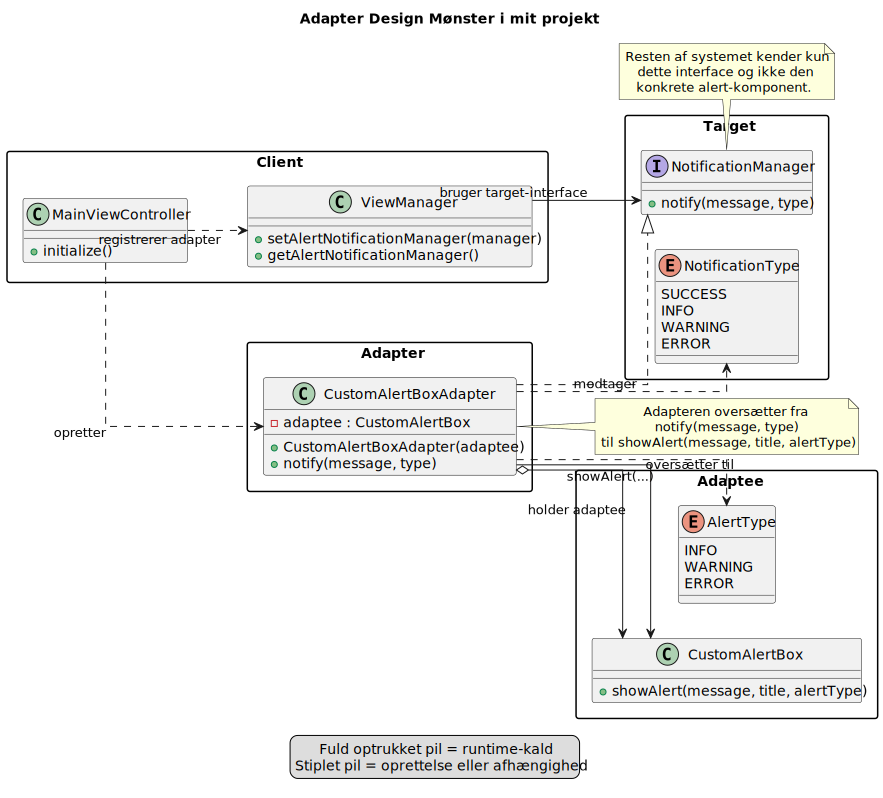

## Hvordan har jeg implementeret det?

## Talepunkter

- Start med klienten: `MainViewController` registrerer adapteren via `ViewManager`
- Peg derefter på `NotificationManager` som target-interface, som resten af systemet forventer
- Vis at `CustomAlertBoxAdapter` implementerer target og holder en `CustomAlertBox`
- Forklar at oversættelsen sker fra `notify(message, type)` til `showAlert(message, title, alertType)`

[Tilbage](3.2.md) [Næste](3.4.md)
