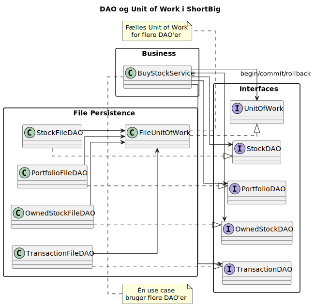

# UML-overblik

## Hvordan hænger mønstrene sammen?

## Talepunkter

- Peg på hvilke klasser der er DAOer og hvilken der er Unit of Work
- Beskriv hvordan service-laget bruger interfaces og konkrete implementationer
- Forklar hvor commit eller samlet ændringsstyring ligger

[Tilbage](4.2.md) [Næste](4.4.md)
