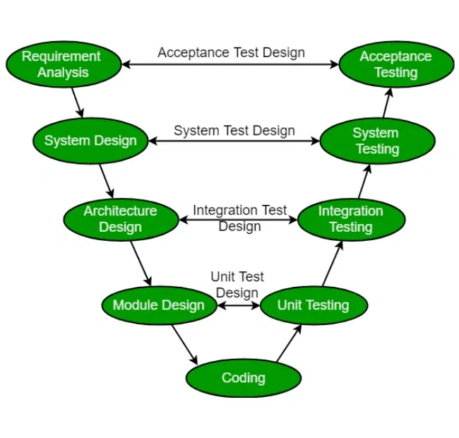

# Testing

## V-modellen

## Talepunkter

- Forklar at V-modellen er en overordnet model, ikke en konkret teststrategi
- Sig at modellen kobler udviklingsniveauer til testniveauer
- Peg især på unit test og integrationstest, fordi det er dem projektet bruger tydeligst

[Tilbage](5.0.md) [Næste](5.2.md)
