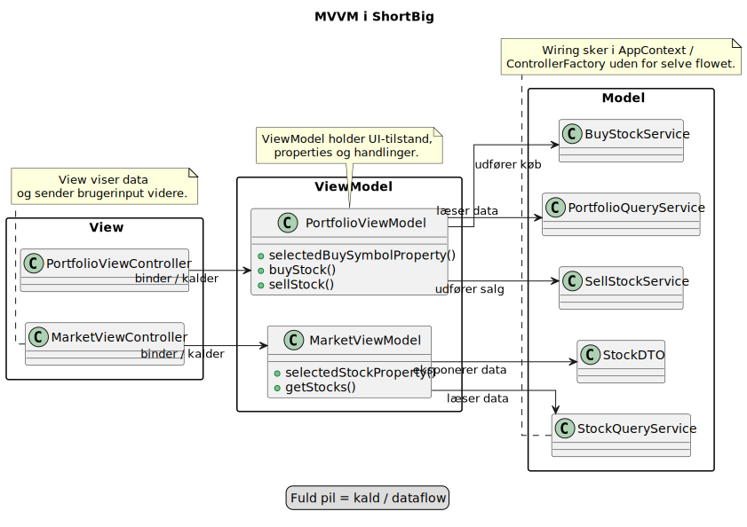

# MVVM-overblik

## Hvordan hænger delene sammen?

## Talepunkter

- Peg på View, ViewModel og Model i projektet
- Beskriv at controlleren binder mod ViewModel, og at ViewModel kalder services i modellen
- Sig gerne at det stadig hedder MVVM, selvom diagrammet læses som View -> ViewModel -> Model
- Nævn at wiring sker i `AppContext` og `ControllerFactory`, men at det er holdt uden for selve MVVM-flowet i diagrammet

[Tilbage](6.2.md) [Næste](6.4.md)
