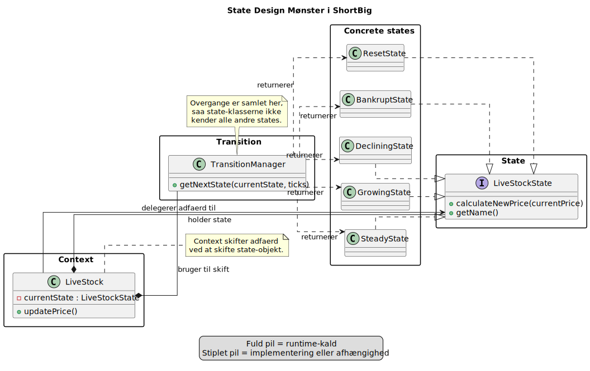

# State-overblik

## Hvordan hænger delene sammen?

- `LiveStock` er Context
- `LiveStockState` er fælles interface
- `TransitionManager` vælger næste state

## Talepunkter

- Peg på Context, State og konkrete states
- Vis at adfærd delegeres til det aktuelle state-objekt
- Nævn at overgange er samlet i `TransitionManager`

[Tilbage](7.2.md) [Næste](7.4.md)
